# Model-Based VPI Defenses: A Deep-Dive Monograph on Model-Level & Representation Guardrails Against Visual Prompt Injection

[](LICENSE)
[](docs/)
[-orange.svg)](docs/)
[](docs/)
[](docs/)

> **A Comprehensive Academic Monograph and Technical Repository**  
> Dissecting the algorithmic foundations, mathematical formulations, internal latent representations, auxiliary guardrail architectures, and empirical trade-offs of **Model-Based Defenses against Visual Prompt Injection (VPI)** in Vision-Language Models (VLMs) and Multimodal Autonomous Agents.

---

## 🎯 Executive Overview & Scope Delimitation

The rapid adoption of Vision-Language Models (VLMs) and Computer-Use Agents (CUAs)—from GPT-4o and Claude 3.5 Sonnet to open-weight models like Qwen2.5-VL and LLaVA—has exposed a fundamental vulnerability: **Visual Prompt Injection (VPI)**. By embedding adversarial directives into images, PDFs, CSS overlays, or web screenshots, attackers bypass safety boundaries, hijack agent execution paths, and trigger unauthorized mutations.

In response, the AI security research community has produced a rich spectrum of defenses. This repository provides a publication-grade, deep-dive examination of **strictly Model-Based Defenses**:

```
                                  DEFENSE TAXONOMY
                                          │
            ┌─────────────────────────────┴─────────────────────────────┐
            ▼                                                           ▼
┌───────────────────────────────────────┐   ┌───────────────────────────────────────┐
│       STRICTLY MODEL-BASED            │   │      SYSTEM & SOFTWARE ENGINEERING    │
│       (Covered in this Repo)          │   │         (Deliberately Excluded)       │
├───────────────────────────────────────┤   ├───────────────────────────────────────┤
│ • Multimodal Safety Fine-Tuning       │   │ • Dual-LLM Privilege Separation       │
│   (VLGuard, Cross-Modal SFT)          │   │   (CaMeL, CaMeL-CUA)                  │
│ • Latent Representation Interventions │   │ • Information Flow Control (IFC)      │
│   (SafePTR Token Pruning, ARGUS)      │   │   (FIDES, The LLMbda Calculus)        │
│ • Discrete Bottlenecks & Codebooks    │   │ • Deterministic Privilege DSLs        │
│   (Q-MLLM Vector Quantization)        │   │   (Progent with Z3 SMT Solvers)       │
│ • Auxiliary VLM Guardrails & Watchers │   │ • Trusted Computing Bases (TCB)       │
│   (WARD, Llama Guard 3V, LlavaGuard)  │   │   (Reference Monitors, Nonce Tokens)  │
│ • Chain-of-Thought Reasoning Guards   │   │ • Sandboxed Filesystem / Network Gating│
│   (GuardReasoner-VL, SafeGuard-VL)    │   │   (Playwright Shims, Egress Traps)    │
└───────────────────────────────────────┘   └───────────────────────────────────────┘
```

---

## 📊 Interactive Showcase Visualizations (Archify Standalone Artifacts)

This repository includes two interactive visual architectures generated with the [Archify](visualizations/) engine (100% vector SVG, theme-adaptive Dark/Light mode, multi-view inspection):

1. **[Taxonomy & Architecture Map](visualizations/model-defense-taxonomy.html):** Interactive map dissecting internal representation defenses (quantization, pruning, activation steering) versus auxiliary guardrail models.
2. **[End-to-End Execution Pipeline](visualizations/model-defense-pipeline.html):** Multi-lane operational workflow illustrating the observation intake, representation filtering, guardrail oversight, and core VLM actuation.

---

## 📚 Curriculum & Chapter Guide

The complete monograph is authored in high-rigor, publication-grade academic Vietnamese, structured into 9 comprehensive chapters:

| Chapter | Title & Target Papers | Core Technical Mechanism | Key Venue & Year |
|:---:|:---|:---|:---:|
| **[00](docs/00_tong_quan_va_ly_thuyet_model_based_defense.md)** | **Bức Tranh Toàn Cảnh & Nền Tảng Lý Thuyết** | Multimodal semantic misalignment, attention hijacking, taxonomic boundary definition | Foundations |
| **[01](docs/01_vlguard_safety_finetuning.md)** | **VLGuard: Safety Fine-Tuning** | Multimodal safety fine-tuning, catastrophic forgetting prevention, dual-objective loss formulation | **ICML 2024** |
| **[02](docs/02_safeptr_prune_then_restore.md)** | **SafePTR: Prune-then-Restore** | Token-level jailbreak mitigation, sensitive layer discovery, Benign Feature Restoration (BFR) | **NeurIPS 2025** |
| **[03](docs/03_argus_activation_steering.md)** | **ARGUS: Activation Steering** | Subspace latent activation steering ($h' = h + \alpha v_{\text{safe}}$), on-demand linear probes | **ArXiv 2025** |
| **[04](docs/04_ward_web_agent_robust_defense.md)** | **WARD: Web Agent Robust Defense** | Asynchronous parallel inspection (0.8B/2B), A3T adversarial training, zero added latency | **ArXiv 2026** |
| **[05](docs/05_guard_models_llama_guard_va_llavaguard.md)** | **Llama Guard 3 Vision & LlavaGuard** | Auxiliary VLM guardrails, 13 hazard categories, guided rationales, policy exception scores | **Meta / ICML 2025** |
| **[06](docs/06_guardreasoner_vl_va_safeguard_vl_cot_reasoning.md)** | **GuardReasoner-VL & SafeGuard-VL** | Multimodal Chain-of-Thought (CoT) reasoning, Online RL with dynamic clipping GRPO, RLVR | **NeurIPS 2025 / CVPR 2026** |
| **[07](docs/07_qmllm_va_discrete_representation_defenses.md)** | **Q-MLLM & Discrete Representations** | Two-level vector quantization codebooks, disrupting continuous gradient feedback, token masking | **NDSS 2026 / ICML 2026** |
| **[08](docs/08_so_sanh_thuc_nghiem_va_ranh_gioi_that_bai.md)** | **Ma Trận Thực Nghiệm & Ranh Giới Thất Bại** | 7D technical comparison matrix, 5 fatal failure modes, defense-in-depth hybrid architecture | Synthesis & Frontier |

---

## 🔬 7D Technical Comparison Matrix

A comparative evaluation of the 8 studied model-based defense systems across seven fundamental dimensions:

| Defense System | Venue | Intervention Level | White-box / Black-box | Latency Overhead | Utility Impact | Multi-Turn Awareness | Enforcement Logic |
|:---|:---:|:---|:---:|:---|:---|:---:|:---|
| **VLGuard** | ICML 2024 | Decoder / Projector Weights | White-box (SFT) | Zero added calls | -3.8% (VQA) | ❌ Stateless | Soft Logits / Softmax |
| **SafePTR** | NeurIPS 2025 | Intermediate Hidden Tokens | White-box (Latent) | < 15% latency | -0.9% (MME) | ❌ Stateless | Semantic Distance Threshold |
| **ARGUS** | ArXiv 2025 | Hidden Subspace Activations | White-box (Steering) | < 10% latency | -1.2% (MMBench) | ❌ Stateless | Vector Addition ($h + \alpha v$) |
| **WARD** | ArXiv 2026 | Compact Watcher (0.8B/2B) | **Black-box compatible** | **Zero added latency** | -0.25% (WebArena) | ⚠️ Single-turn focus | Binary Logits (A3T trained) |
| **Llama Guard 3V** | Meta 2024 | Auxiliary VLM (11B) | **Black-box compatible** | +100% latency | 0.0% (Independent) | ❌ Stateless | 13 Category Multi-class |
| **GuardReasoner-VL** | NeurIPS 2025 | Auxiliary CoT VLM | **Black-box compatible** | +200% latency | 0.0% (Independent) | ❌ Stateless | Reasoning Chain + Verdict |
| **SafeGuard-VL** | CVPR 2026 | Policy-Adaptive VLM | **Black-box compatible** | +100% latency | 0.0% (Independent) | ❌ Stateless | RLVR Verifiable Rewards |
| **Q-MLLM** | NDSS 2026 | Discrete VQ Codebook | White-box (Encoder) | +5% encoding | -4.2% (ImageNet) | ❌ Stateless | Codebook Discrete Indices |

---

## ⚠️ The 5 Fatal Failure Modes of Pure Model-Based Defenses

Our forensic audit reveals that while model-based defenses significantly depress Attack Success Rates on static single-turn benchmarks, **they cannot provide complete security for autonomous computer-use agents** due to five structural bottlenecks:

1. **The "Guard Jailbreak" Paradox (Meta-Injections):** Guard models are neural networks; adversarial payloads crafted to deceive the evaluator (e.g., prompt-in-prompt disguise) reduce detection recall by up to 50%.
2. **Multi-Turn Trajectory Blindness:** All examined model defenses evaluate inputs statelessly at step $t$. They have no cryptographic memory of the original user contract at $t=0$, rendering them blind to *Latent Multi-Turn VPI* at $t \ge 3$.
3. **GUI Utility Collapse:** Token pruning, continuous smoothing, and discrete quantization blur fine visual details (small icons, form fields, financial tables), degrading agent navigation precision.
4. **Latency & Cost Multiplication:** Sequential guardrails double response times (from 2s to 6-9s per action) and double API costs.
5. **Closed-API Incompatibility:** Weight fine-tuning, activation steering, and token pruning require white-box parameter access, making them impossible to deploy on commercial closed frontier models (GPT-4o, Claude 3.5 Sonnet).

---

## 🛡️ The Frontier: Defense-in-Depth Hybrid Architecture

The conclusion of this monograph is unambiguous: **Model-based defenses reduce perception contamination, but only system-level architectural gating can guarantee uncircumventable execution safety.**

```mermaid
flowchart LR
    subgraph PERCEPTION["Tier 1: Representation Filtering (Model-Based)"]
        direction TB
        RawPixels["Raw GUI Screenshot"] --> VQ_Prune["Q-MLLM Codebook / SafePTR Pruning"]
        VQ_Prune --> TypedFacts["Typed Fact Extraction (JSON Schema)"]
    end

    subgraph REASONING["Tier 2: Agent Planning (Untrusted VLM)"]
        direction TB
        TypedFacts --> AgentVLM["Frontier VLM (GPT-4o / Claude / Qwen)"]
        AgentVLM --> ActionProposal["Action Proposal: {tool, args}"]
    end

    subgraph SYSTEM["Tier 3: System-Level TCB Gating (Deterministic)"]
        direction TB
        ActionProposal --> TCB_Gate["TCB Authorization Interceptor"]
        TCB_Gate -->|Matches Intent at t=0| NonceToken["Single-Use HMAC Nonce Token"]
        TCB_Gate -->|Violation Detected| Deny["Fail-Closed Security Abort"]
        NonceToken --> Actuator["Playwright / OS Actuator"]
    end

    style PERCEPTION fill:#eff6ff,stroke:#2563eb,stroke-width:2px
    style REASONING fill:#fefce8,stroke:#ca8a04,stroke-width:2px
    style SYSTEM fill:#f0fdf4,stroke:#16a34a,stroke-width:2px
```



---

## 📖 Citation & Academic Attribution

```bibtex
@misc{model_based_vpi_defenses_2026,
  author = {Vo Pham Tuan Dung},
  title = {Model-Based VPI Defenses: A Deep-Dive Monograph on Model-Level and Representation Guardrails Against Visual Prompt Injection},
  year = {2026},
  publisher = {GitHub},
  howpublished = {\url{https://github.com/tuandung222/model-based-vpi-defenses}}
}
```

*Crafted with academic rigor, mathematical precision, and zero AI slop compliance.*
