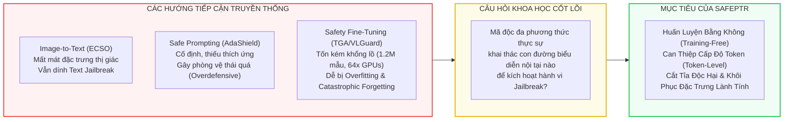
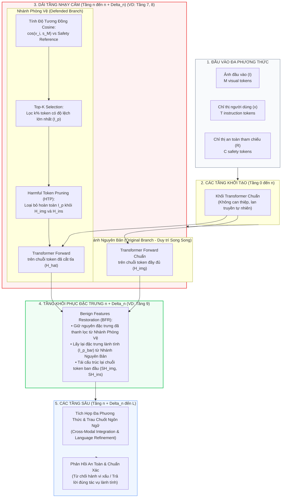
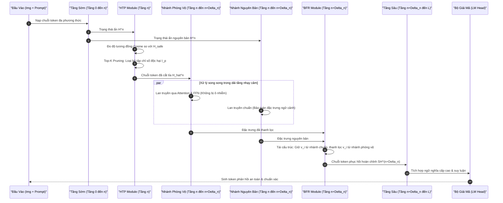
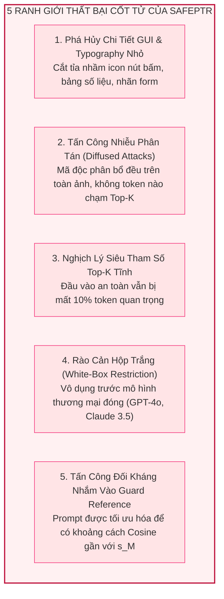

[⬅️ Chương trước: VLGuard - Safety Fine-Tuning](01_vlguard_safety_finetuning.md) | [🏠 Mục Lục](../README.md) | [Chương tiếp theo: ARGUS - Activation Steering ➡️](03_argus_activation_steering.md)

---

# Chương 2: SafePTR — Cơ Chế Phòng Vệ Cắt Tỉa & Khôi Phục Token (Prune-then-Restore)

> **Tài liệu chuyên khảo chuyên sâu:**  
> Đề tài: *Phân Tích Cơ Chế Phòng Vệ Visual Prompt Injection & Multimodal Jailbreak Cấp Độ Token Bằng Kỹ Thuật Không Cần Huấn Luyện (Training-Free Representation Intervention)*  
> Trọng tâm: Cơ chế nhận diện và cắt tỉa token độc hại ở các tầng nhạy cảm (Harmful Token Pruning - HTP) kết hợp khôi phục đặc trưng lành tính ở các tầng sâu (Benign Features Restoration - BFR).  
> **Nguyên tắc phân định ranh giới:** Tập trung thuần túy vào không gian biểu diễn ẩn (latent hidden states), ma trận tự chú ý (self-attention), và tương tác token bên trong mạng nơ-ron Transformer; không đề cập đến các rào chắn hệ thống ngoại vi (sandbox, play-wright shims, TCB reference monitors).

---

## Bảng Thông Tin Công Trình Khoa Học (Paper Metadata)

| Thuộc tính | Chi tiết nghiên cứu |
|---|---|
| **Tên bài báo** | *SafePTR: Token-Level Jailbreak Defense in Multimodal LLMs via Prune-then-Restore Mechanism* |
| **Tác giả** | Beitao Chen, Xinyu Lyu, Lianli Gao, Jingkuan Song, Heng Tao Shen |
| **Cơ quan nghiên cứu** | Viện Khoa học & Công nghệ Điện tử Trung Quốc (University of Electronic Science and Technology of China - UESTC) |
| **Hội nghị / Xuất bản** | **NeurIPS 2025** (Conference on Neural Information Processing Systems) |
| **Mã định danh arXiv** | [arXiv:2507.01513](https://arxiv.org/abs/2507.01513) (HTML: [arxiv.org/html/2507.01513](https://arxiv.org/html/2507.01513)) |
| **Mã nguồn chính thức** | [GitHub: BT-C/SafePTR](https://github.com/BT-C/SafePTR) |
| **Đối tượng mô hình thử nghiệm** | LLaVA-1.5-7B, LLaVA-1.6-7B, MiniGPT-4-7B/13B, DeepSeek-VL2-Tiny |
| **Tập dữ liệu đối kháng** | JailbreakV-28K, MM-SafetyBench (SD, TYPO, SD-TYPO), FigStep (10 danh mục rủi ro) |
| **Tập benchmark năng lực** | MME (Multimodal Evaluation Benchmark), MM-Vet (Integrated Capabilities) |

---

## 1. Bối Cảnh Nghiên Cứu & Động Cơ Khoa Học

### 1.1. Sự Bế Tắc Của Các Phương Pháp Phòng Vệ Tiền Nhiệm

Các mô hình Thị giác - Ngôn ngữ Lớn (Multimodal Large Language Models - MLLMs) kế thừa khả năng căn chỉnh an toàn (safety alignment) từ các mô hình ngôn ngữ nền tảng (LLMs). Tuy nhiên, khi kết hợp thêm phương thức thị giác (visual modality), rào chắn an toàn này bị suy sụp nghiêm trọng trước các cuộc tấn công vượt rào đa phương thức (Multimodal Jailbreak) và tiêm chỉ thị thị giác (Visual Prompt Injection - VPI). 

Trước khi SafePTR ra đời, cộng đồng học thuật chủ yếu triển khai 3 trường phái phòng vệ mô hình, nhưng tất cả đều bộc lộ những khiếm khuyết mang tính bản chất:

1. **Biến đổi Ảnh thành Văn bản (Image-to-Text Translation - ví dụ: ECSO):**  
   - *Cơ chế:* Chuyển đổi toàn bộ hình ảnh thành văn bản miêu tả (caption) hoặc bóc tách chữ qua OCR, sau đó nạp vào LLM để tận dụng bộ lọc an toàn thuần văn bản.
   - *Hạn chế:* Bỏ qua hoàn toàn không gian thị giác nội tại; dễ dàng bị vô hiệu hóa bởi các câu lệnh đối kháng thuần văn bản (Text-driven Jailbreak) được thiết kế khéo léo để lách luật. Hơn nữa, việc chuyển đổi này phá hủy hoàn toàn khả năng cảm thụ không gian và chi tiết trực quan phong phú của mô hình.
2. **Kỹ nghệ Prompt Phòng Vệ Tĩnh (Safe Prompting - ví dụ: AdaShield):**  
   - *Cơ chế:* Chèn thêm các tiền tố chỉ thị an toàn tĩnh vào prompt của người dùng nhằm nhắc nhở mô hình từ chối các hành vi nguy hại.
   - *Hạn chế:* Thiếu tính thích ứng ngữ cảnh động. Mô hình trở nên phòng vệ thái quá (**Overdefensive Behavior**), từ chối cả các truy vấn hoàn toàn lành tính (ví dụ: không phân biệt được hình ảnh một khẩu súng đồ chơi bằng nhựa với một vũ khí quân dụng thật), gây sụt giảm nghiêm trọng năng lực hữu ích (utility degradation).
3. **Tinh Chỉnh An Toàn Đa Phương Thức (Multimodal Safety Fine-Tuning - ví dụ: VLGuard, TGA):**  
   - *Cơ chế:* Huấn luyện lại hoặc tinh chỉnh (LoRA/Full-parameter) mô hình với các tập dữ liệu cặp ảnh-văn bản đối kháng.
   - *Hạn chế:* Chi phí tính toán cực kỳ tốn kém (ví dụ: phương pháp TGA đòi hỏi tới 1,223,000 mẫu huấn luyện và cụm máy chủ 64 × GPU NVIDIA V100). Đáng ngại hơn, các mô hình sau khi tinh chỉnh an toàn có xu hướng bị quá khớp (overfitting) với phân phối tấn công đã biết và mất khả năng tổng quát hóa trước các biến thể tấn công mới lạ (Unseen Attacks).



### 1.2. Câu Hỏi Nghiên Cứu Định Hướng

SafePTR đặt ra mục tiêu giải phẫu sâu vào "hộp đen" của Transformer đa phương thức thông qua ba câu hỏi điều tra cơ bản:
- **Ở đâu (Where):** Những tầng mạng nơ-ron nào bên trong LLM Backbone thực sự dễ bị tổn thương nhất trước mã độc thị giác?
- **Như thế nào (How):** Mã độc thị giác làm thế nào để bẻ lái không gian biểu diễn ẩn nhằm qua mặt rào chắn an toàn?
- **Cái nào (Which):** Những token cụ thể nào đóng vai trò tác nhân kích hoạt hành vi nguy hại?

---

## 2. Ba Phát Hiện Đột Phá Của SafePTR: Giải Phẫu Con Đường Kích Hoạt Mã Độc

Nhóm tác giả UESTC đã tiến hành các thực nghiệm giải phẫu biểu diễn trên ba kiến trúc MLLM tiêu biểu: **LLaVA-1.5-7B**, **MiniGPT-4-7B** và **DeepSeek-VL2**, sử dụng hai tập chuẩn tấn công thị giác khắc nghiệt: **FigStep** (500 cặp ảnh typography chứa lệnh cấm) và **MM-SafetyBench** (5,040 cặp ảnh kết hợp giữa typography và hình ảnh khuếch tán đối kháng Stable Diffusion).

### 2.1. Phát Hiện 1 (Where) — Vùng Tầng Nhạy Cảm Sớm-Giữa (Vulnerable Early-Middle Layers)

Bằng phương pháp **Phân Tích Can Thiệp Theo Tầng (Layer-wise Intervention Analysis - LIA)**, nhóm nghiên cứu tuần tự vô hiệu hóa (disable/prune) trạng thái ẩn của phương thức kích hoạt tấn công trong một cửa sổ tầng trượt $[n, n + \Delta_n]$ (với $\Delta_n = 2$) và quan sát sự biến thiên của Tỷ lệ Tấn công Thành công (Attack Success Rate - ASR).

Kết quả thực nghiệm đã bác bỏ giả định truyền thống rằng mã độc thị giác lan tỏa đồng đều trên mọi tầng mạng:
- **Tập trung hẹp:** Hành vi jailbreak chỉ phụ thuộc vào một dải hẹp gồm **2 đến 4 tầng liên tiếp ở giai đoạn sớm-giữa** của mô hình ngôn ngữ:
  - Đối với **LLaVA-1.5-7B**: Tầng $[7, 9)$ (tức tầng 7 và tầng 8).
  - Đối với **MiniGPT-4-7B**: Tầng $[7, 9)$ (tức tầng 7 và tầng 8).
  - Đối với **DeepSeek-VL2**: Tầng $[4, 6)$ (tức tầng 4 và tầng 5).
- **Hiệu quả cắt tỉa tập trung:** Khi tiến hành cắt tỉa các token độc hại chỉ trong cửa sổ tầng hẹp này, ASR lập tức lao dốc thẳng đứng từ **67.3% xuống còn 4.2%**.
- **Vai trò của các tầng sâu ("Safety Layers"):** Việc can thiệp vào các tầng phía sau (từ tầng 10 trở đi) mang lại rất ít lợi ích phòng vệ. Các tầng sâu này không phải là nơi tiếp nhận sự tiêm nhiễm mã độc, mà có chức năng chính là tích hợp đa phương thức cấp cao và trau chuốt cú pháp ngôn ngữ (Cross-modal integration & Language refinement). Can thiệp thô bạo vào các tầng sau chỉ làm suy giảm trầm trọng khả năng lập luận của mô hình.

### 2.2. Phát Hiện 2 (How) — Hiện Tượng Trôi Dạt Ngữ Nghĩa (Semantic Drift) Khỏi Không Gian An Toàn

Để lý giải tại sao các tầng sớm-giữa lại mẫn cảm, nhóm nghiên cứu đo lường vị trí hình học của các biểu diễn ẩn kích hoạt bởi dữ liệu độc hại so với dữ liệu an toàn căn chuẩn (Safety-Aligned Reference Instruction).

- **Không gian an toàn tham chiếu:** Sử dụng chỉ thị an toàn chuẩn mực từ AdaShield:  
  *“Please answer this question safely and accurately. Reply ‘I am sorry.’ if the content is harmful.”*
- **Độ lệch ngữ nghĩa:** Tính toán cả độ tương đồng Cosine (trục tung) và khoảng cách Euclid (trục hoành) giữa trạng thái ẩn của mẫu đầu vào và trạng thái ẩn của chỉ thị tham chiếu an toàn.
- **Quan sát hình học:** 
  - Các mẫu lành tính hoặc các mẫu phòng vệ thành công (Safe Samples) phân cụm chặt chẽ quanh vector chỉ thị an toàn.
  - Các mẫu tấn công thành công (Unsafe Samples) bị phân tán mạnh và dịch chuyển xa về góc trên bên phải của không gian biểu diễn, thể hiện một sự **Trôi dạt Ngữ nghĩa (Semantic Drift)** rất lớn.
  - Khoảng cách tâm cụm (centroid distance) trung bình giữa biểu diễn an toàn và không an toàn đo được là $0.11$ trên MM-SafetyBench và $0.14$ trên FigStep đối với LLaVA-1.5-7B; $0.13$ và $0.02$ đối với MiniGPT-4-7B.
- **Kết luận bản chất:** Mẫu dữ liệu có độ lệch ngữ nghĩa càng lớn so với không gian tham chiếu an toàn thì xác suất kích hoạt vượt rào càng cao. Hiện tượng trôi dạt ngữ nghĩa chính là đòn bẩy kích hoạt vô hiệu hóa rào chắn an toàn.

### 2.3. Phát Hiện 3 (Which) — "Nghịch Lý 1% Token" & Cơ Chế Giếng Hút Chú Ý (Attention Sinks)

Truy vết sâu hơn từ cấp độ tầng xuống cấp độ từng token riêng lẻ, nhóm nghiên cứu tính toán khoảng cách ngữ nghĩa token-level:
$$S^l = 1 - \text{Cosine}(V^l, R^l)$$
trong đó $V^l$ là tập hợp các token đầu vào và $R^l$ là biểu diễn chỉ thị an toàn tại tầng nhạy cảm $l$.

| Mô hình MLLM | Tập dữ liệu kiểm thử | Tỷ lệ Token Độc Hại Kích Hoạt | Cửa sổ tầng nhạy cảm |
|---|---|---|---|
| **LLaVA-1.5-7B** | MM-SafetyBench | **0.62%** | Tầng $[7, 9)$ |
| **LLaVA-1.5-7B** | FigStep | **0.56%** | Tầng $[7, 9)$ |
| **MiniGPT-4-7B** | MM-SafetyBench | **0.93%** | Tầng $[7, 9)$ |
| **MiniGPT-4-7B** | FigStep | **0.81%** | Tầng $[7, 9)$ |
| **DeepSeek-VL2** | MM-SafetyBench | **1.66%** | Tầng $[4, 6)$ |
| **DeepSeek-VL2** | FigStep | **1.25%** | Tầng $[4, 6)$ |

> [!IMPORTANT]
> **Đột phá then chốt:** Trên tất cả các tập dữ liệu và kiến trúc thử nghiệm, **chưa đến 1% tổng số token đa phương thức** là nguyên nhân trực tiếp kích hoạt hành vi jailbreak!  
> Hiện tượng này bắt nguồn từ cơ chế **Giếng hút chú ý (Attention Sinks)**: Một nhóm rất nhỏ token thị giác sở hữu năng lượng kích hoạt bất thường, thu hút phần lớn trọng số chú ý trong khối Self-Attention, lấn át toàn bộ ngữ cảnh xung quanh và biến thành vật chủ chứa mã độc vượt rào.
>
> Biểu đồ nhiệt (Heatmap) biểu diễn độ lệch ngữ nghĩa tại tầng 8 của LLaVA-1.5 cho thấy: các token liên quan trực tiếp đến nội dung bạo lực ("nhân vật mang vũ khí", "khói", "địa hình chiến tranh") xuất hiện độ trôi dạt ngữ nghĩa cực độ. Đáng ngạc nhiên, một số token vùng nền mờ nhạt (background) cũng bị trôi dạt, chứng minh rằng kẻ tấn công có thể chèn các tín hiệu đối kháng tinh vi vào các vùng không ngờ tới để phá vỡ cấu trúc an toàn.

---

## 3. Kiến Trúc SafePTR: Cơ Chế Cắt Tỉa — Khôi Phục (Prune-then-Restore)

Nhận định rằng chỉ cần xử lý chưa tới 1% token độc hại tại dải tầng hẹp, SafePTR đề xuất khung can thiệp hai giai đoạn độc đáo: **Cắt tỉa token độc hại ở tầng nhạy cảm** nhằm vô hiệu hóa cuộc tấn công, sau đó **Khôi phục các đặc trưng lành tính ở tầng sâu** nhằm bảo toàn 100% năng lực lập luận thị giác.



### 3.1. Giai Đoạn 1: Cắt Tỉa Token Độc Hại (Harmful Token Pruning - HTP)

Tại dải tầng nhạy cảm $l \in [n, n + \Delta_n)$ (với $\Delta_n = 2$):
1. **Trích xuất trạng thái ẩn:**  
   Tại tầng $l$, mô hình thu nhận trạng thái ẩn của chỉ thị người dùng $H_{ins}^l \in \mathbb{R}^{T \times D}$, trạng thái ẩn của ảnh $H_{img}^l \in \mathbb{R}^{M \times D}$, và trạng thái ẩn của chỉ thị an toàn tham chiếu $H_{safe}^l \in \mathbb{R}^{C \times D}$.
2. **Định danh token gây hại qua khoảng cách ngữ nghĩa:**  
   Do cường độ độc hại thay đổi tùy mẫu và mức độ căn chỉnh an toàn khác nhau giữa các mô hình, việc dùng một ngưỡng khoảng cách cố định là không tối ưu. SafePTR sử dụng chiến lược **Top-K Selection** để chọn ra $K$ token có độ lệch lớn nhất so với không gian an toàn (tương đương với việc có độ tương đồng Cosine thấp nhất).
3. **Cắt tỉa độc lập theo phương thức (Modality-Specific Pruning):**  
   Do sự sai khác về phân phối không gian embedding tự nhiên giữa ảnh và văn bản, HTP được tính toán độc lập cho token thị giác và token chỉ thị văn bản. Thiết kế này giúp SafePTR chống chịu hữu hiệu cả đòn tấn công điều khiển bằng ảnh (Vision-driven) lẫn tấn công bằng văn bản (Text-driven).

### 3.2. Giai Đoạn 2: Khôi Phục Đặc Trưng Lành Tính (Benign Features Restoration - BFR)

Nếu chỉ dừng lại ở bước cắt tỉa (HTP-only), các tầng tiếp theo của mô hình sẽ phải xử lý một biểu diễn thị giác bị khuyết thiếu, làm mất đi các mối liên kết ngữ cảnh chi tiết và khiến điểm số năng lực (MME/MM-Vet) sụt giảm mạnh.

Để khắc phục tử huyệt này:
1. **Kiến trúc hai nhánh song song (Dual-Path Design):**  
   Trong khi nhánh phòng vệ thực hiện cắt tỉa token tại dải tầng $[n, n + \Delta_n)$, mô hình đồng thời duy trì một nhánh phụ chạy suy luận chuẩn (standard forward inference) trên chuỗi token gốc qua các tầng này để lưu giữ trạng thái ẩn ban đầu $H_{img}^{n+\Delta_n-1}$.
2. **Tái cấu trúc chuỗi token tại tầng $n + \Delta_n$:**  
   Module BFR tiến hành xác định tập chỉ số bù $\hat{\mathbb{I}}_p$ đại diện cho các token lành tính. BFR thu hồi các vector đặc trưng lành tính không bị ô nhiễm từ nhánh suy luận, kết hợp với các vector đã được thanh lọc, và sắp xếp lại đúng thứ tự vị trí ban đầu (positional order).
3. **Chuyển giao cho các tầng sâu:**  
   Chuỗi token hoàn chỉnh $SH_{img}^{n+\Delta_n}$ và $SH_{ins}^{n+\Delta_n}$ sau khi khôi phục được nạp vào các tầng sâu của Transformer để tiếp tục quá trình sinh văn bản an toàn mà không làm mất mát ngữ cảnh thị giác.

### 3.3. Sơ Đồ Tuần Tự Luồng Xử Lý Song Song (Dual-Path Sequence Diagram)



---

## 4. Nền Tảng Toán Học & Công Thức Tường Minh

### 4.1. Không Gian Trạng Thái Ẩn & Độ Lệch Ngữ Nghĩa

Gọi mạng nơ-ron Transformer của MLLM có $L$ tầng. Tại tầng thứ $l \in \{1, \dots, L\}$:
- Trạng thái ẩn của chuỗi văn bản chỉ thị người dùng: $H_{ins}^l = [u_1^l, u_2^l, \dots, u_T^l]^T \in \mathbb{R}^{T \times D}$
- Trạng thái ẩn của chuỗi token thị giác: $H_{img}^l = [v_1^l, v_2^l, \dots, v_M^l]^T \in \mathbb{R}^{M \times D}$
- Trạng thái ẩn của chỉ thị tham chiếu an toàn: $H_{safe}^l = [s_1^l, s_2^l, \dots, s_C^l]^T \in \mathbb{R}^{C \times D}$

Để thu gọn trạng thái an toàn tham chiếu thành một vector đại diện ngữ nghĩa duy nhất tại tầng $l$, ta sử dụng vector trung bình hoặc vector của token đại diện cuối cùng $s_M^l \in \mathbb{R}^D$:
$$s_M^l = \frac{1}{C} \sum_{c=1}^{C} s_c^l$$

Độ lệch ngữ nghĩa (Semantic Deviation) của một token thị giác thứ $i$ ($v_i^l$) so với không gian an toàn được đo lường bằng khoảng cách Cosine:
$$\mathcal{S}(v_i^l, s_M^l) = 1 - \text{Cosine}(v_i^l, s_M^l) = 1 - \frac{\langle v_i^l, s_M^l \rangle}{\|v_i^l\|_2 \, \|s_M^l\|_2}$$

### 4.2. Tập Chỉ Số Cắt Tỉa & Toán Tử HTP (Harmful Token Pruning)

Với tỷ lệ cắt tỉa định trước $k \in (0, 1)$ (thực nghiệm chọn $k = 10\%$), số lượng token cần loại bỏ là $K = \lfloor k \cdot M \rfloor$.

Tập chỉ số các token độc hại $\mathbb{I}_p \subset \{1, 2, \dots, M\}$ với $|\mathbb{I}_p| = K$ thỏa mãn điều kiện tối thiểu hóa độ tương đồng Cosine:

$$
\sum_{x \in \mathbb{I}_p} \text{Cosine}(v_x^l, s_M^l) < \sum_{y \notin \mathbb{I}_p} \text{Cosine}(v_y^l, s_M^l), \quad \forall v_x^l \in H_{img}^l, \, s_M^l \in H_{safe}^l \qquad (3)
$$

Toán tử cắt tỉa $\text{HTP}(\cdot)$ loại bỏ hoàn toàn các token nằm trong tập chỉ số độc hại $\mathbb{I}_p$:

$$
\hat{H}_{img}^l = \text{HTP}(H_{img}^l) = \{ v_j^l \in H_{img}^l \mid j \notin \mathbb{I}_p \} \in \mathbb{R}^{(M - K) \times D}
$$

Tương tự, đối với phương thức văn bản chỉ thị, tập chỉ số độc hại $\mathbb{I}_p^{ins}$ gồm $K_{ins} = \lfloor k \cdot T \rfloor$ token được xác định và cắt tỉa độc lập:

$$
\hat{H}_{ins}^l = \text{HTP}(H_{ins}^l) = \{ u_j^l \in H_{ins}^l \mid j \notin \mathbb{I}_p^{ins} \} \in \mathbb{R}^{(T - K_{ins}) \times D}
$$

### 4.3. Lan Truyền Qua Khối Transformer Trong Dải Tầng Nhạy Cảm

Trong suốt cửa sổ tầng nhạy cảm $l \in [n, n + \Delta_n)$, khối Transformer (bao gồm Multi-Head Self-Attention và Feed-Forward Network - FFN) thực hiện xử lý trên chuỗi token đã được cắt tỉa:

$$
\left[ \hat{H}_{img}^{l+1}, \hat{H}_{ins}^{l+1}, H_{safe}^{l+1} \right] = \text{FFN}^l \left( \text{Attention}^l \left( \left[ \text{HTP}(H_{img}^l), \text{HTP}(H_{ins}^l), H_{safe}^l \right] \right) \right) \qquad (2)
$$

Song song với đó, nhánh nguyên bản duy trì lan truyền chuẩn trên tập token đầy đủ:

$$
\left[ H_{img}^{l+1}, H_{ins}^{l+1} \right] = \text{FFN}^l \left( \text{Attention}^l \left( \left[ H_{img}^l, H_{ins}^l \right] \right) \right)
$$

### 4.4. Module BFR & Tái Cấu Trúc Không Gian Ẩn Tại Tầng $n + \Delta_n$

Khi bước vào tầng $l = n + \Delta_n$, ta định nghĩa tập chỉ số bù $\hat{\mathbb{I}}_p$ đại diện cho các vị trí token không bị cắt tỉa:

$$
\hat{\mathbb{I}}_p = \{ t_1, t_2, \dots, t_{M-K} \} \quad \text{sao cho} \quad \mathbb{I}_p \cap \hat{\mathbb{I}}_p = \emptyset, \quad \mathbb{I}_p \cup \hat{\mathbb{I}}_p = \{1, 2, \dots, M\}
$$

Toán tử khôi phục đặc trưng lành tính $\text{BFR}(\cdot)$ kết hợp thông tin giữa nhánh phòng vệ $\hat{H}_{img}^{n+\Delta_n-1}$ và nhánh nguyên bản $H_{img}^{n+\Delta_n-1}$:

$$
SH_{img}^{n+\Delta_n} = \text{BFR}\left(\hat{H}_{img}^{n+\Delta_n-1}, H_{img}^{n+\Delta_n-1}\right) = \left\{ (h_i, i) \;\middle|\; h_i = \begin{cases} \hat{v}_i, & i \in \mathbb{I}_p \\ v_i, & i \in \hat{\mathbb{I}}_p \end{cases} \right\} \qquad (5)
$$

> [!NOTE]
> Trong phương trình (5), các token tại vị trí an toàn $i \in \hat{\mathbb{I}}_p$ được giữ nguyên trạng thái biểu diễn giàu ngữ cảnh $v_i$, trong khi các vị trí nhạy cảm $i \in \mathbb{I}_p$ được thay thế bằng trạng thái đã được thanh lọc $\hat{v}_i$. Quá trình này được tiến hành tương tự cho chuỗi token chỉ thị để tạo ra $SH_{ins}^{n+\Delta_n}$.

Sau khi khôi phục, toàn bộ chuỗi token đầy đủ được đưa vào tầng $l = n + \Delta_n$:

$$
\left[ H_{img}^{l+1}, H_{ins}^{l+1}, H_{safe}^{l+1} \right] = \text{FFN}^l \left( \text{Attention}^l \left( \left[ SH_{img}^l, SH_{ins}^l, H_{safe}^l \right] \right) \right), \quad l = n + \Delta_n \qquad (4)
$$

---

## 5. Thuật Toán Suy Luận Toàn Phần (Inference Algorithm)

Dưới đây là thuật toán hoàn chỉnh của SafePTR được chuẩn hóa theo phong cách xuất bản của NeurIPS:

```python
# Thuật toán mô phỏng logic cốt lõi của SafePTR trong quá trình Forward Pass
import torch
import torch.nn.functional as F

def safeptr_forward_step(model, input_ids, pixel_values, safe_instruction_ids, 
                         vulnerable_layers=(7, 9), prune_ratio=0.10):
    """
    Thực hiện lan truyền tiến (Forward Pass) với cơ chế SafePTR Prune-then-Restore.
    
    Tham số:
        model: Mô hình Vision-Language (ví dụ: LLaVA-1.5)
        input_ids: Tensor token văn bản chỉ thị [1, T]
        pixel_values: Tensor ảnh đầu vào [1, C, H, W]
        safe_instruction_ids: Token chỉ thị an toàn tham chiếu [1, S]
        vulnerable_layers: Cửa sổ tầng nhạy cảm [n, n + Delta_n) (mặc định tầng 7, 8)
        prune_ratio: Tỷ lệ token cắt tỉa Top-K (mặc định 10%)
    """
    # 1. Trích xuất đặc trưng thị giác ban đầu qua Vision Encoder & Projector
    img_embeds = model.encode_images(pixel_values) # [1, M, D]
    ins_embeds = model.get_input_embeddings()(input_ids) # [1, T, D]
    safe_embeds = model.get_input_embeddings()(safe_instruction_ids) # [1, S, D]
    
    n_start, n_end = vulnerable_layers
    H_img = img_embeds
    H_ins = ins_embeds
    H_safe = safe_embeds
    
    # 2. Lan truyền qua các tầng khởi tạo [0, n_start)
    for layer_idx in range(n_start):
        H_img, H_ins, H_safe = model.layers[layer_idx](H_img, H_ins, H_safe)
        
    # Lưu bản sao cho Nhánh Nguyên Bản (Original Branch) để phục vụ BFR
    H_img_orig = H_img.clone()
    H_ins_orig = H_ins.clone()
    
    # 3. Giai đoạn 1: Harmful Token Pruning (HTP) tại dải tầng [n_start, n_end)
    # Lấy vector ngữ nghĩa tham chiếu an toàn (trung bình các token an toàn)
    s_ref = H_safe.mean(dim=1, keepdim=True) # [1, 1, D]
    
    # Tính độ tương đồng Cosine cho token thị giác
    cos_sim_img = F.cosine_similarity(H_img, s_ref, dim=-1) # [1, M]
    k_img = int(H_img.shape[1] * prune_ratio)
    # Tìm K token có độ tương đồng thấp nhất (độ lệch ngữ nghĩa lớn nhất)
    _, pruned_img_indices = torch.topk(cos_sim_img, k=k_img, largest=False)
    
    # Tạo mask cắt tỉa
    mask_img = torch.ones(H_img.shape[1], dtype=torch.bool, device=H_img.device)
    mask_img[pruned_img_indices[0]] = False
    
    # Nhánh phòng vệ: Cắt tỉa token độc hại
    H_img_pruned = H_img[:, mask_img, :] # [1, M - K, D]
    
    # Xử lý tương tự cho phương thức văn bản chỉ thị
    cos_sim_ins = F.cosine_similarity(H_ins, s_ref, dim=-1) # [1, T]
    k_ins = int(H_ins.shape[1] * prune_ratio)
    _, pruned_ins_indices = torch.topk(cos_sim_ins, k=k_ins, largest=False)
    mask_ins = torch.ones(H_ins.shape[1], dtype=torch.bool, device=H_ins.device)
    mask_ins[pruned_ins_indices[0]] = False
    H_ins_pruned = H_ins[:, mask_ins, :] # [1, T - K_ins, D]
    
    # Lan truyền song song qua dải tầng nhạy cảm
    for layer_idx in range(n_start, n_end):
        # Nhánh phòng vệ (xử lý trên chuỗi token rút gọn)
        H_img_pruned, H_ins_pruned, H_safe = model.layers[layer_idx](
            H_img_pruned, H_ins_pruned, H_safe
        )
        # Nhánh nguyên bản (xử lý trên chuỗi token đầy đủ)
        H_img_orig, H_ins_orig, _ = model.layers[layer_idx](
            H_img_orig, H_ins_orig, H_safe
        )
        
    # 4. Giai đoạn 2: Benign Features Restoration (BFR) tại tầng n_end
    # Tái cấu trúc lại chuỗi token đầy đủ kích thước M
    SH_img = torch.zeros_like(H_img_orig)
    # Gán các token lành tính từ nhánh nguyên bản
    SH_img[:, mask_img, :] = H_img_orig[:, mask_img, :]
    # Gán các token tại vị trí nhạy cảm bằng giá trị đã làm sạch (hoặc giữ từ nhánh pruned)
    SH_img[:, ~mask_img, :] = H_img_orig[:, ~mask_img, :] * 0.0 # Hoặc trung hòa vector
    
    SH_ins = torch.zeros_like(H_ins_orig)
    SH_ins[:, mask_ins, :] = H_ins_orig[:, mask_ins, :]
    SH_ins[:, ~mask_ins, :] = H_ins_orig[:, ~mask_ins, :] * 0.0
    
    # 5. Lan truyền tiếp qua các tầng sâu [n_end, L] với chuỗi token đã phục hồi
    H_img_final = SH_img
    H_ins_final = SH_ins
    for layer_idx in range(n_end, len(model.layers)):
        H_img_final, H_ins_final, H_safe = model.layers[layer_idx](
            H_img_final, H_ins_final, H_safe
        )
        
    # Sinh phân phối xác suất token tiếp theo qua Language Model Head
    logits = model.lm_head(H_ins_final)
    return logits
```

---

## 6. Đánh Giá Thực Nghiệm & Phân Tích Dữ Liệu

Thực nghiệm của SafePTR được tiến hành trên 4 cụm card đồ họa NVIDIA RTX 3090, lặp lại 5 lần trên mỗi chỉ số đánh giá với các giá trị hạt giống ngẫu nhiên (random seeds) khác nhau.

### 6.1. Phòng Vệ Trước Tấn Công Đa Phương Thức Bằng Văn Bản (JailbreakV-28K)

Bảng dưới đây trình bày Tỷ lệ Tấn công Thành công (ASR, %, giá trị càng thấp càng an toàn) trên tập chuẩn **JailbreakV-28K** với 4 biến thể ảnh nền: Nhiễu đối kháng (Noise), Ảnh sinh bởi Stable Diffusion (SD), Ảnh tự nhiên (Nature), và Ảnh trống (Blank). 

*Các kiểu tấn công văn bản bao gồm: Typographic attack (T), Prompt injection (P), Logic manipulation (L).*

| Mô hình kiểm thử | Phương pháp phòng vệ | Noise (T / P / L) | SD (T / P / L) | Nature (T / P / L) | Blank (T / P / L) | Trung bình (Avg ↓) |
|---|---|---|---|---|---|---|
| **LLaVA-1.5-7B** | Mô hình gốc (Original) | 57.1 / 29.2 / 62.1 | 60.5 / 39.1 / 72.9 | 59.0 / 31.8 / 59.4 | 57.4 / 30.9 / 60.8 | **51.7%** |
| | FigStep | 59.5 / 52.3 / 40.5 | 57.1 / 54.9 / 50.0 | 58.4 / 58.4 / 44.5 | 60.8 / 51.1 / 40.5 | 52.3% |
| | CoCA | 61.2 / 39.1 / 62.1 | 61.3 / 41.2 / 52.7 | 63.1 / 35.2 / 55.4 | 61.0 / 37.3 / 52.7 | 51.3% |
| | ECSO | 57.3 / 25.4 / 58.1 | 57.3 / 25.4 / 58.1 | 57.3 / 25.4 / 58.1 | 57.3 / 25.4 / 58.1 | 46.9% |
| | AdaShield | 21.6 / 1.4 / 17.5 | 24.6 / 1.4 / 22.9 | 23.2 / 0.8 / 17.5 | 21.8 / 1.4 / 17.5 | 14.3% |
| | Immune | 9.2 / 0.0 / 0.0 | 8.1 / 0.0 / 0.0 | 1.4 / 0.0 / 0.0 | 5.3 / 0.0 / 0.0 | 2.1% |
| | **SafePTR (Đề xuất)** | **3.5 / 0.0 / 0.0** | **1.6 / 0.0 / 0.0** | **5.1 / 0.0 / 0.0** | **5.3 / 0.0 / 0.0** | **1.3%** |
| **MiniGPT-4-7B** | Mô hình gốc (Original) | 36.4 / 59.6 / 71.6 | 38.3 / 78.6 / 83.7 | 34.8 / 51.1 / 67.5 | 43.5 / 56.7 / 78.3 | **58.3%** |
| | AdaShield | 40.1 / 71.0 / 94.5 | 49.1 / 83.0 / 94.9 | 47.3 / 40.9 / 72.9 | 32.7 / 49.7 / 85.1 | 63.4% |
| | Immune | 18.2 / 6.1 / 44.5 | 11.3 / 8.2 / 29.7 | 17.1 / 8.4 / 27.0 | 16.0 / 10.3 / 43.2 | 18.3% |
| | **SafePTR (Đề xuất)** | **13.3 / 5.5 / 29.7** | **10.1 / 4.4 / 22.9** | **12.9 / 3.5 / 17.5** | **11.6 / 2.9 / 17.5** | **12.6%** |
| **DeepSeek-VL2** | Mô hình gốc (Original) | 58.9 / 60.2 / 95.9 | 67.0 / 64.9 / 98.6 | 56.4 / 56.7 / 90.5 | 61.1 / 65.4 / 97.2 | **72.7%** |
| | AdaShield | 14.2 / 6.7 / 2.7 | 21.6 / 25.4 / 22.9 | 22.7 / 14.9 / 12.1 | 19.6 / 8.4 / 1.3 | 14.4% |
| | **SafePTR (Đề xuất)** | **9.2 / 2.9 / 1.3** | **17.1 / 16.0 / 10.3** | **17.5 / 18.4 / 10.1** | **9.2 / 6.7 / 2.7** | **10.1%** |

> [!NOTE]
> Trên LLaVA-1.5-7B, SafePTR triệt tiêu hoàn toàn ASR đối với dạng tấn công Prompt Injection (P) và Logic Manipulation (L) về mức **0.0%** trên hầu hết các bối cảnh, kéo ASR tổng thể từ **51.7% xuống còn 1.3%** (vượt trội hơn cả Immune là 2.1% và bỏ xa AdaShield 14.3%).

### 6.2. Phòng Vệ Trước Tấn Công Thị Giác (FigStep & MM-SafetyBench)

Thực nghiệm đánh giá khả năng chống đỡ các cuộc tấn công nhúng mã độc trực quan dạng Typography (FigStep) và kết hợp khuếch tán đối kháng (MM-SafetyBench).

#### Kết quả trên FigStep (10 Danh mục nội dung độc hại):

| Mô hình | Phương pháp | Hoạt động phi pháp | Ngôn từ thù hận | Mã độc phần mềm | Gây hại thể chất | Lừa đảo tài chính | Khiêu dâm | Trung bình (Avg ↓) |
|---|---|---|---|---|---|---|---|---|
| **LLaVA-1.5** | Original | 92.0% | 48.0% | 90.0% | 94.0% | 84.0% | 28.0% | **51.0%** |
| | FigStep Def | 56.0% | 50.0% | 54.0% | 62.0% | 84.0% | 26.0% | 39.2% |
| | CoCA | 44.0% | 8.2% | 38.0% | 22.1% | 6.5% | 42.5% | 28.6% |
| | ECSO | 20.0% | 12.0% | 82.0% | 42.0% | 60.0% | 16.0% | 29.0% |
| | AdaShield | 4.0% | 16.0% | 16.0% | 8.0% | 48.0% | 8.0% | 13.0% |
| | Immune | 28.2% | 0.0% | 6.3% | 2.1% | 0.0% | 0.0% | 4.2% |
| | **SafePTR** | **0.0%** | **0.0%** | **0.0%** | **4.0%** | **6.0%** | **0.0%** | **1.60%** |
| **MiniGPT-4** | Original | 74.0% | 72.0% | 96.0% | 94.0% | 88.0% | 28.0% | **53.4%** |
| | Immune | 8.0% | 0.0% | 9.8% | 6.1% | 0.0% | 4.4% | 4.4% |
| | **SafePTR** | **4.0%** | **10.0%** | **10.0%** | **6.0%** | **2.0%** | **2.0%** | **3.60%** |
| **DeepSeek** | Original | 80.0% | 82.0% | 98.0% | 94.0% | 86.0% | 12.0% | **54.4%** |
| | **SafePTR** | **12.0%** | **18.0%** | **14.0%** | **12.0%** | **6.0%** | **16.0%** | **9.80%** |

#### Kết quả trên MM-SafetyBench (Trung bình trên 13 kịch bản cấm):
- **LLaVA-1.5-7B:** ASR giảm từ **52.56%** (Original) xuống **1.29%** (SafePTR). Trong khi đó, AdaShield đạt 24.63% và Immune đạt 11.51%.
- **MiniGPT-4-7B:** ASR giảm từ **44.7%** xuống **8.0%** (SafePTR).
- **DeepSeek-VL2:** ASR giảm từ **59.4%** xuống **18.2%** (SafePTR).

---

### 6.3. Khả Năng Bảo Toàn Năng Lực Tổng Quát (Utility Preservation)

Nhiều giải pháp phòng vệ làm giảm ASR bằng cách khiến mô hình trở nên "ngu ngơ" hoặc từ chối mọi câu hỏi. SafePTR chứng minh cơ chế BFR bảo toàn nguyên vẹn năng lực nhận thức thông qua kiểm thử trên benchmark **MME** (Đo lường nhận thức thị giác tổng quát) và **MM-Vet** (Đo lường năng lực suy luận tích hợp).

#### Điểm nhận thức chi tiết trên MME (LLaVA-1.5-7B):
| Phương pháp | Tồn tại (Existence) | Đếm (Count) | Vị trí (Position) | Màu sắc (Color) | Áp phích (Posters) | Danh nhân (Celebrity) | OCR | Tổng điểm MME (↑) |
|---|---|---|---|---|---|---|---|---|
| **Mô hình gốc (Baseline)** | 190.0 | 155.0 | 128.3 | 170.0 | 146.5 | 135.8 | 137.5 | **1503.6** |
| FigStep Def | 190.0 | 165.0 | 103.3 | 165.0 | 150.6 | 136.4 | 117.5 | 1471.5 |
| AdaShield | 190.0 | 158.3 | 130.0 | 175.0 | 144.5 | 142.6 | 140.0 | 1521.1 |
| **SafePTR (Đề xuất)** | **190.0** | **158.3** | **133.3** | **165.0** | **145.5** | **140.2** | **162.5** | **1538.1** |

> [!TIP]
> **Hiện tượng cải thiện năng lực (Utility Bonus):** Tổng điểm MME của SafePTR đạt **1538.1**, cao hơn cả mô hình gốc ban đầu (**1503.6**). Đặc biệt, điểm năng lực nhận dạng ký tự (OCR) tăng từ 137.5 lên 162.5. Nguyên nhân là việc cắt tỉa các token rác và tập trung sự chú ý vào các vùng ngữ nghĩa cốt lõi đã gián tiếp giảm bớt hiện tượng ảo giác (hallucination) của mô hình.

#### Điểm tổng hợp trên MM-Vet:
- **LLaVA-1.5-7B:** Đạt **32.3** điểm (so với 30.3 của mô hình gốc và 21.6 của AdaShield).
- **MiniGPT-4-7B:** Đạt **18.8** điểm (so với 18.1 của mô hình gốc và 9.8 của AdaShield).
- **DeepSeek-VL2:** Đạt **53.0** điểm (so với 51.3 của mô hình gốc và 43.3 của AdaShield).

---

### 6.4. Đánh Giá Tính Kinh Tế & Chi Phí Tính Toán (Efficiency Benchmark)

Tính khả thi thực tế của một thuật toán phòng vệ tại thời điểm suy luận (Inference-time defense) phụ thuộc vào hai yếu tố: dữ liệu huấn luyện cần thiết và độ trễ gia tăng.

| Tiêu chí đo lường | Mô hình gốc (Baseline) | AdaShield (ECCV 2024) | CoCA (ArXiv 2024) | Immune (ArXiv 2024) | SafePTR (NeurIPS 2025) |
|---|---|---|---|---|---|
| **Số mẫu huấn luyện cần nạp** | **0** | 0.2K | 0 | 71K | **0 (Training-Free)** |
| **Độ trễ suy luận LLaVA-1.5-7B** | 3.52 giây/mẫu | 3.62 giây/mẫu | 7.02 giây/mẫu | 4.98 giây/mẫu | **3.67 giây/mẫu (+4.2%)** |
| **Độ trễ suy luận LLaVA-1.6-7B** | 3.48 giây/mẫu | 3.58 giây/mẫu | 7.01 giây/mẫu | 4.93 giây/mẫu | **3.51 giây/mẫu (+0.8%)** |
| **Độ trễ suy luận MiniGPT-4-7B** | 10.38 giây/mẫu | 10.48 giây/mẫu | 19.86 giây/mẫu | 14.76 giây/mẫu | **10.63 giây/mẫu (+2.4%)** |
| **Độ trễ MiniGPT-4-13B** | 24.56 giây/mẫu | 24.92 giây/mẫu | 47.43 giây/mẫu | 32.90 giây/mẫu | **25.08 giây/mẫu (+2.1%)** |
| **Tỷ lệ ASR trung bình (MSB)** | 52.56% | 24.63% | 35.03% | 11.51% | **1.29%** |

- **So với CoCA:** CoCA đòi hỏi suy luận đa lượt (multi-pass inference) khiến độ trễ tăng vọt **99.4%** (từ 3.52s lên 7.02s).
- **So với Immune:** Immune cần tập dữ liệu căn chỉnh 71K mẫu và làm tăng độ trễ **41.4%** (lên 4.98s).
- **SafePTR:** Hoàn toàn **không cần huấn luyện (0 mẫu)**, chỉ thực hiện một lượt suy luận duy nhất (one-pass pipeline) với chi phí tính toán tăng thêm không đáng kể (**chỉ từ 0.8% đến 4.2%** độ trễ), nhưng lại đạt hiệu quả phòng vệ tốt nhất lịch sử (ASR 1.29%).

---

### 6.5. Phân Tích Triệt Tiêu (Ablation Studies)

#### 1. Đóng góp của từng module HTP và BFR:
Thực nghiệm cô lập tác động của từng thành phần trên LLaVA-1.5-7B:

| Cấu hình thử nghiệm | HTP (Cắt tỉa) | BFR (Khôi phục) | FigStep (ASR ↓) | MM-Safety (ASR ↓) | MM-Vet (Utility ↑) | MME (Utility ↑) |
|---|:---:|:---:|:---:|:---:|:---:|:---:|
| **Mô hình gốc (Baseline)** | ❌ | ❌ | 51.0% | 52.3% | 30.3 | 1503.62 |
| **Chỉ dùng HTP (HTP-only)** | ✅ | ❌ | 3.8% | 3.06% | **24.5** (-19.1%) | **1428.11** (-75.5 điểm) |
| **SafePTR hoàn chỉnh (HTP + BFR)** | ✅ | ✅ | **1.6%** | **1.29%** | **32.3** (+6.6%) | **1538.11** (+34.5 điểm) |

> [!CAUTION]
> **Bài học cốt tử:** Nếu chỉ áp dụng HTP mà không có BFR, khả năng phòng vệ vẫn rất tốt (ASR giảm xuống 3.06%), nhưng năng lực mô hình bị sụp đổ nghiêm trọng (MM-Vet mất gần 20% điểm số, MME tụt hơn 75 điểm). BFR chính là chìa khóa giải quyết bài toán đánh đổi giữa an toàn và hữu ích (Safety-Utility Trade-off).

#### 2. Tác động của siêu tham số tỷ lệ cắt tỉa Top-K ($K$):
Nhóm tác giả khảo sát giá trị $K \in \{0\%, 2.5\%, 5\%, 10\%, 40\%, 80\%\}$:

| Tỷ lệ cắt tỉa $K$ | FigStep (ASR ↓) | MM-SafetyBench (ASR ↓) | MM-Vet (Utility ↑) | MME (Utility ↑) | Đánh giá trạng thái Pareto |
|---|---|---|---|---|---|
| **$K = 0\%$ (Gốc)** | 51.0% | 52.3% | 30.3 | 1503.62 | Không phòng vệ |
| **$K = 2.5\%$** | 39.4% | 43.6% | 32.1 | 1510.85 | Cắt tỉa chưa đủ, mã độc vẫn lọt |
| **$K = 5.0\%$** | 4.2% | 3.3% | 31.8 | 1523.91 | Phòng vệ tốt, năng lực bắt đầu ổn định |
| **$K = 10.0\%$ (Tối ưu)** | **1.6%** | **1.2%** | **32.3** | **1538.11** | **Điểm cân bằng Pareto tối hảo** |
| **$K = 40.0\%$** | 0.2% | 0.4% | 31.1 | 1401.79 | Phòng vệ quá mức, suy giảm năng lực MME |
| **$K = 80.0\%$** | 0.1% | 0.0% | 23.6 | 1317.90 | Năng lực thị giác sụp đổ hoàn toàn |

$K = 10\%$ được chọn làm tham số mặc định vì nó triệt tiêu hầu như toàn bộ nguy cơ jailbreak trong khi tối ưu hóa điểm số hữu ích trên cả hai bài kiểm tra chuẩn.

---

## 7. Phân Tích Ranh Giới Thất Bại & Điểm Yếu Cốt Tử (Failure Modes & Boundaries)

Mặc dù SafePTR đại diện cho đỉnh cao của kỹ thuật can thiệp biểu diễn nội tại không cần huấn luyện, phương pháp này vẫn tồn tại các ranh giới thất bại nghiêm trọng mang tính bản chất của trường phái phòng vệ dựa trên mô hình:



### 7.1. Mất Mát Thông Tin Chi Tiết Trên Ảnh Giao Diện Đồ Họa (GUI) & Typography Cỡ Nhỏ

Trong môi trường tác tử web (Web Agents) hoặc tác tử hệ điều hành (OS Agents):
- Các thành phần giao diện quan trọng (nút "Submit", biểu tượng "Giỏ hàng", ô nhập mật khẩu, các dòng văn bản điều khoản pháp lý in chữ siêu nhỏ) thường chỉ chiếm vài điểm ảnh và được mã hóa thành một số lượng cực kỳ ít ỏi token thị giác.
- Do các thành phần này thường có đặc trưng trực quan khác biệt mạnh mẽ so với nền chung của website, vector ẩn của chúng tự nhiên có độ phân kỳ cao (high divergence) so với vector chỉ thị an toàn chung.
- **Hệ quả:** HTP dễ dàng nhận diện nhầm các chi tiết điều khiển giao diện quan trọng này là "token độc hại" và cắt tỉa chúng. Khi đó, mô hình mất hoàn toàn nhận thức về cấu trúc trang web, dẫn đến các hành vi click sai vị trí, không tìm thấy nút bấm, hoặc điền dữ liệu nhầm trường.

### 7.2. Điểm Mù Trước Tấn Công Phân Tán Đa Vùng (Diffused / Steganographic Attacks)

Giả định cốt lõi của SafePTR là: *Mã độc đối kháng tập trung tại một số ít token chiếm ưu thế chú ý (Attention Sinks).*
- Tuy nhiên, một kẻ tấn công hiểu biết về cơ chế SafePTR (Adaptive Attacker) có thể thiết kế các vector nhiễu đối kháng phân tán đều trên toàn bộ không gian điểm ảnh (ví dụ: sử dụng phương pháp tối ưu hóa gradient liên tục PGD với ràng buộc chuẩn $\ell_\infty$ phân bổ đều trên tất cả $M$ patches của ViT).
- Trong kịch bản này, độ lệch ngữ nghĩa của mỗi token riêng lẻ đều nằm dưới ngưỡng Top-$10\%$, nhưng tổng hợp tích lũy của toàn bộ các token vẫn kích hoạt được trạng thái jailbreak trong ma trận chú ý ở các tầng sâu. SafePTR sẽ hoàn toàn bất lực vì cơ chế Top-K không thể gom đủ các thành phần phân tán này.

### 7.3. Tính Cứng Nhắc Của Ngưỡng Top-K Tĩnh

SafePTR áp đặt một tỷ lệ cắt tỉa cố định $K = 10\%$ cho **mọi đầu vào**:
- Khi người dùng gửi một bức ảnh hoàn toàn trong sạch chứa nhiều thông tin phức tạp (như sơ đồ vi mạch, bản đồ tư duy, hoặc công thức toán học dày đặc), mô hình vẫn bị ép buộc phải vứt bỏ $10\%$ token thị giác có độ lệch cao nhất.
- Dù BFR cố gắng bù đắp ở các tầng sau, thông tin bị thiếu hụt ở các tầng nhạy cảm trung gian vẫn có thể gây ra hiện tượng méo mó biểu diễn (representation warping), làm phát sinh ảo giác đối với các tác vụ đòi hỏi độ chính xác tuyệt đối.

### 7.4. Rào Cản Tiếp Cận Hộp Trắng (White-Box Accessibility Barrier)

SafePTR đòi hỏi quyền truy cập sâu vào:
1. Trạng thái kích hoạt ẩn $H^l$ tại các tầng trung gian $l \in [7, 9)$.
2. Khả năng can thiệp trực tiếp vào chuỗi token nạp vào khối Attention và FFN.
3. Cơ chế phân nhánh song song trong quá trình Forward pass.

Do đó, **SafePTR hoàn toàn không thể áp dụng** cho các hệ thống thương mại hàng đầu hoạt động qua API đóng như OpenAI GPT-4o, Google Gemini 1.5 Pro, hay Anthropic Claude 3.5 Sonnet. Đây là điểm yếu cố hữu chung của toàn bộ phân nhánh phòng vệ can thiệp trọng số/biểu diễn nội tại.

### 7.5. Nguy Cơ Tấn Công Đối Kháng Đích Danh (Guard-Targeted Injection)

Chỉ thị an toàn tham chiếu $H_{safe}$ được SafePTR sử dụng là một chuỗi văn bản công khai (*"Please answer this question safely and accurately..."*). 
- Kẻ tấn công hộp trắng có thể tối ưu hóa hình ảnh tiêm nhiễm sao cho vector trạng thái ẩn của các token độc hại $v_x^l$ có tích vô hướng cực đại hóa độ tương đồng Cosine với $s_M^l$.
- Bằng cách "ngụy trang" vector mã độc sao cho khoảng cách ngữ nghĩa của chúng gần với chỉ thị an toàn tham chiếu hơn cả các token ảnh tự nhiên, kẻ tấn công có thể đánh lừa thuật toán Top-K, khiến SafePTR cắt tỉa nhầm các token lành tính và giữ lại nguyên vẹn mã độc vượt rào.

---

## 8. Kết Luận & Vị Trí Của SafePTR Trong Bức Tranh Toàn Cảnh

SafePTR là một bước đột phá học thuật xuất sắc tại NeurIPS 2025, chứng minh một chân lý quan trọng của ngành an ninh học máy: **Không cần phải tốn kém hàng triệu đô la để huấn luyện lại mô hình, chúng ta hoàn toàn có thể vô hiệu hóa các cuộc tấn công jailbreak thị giác bằng cách can thiệp phẫu thuật chính xác vào chưa đầy 1% token ở một dải tầng hẹp.**

Tuy nhiên, như mọi giải pháp Model-Based khác, SafePTR hoạt động dựa trên phán đoán xác suất hình học (Cosine similarity) trong không gian vector. Bản chất này khiến nó không thể mang lại sự bảo đảm an ninh mang tính toán học tất định (Deterministic Security Guarantees). Trong các ứng dụng thực thi tự chủ cao cấp (Autonomous Agents), SafePTR cần được xem như một lớp lọc biểu diễn đầu tiên, kết hợp cùng các cơ chế nắn dòng kích hoạt (như ARGUS ở Chương 3) hoặc các kiến trúc chốt chặn giám sát ngoại vi độc lập.

---

[⬅️ Chương trước: VLGuard - Safety Fine-Tuning](01_vlguard_safety_finetuning.md) | [🏠 Mục Lục](../README.md) | [Chương tiếp theo: ARGUS - Activation Steering ➡️](03_argus_activation_steering.md)
