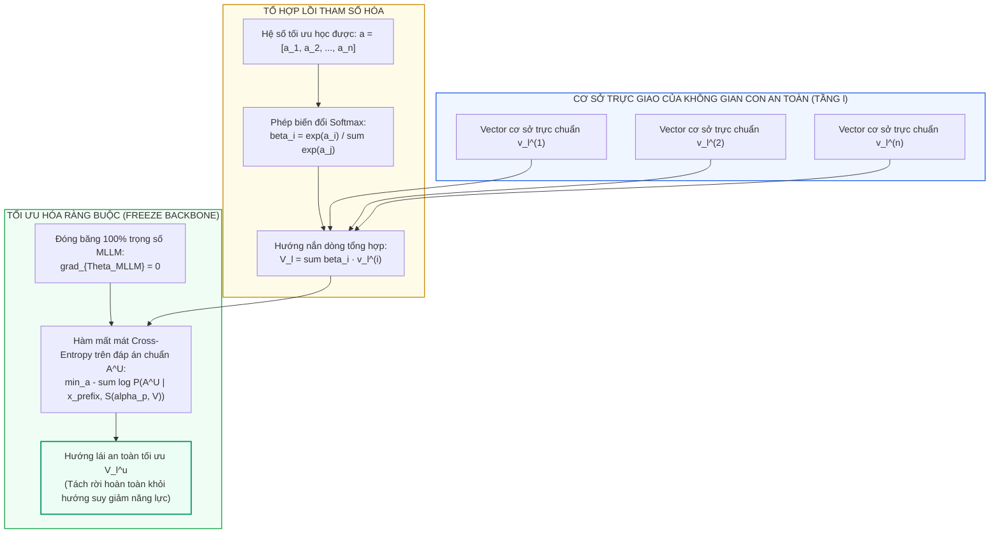
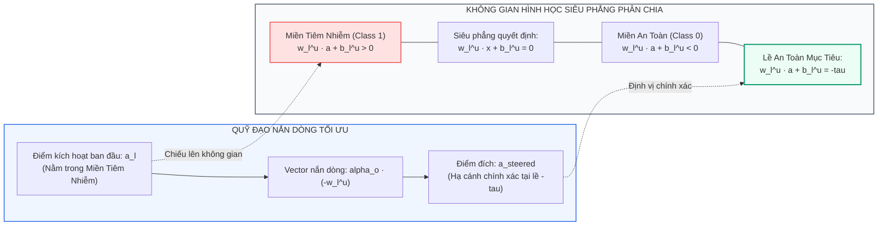
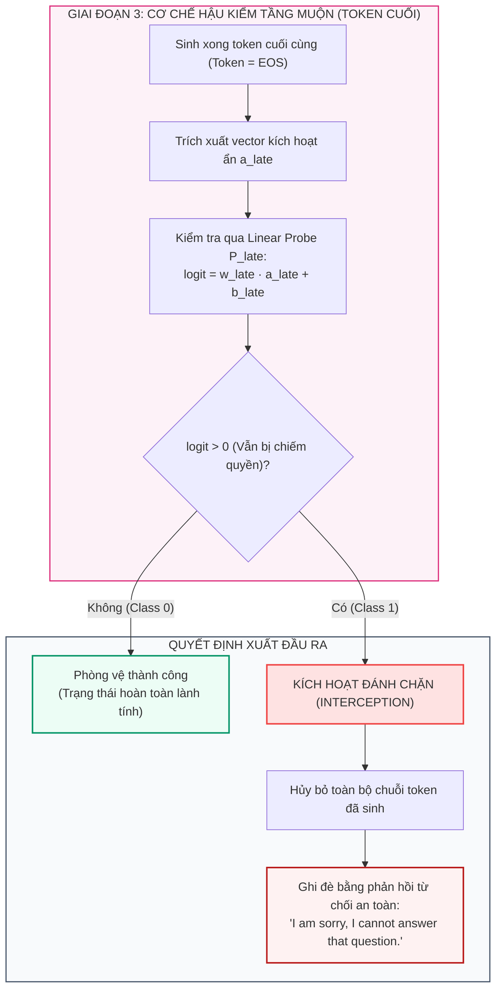
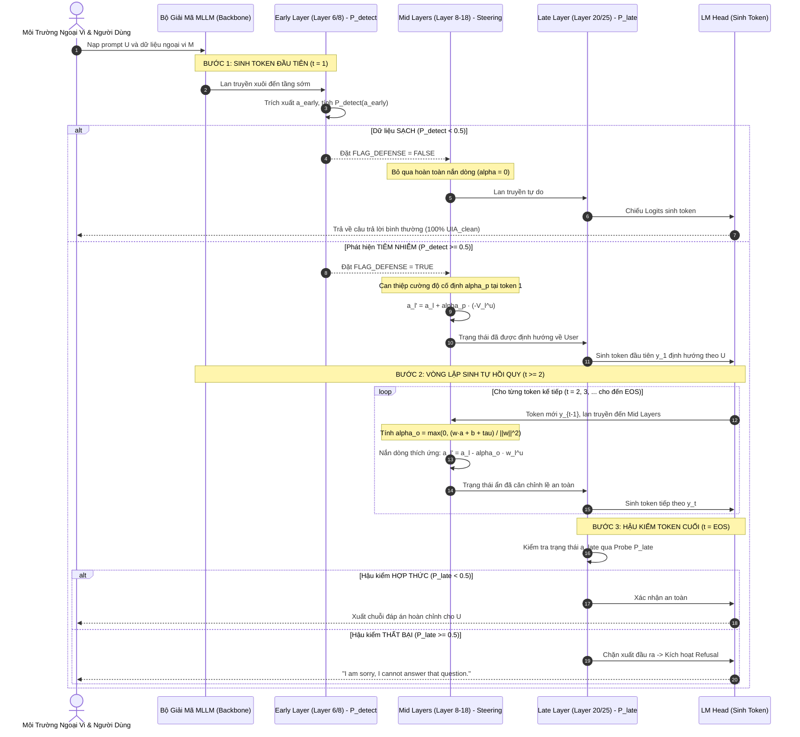

[⬅️ Bài 1: Hình Học Không Gian Ẩn & Probes](01_hinh_hoc_khong_gian_an_va_probes.md) | [🏠 Mục Lục Repo](../../README.md) | [Bài 3: Thực Nghiệm Đa Phương Thức ➡️](03_thuc_nghiem_image_video_audio.md)

---

# Bài 2: Thuật Toán Nắn Dòng Kích Hoạt Thích Ứng (Adaptive Activation Steering) & Cơ Chế Hậu Kiểm

> **Tài liệu chuyên khảo kỹ thuật chuyên sâu**  
> **Chuyên đề:** *Giải Thuật Toán Học Can Thiệp Không Gian Con Trạng Thái Ẩn Trong MLLM*  
> **Trọng tâm bài viết:** Phân tích giải thuật tìm kiếm hướng an toàn tối ưu trên cơ sở trực giao, chứng minh toán học nghiêm ngặt cho nghiệm giải tích dạng đóng $\alpha_o$, cơ chế hậu kiểm tầng muộn, và sơ đồ tuần tự giải mã tự hồi quy.

---

## 1. Tối Ưu Hóa Hướng Lái An Toàn Tách Rời Suy Giảm Năng Lực (Optimal Utility Direction Search)

### 1.1. Thách Thức Toán Học: Sự Chồng Chéo Ngữ Nghĩa

Như đã chỉ ra trong Bài 1 (Phát hiện 3), việc can thiệp ngây thơ bằng vector pháp tuyến đơn lẻ của probe thô ($v_{\text{def}} = -w_l / \|w_l\|_2$) dẫn đến sự suy giảm nghiêm trọng độ chính xác của chỉ thị người dùng ($UIA$). Điều này xuất phát từ hiện tượng chồng chéo không gian: vector phân loại đối kháng vừa mang thông tin "ngăn chặn tiêm nhiễm" vừa chứa các thành phần chiếu làm tê liệt năng lực lập luận tổng quát của mô hình.

Mặt khác, Phát hiện 5 đã chứng minh sự tồn tại của một **Không gian con an toàn đa chiều (Multimodal Safety Subspace)** cấu thành từ tập hợp $n$ vector trọng số probe trực giao đôi một:

$$
\mathcal{W}_l = \left\lbrace w_l^{(1)}, w_l^{(2)}, \dots, w_l^{(n)} \right\rbrace, \quad \text{với } \langle w_l^{(i)}, w_l^{(j)} \rangle = 0 \quad (\forall i \neq j)
$$

Chuẩn hóa các vector này thành hệ cơ sở trực chuẩn (Orthonormal Basis):

$$
v_l^{(i)} = \frac{w_l^{(i)}}{\|w_l^{(i)}\|_2}, \quad \|v_l^{(i)}\|_2 = 1
$$

Mục tiêu là tìm kiếm một vector hướng lái $V_l \in \operatorname{span}\{v_l^{(1)}, \dots, v_l^{(n)}\}$ sao cho khi can thiệp, mô hình vừa triệt tiêu được mã độc, vừa tối đa hóa xác suất sinh ra chuỗi đáp án chuẩn $A^U$ của người dùng.



### 1.2. Công Thức Tổ Hợp Lồi & Hàm Mục Tiêu Huấn Luyện

ARGUS tham số hóa vector hướng lái $V_l$ tại tầng $l$ bằng một tổ hợp lồi có trọng số Softmax dựa trên vector tham số học được $\mathbf{a} = [a_1, a_2, \dots, a_n] \in \mathbb{R}^n$:

$$V_l = \sum_{i=1}^n \left( \frac{\exp(a_i)}{\sum_{j=1}^n \exp(a_j)} \right) v_l^{(i)}$$

Gọi $\mathcal{L}_{\text{steer}}$ là tập hợp các tầng can thiệp ở vùng giữa (Middle Layers). Tập các hướng lái trên toàn bộ các tầng này được biểu diễn là:

$$\mathcal{V} = \{ V_l \mid l \in \mathcal{L}_{\text{steer}} \}$$

Để đảm bảo hướng lái không làm thoái hóa cấu trúc biểu diễn ngôn ngữ tổng quát của mô hình, **toàn bộ trọng số của MLLM được đóng băng tuyệt đối** ($\nabla_{\Theta_{\text{MLLM}}} = \mathbf{0}$). Tham số huấn luyện duy nhất trong suốt quá trình này là vector hệ số $\mathbf{a}$.

Hàm mất mát tối ưu hóa là Negative Log-Likelihood (Cross-Entropy) tính trên chuỗi nhãn chuẩn $A^U$ của người dùng trên tập huấn luyện đối kháng $\mathcal{D}_t$:

$$\mathcal{L}(\mathcal{V}) = - \frac{1}{|\mathcal{D}_t|} \sum_{(x_{\text{prefix}}, A^U) \in \mathcal{D}_t} \sum_{t=1}^{|A^U|} \log P\left( A_t^U \mid x_{\text{prefix}}, A_{<t}^U, \mathcal{S}(\alpha_p, \mathcal{V}) \right)$$

$$\mathcal{V}^u = \arg\min_{\mathcal{V}} \mathcal{L}(\mathcal{V})$$

Trong đó:
- $\mathcal{S}(\alpha_p, \mathcal{V})$ đại diện cho thao tác nắn dòng kích hoạt áp dụng tại tất cả các tầng $l \in \mathcal{L}_{\text{steer}}$ với cường độ thử nghiệm $\alpha_p$:
  $$a_l' = a_l + \alpha_p \cdot (-V_l)$$
- Nhờ việc cực tiểu hóa hàm mất mát trực tiếp trên câu trả lời đúng $A^U$, quá trình lan truyền ngược gradient sẽ tự động triệt tiêu các thành phần cơ sở gây suy thoái nhận thức và củng cố các thành phần cơ sở bảo tồn độ chính xác ngữ nghĩa của tác vụ gốc.

---

## 2. Chứng Minh Nghiệm Giải Tích Dạng Đóng Của Cường Độ Thích Ứng $\alpha_o$

### 2.1. Đặt Vấn Đề: Ranh Giới Giữa Thiếu Lực & Thừa Lực

Trong quá trình sinh token tự hồi quy tại thời điểm suy luận (Inference Time):
- **Nếu $\alpha$ quá nhỏ (Under-steering):** Lực đẩy không đủ lớn để đưa trạng thái kích hoạt $a_l$ vượt qua ranh giới quyết định. Mô hình tiếp tục rơi vào vùng hút của kẻ tấn công và xuất ra nội dung mã độc $A^I$.
- **Nếu $\alpha$ quá lớn (Over-steering):** Trạng thái kích hoạt bị đẩy đi quá xa vào vùng phân phối dị biệt (Out-of-Distribution - OOD). Hệ quả là mô hình bị ảo giác nghiêm trọng, nói lắp, hoặc sinh ra các chuỗi ký tự vô nghĩa (Gibberish).

Do năng lượng kích hoạt thay đổi liên tục theo từng bước sinh token, ARGUS loại bỏ hoàn toàn việc tìm kiếm lưới siêu tham số cố định và thay thế bằng **nghiệm giải tích dạng đóng (Closed-Form Solution)** tính toán cường độ $\alpha_o$ tối ưu cục bộ cho từng token.



### 2.2. Chứng Minh Toán Học Chi Tiết (Rigorous Derivation)

#### Bước 1: Hiệu chuẩn siêu phẳng phân chia dọc theo hướng tối ưu
Sau khi tìm được hướng lái tối ưu $V_l^u$, ARGUS huấn luyện lại một bộ probe tuyến tính $P_l^u$ cho mỗi tầng $l \in \mathcal{L}_{\text{steer}}$. Để bảo toàn tính nhất quán hình học, vector trọng số $w_l^u \in \mathbb{R}^d$ của probe bị cưỡng bức phải song song với hướng tối ưu $V_l^u$:

$$
w_l^u \parallel V_l^u \iff w_l^u = \kappa \cdot V_l^u \quad (\kappa > 0)
$$

Phương trình siêu phẳng quyết định của probe được định nghĩa tại mức logit triệt tiêu:

$$
\mathcal{H}_l^u = \left\lbrace x \in \mathbb{R}^d \mid w_l^u \cdot x + b_l^u = 0 \right\rbrace
$$

Trong đó vector pháp tuyến $w_l^u$ trỏ từ phía lành tính (Class 0 - User instruction) sang phía độc hại (Class 1 - Attacker instruction):
- Nếu $w_l^u \cdot x + b_l^u > 0$: Điểm $x$ nằm về phía tuân theo lệnh tấn công.
- Nếu $w_l^u \cdot x + b_l^u < 0$: Điểm $x$ nằm về phía tuân theo lệnh người dùng.

#### Bước 2: Thiết lập lề an toàn mục tiêu $\tau$
Gọi $\tau > 0$ là lề an toàn (Safety Margin), được đo lường bằng khoảng cách logit trung bình từ các mẫu biểu diễn lành tính trong tập huấn luyện đến siêu phẳng phân định:

$$
\tau = \frac{1}{|\mathcal{D}_{\text{user}}|} \sum_{x \in \mathcal{D}_{\text{user}}} \left| w_l^u \cdot a_l(x) + b_l^u \right|
$$

Mục tiêu can thiệp là biến đổi vector kích hoạt hiện tại $a_l$ thành vector mới $a_{\text{steered}}$ sao cho điểm số phân loại của nó đạt chính xác vị trí tâm phân phối an toàn:

$$
w_l^u \cdot a_{\text{steered}} + b_l^u = -\tau \qquad (1)
$$

#### Bước 3: Thiết lập phương trình nắn dòng
Vì vector pháp tuyến $w_l^u$ trỏ về phía mã độc, hướng nắn an toàn bắt buộc phải ngược hướng với $w_l^u$, tức $-w_l^u$. Vector kích hoạt sau can thiệp được biểu diễn tuyến tính theo cường độ vô hướng $\alpha_o$:

$$
a_{\text{steered}} = a_l + \alpha_o \cdot \left(-w_l^u\right) = a_l - \alpha_o w_l^u \qquad (2)
$$

#### Bước 4: Khai triển đại số giải phương trình
Thay biểu thức (2) vào phương trình mục tiêu (1):

$$
w_l^u \cdot \left( a_l - \alpha_o w_l^u \right) + b_l^u = -\tau
$$

Áp dụng tính chất phân phối của tích vô hướng:

$$
w_l^u \cdot a_l - \alpha_o \left( w_l^u \cdot w_l^u \right) + b_l^u = -\tau
$$

Nhận xét rằng tích vô hướng của một vector với chính nó chính là bình phương chuẩn Euclid:

$$
w_l^u \cdot w_l^u = \|w_l^u\|_2^2
$$

Do đó phương trình trở thành:

$$
w_l^u \cdot a_l - \alpha_o \|w_l^u\|_2^2 + b_l^u = -\tau
$$

Chuyển vế đại lượng chứa $\alpha_o$:

$$
\alpha_o \|w_l^u\|_2^2 = w_l^u \cdot a_l + b_l^u + \tau
$$

Vì $w_l^u$ là vector trọng số khác không của probe đã hội tụ, $\|w_l^u\|_2^2 > 0$. Ta chia cả hai vế cho $\|w_l^u\|_2^2$:

$$
\alpha_o = \frac{w_l^u \cdot a_l + b_l^u + \tau}{\|w_l^u\|_2^2} \qquad (3)
$$

#### Bước 5: Ràng buộc không âm (Non-negativity Projection)
Xét trường hợp trạng thái kích hoạt ban đầu $a_l$ đã nằm sâu trong vùng an toàn vượt quá lề $\tau$:

$$
w_l^u \cdot a_l + b_l^u < -\tau \iff w_l^u \cdot a_l + b_l^u + \tau < 0
$$

Khi đó, giá trị $\alpha_o$ tính toán từ phương trình (3) sẽ mang dấu âm. Một giá trị $\alpha_o < 0$ đồng nghĩa với việc ta sẽ đẩy vector $a_l$ ngược trở lại phía độc hại. Để loại bỏ hiện tượng can thiệp ngược này, ta áp dụng hàm chiếu cực đại với 0:

$$
\alpha_o = \max\left( 0, \frac{w_l^u \cdot a_l + b_l^u + \tau}{\|w_l^u\|_2^2} \right) \qquad (4)
$$

$\blacksquare$ *(Điều phải chứng minh)*

---

## 3. Chiến Lược Phối Hợp Cường Độ: Khởi Động Tĩnh $\alpha_p$ & Suy Luận Động $\alpha_o$

Trong quá trình giải mã tự hồi quy (Autoregressive Generation), ARGUS áp dụng chiến lược điều phối cường độ hai pha:

1. **Token đầu tiên ($t = 1$): Áp dụng cường độ cố định $\alpha_p$**
   - Tại thời điểm bắt đầu sinh phản hồi, mô hình chưa có ngữ cảnh tự hồi quy trước đó; xung lực của cụm trigger tiêm nhiễm $T$ đang đạt mức cực đại trong ma trận chú ý.
   - Việc áp dụng cường độ cố định $\alpha_p$ (được hiệu chuẩn từ tập validation, ví dụ $\alpha_p = 25$ cho Hình ảnh hoặc $\alpha_p = 15$ cho Video/Audio) đóng vai trò như một cú "bẻ lái cưỡng bức", thiết lập tiền đề ngữ nghĩa định hướng dứt khoát về phía câu trả lời người dùng.
2. **Các token tiếp theo ($t \ge 2$): Áp dụng nghiệm đóng thích ứng $\alpha_o$**
   - Khi token đầu tiên đã được sinh ra chuẩn xác theo hướng lành tính, quán tính tự hồi quy của Transformer đã bắt đầu hướng về tác vụ của người dùng.
   - Việc chuyển sang nghiệm đóng thích ứng $\alpha_o$ giúp tính toán chính xác lượng can thiệp tối thiểu cần thiết cho từng token kế tiếp. Tránh được hoàn toàn rủi ro can thiệp thừa gây méo mó cấu trúc ngữ pháp.

---

## 4. Giai Đoạn 3: Bộ Lọc Hậu Kiểm Tầng Muộn ($P_{\text{late}}$)

Mặc dù việc nắn dòng kích hoạt thành công trong việc hóa giải phần lớn các cuộc tấn công, trong các ứng dụng tác tử thực thi tác vụ quan trọng (như giao dịch tài chính hoặc điều khiển hệ thống), một tỷ lệ rò rỉ dù chỉ $0.1\%$ vẫn là mối nguy hiểm tiềm tàng.

ARGUS thiết lập lớp phòng vệ phòng ngừa cuối cùng bằng cách tái sử dụng probe tuyến tính có độ chính xác cao $P_{\text{late}}$ tại các tầng muộn của mô hình:
- **Phương thức Hình ảnh:** Layer 20
- **Phương thức Video:** Layer 25
- **Phương thức Âm thanh:** Layer 20



- **Quy tắc chặn:** Khi quá trình sinh kết thúc tại token $EOS$, nếu $P_{\text{late}}(a_{\text{late}}) \ge 0.5$, hệ thống xác định rằng cuộc tấn công đã vượt qua được lớp nắn dòng kích hoạt. Toàn bộ chuỗi văn bản đã sinh lập tức bị hủy bỏ và thay thế bằng câu từ chối chuẩn:  
  *`"I'm sorry, I cannot answer that question."`*
- Nhờ chốt chặn hậu kiểm này, tỷ lệ $AIA$ và $AIFR$ được kéo giảm triệt để về xấp xỉ **$0.0\%$**.

---

## 5. Sơ Đồ Tuần Tự Giải Mã Tự Hồi Quy (Sequence Execution Flow)

Sơ đồ dưới đây minh họa toàn bộ vòng lặp xử lý tensor qua các tầng Transformer trong một lượt forward pass tích hợp:



---

## 6. Mã Giả Thuật Toán ARGUS Toàn Diện (Algorithm Specification)

Dưới đây là đặc tả thuật toán của quy trình suy luận ARGUS:

```python
def argus_inference_pipeline(
    input_tokens, 
    mllm_model, 
    layer_detect, 
    layers_steer, 
    layer_late,
    probe_detect, 
    probes_steer, 
    probe_late,
    alpha_p, 
    safety_margins_tau
):
    """
    Quy trình suy luận một lượt duy nhất của ARGUS.
    Toàn bộ trọng số MLLM được đóng băng.
    """
    # Bước 1: Khởi tạo lượt sinh token đầu tiên (t = 1)
    hidden_states = mllm_model.embed_tokens(input_tokens)
    flag_injected = False
    generated_tokens = []
    
    # Lan truyền qua các tầng đến tầng phát hiện sớm
    for l in range(1, layer_detect + 1):
        hidden_states = mllm_model.layers[l](hidden_states)
    
    # Đánh giá tiêm nhiễm tại token cuối cùng của tầng sớm
    a_early = hidden_states[:, -1, :]
    if probe_detect.predict_proba(a_early) >= 0.5:
        flag_injected = True
        
    # Tiếp tục lan truyền cho token đầu tiên
    for l in range(layer_detect + 1, mllm_model.num_layers + 1):
        if flag_injected and (l in layers_steer):
            # Áp dụng cường độ cố định alpha_p cho token 1
            direction_u = probes_steer[l].direction_vector  # V_l^u
            hidden_states[:, -1, :] = hidden_states[:, -1, :] - alpha_p * direction_u
            
        hidden_states = mllm_model.layers[l](hidden_states)
        
    # Sinh token đầu tiên
    next_token = mllm_model.lm_head(hidden_states[:, -1, :]).argmax(dim=-1)
    generated_tokens.append(next_token)
    
    # Bước 2: Vòng lặp giải mã tự hồi quy (t >= 2)
    while next_token != mllm_model.eos_token_id and len(generated_tokens) < MAX_GEN_LEN:
        hidden_states = mllm_model.embed_tokens(next_token)
        
        for l in range(1, mllm_model.num_layers + 1):
            if flag_injected and (l in layers_steer):
                # Tính nghiệm giải tích dạng đóng alpha_o
                a_l = hidden_states[:, -1, :]
                w_u = probes_steer[l].weight
                b_u = probes_steer[l].bias
                tau = safety_margins_tau[l]
                
                norm_sq = torch.norm(w_u, p=2) ** 2
                score = torch.matmul(a_l, w_u) + b_u + tau
                alpha_o = torch.clamp(score / norm_sq, min=0.0)
                
                # Nắn dòng kích hoạt
                hidden_states[:, -1, :] = a_l - alpha_o * w_u
                
            hidden_states = mllm_model.layers[l](hidden_states)
            
            # Lưu lại trạng thái kích hoạt tầng muộn
            if l == layer_late:
                a_late = hidden_states[:, -1, :]
                
        next_token = mllm_model.lm_head(hidden_states[:, -1, :]).argmax(dim=-1)
        generated_tokens.append(next_token)
        
    # Bước 3: Hậu kiểm tại token kết thúc
    if flag_injected:
        if probe_late.predict_proba(a_late) >= 0.5:
            # Phát hiện phòng vệ thất bại -> Xuất câu từ chối an toàn
            return "I'm sorry, I cannot answer that question."
            
    return mllm_model.tokenizer.decode(generated_tokens)
```

---

## 7. Tổng Kết

Thuật toán của ARGUS kết hợp tính chặt chẽ của lý thuyết biểu diễn hình học với sự thanh lịch của lời giải giải tích dạng đóng:
- **Tối ưu hóa hướng nắn dòng $V_l^u$** giúp giải phóng năng lực lập luận gốc khỏi sự ràng buộc của vector đối kháng thô.
- **Nghiệm dạng đóng $\alpha_o$** loại bỏ việc dò tìm tham số thực nghiệm, đảm bảo mức độ can thiệp luôn là tối thiểu và chính xác nhất.
- **Sự phối hợp 3 giai đoạn** vận hành mượt mà trong một lượt forward pass duy nhất, mở đường cho hiệu năng thực nghiệm vượt bậc sẽ được trình bày trong Bài 3.

---

[⬅️ Bài 1: Hình Học Không Gian Ẩn & Probes](01_hinh_hoc_khong_gian_an_va_probes.md) | [🏠 Mục Lục Repo](../../README.md) | [Bài 3: Thực Nghiệm Đa Phương Thức ➡️](03_thuc_nghiem_image_video_audio.md)
