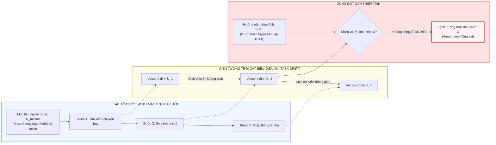
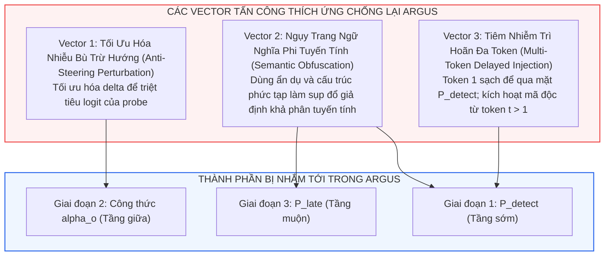
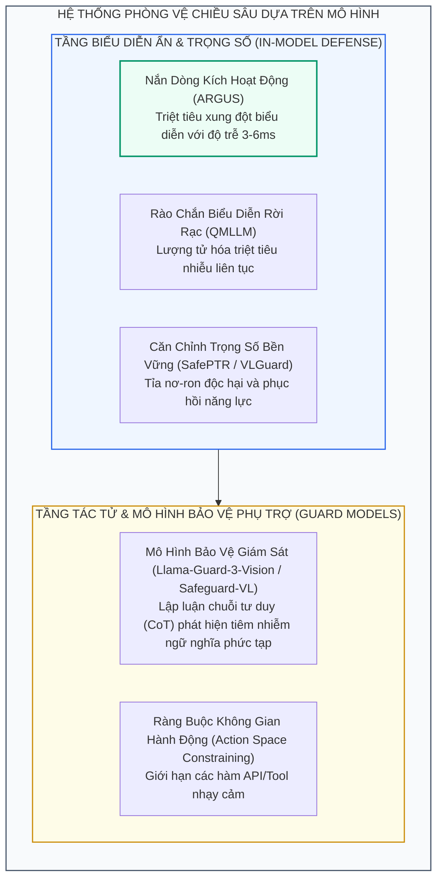

[⬅️ Bài 3: Thực Nghiệm Đa Phương Thức](03_thuc_nghiem_image_video_audio.md) | [🏠 Mục Lục Repo](../../README.md) | [Tổng Quan ARGUS ➡️](index.md)

---

# Bài 4: So Sánh Đối Đầu: Activation Steering vs SFT/DPO, Hiện Tượng Trôi Dạt Tác Vụ & Vector Tấn Công Thích Ứng

> **Tài liệu chuyên khảo kỹ thuật chuyên sâu**  
> **Chuyên đề:** *Phân Tích Cơ Chế Học Máy Đối Kháng & Giới Hạn Kỹ Thuật Của Activation Steering*  
> **Trọng tâm bài viết:** So sánh bản chất giữa can thiệp không gian kích hoạt ẩn và tinh chỉnh trọng số mô hình (SFT/DPO), mổ xẻ hiện tượng trôi dạt biểu diễn trong kịch bản đa lệnh, thiết kế các vector tấn công thích ứng hộp trắng/hộp xám, và xác định ranh giới an toàn của các giải pháp phòng vệ dựa trên mô hình.

---

## 1. So Sánh Bản Chất Học Máy: Activation Steering vs. Biến Đổi Trọng Số (SFT / DPO)

Trong lĩnh vực an toàn mô hình nền tảng, hai trường phái phòng vệ lớn nhất hiện nay là:
1. **Biến đổi trọng số tham số (Parameter Mutation):** Tinh chỉnh có giám sát (Supervised Fine-Tuning - SFT) hoặc Tối ưu hóa tùy chọn trực tiếp (Direct Preference Optimization - DPO / Adversarial Training).
2. **Can thiệp trạng thái kích hoạt ẩn (Latent Representation Steering):** Đóng băng toàn bộ trọng số gốc và can thiệp động vào vector ẩn trong quá trình lan truyền xuôi (tiêu biểu là ARGUS).

```mermaid
flowchart TD
    subgraph PARAM_MUTATION["TRƯỜNG PHÁI 1: BIẾN ĐỔI TRỌNG SỐ (SFT / DPO)"]
        LossSFT["Hàm mất mát căn chỉnh an toàn:<br/>L(Theta) = L_user - beta · L_inject"]
        GradDescent["Cập nhật Gradient liên tục:<br/>Theta <- Theta - eta · grad L"]
        WeightDistort["Trọng số mô hình bị biến dạng vĩnh viễn"]
        SideEffects["Hệ quả tiêu cực:<br/>1. Quên thảm khốc (Catastrophic Forgetting)<br/>2. Từ chối thái quá (Over-refusal Collapse)<br/>3. Kém thích ứng với phân phối tấn công mới"]

        LossSFT --> GradDescent --> WeightDistort --> SideEffects
    end

    subgraph ACTIVATION_STEERING["TRƯỜNG PHÁI 2: CAN THIỆP ẨN ĐỘNG (ARGUS - RepE)"]
        FreezeModel["ĐÓNG BĂNG 100% TRỌNG SỐ:<br/>grad_{Theta_MLLM} = 0"]
        DynamicIntervene["Nắn dòng kích hoạt tại thời điểm suy luận:<br/>a_l' = a_l + alpha_o · (-w_l^u)"]
        ZeroForget["Ưu thế vượt trội:<br/>1. Bảo toàn 100% năng lực gốc (Zero Forgetting)<br/>2. Bật/tắt động theo mẫu (Per-sample switch)<br/>3. Chi phí huấn luyện cực thấp (1 GPU, vài phút)"]

        FreezeModel --> DynamicIntervene --> ZeroForget
    end

    style PARAM_MUTATION fill:#fef2f2,stroke:#ef4444,stroke-width:1.5px
    style ACTIVATION_STEERING fill:#f0fdf4,stroke:#16a34a,stroke-width:1.5px
    style SideEffects fill:#fee2e2,stroke:#b91c1c,stroke-width:1.5px
    style ZeroForget fill:#ecfdf5,stroke:#059669,stroke-width:1.5px
```

### 1.1. Bảng Đối Chiếu Kỹ Thuật Toàn Diện

| Tiêu Chí So Sánh | Tinh Chỉnh Tham Số (SFT / DPO / LoRA) | Nắn Dòng Trạng Thái Ẩn (ARGUS - RepE) | Rationale Học Máy & Cơ Chế |
|:---|:---|:---|:---|
| **Can thiệp trọng số ($\Theta$)** | Biến đổi hàng triệu đến hàng tỷ trọng số ($\Delta \Theta \neq \mathbf{0}$) | **Đóng băng tuyệt đối** ($\Delta \Theta = \mathbf{0}$) | ARGUS bảo toàn cấu trúc ma trận gốc của mô hình, không làm xáo trộn các tri thức đã học trong giai đoạn pre-training. |
| **Nguy cơ quên thảm khốc (Catastrophic Forgetting)** | **Rất cao**; năng lực lập luận tổng quát và khả năng theo chỉ thị bị xói mòn | **Hoàn toàn bằng 0** | Trọng số không đổi; khi gặp dữ liệu sạch, cơ chế steering được tắt hoàn toàn bởi $P_{\text{detect}}$, giữ nguyên 100% $UIA_{\text{clean}}$. |
| **Hiện tượng từ chối thái quá (Over-refusal)** | Nghiêm trọng; mô hình sinh phản xạ "sợ hãi", từ chối cả câu hỏi lành tính | Rất thấp; chỉ từ chối khi bộ lọc hậu kiểm $P_{\text{late}}$ phát hiện phòng vệ thất bại | SFT/DPO làm lệch phân phối prior sang các câu từ chối; ARGUS chủ động nắn dòng về phía đáp án đúng $A^U$ thay vì hướng từ chối. |
| **Tính linh hoạt theo ngữ cảnh (Dynamic Switching)** | **Tĩnh**; mô hình áp dụng chung một bộ trọng số cho mọi loại đầu vào | **Động**; tự động tính toán cường độ $\alpha_o$ riêng biệt cho từng token | Nghiệm giải tích $\alpha_o = \max(0, \dots)$ chỉ tác động một lực tối thiểu cần thiết để vượt qua lề an toàn $\tau$. |
| **Chi phí huấn luyện (Training Overhead)** | Hàng chục GPU hours; cần hàng chục nghìn mẫu đối kháng và bộ nhớ lớn | **Vài phút trên 1 GPU**; chỉ tối ưu vector $\mathbf{a} \in \mathbb{R}^n$ ($n \le 5$) | Bài toán tối ưu hóa của ARGUS chỉ có $n$ tham số vô hướng, hội tụ sau 1 - 2 epochs. |
| **Độ trễ suy luận (Inference Latency)** | $0$ ms bổ sung (sử dụng cùng kiến trúc) | **$3 - 6$ ms** bổ sung | Đổi một độ trễ không đáng kể (vài ms) để đổi lấy sự bảo toàn hoàn hảo năng lực suy luận gốc. |

### 1.2. Phân Tích Hiện Tượng Xói Mòn Năng Lực Của Tinh Chỉnh Đối Kháng (AT/DPO)

Trong Bảng 1 của công trình ARGUS, phương pháp Adversarial Training (DPO) dù giảm được $AIA$ xuống $2.3\%$ (trên Ảnh), nhưng $UIA_{\text{clean}}$ lại sụt giảm từ **$49.6\%$ xuống $40.7\%$** (mất gần $9\%$ độ chính xác trên dữ liệu lành tính!). 

Hiện tượng này bắt nguồn từ bản chất toán học của DPO:

$$
\mathcal{L}_{\text{DPO}}(\Theta) = - \mathbb{E}_{(x, y_w, y_l)} \left[ \log \sigma \left( \beta \log \frac{\pi_\Theta(y_w \mid x)}{\pi_{\text{ref}}(y_w \mid x)} - \beta \log \frac{\pi_\Theta(y_l \mid x)}{\pi_{\text{ref}}(y_l \mid x)} \right) \right]
$$

Khi tối ưu hóa để hạ thấp xác suất của chuỗi bị chiếm quyền $y_l = A^I$ và nâng cao $y_w = A^U$, ma trận trọng số $\Theta$ bị ép phải thay đổi trên toàn bộ các subspace. Do dữ liệu huấn luyện an toàn không thể bao quát toàn bộ phân phối tri thức, các vùng không gian đại diện cho tri thức chuyên sâu (toán học, mã nguồn, trích xuất thực thể) bị "xói mòn" (Representation Collapse), biến mô hình trở nên ngô nghê hoặc từ chối vô cớ.

Ngược lại, ARGUS giữ nguyên $\pi_{\text{ref}} = \pi_\Theta$. Bằng việc nắn dòng vector $a_l \leftarrow a_l - \alpha_o w_l^u$, ARGUS chỉ dịch chuyển trạng thái kích hoạt cục bộ trong không gian con an toàn đa chiều $\mathcal{V}_{\text{safe}}$ mà không tác động đến các chiều biểu diễn tri thức khác.

---

## 2. Thách Thức Kịch Bản Đa Lệnh & Hiện Tượng Trôi Dạt Tác Vụ (Multi-Instruction Task Drift)

Mặc dù ARGUS thể hiện hiệu năng phòng vệ xuất sắc trong thiết lập chuẩn, nhóm tác giả đã thẳng thắn chỉ ra giới hạn cốt lõi trong phần *Limitations*: **ARGUS được thiết kế và kiểm chứng trong kịch bản một chỉ thị người dùng và một chỉ thị tiêm nhiễm ($1\text{U} + 1\text{I}$)**.

Trong thực tế triển khai các tác tử AI đa phương thức phức tạp (Complex Multimodal Agents), mô hình phải xử lý các chuỗi tác vụ dài với nhiều bước thực thi đan xen:

### 2.1. Phân Tích Cơ Chế Trôi Dạt Biểu Diễn Ẩn (Latent Representation Drift)

1. **Sự dịch chuyển của vector mục tiêu:** Trong quá trình thực thi đa bước, vector biểu diễn ý định người dùng trong không gian ẩn không phải là một điểm bất biến mà là một quỹ đạo động (trajectory):

$$
a_{\text{user}}(t) = f\left( U_{\text{master}}, \text{History}_{<t}, \text{Obs}_t \right)
$$

Khi tác tử chuyển từ bước *"Tìm kiếm"* sang *"So sánh giá"*, tọa độ tâm phân phối của hành vi lành tính đã thay đổi đáng kể.
2. **Sự bất đối xứng của hướng can thiệp tĩnh:** Hướng tối ưu $V_l^u$ trong ARGUS được học trên các cặp $(U, A^U)$ đơn lẻ. Khi áp dụng $V_l^u$ cho một bước trung gian phức tạp, vector nắn dòng có thể không còn trực giao với các chiều thông tin quan trọng của bước đó, vô tình kéo trạng thái kích hoạt trôi xa khỏi mục tiêu cục bộ của tác tử.
3. **Mâu thuẫn chỉ thị phụ trợ hợp pháp:** Trong nhiều trang web, bản thân nội dung ngoại vi chứa các chỉ thị điều hướng hợp pháp (ví dụ: *"Nhấn vào đây để xem chi tiết"*, *"Đăng nhập bằng Google"*). Một hệ thống nắn dòng thô bạo có nguy cơ nhận diện nhầm các chỉ thị hợp pháp này là tiêm nhiễm độc hại và triệt tiêu chúng, làm tê liệt khả năng tương tác của tác tử.

---

## 3. Các Vector Tấn Công Thích Ứng (Adaptive Adversarial Attacks)

Khi kẻ tấn công có hiểu biết về cơ chế hoạt động của ARGUS (mô hình đe dọa hộp xám hoặc hộp trắng), chúng có thể thiết kế các chiến lược tấn công thích ứng nhằm vượt qua hoặc vô hiệu hóa các lớp phòng vệ:

### 3.1. Vector 1: Tấn Công Đối Kháng Bù Trừ Hướng (Anti-Steering Perturbations)

Nếu kẻ tấn công trích xuất được trọng số của probe $w_l^u$ và lề an toàn $\tau$, chúng có thể tính toán một vector nhiễu đối kháng $\delta$ nhúng vào ảnh hoặc âm thanh bằng phương pháp chiếu gradient (PGD):

$$
\min_{\delta, \|\delta\|_p \le \epsilon} \mathcal{L}_{\text{task}}(A^I) \quad \text{với ràng buộc:} \quad w_{\text{det}} \cdot a_{\text{early}}(x + \delta) + b_{\text{det}} < 0 \quad \text{và} \quad w_l^u \cdot a_l(x + \delta) + b_l^u < -\tau
$$

**Cơ chế đánh bại:**
- Kẻ tấn công cố tình "ngụy trang" vector kích hoạt $a_l(x + \delta)$ sao cho điểm logit của nó rơi sâu vào miền giá trị âm ($< -\tau$).
- Khi đó, công thức nghiệm dạng đóng của ARGUS:

$$
\alpha_o = \max\left( 0, \frac{w_l^u \cdot a_l + b_l^u + \tau}{\|w_l^u\|_2^2} \right) = \max(0, \text{giá trị âm}) = 0
$$

- Hệ thống bị đánh lừa rằng trạng thái kích hoạt đã hoàn toàn an toàn và **tắt lực can thiệp ($\alpha_o = 0$)**, cho phép mã độc được thực thi tự do.

### 3.2. Vector 2: Ngụy Trang Ngữ Nghĩa Phi Tuyến Tính (Semantic Obfuscation)

Giả định nền tảng của ARGUS là **Tính Khả Phân Tuyến Tính (Linear Separability)**. Kẻ tấn công có thể phá vỡ giả định này bằng cách:
- Không sử dụng các trigger thô dạng `"Ignore all previous instructions"`.
- Sử dụng kỹ thuật chia nhỏ ngữ nghĩa (Semantic Fragment Dispersion): chia nhỏ chỉ thị độc hại thành các mảnh ghép ẩn dụ rải rác trên nhiều vùng của ảnh hoặc qua nhiều khung hình video.
- Sử dụng các cấu trúc ngôn ngữ phức hợp nhiều tầng (Higher-Order Pragmatics), nhập vai (Role-playing), hoặc lý luận logic hình thức.

Khi ngữ nghĩa độc hại được mã hóa phi tuyến tính, ranh giới giữa an toàn và độc hại biến thành một đa tạp uốn lượn phức tạp (Non-linear Manifold). Các linear probe bậc nhất ($P_{\text{detect}}, P_l^u, P_{\text{late}}$) sẽ bị sụp đổ độ chính xác, dẫn đến việc bỏ sót tấn công (False Negatives) hoặc từ chối nhầm tác vụ lành tính (False Positives).

### 3.3. Vector 3: Tiêm Nhiễm Trì Hoãn Đa Token (Multi-Token Delayed Injection)

ARGUS chỉ kích hoạt bộ dò tiêm nhiễm $P_{\text{detect}}$ **một lần duy nhất tại token đầu tiên ($t = 1$)** nhằm tiết kiệm chi phí tính toán. Kẻ tấn công có thể khai thác điểm mù này:
- Thiết kế một chỉ thị độc hại sao cho tại token đầu tiên, phản hồi bắt buộc phải bắt đầu bằng một chuỗi mở đầu hoàn toàn lành tính (ví dụ: *"Dưới đây là mô tả bức ảnh..."*).
- Tại $t = 1$, $a_{\text{early}}$ mang đặc trưng hoàn toàn bình thường $\implies P_{\text{detect}} < 0.5 \implies$ **Cờ phòng vệ bị tắt vĩnh viễn cho toàn bộ phiên sinh**.
- Từ token $t = 5$ trở đi, chuỗi sinh bất ngờ chuyển hướng sang thực thi mã độc tiêm nhiễm mà không gặp phải bất kỳ sự can thiệp nắn dòng nào ở các tầng giữa.

---

## 4. Định Vị ARGUS & Xu Hướng Phát Triển Phòng Vệ Dựa Trên Mô Hình

Phân tích phản biện trên không phủ nhận giá trị của ARGUS mà giúp định vị chính xác vai trò của phương pháp trong hệ sinh thái an toàn AI:

### 4.1. Bản Chất Xác Suất & Giới Hạn Của Phòng Vệ Nội Tại
Mọi kỹ thuật can thiệp biểu diễn (Representation Intervention) đều dựa trên xác suất thống kê. Dù $AIA$ giảm xuống $0.1\%$, xác suất rủi ro vẫn tồn tại. Do đó:
- **ARGUS là phòng tuyến vòng trong xuất sắc:** Loại bỏ hơn $99.9\%$ các nỗ lực tấn công thông thường với chi phí tính toán tối thiểu (3 - 6 ms).
- **Cần phối hợp với các cơ chế ràng buộc tác tử:** Đối với các hành động rủi ro cao (xóa file, chuyển tiền, cấp quyền), hệ thống bắt buộc phải áp dụng cơ chế xác nhận người dùng (Human-in-the-Loop) hoặc mô hình giám sát đa bước (Watcher Guard Models).

### 4.2. Các Hướng Nghiên Cứu Mở Rộng Tiềm Năng
1. **Nắn dòng trên đa tạp phi tuyến tính (Non-linear Manifold Steering):** Sử dụng mạng nơ-ron MLP nhỏ (Kernelized Probes) thay vì hồi quy logistic tuyến tính để nắm bắt các ranh giới an toàn phi tuyến tính phức tạp.
2. **Bộ phát hiện đa bước tuần hoàn (Multi-Step Detection Checkpoints):** Thay vì chỉ kiểm tra tại $t = 1$, kích hoạt $P_{\text{detect}}$ định kỳ mỗi $K$ token để ngăn chặn tấn công tiêm nhiễm trì hoãn.
3. **Cơ chế nắn dòng nhận thức ngữ cảnh động (Context-Aware Steering):** Huấn luyện mạng tạo trọng số $\mathbf{a}(U)$ phụ thuộc trực tiếp vào đặc trưng câu hỏi của người dùng, giúp vector $V_l^u$ tự động xoay chuyển linh hoạt theo quỹ đạo của tác vụ đa bước.

---

## 5. Tổng Kết Toàn Bộ Chuyên Đề ARGUS

Chuyên đề nghiên cứu chuyên sâu về công trình **ARGUS** (arXiv:2501.12781) đã giải phẫu một trong những giải pháp phòng vệ Visual/Multimodal Prompt Injection thanh lịch và hiệu quả nhất hiện nay:
1. **Khoa học biểu diễn:** Khám phá sự tồn tại của Không gian con an toàn đa chiều ($\mathcal{V}_{\text{safe}}$) và tính khả phân tuyến tính của hành vi tuân thủ chỉ thị.
2. **Đột phá giải thuật:** Xây dựng quy trình tìm kiếm hướng lái tối ưu tách rời suy giảm năng lực và dẫn xuất nghiệm giải tích dạng đóng $\alpha_o$ cho cường độ can thiệp thích ứng.
3. **Thực thi vượt trội:** Bảo đảm an toàn gần như tuyệt đối ($AIA \to 0\%$) trên cả ba phương thức Ảnh, Video, Âm thanh với chi phí độ trễ chỉ từ **3 đến 6 ms**, bảo toàn trọn vẹn $100\%$ năng lực mô hình gốc.

ARGUS đặt nền móng vững chắc cho trường phái phòng vệ dựa trên biểu diễn trạng thái ẩn, mở ra hướng đi đầy triển vọng cho việc xây dựng các tác tử AI đa phương thức an toàn, tin cậy và hiệu năng cao.

---

[⬅️ Bài 3: Thực Nghiệm Đa Phương Thức](03_thuc_nghiem_image_video_audio.md) | [🏠 Mục Lục Repo](../../README.md) | [Tổng Quan ARGUS ➡️](index.md)
