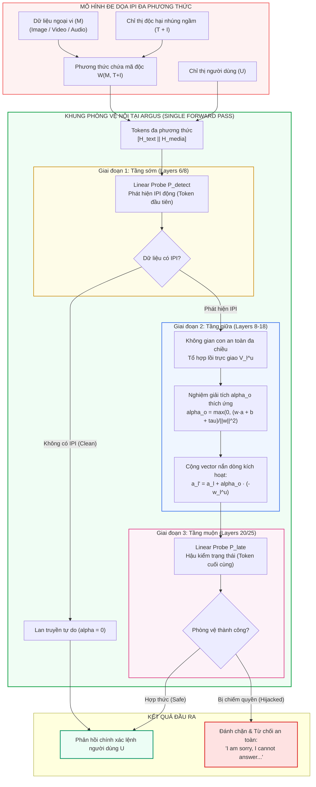
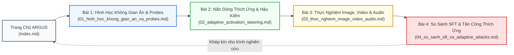

[🏠 Mục Lục Repo](../../README.md) | [Tổng Quan ARGUS](index.md) | [Bài 1: Hình Học Không Gian Ẩn & Probes ➡️](01_hinh_hoc_khong_gian_an_va_probes.md)

---

# Chuyên Đề Nghiên Cứu: ARGUS — Nắn Dòng Kích Hoạt Ẩn Phòng Vệ Indirect Prompt Injection Đa Phương Thức

> **Tài liệu chuyên khảo kỹ thuật chuyên sâu**  
> **Đề tài:** *Phòng Vệ Tấn Công Tiêm Nhiễm Chỉ Thị Gián Tiếp (Indirect Prompt Injection - IPI) Đa Phương Thức Bằng Can Thiệp Biểu Diễn Trạng Thái Ẩn (Representation Engineering)*  
> **Công trình trọng tâm:** *ARGUS: Defending Against Multimodal Indirect Prompt Injection via Steering Instruction-Following Behavior* (arXiv:2501.12781, 2025)

---

## 1. Bảng Định Danh Công Trình (Paper Metadata)

| Thuộc Tính | Chi Tiết Định Danh Học Thuật |
|:---|:---|
| **Tên bài báo** | **ARGUS: Defending Against Multimodal Indirect Prompt Injection via Steering Instruction-Following Behavior** |
| **Tác giả** | Weikai Lu, Ziqian Zeng (Corresponding Author), Kehua Zhang, Haoran Li, Huiping Zhuang, Ruidong Wang, Cen Chen, Hao Peng |
| **Cơ quan nghiên cứu** | • Trường Khoa học & Kỹ thuật Máy tính, Đại học Công nghệ Hoa Nam (South China University of Technology - SCUT) • Đại học Khoa học & Công nghệ Hồng Kông (HKUST) • Đại học Sư phạm Chiết Giang (Zhejiang Normal University) • Đại học Hàng không Vũ trụ Bắc Kinh (Beihang University) |
| **Kênh công bố & Thời gian** | arXiv preprint (arXiv:2501.12781 [cs.CR, cs.CV, cs.CL]), Tháng 01/2025 |
| **Lĩnh vực chuyên môn** | Model-based Multimodal Security, Representation Engineering (RepE), Activation Steering, Vision-Language-Audio Safety |
| **Mã nguồn công khai** | Trực thuộc dự án an toàn MLLM của nhóm SCUT-SEALab |
| **Tài liệu tham khảo** | [arXiv:2501.12781](https://arxiv.org/abs/2501.12781) \| [arXiv HTML](https://arxiv.org/html/2501.12781) \| [arXiv PDF](https://arxiv.org/pdf/2501.12781.pdf) |

---

## 2. Tóm Tắt Đóng Góp Khoa Học (Executive Summary)

Các mô hình Thị giác - Ngôn ngữ - Âm thanh Lớn (Multimodal Large Language Models - MLLMs) đang đối mặt với lỗ hổng nghiêm trọng trước các cuộc tấn công **Tiêm Nhiễm Chỉ Thị Gián Tiếp Đa Phương Thức (Multimodal Indirect Prompt Injection - IPI)**. Trong kịch bản này, kẻ tấn công nhúng một chỉ thị độc hại $I$ đi kèm cụm kích hoạt $T$ vào trong dữ liệu ngoại vi $M$ (hình ảnh, video hoặc âm thanh). Khi MLLM xử lý dữ liệu ngoại vi để giải quyết tác vụ người dùng $U$, cơ chế tự chú ý (self-attention) của Transformer bị chiếm quyền điều khiển, khiến mô hình thực thi chỉ thị của kẻ tấn công thay vì yêu cầu hợp pháp của người dùng.

Khác với các phương pháp tiếp cận truyền thống vốn dựa vào kỹ nghệ prompt (prompt engineering), chỉnh sửa xóa nhiễu dữ liệu ngoại vi (inpainting removal), hoặc tinh chỉnh trọng số đối kháng (safety fine-tuning / DPO), công trình **ARGUS** đề xuất một mô thức hoàn toàn mới dựa trên **Kỹ thuật Biểu diễn (Representation Engineering - RepE)**:

1. **Khám phá hình học biểu diễn ẩn (Latent Representation Geometry):** ARGUS chứng minh bằng thực nghiệm rằng hành vi tuân thủ chỉ thị của MLLM hoàn toàn **khả phân tuyến tính** (linearly separable) trong không gian kích hoạt ẩn của bộ giải mã Transformer. Hơn thế nữa, các tác giả phát hiện ra sự tồn tại của một **Không gian con an toàn đa chiều (Multimodal Safety Subspace)** thay vì một vector đơn lẻ.
2. **Cơ chế nắn dòng kích hoạt tách rời suy giảm năng lực (Utility-Preserving Activation Steering):** Thay vì can thiệp ngây thơ bằng vector phân loại đối kháng (vốn bị ghép cặp với hướng làm tê liệt khả năng suy luận), ARGUS tối ưu hóa một tổ hợp lồi trên không gian con cơ sở trực giao để tìm ra hướng nắn dòng tối ưu $V_l^u$, tách rời hoàn toàn khỏi hướng làm suy giảm năng lực tác vụ.
3. **Nghiệm giải tích dạng đóng cho cường độ can thiệp thích ứng ($\alpha_o$):** ARGUS dẫn xuất một nghiệm đóng (closed-form solution) xác định chính xác cường độ can thiệp tối thiểu cần thiết cho từng token suy luận, đảm bảo trạng thái kích hoạt được kéo vừa đủ qua siêu phẳng an toàn tới lề mục tiêu $\tau$ mà không gây biến dạng phân phối (out-of-distribution distortion).
4. **Kiến trúc ba giai đoạn tích hợp trong một lượt lan truyền xuôi (Single Forward Pass):** Kết hợp bộ dò tiêm nhiễm ở tầng sớm ($P_{\text{detect}}$), bộ nắn dòng thích ứng ở tầng giữa, và bộ lọc hậu kiểm ($P_{\text{late}}$) ở tầng muộn, mang lại mức độ bảo vệ gần như tuyệt đối ($AIA \to 0\%$) trên cả ba phương thức **Ảnh, Video, Âm thanh** với độ trễ phát sinh chỉ từ **3 đến 6 mili-giây** (ms).

---

## 3. Bản Đồ Nội Dung Bộ Tài Liệu Chuyên Khảo

Bộ chuyên khảo về công trình ARGUS được cấu trúc thành 4 chương chuyên sâu, phân tích toàn diện từ cơ sở lý thuyết toán học, giải thuật can thiệp trạng thái ẩn, thiết lập thực nghiệm đa phương thức cho đến phân tích an ninh đối kháng:

### [Bài 1: Hình Học Không Gian Kích Hoạt Ẩn & Kỹ Thuật Linear Probes Phát Hiện IPI](01_hinh_hoc_khong_gian_an_va_probes.md)
- **Mục tiêu chuyên sâu:** Khảo sát chi tiết cấu trúc hình học của không gian biểu diễn ẩn trong MLLM khi đối mặt với xung đột chỉ thị.
- **Nội dung trọng tâm:**
  - Thiết lập giao thức Linear Probing trên vector kích hoạt ẩn $a_l \in \mathbb{R}^d$.
  - Mổ xẻ chi tiết **5 phát hiện khoa học cốt lõi (Core Empirical Findings)** về tính khả phân tuyến tính, tính hai chiều của hành vi tuân thủ, hiện tượng ghép cặp suy giảm năng lực (coupling), hiện tượng gia tăng năng lực nghịch lý, và sự tồn tại của không gian con an toàn đa chiều.
  - Thiết kế và hiệu chuẩn bộ phân loại nhị phân $P_{\text{detect}}$ ở các tầng sớm (Early Layers) để kích hoạt phòng vệ theo nhu cầu (On-Demand Detection).

### [Bài 2: Thuật Toán Nắn Dòng Kích Hoạt Thích Ứng (Adaptive Activation Steering) & Cơ Chế Hậu Kiểm](02_adaptive_activation_steering.md)
- **Mục tiêu chuyên sâu:** Phân tích giải thuật toán học tối ưu hóa hướng an toàn và chứng minh nghiệm giải tích dạng đóng.
- **Nội dung trọng tâm:**
  - Thuật toán tìm kiếm hướng tối ưu $V_l^u$ trên không gian con cơ sở trực giao $\{v_l^{(1)}, \dots, v_l^{(n)}\}$ bằng tối ưu hóa tổ hợp lồi Softmax với trọng số backbone bị đóng băng tuyệt đối ($\nabla_\Theta = \mathbf{0}$).
  - Chứng minh toán học hoàn chỉnh cho nghiệm giải tích dạng đóng của cường độ can thiệp thích ứng:
    $$\alpha_o = \max\left( 0, \frac{w_l^u \cdot a_l + b_l^u + \tau}{\|w_l^u\|_2^2} \right)$$
  - Thiết kế bộ lọc hậu kiểm $P_{\text{late}}$ ở các tầng muộn để tạo lập chốt chặn an toàn tuyệt đối.
  - Sơ đồ tuần tự (sequence diagram) chi tiết của toàn bộ chu trình suy luận tự hồi quy (Autoregressive Generation).

### [Bài 3: Thực Nghiệm Toàn Diện Trên Ba Miền Đa Phương Thức (Image, Video, Audio) & Phân Tích Độ Trễ](03_thuc_nghiem_image_video_audio.md)
- **Mục tiêu chuyên sâu:** Kiểm chứng định lượng tính hiệu quả, tính tổng quát hóa và chi phí tính toán của ARGUS trên các bộ dữ liệu quy chuẩn.
- **Nội dung trọng tâm:**
  - Thiết kế bộ benchmark đa phương thức: VTQA 2023 (Hình ảnh), MSR-VTT (Video), Clotho-AQA (Âm thanh).
  - Bảng kết quả đối soát toàn diện với 5 nhóm phương pháp phòng vệ nền tảng (System Prompt, Ignore Prompt, Gaussian Noise, Inpainted Removal, Adversarial Training / DPO).
  - Phân tích bóc tách thành phần (Ablation Study): vai trò của việc tìm kiếm hướng (Search), can thiệp thích ứng ($\alpha_o$), và hậu kiểm (Post-Filtering).
  - Đánh giá khả năng mở rộng xuyên kiến trúc trên InternVL3.5-8B, Qwen2.5-VL-7B, và Qwen2-Audio-7B.
  - Phân tích nguyên nhân độ trễ siêu thấp (chỉ tốn thêm **3 - 6 ms** so với hàng chục ngàn mili-giây của các phương pháp tiền xử lý).

### [Bài 4: So Sánh Đối Đầu: Activation Steering vs SFT/DPO, Hiện Tượng Trôi Dạt Tác Vụ & Vector Tấn Công Thích Ứng](04_so_sanh_sft_va_adaptive_attacks.md)
- **Mục tiêu chuyên sâu:** Phân tích bản chất học máy đối chiếu giữa can thiệp trạng thái ẩn và tái huấn luyện trọng số, nhận diện các ranh giới thất bại và các vector tấn công thích ứng.
- **Nội dung trọng tâm:**
  - So sánh cơ chế can thiệp: Đóng băng trọng số $\Theta$ vs Biến đổi tham số ($W \leftarrow W - \eta \nabla L$); hiện tượng quên thảm khốc (Catastrophic Forgetting) và từ chối thái quá (Over-refusal).
  - Giới hạn của mô hình đe dọa $1\text{U} + 1\text{I}$ và hiện tượng trôi dạt biểu diễn (Task Drift) trong kịch bản chuỗi lệnh đa bước (Multi-Instruction Agents).
  - Thiết kế các vector tấn công thích ứng hộp trắng / hộp xám: Tối ưu hóa nhiễu bù trừ hướng (Anti-steering adversarial perturbations) và kỹ thuật viết lại ngữ nghĩa (Semantic paraphrasing).
  - Định vị ARGUS trong hệ thống phòng vệ đa tầng (Defense-in-Depth) dựa trên mô hình.

---

## 4. Tổng Hợp So Sánh Các Trường Phái Phòng Vệ VPI / IPI

Bảng dưới đây tổng kết sự khác biệt bản chất giữa ARGUS và các nhóm giải pháp phòng vệ phổ biến trong y văn:

| Tiêu Chí Kỹ Thuật | Kỹ Nghệ Prompt (System / Ignore Prompt) | Xóa Nhiễu Ngoại Vi (Inpainted Removal) | Tinh Chỉnh An Toàn (Adversarial Training / DPO) | Nắn Dòng Trạng Thái Ẩn (ARGUS - RepE) |
|:---|:---:|:---:|:---:|:---:|
| **Bản chất can thiệp** | Bổ sung chuỗi văn bản cảnh báo vào ngữ cảnh đầu vào | Sử dụng mô hình chuyên dụng chỉnh sửa/xóa pixel hoặc khung hình | Tinh chỉnh vĩnh viễn trọng số mô hình ($\Theta_{\text{MLLM}}$) | Can thiệp vector kích hoạt ẩn trong một lượt forward pass |
| **Biến đổi trọng số ($\Theta$)** | Không ($\Delta \Theta = 0$) | Không ($\Delta \Theta = 0$) | **Có** ($\Delta \Theta \neq 0$) | **Không** ($\Delta \Theta = 0$, chỉ nắn $a_l$) |
| **Bảo toàn năng lực gốc ($UIA_{\text{clean}}$)** | Kém (Gây nhiễu chú ý) | Tốt (Giữ được độ chính xác) | Kém (Quên thảm khốc, tụt năng lực) | **Bảo toàn 100%** (Nhờ tầng $P_{\text{detect}}$) |
| **Độ trễ suy luận (Overhead)** | Nhỏ (2 - 15 ms) | **Bùng nổ** (12,885 - 574,121 ms) | **0 ms** (Không tăng thêm) | **Cực thấp** (**3 - 6 ms**) |
| **Khả năng mở rộng đa phương thức** | Đồng đều nhưng kém hiệu quả | Phụ thuộc nặng (Không có mô hình cho Audio) | Đòi hỏi dữ liệu tinh chỉnh cho từng phương thức | **Áp dụng thống nhất** cho Image, Video, Audio |
| **Rủi ro Over-refusal** | Thấp | Không áp dụng | **Rất cao** (Mô hình trở nên quá thận trọng) | Cực thấp (Chỉ từ chối khi steering thất bại) |

---

## 5. Kết Luận Khái Quát

ARGUS khẳng định tiềm năng vượt trội của trường phái **Representation Engineering** trong việc giải quyết vấn đề an toàn MLLM mà không cần đánh đổi năng lực tác vụ cốt lõi hay gia tăng chi phí phần cứng. Bằng việc phân tích sâu cấu trúc hình học của không gian trạng thái ẩn và thiết kế can thiệp toán học chính xác, ARGUS thiết lập một chuẩn mực mới cho các cơ chế phòng vệ Visual/Multimodal Prompt Injection thế hệ tiếp theo.

---

[🏠 Mục Lục Repo](../../README.md) | [Tổng Quan ARGUS](index.md) | [Bài 1: Hình Học Không Gian Ẩn & Probes ➡️](01_hinh_hoc_khong_gian_an_va_probes.md)
