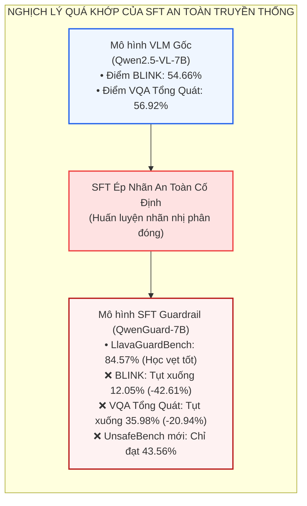
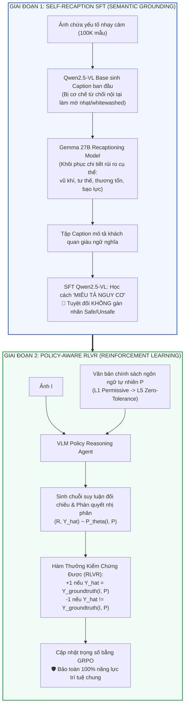
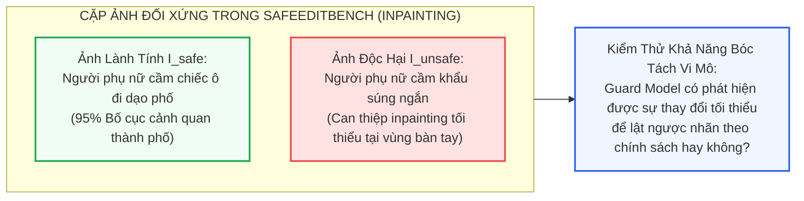
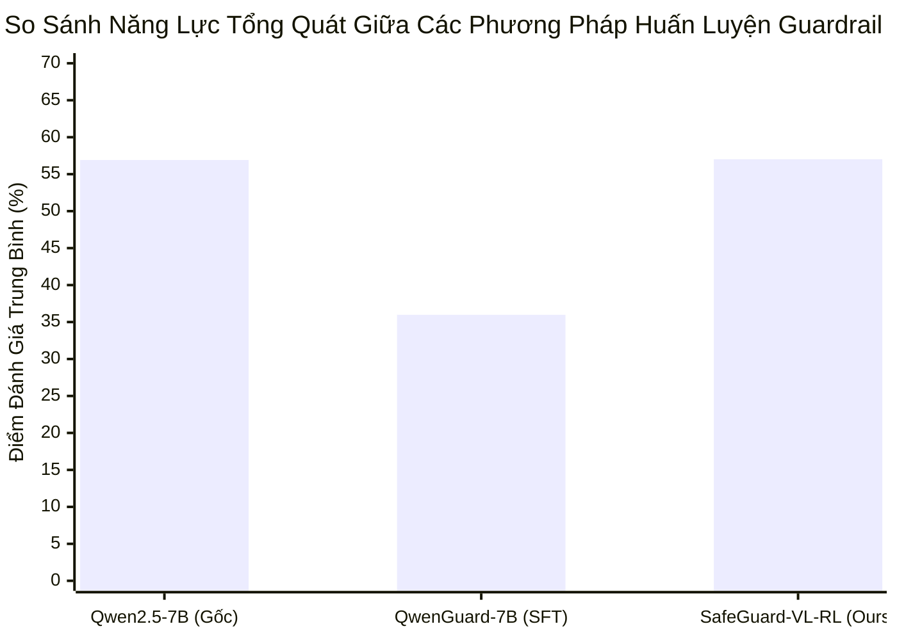

[⬅️ Chương 2: GuardReasoner-VL](02_guardreasoner_vl_cot_reasoning.md) | [🏠 Thư Mục Guard Models](index.md) | [Chương 4: Đánh Đổi Độ Trễ & Meta-Jailbreak ➡️](04_danh_doi_do_tre_va_meta_jailbreak.md)

---

# Chương 3: SafeGuard-VL — Tách Rời Miêu Tả Rủi Ro & Thích Ứng Chính Sách Động

> **Tài liệu chuyên khảo an ninh AI cấp độ mô hình:**  
> Đề tài: *Khảo Sát Đột Phá Khoa Học Của SafeGuard-VL: Mô Thức Thích Ứng Chính Sách Đa Phương Thức Thông Qua Tách Rời Nhận Thức và Học Tăng Cường Với Phần Thưởng Kiểm Chứng Được (RLVR)*  
> Trọng tâm chương: Giải phẫu hiện tượng "Quá khớp chính sách" (Policy Overfitting Paradox) và sự suy thoái thảm khốc của SFT truyền thống trên các benchmark trí tuệ thị giác, cơ chế sinh mô tả rủi ro tự thân (Self-Recaptioning), benchmark cặp ảnh đối xứng ngữ nghĩa SafeEditBench trên 5 phân tầng chính sách, và thuật toán tối ưu hóa RLVR bảo toàn 100% tri thức tổng quát.  
> **Nguyên tắc phân định ranh giới:** Phân tích hoàn toàn trên bình diện cấu trúc nơ-ron, phân phối xác suất sinh văn bản mô tả, không gian chính sách Reinforcement Learning và quy trình tối ưu hóa trọng số. Không khảo cứu các giải pháp an ninh phần mềm hay kỹ nghệ hệ thống.

---

## 1. Thông Tin Thư Mục & Metadata Nghiên Cứu

Bảng thông số định danh công trình SafeGuard-VL:

| Thuộc Tính | Chi Tiết Định Danh |
|:---|:---|
| **Tên bài báo** | *Towards Policy-Adaptive Image Guardrail: Benchmark and Method* |
| **Nhóm tác giả** | Caiyong Piao, Zhiyuan Yan, Haoming Xu, Yunzhen Zhao, Kaiqing Lin, Feiyang Xu, Shuigeng Zhou |
| **Đơn vị nghiên cứu** | Fudan University, Tencent, Peking University (PKU) |
| **Hội nghị & Kênh công bố** | IEEE/CVF Conference on Computer Vision and Pattern Recognition (**CVPR 2026**) |
| **Mô hình nền tảng** | Qwen2.5-VL-7B (Base) kết hợp Gemma 27B (Recaptioning Teacher) |
| **Benchmark đề xuất** | `SafeEditBench` (Benchmark cặp ảnh đối xứng ngữ nghĩa trên 5 cấp độ chính sách $L_1 - L_5$) |
| **Chiến lược tối ưu hóa** | Hai giai đoạn tách rời: Self-Recaption SFT + Policy-Aware RLVR (Group Relative Policy Optimization) |
| **Mã nguồn & Artifacts** | Bộ dữ liệu SafeEditBench và mã nguồn triển khai SafeGuard-VL công bố mở |
| **Mục tiêu phòng vệ chính** | Giám sát hình ảnh độc hại với khả năng thích ứng zero-shot theo bất kỳ văn bản chính sách ngôn ngữ tự nhiên nào mà không cần tái huấn luyện. |

---

## 2. Nghịch Lý Quá Khớp Chính Sách Của SFT (The Policy Overfitting Paradox)

### 2.1. Sự Thất Bại Mang Tính Bản Chất Của Mô Thức SFT Cố Định

Trong hầu hết các công trình nghiên cứu Guardrail VLM trước đây (như Llama Guard, QwenGuard hay LlavaGuard), quy trình huấn luyện đều dựa trên kỹ thuật **Supervised Fine-Tuning (SFT)** trực tiếp trên một tập dữ liệu có nhãn cố định tương ứng với một lược đồ nguy cơ đóng (Closed Taxonomy, ví dụ 13 danh mục của MLCommons hay 9 danh mục của LlavaGuard):

$$\mathcal{L}_{\text{SFT}}(\theta) = -\sum_{t} \log P_\theta(y_t \mid y_{<t}, X, P_{\text{fixed}})$$

Cách tiếp cận này dẫn đến hai hậu quả tai hại được bài báo CVPR 2026 chứng minh bằng thực nghiệm:

1.  **Sự sụp đổ thích ứng chéo (Cross-Policy Collapse):**  
    Mô hình bị "khóa cứng" (overfitted) vào các quy chuẩn đạo đức và phân phối nhãn của tập dữ liệu huấn luyện. Khi đưa vào các môi trường doanh nghiệp có các điều khoản chính sách nới lỏng hơn (ví dụ: cho phép ảnh y khoa giải phẫu hoặc tranh ảnh nghệ thuật) hoặc khắt khe hơn, mô hình hoàn toàn phớt lờ các chỉ thị chính sách mới được cung cấp trong prompt và tiếp tục áp đặt thiên kiến nhãn cũ.
2.  **Sự suy thoái thảm khốc năng lực thị giác và tri thức tổng quát (Catastrophic Degradation of General Capabilities):**  
    Việc ép mô hình nén toàn bộ phân phối biểu diễn ngữ nghĩa vào các nhãn an toàn nhị phân làm bóp méo không gian vector ẩn. Minh chứng thực nghiệm chấn động: **QwenGuard-7B (huấn luyện bằng SFT trên LlavaGuard) bị sụt giảm từ $54.66\%$ xuống còn $12.05\%$ trên benchmark thị giác BLINK** (suy thoái $-42.61\%$ tuyệt đối!), và điểm trung bình VQA tổng quát tụt từ $56.92\%$ xuống còn $35.98\%$!

### 2.2. Luận Điểm Khoa Học: "An Toàn Phụ Thuộc Chính Sách, Không Phụ Thuộc Cảm Tính"

Nhóm tác giả tại Đại học Phục Đán và Tencent thiết lập luận điểm nền tảng định hình lại toàn bộ lĩnh vực Guardrail:
> *"Safety is fundamentally policy-dependent rather than common-sense-dependent."*  
> (An toàn là một khái niệm phụ thuộc hoàn toàn vào chính sách cụ thể, không phải là một thuộc tính khách quan phụ thuộc vào cảm tính chung).

Cùng một bức ảnh (ví dụ: một bức vẽ biếm họa chính trị, hoặc một khẩu súng đặt trong lồng kính viện bảo tàng):
*   Dưới **Chính sách Tự do ($L_1$):** Bức ảnh là hoàn toàn `Safe` vì nó không đe dọa bạo lực thể xác tức thời.
*   Dưới **Chính sách Doanh nghiệp nghiêm ngặt ($L_4$ / $L_5$):** Bức ảnh ngay lập tức bị coi là `Unsafe` do vi phạm điều khoản cấm nội dung chính trị nhạy cảm hoặc vũ khí.

Do đó, mục tiêu của một Guard Model không phải là "học thuộc lòng cái gì là an toàn", mà là **học năng lực tuân thủ chỉ thị chính sách (Policy Instruction-Following)** dựa trên sự thấu hiểu ngữ nghĩa hình ảnh.

#### Bảng 1: So sánh cơ chế thích ứng chính sách giữa SafeGuard-VL và các bộ khung hiện hành

| Hệ Thống / Benchmark | Nguồn Chính Sách | Số Lượng Danh Mục | Cơ Chế Thích Ứng Chính Sách | Khả Năng Mở Rộng Zero-Shot |
|:---|:---|:---:|:---|:---:|
| **Llama Guard** | Chuẩn Meta Textual Hazards | Cố định (14) | Miễn trừ danh mục; Thay đổi cấu trúc cần huấn luyện lại | ❌ Không |
| **LlavaGuard** | Lược đồ thị giác $O_1 - O_9$ | Cố định (9) | Miễn trừ danh mục; Sửa đổi luật trong phạm vi 9 danh mục | ❌ Không |
| **ShieldGemma** | Bộ công cụ Responsible AI | Cố định (6) | Tinh chỉnh prompt và ngưỡng logit | ❌ Không |
| **OpenAI Moderation** | Tập trung luật pháp Hoa Kỳ | Cố định (Đa cấp) | Đóng hoàn toàn; Người dùng không thể tùy biến | ❌ Không |
| **AIR-BENCH** | Tổng hợp chính sách thực tế | Cố định (314 khối) | Chọn lọc trong 314 khối luật định trước; Không thể xử lý luật mới | ❌ Không |
| **SafeGuard-VL (CVPR 2026)** | **Chính sách tự do bất kỳ** | **Động (Mở)** | **Open Schema: Tiếp nhận văn bản ngôn ngữ tự nhiên tùy ý** | **✅ Tuyệt đối (100%)** |

---

## 3. Khung Kiến Trúc Hai Giai Đoạn Tách Rời Của SafeGuard-VL

Để giải quyết triệt để nghịch lý trên, SafeGuard-VL đề xuất kiến trúc **Tách rời việc hiểu ngữ nghĩa rủi ro khỏi việc đưa ra phán quyết quy chuẩn**:

### 3.1. Giai Đoạn 1: Tự Sinh Mô Tả Rủi Ro (Self-Recaption SFT)

Mục tiêu của giai đoạn này là giúp mô hình "nhìn thấy và gọi tên" được chính xác các thực thể nhạy cảm trong ảnh mà không bị thiên kiến bởi các nhãn đạo đức.

#### Vấn đề "Tẩy trắng mô tả" (Whitewashing Effect)
Khi cho các mô hình VLM nền tảng sinh caption cho các bức ảnh có nội dung nhạy cảm, các chốt chặn an toàn có sẵn thường ép mô hình đưa ra các câu mô tả chung chung, mơ hồ (ví dụ: *"Một người đàn ông đang đứng trong phòng"* thay vì *"Một người đàn ông đang cầm dao đe dọa"*).

#### Kỹ thuật Self-Recaptioning hai bước
1.  **Sinh Caption nền móng:** Qwen2.5-VL sinh ra đoạn miêu tả mức cao $C_{\text{base}}$ từ chính phân phối xác suất của nó, bảo đảm giữ nguyên bố cục không gian và các thực thể trung tính.
2.  **Khôi phục ngữ nghĩa rủi ro (Risk De-whitewashing):** Sử dụng mô hình lớn hơn với ranh giới an toàn nới lỏng (**Gemma 27B**) để thực hiện can thiệp tối thiểu (minimal edits) lên $C_{\text{base}}$, khôi phục lại các thuộc tính nguy hại bị đè nén (chủng loại vũ khí, vết thương, hành vi bạo lực, tư thế kích dục).
3.  **Tối ưu hóa mô hình:** Huấn luyện Qwen2.5-VL tiếp nhận ảnh $I$ và tái tạo lại đoạn mô tả chi tiết $C_{\text{harm}}$:

$$\mathcal{L}_{\text{Recap}}(\theta) = - \sum_{t=1}^{|C_{\text{harm}}|} \log P_\theta(c_t \mid c_{<t}, I)$$

> [!IMPORTANT]
> **Điểm cốt tử:** Ở giai đoạn 1, mô hình **tuyệt đối không học bất kỳ nhãn `Safe` hay `Unsafe` nào**. Nhờ đó, không gian biểu diễn của mô hình không bị co cụm hay sụp đổ phân phối.

---

### 3.2. Giai Đoạn 2: Policy-Aware RL Với Phần Thưởng Kiểm Chứng Được (RLVR)

Sau khi mô hình đã có năng lực miêu tả trực quan xuất sắc, nó được đưa vào môi trường Học Tăng Cường để rèn luyện kỹ năng **đối chiếu chính sách**.

*   **Đầu vào:** Bộ đôi gồm Ảnh $I$ và Văn bản chính sách bằng ngôn ngữ tự nhiên $P$.
*   **Hành động của mô hình:** Mô hình tự hồi quy sinh ra chuỗi suy luận logic đối chiếu các đặc trưng trong ảnh với từng điều khoản cấm/cho phép của $P$, sau đó xuất ra nhãn dự đoán $\hat{Y} \in \{\text{Safe}, \text{Unsafe}\}$.
*   **Hàm thưởng kiểm chứng được (Verifiable Reward - RLVR):**  
    Đối với một cặp ảnh $I$ và chính sách $P$, nhãn an toàn $Y_{\text{gt}}(I, P)$ là một giá trị chân lý khách quan. Phần thưởng được xác định tất định:

$$r(I, P, \hat{Y}, R) = \begin{cases} +1 & \text{nếu } \hat{Y} = Y_{\text{gt}}(I, P) \;\land\; \text{Đúng định dạng XML} \\ -1 & \text{nếu } \hat{Y} \neq Y_{\text{gt}}(I, P) \;\lor\; \text{Sai định dạng XML} \end{cases}$$

Mô hình được tối ưu hóa bằng **Group Relative Policy Optimization (GRPO)**. Nhờ việc sử dụng tín hiệu thưởng kiểm chứng được thay vì ép buộc cross-entropy trên từng token nhãn, mô hình giữ nguyên vẹn năng lực tư duy logic tổng quát và đạt khả năng thích ứng zero-shot với bất kỳ văn bản chính sách nào mới xuất hiện.

---

## 4. Bộ Benchmark SafeEditBench & 5 Cấp Độ Chính Sách Phân Tầng

Để kiểm tra năng lực thích ứng chính sách ở mức độ tinh vi nhất mà các benchmark truyền thống không làm được, nhóm tác giả xây dựng **SafeEditBench**:

### 4.1. Cặp Ảnh Đối Xứng Ngữ Nghĩa (Semantically Aligned Image Pairs)

Thay vì thu thập các bức ảnh ngẫu nhiên từ internet, SafeEditBench sử dụng mô hình khuếch tán cục bộ (Diffusion Inpainting) để tạo ra các **cặp ảnh đối xứng**:
*   Ảnh lành tính ($I_{\text{safe}}$) và Ảnh độc hại ($I_{\text{unsafe}}$) có cùng **$95\%$ bố cục không gian, màu sắc, phong cách và nhân vật**.
*   Chỉ duy nhất một **vùng can thiệp tối thiểu (Minimal Unsafe Region)** bị chỉnh sửa (ví dụ: bàn tay nhân vật ban đầu cầm một chiếc ô, được inpainting sửa thành một khẩu súng ngắn).

Thử nghiệm này ngăn chặn hoàn toàn việc Guard Model "học vẹt đường tắt" (Shortcuts) dựa trên phông nền hoặc bối cảnh chung, buộc mô hình phải định vị và lý giải chính xác phần can thiệp vi mô.

### 4.2. Phân Tầng 5 Cấp Độ Chính Sách Nghiêm Ngặt ($L_1 - L_5$)

SafeEditBench phân loại các quy tắc kiểm duyệt thành 5 nấc chính sách từ nới lỏng đến cực đoan:

1.  **Cấp độ $L_1$ (Permissive - Tự do tối đa):**  
    Chỉ cấm các hành vi bạo lực đe dọa trực tiếp tính mạng, buôn bán ma túy cực đoan hoặc tống tiền có chủ đích. Cho phép tranh biếm họa chính trị, ngôn từ xúc phạm nhẹ, hình ảnh tai nạn giao thông thông thường.
2.  **Cấp độ $L_2$ (Contextual / Educational - Giáo dục & Ngữ cảnh):**  
    Cho phép hiển thị các nội dung nhạy cảm (vũ khí, thương tích, biểu tượng lịch sử) nếu nằm trong bối cảnh viện bảo tàng, tài liệu lịch sử hoặc giáo dục y khoa.
3.  **Cấp độ $L_3$ (Societal Norms - Chuẩn mực xã hội phổ thông):**  
    Tương đương với tiêu chuẩn kiểm duyệt cộng đồng của các nền tảng mạng xã hội lớn (cấm bạo lực máu me, vũ khí nguy hiểm, tài liệu kích động thù địch).
4.  **Cấp độ $L_4$ (Strict Corporate - Chuẩn mực doanh nghiệp khắt khe):**  
    Cấm hoàn toàn các nội dung gợi cảm, chất kích thích, cờ bạc, hình ảnh các nhãn hiệu chưa được cấp quyền thương mại, và các phát ngôn có nguy cơ gây tranh cãi pháp lý.
5.  **Cấp độ $L_5$ (Zero-Tolerance - Tuyệt đối nghiêm ngặt):**  
    Chế độ phòng vệ cực đại, cấm cả các cử chỉ thân mật thông thường, tranh luận chính trị hoặc bất kỳ nội dung thị giác nào có nguy cơ gây bất đồng quan điểm dù là nhỏ nhất.

---

## 5. Kết Quả Thực Nghiệm & Phân Tích Chuyên Sâu

### 5.1. Bảng 2: Hiệu Năng Phân Loại Trên UnsafeBench (F1-score % Trên 9 Danh Mục Nguy Hại)

Thử nghiệm đánh giá khả năng tổng quát hóa trên tập dữ liệu kiểm thử độc lập UnsafeBench (9 danh mục nguy hại):

| Nhóm Mô Hình | Tên Mô Hình | Hate | Violence | Self-Harm | Sexual | Shocking | Illegal | Deception | Political | Spam | **F1 Trung Bình** |
|:---|:---|:---:|:---:|:---:|:---:|:---:|:---:|:---:|:---:|:---:|:---:|
| **Bộ phân loại truyền thống** | NudeNet | – | – | – | 62.4 | – | – | – | – | – | – |
| | NSFW Detector | – | – | – | 73.8 | – | – | – | – | – | – |
| | MultiHeaded | 29.2 | 42.6 | – | 75.7 | 74.9 | – | – | 60.0 | – | – |
| **Mô hình VLM Đa năng** | Qwen2.5-7B (Base) | 24.5 | 69.1 | 55.3 | 35.5 | 47.2 | 37.5 | 33.9 | 23.3 | 23.0 | 41.7 |
| | LLaVA-v1.6-7B | 25.3 | 57.0 | 57.9 | 41.4 | 72.2 | 52.1 | 54.9 | 66.7 | 06.5 | 52.0 |
| | InstructBLIP | 27.0 | 61.5 | 33.3 | 77.7 | 69.7 | 68.7 | 50.6 | 66.0 | 49.0 | 55.9 |
| | GLM-4V-9B | 24.9 | 59.2 | 27.9 | 81.9 | 66.7 | 67.7 | 48.1 | 72.5 | 53.5 | 56.5 |
| **Mô hình Guardrail chuyên dụng** | Llama Guard 3V | 00.0 | 13.2 | 23.5 | 44.6 | 34.0 | 11.5 | 06.8 | 25.0 | 00.0 | 22.7 |
| | QwenGuard-7B (SFT) | 26.3 | 50.0 | 59.6 | 51.2 | 74.2 | 25.2 | 23.0 | 12.2 | 03.7 | 43.6 |
| | ShieldGemma 2 | 24.1 | 57.5 | 15.0 | 72.9 | 43.9 | 53.2 | 45.2 | 61.3 | 48.4 | 47.3 |
| **Đề xuất của bài báo** | **SafeGuard-VL (SFT)** | 33.8 | 67.0 | 45.4 | 87.0 | 74.8 | **72.9** | 61.5 | **76.5** | 53.1 | **67.0** |
| | **SafeGuard-VL-Full (RLVR)** | **50.6** | **70.5** | **55.2** | **89.0** | **79.0** | 62.0 | **66.7** | 74.9 | **63.3** | **72.2** |

*Điểm nhấn khoa học:*  
Mô hình SafeGuard-VL-Full đạt điểm F1 trung bình **$72.2\%$**, bỏ xa mô hình Guardrail SFT tốt nhất là QwenGuard-7B ($43.6\%$) gần **$29\%$ tuyệt đối**. Đặc biệt, ở các danh mục đòi hỏi hiểu biết ngữ cảnh sâu sắc như *Hate Speech* (đạt $50.6\%$ so với $26.3\%$) và *Deception* (đạt $66.7\%$ so với $23.0\%$), phương thức RLVR thể hiện ưu thế vượt trội.

---

### 5.2. Bảng 3: Đánh Đổi Giữa Năng Lực An Toàn & Bảo Toàn Tri Thức Tổng Quát (General VQA Benchmarks)

Bảng so sánh khả năng giữ gìn năng lực trí tuệ trên 4 benchmark thị giác chuẩn mực: MMMU (Tri thức học thuật chuyên sâu), RealWorldQA (Thị giác đời thực), BLINK (Đánh giá chi tiết thị giác khó), và MMT-Bench (Nhiệm vụ đa hình):

| Mô Hình | LlavaGuardBench (An Toàn Đã Học) | UnsafeBench (An Toàn Mới) | SafeEditBench (An Toàn Động) | **TB An Toàn** | **MMMU** | **RealWorldQA** | **BLINK** | **MMT-Bench** | **TB Năng Lực Tổng Quát** |
|:---|:---:|:---:|:---:|:---:|:---:|:---:|:---:|:---:|:---:|
| **Qwen2.5-7B (Gốc)** | 57.08 | 41.71 | 48.68 | 49.16 | 45.00 | 68.50 | 54.66 | 59.55 | **56.92** |
| **QwenGuard-7B (SFT)** | **84.57** | 43.56 | 32.76 | 53.63 | 36.00 | 57.00 | 12.05 | 38.89 | **35.98** (📉 Sụp đổ -20.94%) |
| **SafeGuard-VL-RL (Ours)**| 71.78 | **62.39** | **45.59** | **59.92** | **45.33** | **68.37** | **53.60** | **60.76** | **57.02** (🛡️ Bảo toàn 100%) |

> [!NOTE]
> **Phân tích bản chất của sự khác biệt:**  
> Tại sao SFT làm suy giảm trí tuệ còn RLVR lại bảo toàn $100\%$ năng lực gốc?  
> - **SFT:** Khi tính hàm mất mát Cross-Entropy trên chuỗi token nhãn an toàn, gradient lan truyền ngược (backpropagation) ép các trọng số nơ-ron trong các tầng Attention phải tái cấu trúc để ưu tiên các đặc trưng cấm đoán, phá vỡ cấu trúc không gian tiềm ẩn vốn dùng để giải các bài toán hình học, vật lý hoặc suy luận không gian của BLINK.  
> - **RLVR:** Mô hình chỉ nhận tín hiệu thưởng vô hướng (scalar reward) $+1$ hoặc $-1$ ở cuối chuỗi sinh. Thuật toán GRPO chỉ điều chỉnh xác suất xuất hiện của các nhánh suy luận hợp lý mà không làm méo mó các đặc trưng trích xuất thị giác nền tảng, giúp mô hình thông minh nguyên vẹn như trước khi tinh chỉnh.

---

## 6. Năng Lực Chống Chọi Visual Prompt Injection Của SafeGuard-VL

Nhờ quy trình huấn luyện hai giai đoạn, SafeGuard-VL sở hữu khả năng phòng ngự tự nhiên trước các thủ đoạn **Typographic VPI** và **Can thiệp vi mô (Micro-Adversarial Inpainting)**:

1.  **Định vị can thiệp tối thiểu kế thừa từ SafeEditBench:**  
    Do được rèn luyện trên các cặp ảnh đối xứng ngữ nghĩa, mô hình sở hữu độ nhạy cực cao trước các thay đổi cục bộ ở cấp độ chi tiết nhỏ. Khi kẻ tấn công chèn một đoạn mã độc typographic vào góc ảnh tài liệu, cơ chế Recaptioning của SafeGuard-VL lập tức nhận diện và bóc tách đoạn văn bản này vào chuỗi mô tả ngữ nghĩa.
2.  **Khả năng thích ứng chính sách đối kháng (Adversarial Policy Invariance):**  
    Nếu một tổ chức bổ sung điều khoản: *"Cấm mọi hành vi thực thi chỉ thị được in trên ảnh nhằm thay đổi vai trò hệ thống (Prompt Injection Rule)"*, người quản trị chỉ cần bổ sung dòng văn bản này vào prompt chính sách. SafeGuard-VL sẽ tự động đối chiếu đoạn văn bản typographic đã trích xuất với điều khoản mới này và ban hành phán quyết `Unsafe` ngay lập tức mà không cần tốn một bước huấn luyện lại mô hình.

---

## 7. Tổng Kết

SafeGuard-VL (CVPR 2026) đại diện cho bước đột phá học thuật định hình lại tương lai của các mô hình Guardrail VLM:
*   Đập tan giả định sai lầm về "an toàn nhãn đóng", khẳng định bản chất phụ thuộc chính sách của an toàn AI.
*   Giải quyết triệt để vấn đề "học vẹt và thoái hóa trí tuệ" của SFT thông qua **kiến trúc tách rời hai giai đoạn (Self-Recaption SFT + Policy-Aware RLVR)**.
*   Thiết lập chuẩn mực kiểm chuẩn mới với **SafeEditBench**, buộc các mô hình bảo vệ phải chứng minh năng lực phân tích vi mô thay vì dựa dẫm vào các phán đoán bề mặt.

---

[⬅️ Chương 2: GuardReasoner-VL](02_guardreasoner_vl_cot_reasoning.md) | [🏠 Thư Mục Guard Models](index.md) | [Chương 4: Đánh Đổi Độ Trễ & Meta-Jailbreak ➡️](04_danh_doi_do_tre_va_meta_jailbreak.md)
