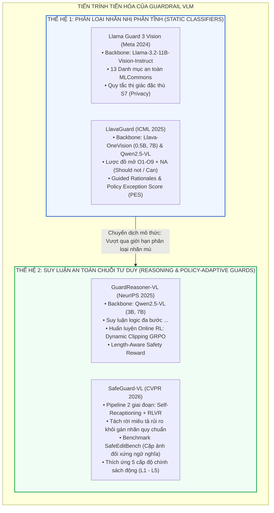

[⬅️ Danh Mục Chuyên Khảo](../../README.md) | [🏠 Thư Mục Guard Models](index.md) | [Chương 1: Llama Guard 3V & LlavaGuard ➡️](01_llama_guard_3v_and_llavaguard.md)

---

# Chuyên Khảo Chuyên Sâu: Các Mô Hình Giám Sát Đa Phương Thức Ngoại Vi (Multimodal Guardrail VLMs)

> **Tài liệu chuyên khảo an ninh AI cấp độ mô hình:**  
> Đề tài: *Khảo sát, Phân tích Kiến trúc và Đánh giá Thực nghiệm Các Mô hình Giám sát An toàn Đa Phương thức (VLM Guardrails & Watchers)*  
> Phạm vi kỹ thuật: Các mô hình bảo vệ ngoại vi hoạt động như "tường lửa tri giác" (Sensory Firewalls) nhằm phát hiện, phân loại và ngăn chặn rủi ro độc hại cũng như các đòn tấn công tiêm chỉ thị thị giác (Visual Prompt Injection - VPI). Phân tích chuyên sâu từ các bộ phân loại nhãn nhị phân tĩnh (Llama Guard 3 Vision, LlavaGuard) đến các mô hình suy luận an toàn chuỗi tư duy (GuardReasoner-VL, SafeGuard-VL).  
> **Nguyên tắc phân định ranh giới:** Chuyên khảo tập trung tuyệt đối vào cơ chế cấp độ mô hình (trọng số nơ-ron, hàm mất mát phân loại, không gian biểu diễn ẩn, thuật toán Reinforcement Learning trực tuyến và tối ưu hóa suy luận). Không khảo cứu các giải pháp an ninh phần mềm hay kỹ nghệ hệ thống (TCB monitors, OS sandboxing, formal IFC).

---

## 1. Bản Đồ Tổng Quan Chuyên Đề

Kiến trúc phòng vệ sử dụng mô hình giám sát ngoại vi (Auxiliary Guardrail Models) đại diện cho một nhánh nghiên cứu quan trọng trong hệ sinh thái an ninh AI đa phương thức. Thay vì can thiệp trực tiếp vào trọng số của mô hình nền tảng chính (Primary Agent VLM) — vốn dễ gây suy giảm năng lực giải quyết tác vụ (Alignment-Utility Trade-off) hoặc hiện tượng quên lãng thảm khốc (Catastrophic Forgetting) — trường phái này xây dựng các mô hình chuyên biệt hóa độc lập để thanh tra luồng dữ liệu vào/ra.



---

## 2. Metadata 4 Công Trình Nền Tảng

Dưới đây là bảng tổng hợp thông số khoa học, đơn vị chủ trì, kênh công bố và tài nguyên của 4 bài báo nghiên cứu trọng tâm trong chuyên đề này:

| Thuộc Tính | Llama Guard 3 Vision | LlavaGuard | GuardReasoner-VL | SafeGuard-VL |
|:---|:---|:---|:---|:---|
| **Tên bài báo** | *Llama Guard 3 Vision: Safeguarding Human-AI Image Understanding Conversations* | *LlavaGuard: An Open VLM-based Framework for Safeguarding Vision Datasets and Models* | *GuardReasoner-VL: Safeguarding VLMs via Reinforced Reasoning* | *Towards Policy-Adaptive Image Guardrail: Benchmark and Method* |
| **Nhóm tác giả** | Jianfeng Chi, Ujjwal Karn, Hongyuan Zhan, Eric Smith, Javier Rando, et al. | Lukas Helff, Felix Friedrich, Manuel Brack, Kristian Kersting, Patrick Schramowski | Yue Liu, Shengfang Zhai, Mingzhe Du, Yulin Chen, Tri Cao, Bryan Hooi, et al. | Caiyong Piao, Zhiyuan Yan, Haoming Xu, Yunzhen Zhao, Shuigeng Zhou, et al. |
| **Tổ chức chủ trì** | GenAI at Meta | TU Darmstadt, Hessian.AI, DFKI, Centre for Cognitive Science | National University of Singapore (NUS), NTU | Fudan University, Tencent, Peking University (PKU) |
| **Hội nghị / Kênh** | Meta Tech Report / ArXiv 2024 | **ICML 2025** | **NeurIPS 2025** | **CVPR 2026** |
| **Backbone kiến trúc** | Llama-3.2-11B-Vision-Instruct | Llava-OneVision (0.5B, 7B) & Qwen2.5-VL-7B | Qwen2.5-VL-Instruct (3B, 7B) | Qwen2.5-VL-7B (Base) & Gemma 27B (Recaption) |
| **Mô thức kiểm duyệt** | Phân loại nhãn nhị phân đóng (`safe` / `unsafe` + mã $S_1 - S_{13}$) | Phân loại có giải trình (JSON: `rating`, `category`, `rationale`) | Chuỗi tư duy logic có cấu trúc (`<think>` CoT + `<result>`) | Giải trình đối chiếu chính sách tùy biến + Nhãn nhị phân bằng RLVR |
| **Khả năng thích ứng** | Thấp (Chính sách cố định 13 danh mục MLCommons) | Trung bình (Tùy biến luật Should not/Can trong phạm vi O1-O9) | Thấp đến trung bình (Cố định định nghĩa danh mục an toàn) | **Tuyệt đối (Mở hoàn toàn cho văn bản ngôn ngữ tự nhiên bất kỳ)** |
| **Tối ưu hóa chính** | Supervised Fine-Tuning (SFT) với Anti-memorization Shuffling | SFT với Guided Rationales chưng cất từ LLaVA-34B | Online GRPO với Dynamic Clipping $B_s$ & Length Penalty | Tách rời 2 giai đoạn: Self-Recaption SFT + Policy-Aware RLVR |

---

## 3. Mục Lục Chi Tiết Bộ Chuyên Khảo

Bộ tài liệu chuyên khảo được chia thành 4 chuyên đề kỹ thuật nối tiếp nhau một cách logic, khảo sát từ nguyên lý hoạt động đến các ranh giới thất bại thực tế:

```
papers/guard_models/
├── index.md                                 # Tổng quan chuyên đề, metadata & bản đồ cấu trúc (Hiện tại)
├── 01_llama_guard_3v_and_llavaguard.md       # Giải phẫu Llama Guard 3 Vision & LlavaGuard
├── 02_guardreasoner_vl_cot_reasoning.md      # Quy trình CoT, kho dữ liệu 123K & Online GRPO của GuardReasoner-VL
├── 03_safeguard_vl_policy_adaptive.md        # Tách rời Self-Recaptioning, SafeEditBench & RLVR của SafeGuard-VL
└── 04_danh_doi_do_tre_va_meta_jailbreak.md   # Bùng nổ độ trễ (+200%), chi phí token, Guard-Targeted Jailbreak & Adaptive Routing
```

### [Chương 1: Llama Guard 3 Vision & LlavaGuard — Nền Tảng Phân Loại Nhãn & Guided Rationales](01_llama_guard_3v_and_llavaguard.md)
*   **Phân tích Llama Guard 3 Vision (Meta):**
    *   Cấu trúc xử lý ảnh đa phân mảnh ($4 \times 560 \times 560$ pixels) của Vision Transformer.
    *   Hệ thống 13 danh mục nguy cơ chuẩn MLCommons v0.5 và quy tắc thị giác đặc thù **S7 (Privacy)**: cấm tuyệt đối nhận diện danh tính người thật từ ảnh đời thực.
    *   Kỹ thuật chống học vẹt định dạng (*Anti-Memorization Augmentation*): Random Category Dropping và Category Index Shuffling.
    *   Thực nghiệm phòng vệ đối kháng hộp trắng: Độ suy thoái thảm khốc trước nhiễu điểm ảnh PGD ($l_\infty = 8/255$ làm tỷ lệ lọt lưới tăng vọt từ $21\%$ lên $70\%$) và tấn công chuỗi văn bản GCG ($72\%$ - $75\%$).
*   **Phân tích Khung Kiến Trúc Mở LlavaGuard (ICML 2025):**
    *   Hệ thống taxonomy 2 chiều $O_1 - O_9$ + NA tích hợp điều kiện cấm ("Should not") và ngoại lệ hợp pháp ("Can").
    *   Kỹ thuật sinh lập luận có định hướng (**Guided Rationales**) thông qua giáo viên LLaVA-34B.
    *   Hình thức hóa toán học cho độ thích ứng chính sách: Tỷ lệ ngoại lệ chính sách $\text{PER}$ và Điểm ngoại lệ chính sách $\text{PES}$ (trung bình điều hòa giữa $\text{PER}$ và $\text{Acc}_{\text{bal}}$).
    *   Đột phá hiệu năng của **LlavaGuard-0.5B** ($75\text{ms}$ latency, $\text{PES} = 87.10\%$, vượt trội OpenAI Omni-Moderation).

### [Chương 2: GuardReasoner-VL — Suy Luận Chuỗi Tư Duy (CoT) & Học Tăng Cường Trực Tuyến](02_guardreasoner_vl_cot_reasoning.md)
*   **Khuyết tật bản thể luận của các bộ phân loại nhãn mù:**
    *   Bẫy tương quan bề mặt (Spurious Shortcuts) và hiện tượng "mù" tương tác ngữ nghĩa chéo (Cross-Modal Semantic Blindness) trước văn bản in typographic VPI.
*   **Kiến trúc GuardReasoner-VL (NeurIPS 2025):**
    *   Cấu trúc chuỗi tư duy `<think>...</think>` kết hợp phán quyết `<result>...</result>`.
    *   Kho ngữ liệu **GuardReasoner-VLTrain**: $123{,}096$ mẫu với $631{,}795$ bước suy luận trải rộng trên Text, Image và Text-Image pairs.
    *   Khai phá mẫu khó: Rejection Sampling (chạy 4 lần ở nhiệt độ cao, lọc các mẫu sai 100%) và ghép nối dữ liệu nhạy an toàn (*Safety-Aware Data Concatenation* theo quy tắc gán nhãn Union).
    *   Thuật toán Online RL với **Dynamic Clipping GRPO**: Cơ chế co hẹp cửa sổ clipping $B_s = \prod_{i=1}^s \frac{s_{\text{total}} - i}{s_{\text{total}}} \cdot \epsilon$ nhằm cân bằng hoàn hảo giữa Khám phá (Exploration) và Khai thác (Exploitation).
    *   Hàm thưởng kiểm soát độ dài (**Length-Aware Safety Reward**): Phân tích động lực toán học khuyến khích đào sâu tư duy khi gặp mẫu khó nhưng ngăn chặn lạm phát token qua ngưỡng cắt $\beta$.
    *   Thực nghiệm diện rộng: Đạt $79.07\%$ F1 trên Prompt Harmfulness và $77.58\%$ F1 trên Response Harmfulness, vượt xa Llama Guard 3V ($48.03\%$).

### [Chương 3: SafeGuard-VL — Tách Rời Tự Động Mô Tả & Thích Ứng Chính Sách Động](03_safeguard_vl_policy_adaptive.md)
*   **Nghịch lý quá khớp chính sách của SFT (Policy Overfitting Paradox):**
    *   Sự sụp đổ thảm khốc của các mô hình SFT thuần túy (QwenGuard-7B tụt từ $54.66\%$ xuống $12.05\%$ trên benchmark thị giác BLINK, tri thức tổng quát rơi xuống $35.98\%$).
    *   Luận điểm nền tảng: An toàn mang tính phụ thuộc chính sách (Policy-Dependent), không phụ thuộc cảm tính thông thường (Common-Sense-Dependent).
*   **Khung Kiến Trúc Hai Giai Đoạn Tách Rời Của SafeGuard-VL (CVPR 2026):**
    *   *Giai đoạn 1 (Self-Recaption SFT):* Dùng Qwen2.5-VL sinh caption gốc, sau đó dùng Gemma 27B khôi phục các chi tiết rủi ro bị che giấu (de-whitewashing). Huấn luyện mô hình thuần túy miêu tả rủi ro khách quan ($\mathcal{L}_{\text{Recap}}$), tuyệt đối không học nhãn quy chuẩn.
    *   *Giai đoạn 2 (Policy-Aware RLVR):* Sử dụng Group Relative Policy Optimization với phần thưởng kiểm chứng được ($r \in \{+1, -1\}$) trên các văn bản chính sách ngôn ngữ tự nhiên tùy ý.
*   **Bộ Benchmark SafeEditBench:**
    *   Cơ chế inpainting tạo các cặp ảnh đối xứng ngữ nghĩa (Semantically Aligned Image Pairs), bảo toàn $95\%$ khung cảnh và chỉ thay đổi chi tiết tối thiểu.
    *   Phân tầng 5 cấp độ nghiêm ngặt: $L_1$ (Permissive) $\rightarrow$ $L_2$ (Educational) $\rightarrow$ $L_3$ (Societal) $\rightarrow$ $L_4$ (Corporate) $\rightarrow$ $L_5$ (Zero-Tolerance).
*   **Đột phá thực nghiệm:**
    *   SafeGuard-VL-Full đạt $72.2\%$ F1 trên UnsafeBench (so với $43.6\%$ của QwenGuard và $22.7\%$ của Llama Guard).
    *   Bảo tồn trọn vẹn $100\%$ tri thức tổng quát ($57.02\%$ so với $56.92\%$ của base model).

### [Chương 4: Đánh Đổi Độ Trễ, Chi Phí Vận Hành, Nghịch Lý Meta-Jailbreak & Định Tuyến Thích Ứng](04_danh_doi_do_tre_va_meta_jailbreak.md)
*   **Bùng nổ độ trễ (+200%) và chi phí suy luận trong thực tế:**
    *   Phương trình phân rã độ trễ tổng thể đường ống suy luận:
        $$t_{\text{total}} = t_{\text{guard\_pre}} + t_{\text{primary\_agent}} + t_{\text{guard\_post}}$$
    *   Sự bế tắc của các tác tử tự hành tương tác lặp (Agentic Loop $K$ bước): Bị cộng thêm từ $15$ đến $35$ giây độ trễ chết.
    *   Lạm phát chi phí tính toán: Phân tích số lượng Vision Tokens ($729$ - $2400$ tokens), System Policy Tokens ($800$ - $1500$ tokens) và CoT Reasoning Tokens ($180$ - $400$ tokens).
*   **Nghịch lý tấn công ngược hướng đích vào Guardrail (Guard-Targeted Jailbreak & Meta-Jailbreak):**
    *   Bản chất Transformer tự hồi quy khiến bản thân Guard Model cũng dễ bị tổn thương trước VPI.
    *   Hiện tượng bẻ cong chuỗi tư duy (Adversarial CoT Hijacking / Sycophancy / Rationalization Bias): Kẻ tấn công tiêm văn bản chỉ thị mạo danh thẩm quyền hệ thống buộc `<think>` tự ngụy biện để xuất phán quyết `Safe`.
    *   Lỗ hổng điểm ảnh liên tục: Tại sao mọi Guard Model đều suy thoái trước nhiễu đối kháng PGD.
*   **Giải pháp kiến trúc công nghiệp: Định tuyến thích ứng (Adaptive Guardrail Routing):**
    *   Mô hình phân luồng 2 cấp: Fast Screening Gate (phán duyệt nhanh $< 100\text{ms}$ dựa trên độ tin cậy logit) kết hợp với Deep Reasoning Guard (chỉ kích hoạt chuỗi CoT chuyên sâu cho vùng ranh giới xám).
    *   Bảng ma trận so sánh toàn diện 4 mô hình bảo vệ qua 7 chiều kỹ thuật.

---

## 4. Tóm Tắt Đóng Góp Khoa Học & Bảng So Sánh Tổng Hợp

Bảng đối chiếu tổng quan giữa 4 công trình Guardrail VLM nền tảng:

| Chiều Kỹ Thuật | Llama Guard 3 Vision (Meta 2024) | LlavaGuard (ICML 2025) | GuardReasoner-VL (NeurIPS 2025) | SafeGuard-VL (CVPR 2026) |
|:---|:---|:---|:---|:---|
| **Động cơ cốt lõi** | Thiết lập chuẩn an toàn công nghiệp hội thoại cho Llama-3.2 | Xây dựng bộ khung kiểm duyệt mã nguồn mở linh hoạt chính sách | Nâng cao độ chính xác và khả năng diễn giải bằng CoT Reasoning | Loại bỏ hiện tượng quá khớp chính sách và suy thoái tri thức tổng quát |
| **Quy trình gán nhãn** | Nhãn đóng 13 danh mục MLCommons | Schema JSON 9 danh mục + Rationale giải trình | Chuỗi tư duy nhiều bước `<think>` + phán quyết `<result>` | Miêu tả chi tiết độc lập với nhãn + Đối chiếu chính sách bằng RLVR |
| **Cơ chế huấn luyện** | SFT với Data Augmentation (Shuffling, Dropping) | SFT với Guided Rationales chưng cất từ LLaVA-34B | R-SFT Khởi động lạnh + Online GRPO với Dynamic Clipping | Two-stage: Self-Recaption SFT + Policy-Aware RLVR (GRPO) |
| **Độ trễ suy luận** | $\sim 800\text{ms} - 1200\text{ms}$ (11B) | $75\text{ms}$ (0.5B) đến $326\text{ms}$ (7B) | $\sim 1420\text{ms} - 1850\text{ms}$ (3B, 7B) | $\sim 2100\text{ms}$ (7B) |
| **Bảo toàn năng lực chung** | Giảm nhẹ trên các tác vụ tạo sinh | Suy giảm trung bình trên VQA | Kế thừa đặc tính của Qwen2.5-VL | **Bảo toàn 100% điểm VQA (MMMU, BLINK, RealWorldQA)** |
| **Năng lực kháng VPI** | Kém (Mù ngữ cảnh chiếm quyền điều khiển) | Kém trước typographic injection; Tốt ở rà soát ảnh tĩnh | **Khá (CoT bóc tách được văn bản typographic trong ảnh)** | **Xuất sắc (Nhận diện chính xác ranh giới rủi ro tối thiểu qua SafeEditBench)** |

---

[⬅️ Danh Mục Chuyên Khảo](../../README.md) | [🏠 Thư Mục Guard Models](index.md) | [Chương 1: Llama Guard 3V & LlavaGuard ➡️](01_llama_guard_3v_and_llavaguard.md)
