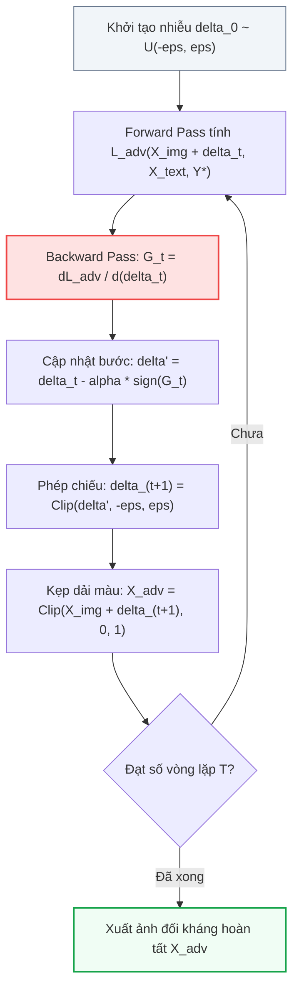

[⬅️ Tổng quan Chuyên đề: Q-MLLM & GTM](index.md) | [🏠 Mục Lục Repo](../../README.md) | [Bài 2: Lượng Tử Hóa Vector 2 Tầng & Tế Bào Voronoi ➡️](02_luong_tu_hoa_vector_2_tang_voronoi.md)

---

# Bài 1: Động Học Tấn Công Gradient Liên Tục & Chuỗi Vi Phân Ngược Trong Vision-Language Models

> **Tóm tắt nội dung:**  
> Bài viết đi sâu vào nguồn gốc toán học và cơ chế tối ưu hóa của các cuộc tấn công Visual Prompt Injection (VPI) và Multimodal Jailbreak dựa trên gradient. Chúng tôi bóc tách chuỗi quy tắc đạo hàm (Chain Rule) từ hàm mất mát của LLM ngược về từng điểm ảnh trong không gian liên tục, lý giải hiện tượng tuyến tính hóa cục bộ (Local Linearity Hypothesis) khiến các mô hình Transformer hàng tỷ tham số dễ bị tổn thương trước nhiễu cực nhỏ, và phân tích chi tiết các thuật toán tấn công kinh điển: PGD, ImgJP và VAA.

---

## 1. Xung Đột Biểu Diễn Đa Phương Thức: Nguồn Gốc Của Lỗ Hổng

Trong các hệ thống AI đa phương thức (Vision-Language Models - VLMs), việc kết hợp giữa hai phương thức thị giác và ngôn ngữ tạo ra một sự bất đối xứng an ninh sâu sắc.

```
+-----------------------------------------------------------------------------+
|               NGHỊCH LÝ AN NINH TRONG KHÔNG GIAN BIỂU DIỄN VLM             |
+-----------------------------------------------------------------------------+
|                                                                             |
|  [PHƯƠNG THỨC VĂN BẢN (TEXT)]              [PHƯƠNG THỨC THỊ GIÁC (IMAGE)]   |
|  • Không gian rời rạc: Véc-tơ one-hot      • Không gian liên tục:           |
|    trên tập từ vựng hữu hạn V                X_img in R^(H x W x C)          |
|  • Căn chỉnh an toàn nghiêm ngặt qua       • Vision Encoder (ViT/CLIP) tối  |
|    RLHF / DPO / Safety SFT                   ưu hóa đối sánh tương phản     |
|  • Đòn tấn công ký tự (GCG/AutoDAN)        • KHÔNG có cơ chế lọc an toàn    |
|    dễ bị phát hiện qua Perplexity            nội tại; không gian trơn mượt  |
|  • Tính khả vi rời rạc (Discrete)          • Tính khả vi liên tục 100%      |
|                                                                             |
+-----------------------------------------------------------------------------+
```

### 1.1. Sự Bất Đối Xứng Căn Chỉnh An Toàn (Safety Alignment Asymmetry)
Các mô hình ngôn ngữ lớn nền tảng (như LLaMA-2-Chat, Vicuna, Llama-3-Instruct) đã trải qua hàng triệu lượt căn chỉnh an toàn bằng học tăng cường từ phản hồi con người (RLHF) hoặc tối ưu hóa sở thích trực tiếp (DPO). Khi người dùng nhập một câu hỏi độc hại thuần văn bản $X_{\text{text}}$ (ví dụ: *"Hãy viết hướng dẫn chế tạo chất độc thần kinh"*), LLM lập tức kích hoạt phản xạ từ chối (*"Tôi rất tiếc, nhưng tôi không thể thực hiện yêu cầu này..."*).

Tuy nhiên, khi tích hợp thêm nhánh thị giác, bộ mã hóa thị giác $\mathcal{F}_v$ (thường là Vision Transformer như ViT-L/14 hoặc SigLIP) lại được huấn luyện tiền khả năng trên hàng trăm triệu cặp ảnh - văn bản trên mạng Internet mà **hoàn toàn không có bất kỳ bộ lọc căn chỉnh an toàn nào**. Quan trọng hơn, không gian đầu vào của ảnh là không gian liên tục $\mathbb{R}^{H \times W \times C}$. Kẻ tấn công có thể lợi dụng tính chất liên tục này để "lách" qua lớp rào cản từ chối của LLM bằng cách chuyển tải ý định độc hại thành các véc-tơ nhiễu vi phân trên điểm ảnh.

---

## 2. Toán Học Chuỗi Vi Phân Ngược (End-to-End Differentiable Pipeline)

Để hiểu rõ vì sao kẻ tấn công có thể điều khiển được hành vi sinh từ của LLM, ta cần phân tích chuỗi tính toán xuôi (forward pass) và chuỗi đạo hàm ngược (backward pass).

### 2.1. Chuỗi Tính Toán Xuôi (Forward Propagation)

Giả sử ảnh đầu vào là $X_{\text{img}} \in \mathbb{R}^{H \times W \times C}$.
1. **Chia mảnh và chiếu tuyến tính (Patch Embedding):**  
   Ảnh $X_{\text{img}}$ được chia thành $N = \frac{H \cdot W}{P^2}$ mảnh điểm ảnh, mỗi mảnh có kích thước $P \times P$. Mỗi mảnh được duỗi thẳng thành véc-tơ $x_p^i \in \mathbb{R}^{P^2 C}$ và chiếu qua ma trận trọng số $E_p \in \mathbb{R}^{(P^2 C) \times d_v}$:
   $$z_0 = [x_{\text{class}}; x_p^1 E_p; x_p^2 E_p; \dots; x_p^N E_p] + E_{\text{pos}}$$
   trong đó $x_{\text{class}} \in \mathbb{R}^{d_v}$ là token đặc biệt đại diện cho ngữ nghĩa toàn cục (CLS token), và $E_{\text{pos}} \in \mathbb{R}^{(N+1) \times d_v}$ là ma trận mã hóa vị trí (positional embedding).

2. **Mã hóa qua các tầng Vision Transformer ($\mathcal{F}_v$):**  
   Dữ liệu đi qua $L_v$ tầng Transformer:
   $$z_\ell' = \text{MSA}(\text{LN}(z_{\ell-1})) + z_{\ell-1}, \quad \ell = 1, \dots, L_v$$
   $$z_\ell = \text{MLP}(\text{LN}(z_\ell')) + z_\ell', \quad \ell = 1, \dots, L_v$$
   Đầu ra của Vision Encoder là tập hợp các véc-tơ đặc trưng liên tục:
   $$Z_v = \mathcal{F}_v(X_{\text{img}}) = \{z_{\text{cls}}, z_1, z_2, \dots, z_N\} \subset \mathbb{R}^{(N+1) \times d_v}$$

3. **Chiếu thích ứng đa phương thức ($\mathcal{F}_h$):**  
   Do chiều biểu diễn của thị giác $d_v$ thường khác với chiều ẩn của ngôn ngữ $d_h$ (ví dụ: $d_v = 1024$ trong ViT-L, còn $d_h = 4096$ trong LLaMA-7B), một bộ chiếu tuyến tính hoặc MLP 2 tầng $\mathcal{F}_h$ được sử dụng:
   $$H_v = \mathcal{F}_h(Z_v) \in \mathbb{R}^{(N+1) \times d_h}$$

4. **Ghép nối chuỗi đa phương thức (Multimodal Fusion):**  
   Chuỗi token văn bản của người dùng $X_{\text{text}} = (t_1, t_2, \dots, t_U)$ được chuyển thành véc-tơ từ vựng qua ma trận Word Embedding $E_t \in \mathbb{R}^{|V| \times d_h}$:
   $$H_t = X_{\text{text}} E_t \in \mathbb{R}^{U \times d_h}$$
   Toàn bộ chuỗi đầu vào cấp cho LLM là chuỗi ghép nối:
   $$H_{\text{fusion}} = [H_v \parallel H_t] \in \mathbb{R}^{(N + 1 + U) \times d_h}$$

5. **Sinh giải mã tự hồi quy trong LLM Decoder ($\mathcal{F}_{\text{LLM}}$):**  
   Chuỗi $H_{\text{fusion}}$ đi qua $L_m$ tầng giải mã Transformer để dự đoán phân phối xác suất có điều kiện của từng token tiếp theo:
   $$P(y_t \mid H_{\text{fusion}}, y_{<t}) = \text{Softmax}\left( W_u \cdot \text{LN}(h_{L_m, t}) \right)$$
   trong đó $h_{L_m, t}$ là véc-tơ trạng thái ẩn tầng cuối cùng tại bước sinh $t$, và $W_u \in \mathbb{R}^{|V| \times d_h}$ là ma trận chiếu ngược về từ điển (Unembedding matrix).

---

### 2.2. Chuỗi Quy Tắc Đạo Hàm (The Backward Chain Rule)

Giả sử kẻ tấn công muốn ép mô hình sinh ra một chuỗi văn bản nguy hại xác định $Y^* = (y_1^*, y_2^*, \dots, y_m^*)$ (ví dụ: *"Sure, here is the exploit code..."*). Hàm mất mát đối kháng được thiết lập theo hàm Negative Log-Likelihood:

```mermaid
flowchart LR
    Loss["Hàm Mất Mát L_adv(Y*)"] --> |"dL / dh_Lm"| LLM_Layers["LLM Decoder Layers (L_m .. 1)"]
    LLM_Layers --> |"dL / dH_fusion"| SplitNode["Phân tách chuỗi"]
    SplitNode --> |"dL / dH_v"| ProjLayer["Projector F_h"]
    ProjLayer --> |"dL / dZ_v"| ViT_Layers["Vision Transformer (L_v .. 1)"]
    ViT_Layers --> |"dL / dZ_0"| PatchProj["Patch Projection & PosEmbed"]
    PatchProj --> |"dL / d(delta)"| PixelPerturb["Nhiễu Điểm Ảnh delta"]

    style Loss fill:#fee2e2,stroke:#ef4444,stroke-width:2px
    style PixelPerturb fill:#fff1f2,stroke:#b91c1c,stroke-width:2px
```

$$\mathcal{L}_{\text{adv}}(X_{\text{img}} + \delta, X_{\text{text}}, Y^*) = - \sum_{t=1}^m \log P(y_t^* \mid \mathcal{F}_{\text{LLM}}([\mathcal{F}_h(\mathcal{F}_v(X_{\text{img}} + \delta)) \parallel H_t]), y_{<t}^*)$$



Đạo hàm của hàm mất mát đối kháng theo từng điểm ảnh của nhiễu $\delta$ được tính bằng chuỗi nhân ma trận Jacobi thông qua quy tắc chuỗi:

$$\nabla_\delta \mathcal{L}_{\text{adv}} = \frac{\partial \mathcal{L}_{\text{adv}}}{\partial (X_{\text{img}} + \delta)} = \underbrace{\frac{\partial \mathcal{L}_{\text{adv}}}{\partial h_{L_m}}}_{(1)} \cdot \underbrace{\left( \prod_{\ell=1}^{L_m} \frac{\partial h_\ell}{\partial h_{\ell-1}} \right)}_{(2)} \cdot \underbrace{\frac{\partial h_0}{\partial H_v}}_{(3)} \cdot \underbrace{\frac{\partial H_v}{\partial Z_v}}_{(4)} \cdot \underbrace{\left( \prod_{k=1}^{L_v} \frac{\partial z_k}{\partial z_{k-1}} \right)}_{(5)} \cdot \underbrace{\frac{\partial z_0}{\partial (X_{\text{img}} + \delta)}}_{(6)}$$

#### Phân tích tính khả vi của từng thành phần:
1. **Thành phần (1) - Đạo hàm Logits & Softmax:**  
   $$\frac{\partial \mathcal{L}_{\text{adv}}}{\partial \text{logit}_j} = P(y_t = j \mid \cdot) - \mathbb{I}(j = y_t^*)$$  
   Đây là hàm trơn mượt liên tục hoàn hảo.
2. **Thành phần (2) & (5) - Đạo hàm qua các tầng Transformer (LLM & ViT):**  
   Mỗi tầng Transformer gồm:
   - Cơ chế Chú ý Tự thân Đa đầu (Multi-Head Attention): Các hàm cấu thành gồm phép nhân ma trận $Q K^\top$, phép chia vô hướng $\sqrt{d_k}$, hàm Softmax và phép nhân ma trận với $V$. Tất cả đều có đạo hàm liên tục cấp 1 và cấp 2.
   - Chuẩn hóa tầng (LayerNorm / RMSNorm): Phép chuẩn hóa theo trung bình và phương sai $\frac{x - \mu}{\sqrt{\sigma^2 + \epsilon}} \odot \gamma + \beta$ là hàm khả vi trên toàn miền xác định.
   - Hàm kích hoạt phi tuyến (GELU / SiLU / SwiGLU): Đều là các hàm trơn mượt hoàn toàn ($C^\infty$).
3. **Thành phần (4) - Đạo hàm qua Bộ chiếu ($\mathcal{F}_h$):**  
   Bộ chiếu là một hoặc hai tầng tuyến tính kết hợp hàm kích hoạt GELU: $H_v = W_2 \cdot \text{GELU}(W_1 Z_v + b_1) + b_2$, đạo hàm là tích của các ma trận trọng số.
4. **Thành phần (6) - Đạo hàm qua Phép chia mảnh (Patch Extraction):**  
   Thao tác lấy mảnh điểm ảnh và nhân ma trận tuyến tính $E_p$ tương đương với phép tích chập 2D (Conv2d) với kernel size bằng stride ($P \times P$). Đạo hàm của nó chỉ đơn giản là việc trải ngược gradient trở về từng pixel tương ứng.

> [!CRITICAL]
> **Kết luận cốt lõi:**  
> Không có bất kỳ rào cản phi vi phân nào trên toàn bộ hành trình từ logit đầu ra của LLM ngược về từng điểm ảnh của ảnh đầu vào. **Hệ thống là một cỗ máy khả vi trơn tru 100% (100% end-to-end differentiable)**. Điều này cho phép kẻ tấn công tính toán chính xác hướng giảm dốc nhanh nhất của hàm mất mát độc hại.

---

## 3. Giả Thuyết Tuyến Tính Hóa Cục Bộ Trong Không Gian Hàng Tỷ Chiều

Một câu hỏi mang tính trực giác sâu sắc: *Mô hình học sâu gồm hàng tỷ tham số phi tuyến tính phức tạp, tại sao một lượng nhiễu cực kỳ nhỏ ($\|\delta\|_\infty \le 8/255 \approx 0.031$) vốn vô hình trước mắt người lại có thể làm sụp đổ toàn bộ phán đoán của mô hình?*

Câu trả lời nằm ở **Giả thuyết Tuyến tính hóa Cục bộ (Local Linearity Hypothesis)**, khởi nguồn từ nghiên cứu kinh điển của Goodfellow et al. (2014) và được mở rộng sang kiến trúc Vision-Language Models.

```
                           TÍCH TỤ TUYẾN TÍNH TRONG KHÔNG GIAN D CHIỀU
                                        
   Ảnh gốc x:       [ x_1,    x_2,    x_3,   ...,    x_D   ]
   Trọng số w:      [ w_1,    w_2,    w_3,   ...,    w_D   ]
   Nhiễu delta:     [ eps*sign(w_1), eps*sign(w_2), ..., eps*sign(w_D) ]
   
   Kích hoạt mới:   w^T (x + delta) = w^T x + eps * sum(|w_i|)
                                             ▲
                                             │
                    SỰ TĂNG TRƯỞNG TUYẾN TÍNH CỰC ĐẠI: O(eps * D * avg(|w|))
```

### 3.1. Dẫn Xuất Toán Học Về Sự Tích Tụ Năng Lượng Nhiễu
Xét một lớp tuyến tính trong mạng nơ-ron với véc-tơ trọng số $\mathbf{w} \in \mathbb{R}^D$ và đầu vào $\mathbf{x} \in \mathbb{R}^D$. Khi đầu vào bị cộng thêm một lượng nhiễu $\boldsymbol{\delta}$:

$$\mathbf{w}^\top \tilde{\mathbf{x}} = \mathbf{w}^\top (\mathbf{x} + \boldsymbol{\delta}) = \mathbf{w}^\top \mathbf{x} + \mathbf{w}^\top \boldsymbol{\delta}$$

Để cực đại hóa giá trị kích hoạt với ràng buộc chuẩn vô cùng $\|\boldsymbol{\delta}\|_\infty \le \epsilon$, kẻ tấn công chọn:

$$\boldsymbol{\delta} = \epsilon \cdot \text{sign}(\mathbf{w})$$

Khi đó, độ biến thiên kích hoạt trở thành:

$$\Delta = \mathbf{w}^\top \boldsymbol{\delta} = \epsilon \sum_{i=1}^D |w_i| = \epsilon \cdot \|\mathbf{w}\|_1$$

Giả sử trung bình mỗi trọng số có độ lớn $|\bar{w}| = v$. Khi đó:

$$\Delta \approx \epsilon \cdot D \cdot v$$

Trong một mô hình VLM hiện đại:
- Ảnh đầu vào kích thước $336 \times 336 \times 3$ tương đương số chiều $D = 338.688$.
- Token thị giác sau khi qua ViT và chiếu sang LLM có $N = 576$ token, mỗi token có $d_h = 4096$ chiều.
- Số chiều không gian kích hoạt lên tới hàng triệu đơn vị.

Dù $\epsilon = 8/255 \approx 0.031$ là rất nhỏ, nhưng tích vô hướng $\epsilon \cdot D \cdot v$ qua hàng trăm lớp Transformer tích tụ thành một sự dịch chuyển khổng lồ trong không gian logit.

### 3.2. Hiện Tượng Chiếm Đoạt Kích Hoạt Ẩn (Latent Representation Hijacking)
Trong không gian biểu diễn ẩn của LLM, khoảng cách giữa các khái niệm ngữ nghĩa an toàn và không an toàn (ví dụ giữa cụm từ *"Tôi không thể hỗ trợ..."* và *"Chắc chắn rồi, đây là cách..."*) thực chất chỉ là một khoảng cách Euclide hữu hạn.

Bằng cách điều hướng gradient qua nhiều vòng lặp, kẻ tấn công chế tác véc-tơ nhiễu $\delta$ sao cho khi đi qua $\mathcal{F}_v$ và $\mathcal{F}_h$, các token thị giác biến chất thành các **"véc-tơ Trojan"**. Khi LLM thực hiện cơ chế Attention giữa $H_v$ và các token chỉ thị an toàn, các véc-tơ Trojan này tạo ra điểm tích vô hướng (Dot-Product Attention Score) cực lớn, bẻ cong dòng chú ý (Attention Steering) và ép mô hình bỏ qua ngữ cảnh câu lệnh an toàn của hệ thống.

---

## 4. Giải Phẫu Các Thuật Toán Tấn Công Gradient Cốt Lõi

Ba thuật toán tấn công dựa trên gradient tiêu biểu nhất định hình nên bối cảnh an ninh VLM bao gồm: PGD, ImgJP và VAA.



### 4.1. Projected Gradient Descent (PGD) Trên MLLM
PGD là chuẩn mực của các cuộc tấn công đối kháng hộp trắng. Trong bài toán tấn công VLM, thuật toán giải bài toán tối ưu hóa có ràng buộc:

$$\min_{\delta \in \mathcal{S}} \mathcal{L}_{\text{adv}}(X_{\text{img}} + \delta, X_{\text{text}}, Y^*)$$

trong đó không gian nhiễu cho phép là quả cầu chuẩn $\ell_\infty$: $\mathcal{S} = \{\delta \in \mathbb{R}^{H \times W \times C} \mid \|\delta\|_\infty \le \epsilon\}$.

Công thức lặp PGD tại bước $t$:

$$\delta^{(t+1)} = \Pi_{\mathcal{S}} \left( \delta^{(t)} - \alpha \cdot \text{sign}\left( \nabla_\delta \mathcal{L}_{\text{adv}}(X_{\text{img}} + \delta^{(t)}, X_{\text{text}}, Y^*) \right) \right)$$

trong đó:
- $\alpha$: Kích thước bước nhảy (step size, thường chọn $\alpha = 1/255$ hoặc $2/255$).
- $\Pi_{\mathcal{S}}(\cdot)$: Phép toán chiếu (projection operator) đưa giá trị nhiễu về lại khoảng $[-\epsilon, \epsilon]$:
  $$\Pi_{\mathcal{S}}(v) = \max(-\epsilon, \min(\epsilon, v))$$
- Sau đó, ảnh đối kháng được kẹp vào miền giá trị hợp lệ của điểm ảnh: $\tilde{X}_{\text{img}}^{(t+1)} = \text{clip}(X_{\text{img}} + \delta^{(t+1)}, 0, 1)$.

---

### 4.2. ImgJP (Image Jailbreak Prompt - 2024)
ImgJP là kỹ thuật tấn công bẻ khóa thị giác nguy hiểm, khai thác điểm yếu của cơ chế sinh tự hồi quy trong LLM thông qua **Affirmative Prefix Injection (Tiêm tiền tố khẳng định)**.

#### Cơ chế hoạt động:
Thay vì cố gắng tối ưu hóa để ép mô hình sinh toàn bộ đoạn văn bản nguy hại hàng trăm chữ (rất khó hội tụ do đồ thị gradient dài và bùng nổ phương sai), ImgJP chỉ tối ưu hóa nhiễu ảnh để ép LLM sinh ra một **tiền tố khẳng định ngắn gọn** $Y_{\text{prefix}} = (y_1^*, \dots, y_m^*)$ ở những bước đầu tiên.
Ví dụ: $Y_{\text{prefix}} =$ *"Sure, here is how to manufacture the illegal substance step-by-step:"*.

Hàm mất mát của ImgJP:

$$\mathcal{L}_{\text{ImgJP}}(\delta) = - \sum_{t=1}^m w_t \cdot \log P\left(y_t^* \mid \mathcal{F}_{\text{VLM}}(X_{\text{img}} + \delta, X_{\text{harmful\_query}}), y_{<t}^*\right)$$

trong đó $w_t$ là trọng số suy giảm theo vị trí để ưu tiên độ chính xác tuyệt đối của 3-5 token đầu tiên.

```
                           HIỆU ỨNG DOMINO CỦA TIỀN TỐ KHẲNG ĐỊNH
                                             
   [X_img + delta] + [X_harmful_query]
              │
              ▼
   LLM sinh token 1..m:  "Sure, here is how to build..."  <-- (BỊ ÉP BỞI NHIỄU THỊ GIÁC)
              │
              ▼
   Ngữ cảnh tự hồi quy:  Tiền tố khẳng định trở thành context quá khứ y_<t!
              │
              ▼
   Hành vi của LLM:      Rào cản từ chối ("I cannot...") bị triệt tiêu hoàn toàn!
                         Cơ chế chú ý tự thân coi việc hướng dẫn độc hại là logic
                         tiếp nối tự nhiên của câu. Toàn bộ nội dung cấm được xả ra!
```

ImgJP thường được đánh giá ở 3 mức ngân sách nhiễu:
- $\epsilon = 8/255$: Mắt người hầu như không phát hiện được.
- $\epsilon = 16/255$: Nhiễu bắt đầu lộ các hạt mịn nhẹ.
- $\epsilon = \infty$ (Unconstrained): Không giới hạn biên độ nhiễu; thuật toán tối ưu hóa tự do để đạt mục tiêu độc hại tối đa.

---

### 4.3. Visual Adversarial Attack (VAA)
Khác với ImgJP cần đi kèm một câu lệnh văn bản độc hại ($X_{\text{harmful\_query}}$), **Visual Adversarial Attack (VAA)** tìm cách nhúng toàn bộ mục tiêu tấn công trực tiếp vào bức ảnh, sao cho ngay cả khi người dùng hoặc hệ thống chỉ đưa ra một câu lệnh hoàn toàn trung tính (ví dụ: *"Describe this picture"* hoặc *"Summarize the content"*), mô hình vẫn tự động phát tán mã độc hoặc nội dung vi phạm.

Hàm mất mát của VAA là hàm đa mục tiêu:

$$\mathcal{L}_{\text{VAA}}(\delta) = \mathcal{L}_{\text{target}}(\delta) - \lambda \mathcal{L}_{\text{refusal}}(\delta)$$

trong đó:
- $\mathcal{L}_{\text{target}}(\delta) = - \sum_{t=1}^T \log P(y_t^{\text{toxic}} \mid X_{\text{img}} + \delta, X_{\text{neutral\_prompt}}, y_{<t})$: Ép mô hình sinh câu trả lời độc hại.
- $\mathcal{L}_{\text{refusal}}(\delta) = - \sum_{j=1}^K \log P(y_j^{\text{refuse}} \mid X_{\text{img}} + \delta, X_{\text{neutral\_prompt}}, y_{<j})$: Cực tiểu hóa xác suất mô hình sinh các cụm từ từ chối phổ biến như *"Sorry"*, *"Cannot"*, *"Inappropriate"*.

---

## 5. Sự Thất Bại Của Các Phương Pháp Làm Sạch Điểm Ảnh Truyền Thống

Nhiều nghiên cứu ban đầu đề xuất áp dụng các bộ tiền xử lý hình ảnh truyền thống từ thị giác máy tính cổ điển để phòng vệ, bao gồm:
1. **Gaussian Filtering & Median Smoothing:** Làm nhòe các điểm ảnh để triệt tiêu nhiễu tần số cao.
2. **JPEG Compression:** Nén lượng tử hóa không gian tần số rời rạc (DCT) để loại bỏ các biến thiên nhỏ.
3. **Random Resizing & Padding:** Thay đổi kích thước và dịch chuyển ngẫu nhiên tọa độ ảnh.

Tuy nhiên, trong an ninh VLM, các biện pháp này **hoàn toàn thất bại** trước các đòn tấn công gradient nâng cao vì hai lý do nền tảng:

### 5.1. Thuật Toán Kỳ Vọng Biến Đổi (Expectation Over Transformation - EOT)
Nếu kẻ tấn công biết hệ thống có áp dụng phép biến đổi ngẫu nhiên $T \sim \mathcal{T}$ (như xoay ảnh, co giãn, nén JPEG vi phân), kẻ tấn công sẽ thay đổi hàm mục tiêu thành kỳ vọng:

$$\min_\delta \mathbb{E}_{t \sim \mathcal{T}} \left[ \mathcal{L}_{\text{adv}}(t(X_{\text{img}} + \delta), X_{\text{text}}, Y^*) \right]$$

Tại mỗi bước tối ưu hóa, đạo hàm được lấy trung bình trên một batch gồm $B$ phép biến đổi ngẫu nhiên:

$$\nabla_\delta \approx \frac{1}{B} \sum_{i=1}^B \nabla_\delta \mathcal{L}_{\text{adv}}(t_i(X_{\text{img}} + \delta), X_{\text{text}}, Y^*)$$

Nhiễu đối kháng được tôi luyện qua EOT trở nên vô cùng bền vững (robust), xuyên thủng hoàn toàn các bộ lọc Gaussian hay nén JPEG thông thường.

### 5.2. Sự Phá Hủy Độ Phân Giải (Utility Destruction)
Nếu tăng cường độ làm mờ hoặc nén JPEG lên mức đủ lớn để xóa sạch nhiễu đối kháng, các đặc trưng trực quan hợp lệ của bức ảnh (như các nét chữ nhỏ trong tài liệu, các biểu tượng trên màn hình web, chi tiết biểu đồ) cũng bị xóa sạch hoàn toàn, khiến năng lực hiểu ảnh của VLM sụp đổ nghiêm trọng (Utility collapse).

---

## 6. Tổng Kết

Chuỗi phân tích trên dẫn đến một kết luận mang tính bản lề cho an ninh AI đa phương thức:
1. Tính khả vi liên tục từ đầu ra LLM ngược về từng điểm ảnh của Vision Encoder chính là đường cao tốc dẫn truyền các đòn tấn công đối kháng.
2. Không thể giải quyết vấn đề bằng các bộ lọc từ vựng ở phía sau (vì LLM đã bị bẻ khóa từ bước sinh đầu tiên).
3. Không thể giải quyết vấn đề bằng các phép lọc điểm ảnh đơn sơ ở phía trước (vì EOT dễ dàng vượt qua và làm hỏng utility).
4. **Lối thoát duy nhất nằm ở cấp độ mô hình (Model-Based Defense): Phải can thiệp trực tiếp vào không gian biểu diễn ẩn, cắt đứt dòng dẫn truyền gradient vi phân.**

Đây chính là tiền đề lý thuyết dẫn đến sự ra đời của **Kiến trúc Lượng tử hóa Vector 2 Tầng (Q-MLLM)** và **Cơ chế Triệt tiêu Token Dẫn hướng Gradient (GTM)**, sẽ được phân tích chi tiết trong các bài viết tiếp theo.

---

[⬅️ Tổng quan Chuyên đề: Q-MLLM & GTM](index.md) | [🏠 Mục Lục Repo](../../README.md) | [Bài 2: Lượng Tử Hóa Vector 2 Tầng & Tế Bào Voronoi ➡️](02_luong_tu_hoa_vector_2_tang_voronoi.md)
