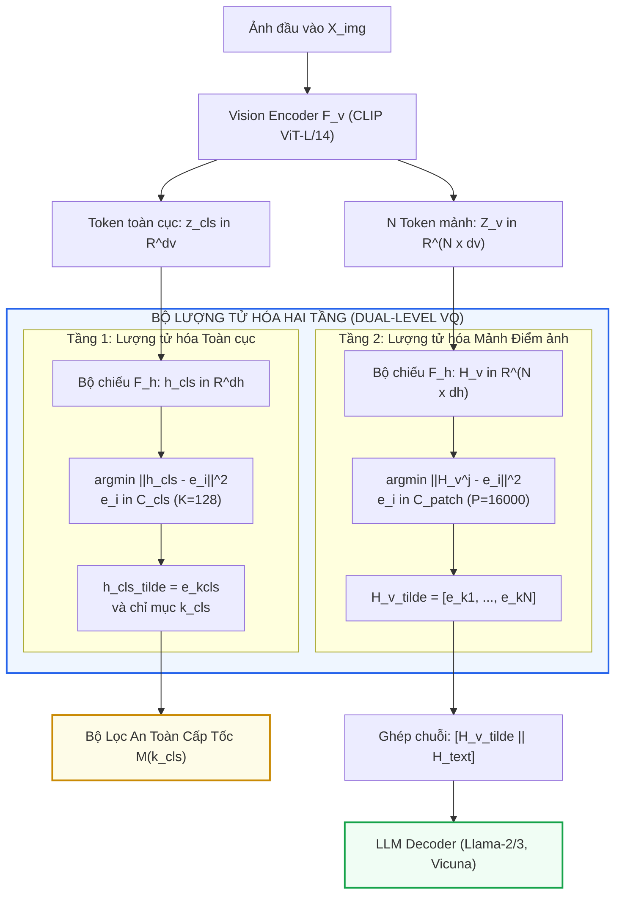
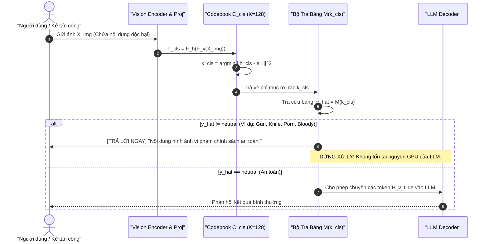

[⬅️ Bài 1: Tấn Công Gradient Liên Tục](01_tan_cong_gradient_lien_tuc.md) | [🏠 Mục Lục Chuyên Đề](index.md) | [Bài 3: Localize and Neutralize (GTM) ➡️](03_localize_and_neutralize_gtm.md)

---

# Bài 2: Lượng Tử Hóa Vector 2 Tầng & Hình Học Tế Bào Voronoi Trong Q-MLLM

> **Tóm tắt nội dung:**  
> Bài viết phân tích cấu trúc toán học và kiến trúc hệ thống của **Q-MLLM (NDSS 2026)** - giải pháp phòng vệ mô hình tiên phong ứng dụng cơ chế Lượng tử hóa Vector hai tầng (Dual-Level Vector Quantization). Bằng cách phân tách và ánh xạ đặc trưng thị giác liên tục thành các tế bào Voronoi rời rạc ở cả cấp độ mảnh không gian (patch-level) và cấp độ ngữ nghĩa toàn cục (global-semantic cls), Q-MLLM thiết lập một nút thắt cổ chai phi vi phân (non-differentiable bottleneck), dập tắt hoàn toàn dòng đạo hàm ngược của kẻ tấn công trong khi vẫn bảo toàn năng lực hiểu đa phương thức.

---

## 1. Triết Lý Kiến Trúc: Đột Phá Bằng Nút Thắt Cổ Chai Rời Rạc

Như đã chứng minh ở Bài 1, nguồn gốc khiến VLM dễ bị tổn thương trước các cuộc tấn công đối kháng nằm ở **tính khả vi liên tục** của chuỗi lan truyền ngược từ LLM về điểm ảnh. Để vô hiệu hóa triệt để véc-tơ tấn công này, nhóm tác giả Wei Zhao et al. (Đại học Quản lý Singapore - SMU) tại **NDSS 2026** đưa ra một ý tưởng nền tảng:

> **Nguyên lý Q-MLLM:**  
> Thay vì để các véc-tơ embedding thị giác liên tục $H_v \in \mathbb{R}^{N \times d_h}$ truyền trực tiếp vào LLM, ta ép toàn bộ luồng thông tin thị giác phải đi qua một **Từ điển mã rời rạc (Discrete Codebook)**. Mọi véc-tơ liên tục đều bị lượng tử hóa về điểm tựa rời rạc gần nhất, biến không gian liên tục thành các miền đa diện rời rạc (tế bào Voronoi).

```
                      LUỒNG THÔNG TIN QUA NÚT THẮT CỔ CHAI RỜI RẠC
                                          
   Ảnh đầu vào X_img ──► [Vision Encoder & Proj] ──► Biểu diễn liên tục H_v in R^(N x dh)
                                                               │
                                                               ▼
   ┌────────────────────────────────────────────────────────────────────────────────┐
   │          NÚT THẮT CỔ CHAI LƯỢNG TỬ HÓA VECTOR (VQ BOTTLENECK)                  │
   │                                                                                │
   │   H_v liên tục ──► [Phép tìm kiếm Codeword gần nhất argmin ||H_v - e_i||^2]     │
   │                                   │                                            │
   │                                   ▼                                            │
   │                 Các véc-tơ mã hóa rời rạc H_v_tilde = e_k                      │
   │           (Tế bào Voronoi triệt tiêu đạo hàm vi phân: d(e_k)/dH_v = 0)         │
   └────────────────────────────────────────────────────────────────────────────────┘
                                                               │
                                                               ▼
                                             LLM Decoder giải mã tự hồi quy
```

---

## 2. Phân Tầng Biểu Diễn: Dual-Level Vector Quantization

Trong ảnh chụp tự nhiên, thông tin thị giác tồn tại ở hai cấp độ trừu tượng khác nhau:
1. **Thông tin cục bộ không gian (Fine-grained Spatial Details):** Các đường nét, kết cấu, vật thể nhỏ phân bổ trên từng mảnh điểm ảnh (patches).
2. **Thông tin ngữ nghĩa toàn cục (High-Level Global Semantics):** Bối cảnh tổng quan của bức ảnh (ví dụ: một bữa tiệc sinh nhật, hiện trường tai nạn, hoặc một bức tranh phong cảnh), thường được cô đọng trong token đại diện toàn cục (`[CLS]`).

Nhận thấy sự khác biệt này, Q-MLLM không sử dụng một từ điển mã cào bằng mà xây dựng **Kiến trúc Lượng tử hóa Vector Hai Tầng (Dual-Level VQ)** độc lập:



### 2.1. Tầng 1: Lượng Tử Hóa Ngữ Nghĩa Toàn Cục (Global-Semantic Quantization)
- **Từ điển mã toàn cục:** $\mathcal{C}_{\text{cls}} = \{e_i^{\text{cls}}\}_{i=1}^K \subset \mathbb{R}^{K \times d_h}$, với kích thước từ điển nhỏ gọn $K = 128$.
- **Cơ chế gán mã:** Embedding toàn cục liên tục sau bộ chiếu $h_{\text{cls}} = \mathcal{F}_h(z_{\text{cls}}) \in \mathbb{R}^{d_h}$ được lượng tử hóa bằng phép tìm kiếm lân cận gần nhất theo khoảng cách $\ell_2$:
  $$k_{\text{cls}} = \arg\min_{i \in \{1, \dots, K\}} \|h_{\text{cls}} - e_i^{\text{cls}}\|_2^2$$
  $$\tilde{h}_{\text{cls}} = e_{k_{\text{cls}}}^{\text{cls}} \in \mathbb{R}^{d_h}$$
- **Mục đích thiết kế:** Với chỉ $K = 128$ từ mã, không gian ngữ nghĩa tổng thể được gom cụm chặt chẽ thành 128 khái niệm vĩ mô. Chỉ mục $k_{\text{cls}}$ đóng vai trò như một "chữ ký ngữ nghĩa" (semantic fingerprint) cho phép nhận diện ngay lập tức bức ảnh có chứa các chủ đề độc hại (vũ khí, khiêu dâm, bạo lực) hay không.

### 2.2. Tầng 2: Lượng Tử Hóa Mảnh Không Gian (Pixel-Patch Quantization)
- **Từ điển mã mảnh:** $\mathcal{C}_{\text{patch}} = \{e_i^{\text{patch}}\}_{i=1}^P \subset \mathbb{R}^{P \times d_h}$, với dung lượng lớn hơn nhiều: $P = 16000$ (hoặc $4096$).
- **Cơ chế gán mã:** Với mỗi mảnh không gian $j \in \{1, \dots, N\}$ (trong ViT-L/14-336px, $N = 576$ patches):
  $$k_j = \arg\min_{i \in \{1, \dots, P\}} \|H_v^j - e_i^{\text{patch}}\|_2^2$$
  $$\tilde{H}_v^j = e_{k_j}^{\text{patch}} \in \mathbb{R}^{d_h}$$
  Tập hợp véc-tơ sau lượng tử hóa là $\tilde{H}_v = [\tilde{H}_v^1, \tilde{H}_v^2, \dots, \tilde{H}_v^N] \in \mathbb{R}^{N \times d_h}$.
- **Mục đích thiết kế:** Dung lượng $P = 16000$ đủ lớn để mô tả phong phú các hình thái thị giác hạt mịn, hình khối và màu sắc, đảm bảo mô hình vẫn giải quyết tốt các bài toán VQA và suy luận khoa học mà không bị vỡ ảnh.

---

## 3. Hình Học Tế Bào Voronoi & Bản Chất Phi Vi Phân

Về mặt giải tích toán học, phép toán lượng tử hóa vector phân chia không gian véc-tơ liên tục $\mathbb{R}^{d_h}$ thành một tập hợp các đa diện lồi gọi là **Tế bào Voronoi (Voronoi Cells)**:

$$\mathcal{V}_i = \{x \in \mathbb{R}^{d_h} \mid \|x - e_i\|_2 \le \|x - e_j\|_2, \forall j \ne i\}$$

```
                   HÌNH HỌC PHÂN VÙNG TẾ BÀO VORONOI TRONG R^dh
                   
                   \          |          /
                    \   V_1   |   V_2   /
                     \   *    |    *   /
                      \ e_1   |   e_2 /
                       \      |      /
                        \-----|-----/  <--- Ranh giới siêu phẳng H_12
                       /      |      \
                      /  e_3  |   e_4 \
                     /   *    |    *   \
                    /   V_3   |   V_4   \
                   /          |          \
```

### 3.1. Tính Chất Hàm Bậc Thang Từng Đoạn (Piecewise Constant Mapping)
Ánh xạ lượng tử hóa $\text{VQ}(x) = e_{\arg\min_i \|x - e_i\|_2}$ là một **hàm hằng từng đoạn**.
1. **Bên trong nội vi tế bào Voronoi ($x \in \text{int}(\mathcal{V}_i)$):**  
   Tại mọi điểm bên trong tế bào, giá trị đầu ra của hàm luôn là hằng số $e_i$. Do đó, đạo hàm Frechet của hàm lượng tử hóa bằng chính xác ma trận không:
   $$\frac{\partial \text{VQ}(x)}{\partial x} = \mathbf{0} \in \mathbb{R}^{d_h \times d_h}, \quad \forall x \in \text{int}(\mathcal{V}_i)$$
2. **Tại ranh giới siêu phẳng ($\mathcal{H}_{ij} = \{x \mid \|x - e_i\|_2 = \|x - e_j\|_2\}$):**  
   Hàm xảy ra bước nhảy gián đoạn (jump discontinuity). Đạo hàm toán học tại đây **không xác định** (undefined).

### 3.2. Sự Cắt Đứt Hoàn Toàn Chuỗi Đạo Hàm Ngược
Khi kẻ tấn công cố gắng tính đạo hàm của hàm mất mát đối kháng $\mathcal{L}_{\text{adv}}$ ngược về ảnh đầu vào, theo quy tắc chuỗi tại Bài 1:

$$\nabla_\delta \mathcal{L}_{\text{adv}} = \frac{\partial \mathcal{L}_{\text{adv}}}{\partial \tilde{H}_v} \cdot \underbrace{\frac{\partial \tilde{H}_v}{\partial H_v}}_{\frac{\partial \text{VQ}(H_v)}{\partial H_v} = \mathbf{0}} \cdot \frac{\partial H_v}{\partial Z_v} \cdot \frac{\partial Z_v}{\partial (X_{\text{img}} + \delta)} = \mathbf{0}$$

Dòng đạo hàm ngược bị chặn đứng hoàn toàn bởi ma trận không tại tầng VQ. Kẻ tấn công nhận về gradient bằng 0 trên toàn bộ các điểm ảnh, khiến mọi giải thuật tối ưu hóa dựa trên gradient (PGD, ImgJP, VAA) bị tê liệt ngay từ vòng lặp đầu tiên.

---

## 4. Phương Pháp Huấn Luyện & Các Hàm Mất Mát

Do phép toán $\arg\min$ không có đạo hàm, việc huấn luyện một mô hình nơ-ron chứa tầng VQ là bài toán phi vi phân. Q-MLLM giải quyết thách thức này thông qua kỹ thuật **Straight-Through Estimator (STE)** và quy trình huấn luyện hai giai đoạn.

### 4.1. Kỹ Thuật Ước Lượng Gradient Đi Thẳng (Straight-Through Estimator - STE)
Để gradient có thể đi vòng qua bước lượng tử hóa trong quá trình huấn luyện xuôi - ngược, STE sao chép trực tiếp gradient từ đầu ra của VQ sang đầu vào của VQ thông qua toán tử chặn gradient $\text{sg}[\cdot]$:

$$\tilde{x} = x + \text{sg}[\text{VQ}(x) - x]$$

Trong lượt lan truyền tiến (forward pass), $\tilde{x} = \text{VQ}(x)$ vì phần hiệu số được thực thi.  
Trong lượt lan truyền lùi (backward pass), do $\text{sg}[\cdot]$ có đạo hàm bằng 0, ta có:
$$\frac{\partial \tilde{x}}{\partial x} = \frac{\partial x}{\partial x} + \mathbf{0} = \mathbf{I}$$

### 4.2. Các Hàm Mất Mát Thành Phần
Để huấn luyện đồng thời bộ từ điển mã và căn chỉnh đặc trưng, Q-MLLM thiết lập 4 hàm mất mát:

1. **Codebook Loss ($\mathcal{L}_{\text{codebook}}$):** Cực tiểu hóa khoảng cách giữa véc-tơ mã hóa được chọn $e_k$ và véc-tơ biểu diễn của mạng:
   $$\mathcal{L}_{\text{codebook}} = \|\text{VQ}(x) - \text{sg}[x]\|_2^2$$
   Hàm này cập nhật trọng số của các véc-tơ trong Codebook để chúng di chuyển dần về tâm của các cụm đặc trưng thị giác.

2. **Commitment Loss ($\mathcal{L}_{\text{commit}}$):** Ràng buộc đầu ra của bộ chiếu $x$ không được dao động quá xa khỏi từ mã được chọn:
   $$\mathcal{L}_{\text{commit}} = \|x - \text{sg}[\text{VQ}(x)]\|_2^2$$
   Hàm này ép buộc bộ chiếu $\mathcal{F}_h$ phải cam kết hội tụ về không gian của Codebook.

   Tổng hàm mất mát VQ:
   $$\mathcal{L}_{\text{vq}} = \mathcal{L}_{\text{codebook}} + \lambda_{\text{commit}} \mathcal{L}_{\text{commit}}, \quad \text{với } \lambda_{\text{commit}} = 0.25$$

3. **Semantic Alignment Loss ($\mathcal{L}_{\text{semantic}}$):**  
   Để token toàn cục lượng tử hóa $\tilde{h}_{\text{cls}}$ nắm giữ được ngữ nghĩa cấp cao phục vụ việc phát hiện an toàn, Q-MLLM ép $\tilde{h}_{\text{cls}}$ phải căn chỉnh với véc-tơ biểu diễn ẩn tầng cuối cùng của câu mô tả ảnh ($H_{\text{caption}}$) sinh ra bởi LLM:
   $$\mathcal{L}_{\text{semantic}} = \|\tilde{h}_{\text{cls}} - H_{\text{caption}}\|_2^2$$

4. **Generative Loss ($\mathcal{L}_{\text{generative}}$):**  
   Hàm mất mát tự hồi quy tiêu chuẩn dự đoán chuỗi token văn bản mục tiêu:
   $$\mathcal{L}_{\text{generative}} = - \sum_{t=1}^T \log P(y_t \mid H_{\text{fusion}}, y_{<t})$$

---

### 4.3. Quy Trình Huấn Luyện Hai Giai Đoạn (Two-Stage Training)

```
+-----------------------------------------------------------------------------+
|        GIAI ĐOẠN 1: TIỀN HUẤN LUYỆN BỘ LƯỢNG TỬ (PRETRAINING PHASE)          |
+-----------------------------------------------------------------------------+
|  • Vision Encoder F_v: ĐÓNG BĂNG HOÀN TOÀN (Frozen)                        |
|  • LLM Decoder F_LLM:  ĐÓNG BĂNG HOÀN TOÀN (Frozen)                        |
|  • Trọng số cập nhật:  Bộ chiếu F_h, Codebook C_cls, Codebook C_patch       |
|  • Dữ liệu: 558K cặp ảnh - chú thích LLaVA Pretraining                      |
|  • Hàm tổn thất tổng hợp:                                                  |
|       L_pretrain = L_generative + lambda_1 * (L_vq^patch + L_vq^cls)        |
|                                 + lambda_2 * L_semantic                     |
|       (với lambda_1 = 0.5, lambda_2 = 0.1, lambda_commit = 0.25)           |
+-----------------------------------------------------------------------------+
                                       │
                                       ▼
+-----------------------------------------------------------------------------+
|        GIAI ĐOẠN 2: TINH CHỈNH THÍCH NGHI LLM (FINE-TUNING PHASE)           |
+-----------------------------------------------------------------------------+
|  • Vision Encoder F_v: ĐÓNG BĂNG HOÀN TOÀN (Frozen)                        |
|  • Bộ chiếu F_h:       ĐÓNG BĂNG HOÀN TOÀN (Frozen)                        |
|  • Cả 2 Codebooks:    ĐÓNG BĂNG HOÀN TOÀN (Frozen)                        |
|  • Trọng số cập nhật:  LLM Decoder F_LLM                                    |
|  • Dữ liệu: 665K mẫu đối thoại đa phương thức LLaVA Instruct                |
|  • Hàm tổn thất: Tối ưu hóa xác suất sinh hội thoại: L_finetune = L_lm      |
+-----------------------------------------------------------------------------+
```

> [!NOTE]
> **Ý nghĩa của việc đóng băng thành phần thị giác ở Giai đoạn 2:**  
> Bằng cách khóa chặt bộ chiếu và codebook ở Giai đoạn 2, cơ chế lượng tử hóa được giữ ổn định tuyệt đối. Mô hình LLM buộc phải học cách thích nghi hoàn toàn với việc suy luận dựa trên các token rời rạc đã được lượng tử hóa. Điều này loại bỏ hoàn toàn hiện tượng trôi dạt biểu diễn (representation drift) và củng cố hàng rào an toàn trước các nhiễu liên tục.

---

## 5. Thuật Toán Phát Hiện Tín Hiệu Độc Hại Tốc Hành (Safety Mapping)

Bên cạnh việc triệt tiêu gradient, Q-MLLM tận dụng trực tiếp chỉ mục rời rạc $k_{\text{cls}}$ của token toàn cục để tạo ra một bộ lọc an toàn siêu nhẹ (Lightweight Safety Filter) có khả năng từ chối ngay lập tức các hình ảnh độc hại trước khi chuyển dữ liệu vào LLM.



### 5.1. Xây Dựng Ánh Xạ An Toàn Ngoại Tuyến (Offline Mapping Construction)
Hệ thống sử dụng một tập dữ liệu hiệu chuẩn nhỏ $\mathcal{D}_{\text{map}}$ gồm 50 ảnh cho mỗi loại độc hại (Khiêu dâm, Máu me, Súng, Dao, Rượu, Thuốc lá, Cử chỉ xúc phạm) và 500 ảnh trung tính. **Tập dữ liệu này hoàn toàn không dùng để gradient descent**, mà chỉ dùng để thống kê phân phối:

1. Trích xuất chỉ mục $k_i = \arg\min_j \|h_{\text{cls}}^{(i)} - e_j^{\text{cls}}\|_2^2$ cho mọi ảnh trong $\mathcal{D}_{\text{map}}$.
2. Xây dựng bảng tần suất $D[k][c]$ đếm số lần ảnh thuộc danh mục $c$ rơi vào tế bào Voronoi thứ $k$.
3. Tính xác suất hậu nghiệm:
   $$P(c \mid k) = \frac{D[k][c]}{\sum_{c'} D[k][c']}$$
4. Xác lập hàm phân loại an toàn $M(k)$ theo ngưỡng tin cậy $\tau = 0.6$:
   $$M(k) = \begin{cases} c_{\text{dom}} & \text{nếu } \max_c P(c \mid k) > \tau \\ \text{neutral} & \text{ngược lại} \end{cases}$$

### 5.2. Thuật Toán Thực Thi Tại Thời Gian Suy Luận (Inference Algorithm)

```python
# Mô phỏng thuật toán suy luận Q-MLLM theo đúng thiết kế của SMU
import torch

def qmllm_inference(x_img, text_prompt, model, codebook_cls, codebook_patch, safety_map):
    # Bước 1: Trích xuất đặc trưng thị giác
    with torch.no_grad():
        z_cls, z_patches = model.vision_encoder(x_img)
        h_cls = model.modal_projector(z_cls)        # shape: [1, dh]
        h_patches = model.modal_projector(z_patches)  # shape: [N, dh]

    # Bước 2: Lượng tử hóa vector tầng 1 (Global CLS)
    dists_cls = torch.cdist(h_cls, codebook_cls)    # [1, K] với K = 128
    k_cls = torch.argmin(dists_cls, dim=-1).item()
    h_cls_quantized = codebook_cls[k_cls].unsqueeze(0)

    # Bước 3: Đánh giá an toàn tốc hành qua bảng ánh xạ M(k_cls)
    predicted_category = safety_map.get(k_cls, "neutral")
    if predicted_category != "neutral":
        # Từ chối ngay lập tức trong micro-giây, tiết kiệm 100% chi phí tính toán LLM
        return f"[CẢNH BÁO AN TOÀN] Hình ảnh bị từ chối do vi phạm danh mục: {predicted_category}"

    # Bước 4: Lượng tử hóa vector tầng 2 (N Mảnh không gian)
    dists_patch = torch.cdist(h_patches, codebook_patch) # [N, P] với P = 16000
    k_patches = torch.argmin(dists_patch, dim=-1)         # [N]
    h_patches_quantized = codebook_patch[k_patches]       # [N, dh]

    # Bước 5: Ghép chuỗi và giải mã tự hồi quy trong LLM
    text_embeds = model.text_embedder(text_prompt)
    h_fusion = torch.cat([h_patches_quantized.unsqueeze(0), text_embeds], dim=1)
    output_tokens = model.llm_decoder.generate(inputs_embeds=h_fusion)
    
    return model.tokenizer.decode(output_tokens[0])
```

---

## 6. Động Học Bẫy Gradient & Sự Đình Trệ Tối Ưu Hóa Đối Kháng

Thực nghiệm đo đạc đường cong hàm mất mát đối kháng trong Q-MLLM chỉ ra cách lượng tử hóa vector phá vỡ các thuật toán tấn công lặp:

```
                            ĐƯỜNG CONG TỔN THẤT ĐỐI KHÁNG QUA 2000 BƯỚC
                                            
   Hàm Mất Mát L_adv
         │
     400 ┼──┐
         │  │ 
     300 ┼  │   [LLaVA-1.5 Gốc]
         │  └───\ 
     200 ┼       \_____ 
         │             \_____
     100 ┼                   \______
         │                          \______ (Hội tụ < 50: Jailbreak THÀNH CÔNG)
      50 ┼─────────────────────────────────────────────────────────────
         │
         │  [Q-MLLM, alpha = 1/255]
     400 ┼──┐
         │  │   
     300 ┼  └───\ 
         │       \══════════════════════════════════════════════════════ (ĐÌNH TRỆ Ở MỨC CAO)
     200 ┼       (Bị bẫy trong ô Voronoi, Loss không đổi sau 250 bước: Jailbreak THẤT BẠI)
         │
       0 ┴─────┴─────┴─────┴─────┴─────┴─────┴─────┴─────┴─────┴───── Iterations
         0    250   500   750  1000  1250  1500  1750  2000
```

### Phân tích hiện tượng:
1. **Với bước nhảy chuẩn ($\alpha = 1/255$):**  
   Hàm mất mát chỉ giảm nhẹ trong khoảng 200–250 bước lặp đầu tiên, sau đó rơi vào trạng thái đi ngang tuyệt đối (plateau). Lý do: khi nhiễu tích lũy dần, véc-tơ đặc trưng dịch chuyển chậm bên trong tế bào Voronoi hiện tại. Do khoảng cách đến các codeword khác vẫn lớn hơn codeword hiện tại, chỉ số lượng tử hóa không đổi. Khi gradient bị chặn, thuật toán không tìm được hướng đi tiếp và bị bẫy vĩnh viễn.
2. **Với bước nhảy cực nhỏ ($\alpha = 0.5/255$):**  
   Mất mát đối kháng gần như không đổi ngay từ những bước đầu tiên. Bước nhảy quá bé không bao giờ đủ lực để đưa véc-tơ vượt qua ranh giới siêu phẳng Voronoi $\mathcal{H}_{ij}$.
3. **Với bước nhảy lớn ($\alpha = 4/255$):**  
   Đường cong dao động dữ dội và hỗn loạn. Bước nhảy lớn thỉnh thoảng ép véc-tơ nhảy cóc sang một tế bào Voronoi khác, nhưng vì đây là bước nhảy rời rạc ngẫu nhiên chứ không phải sự dịch chuyển trơn mượt, nó phá vỡ hoàn toàn cấu trúc cộng hưởng pha của véc-tơ tấn công, khiến kẻ tấn công không thể hội tụ về nghiệm tối ưu.

---

## 7. Tổng Kết

Kiến trúc Lượng tử hóa Vector 2 tầng của Q-MLLM đã giải quyết triệt để điểm yếu cố hữu của VLM trước các cuộc tấn công gradient liên tục bằng cách:
1. Tạo ra một bức tường phi vi phân bằng hình học tế bào Voronoi.
2. Thiết lập quy trình huấn luyện hai giai đoạn với STE để duy trì năng lực suy luận đa phương thức mà không làm suy giảm tính toàn vẹn của mô hình.
3. Tích hợp bộ lọc an toàn cấp tốc ở tầng CLS token, triệt tiêu chi phí tính toán khi phát hiện nội dung độc hại thụ động.

Tuy nhiên, liệu có giải pháp nào ngăn chặn Visual Prompt Injection mà **hoàn toàn không cần huấn luyện lại bất kỳ trọng số nào**? Bài viết tiếp theo sẽ giới thiệu cơ chế **Localize and Neutralize (GTM - ICML 2026)**.

---

[⬅️ Bài 1: Tấn Công Gradient Liên Tục](01_tan_cong_gradient_lien_tuc.md) | [🏠 Mục Lục Chuyên Đề](index.md) | [Bài 3: Localize and Neutralize (GTM) ➡️](03_localize_and_neutralize_gtm.md)
