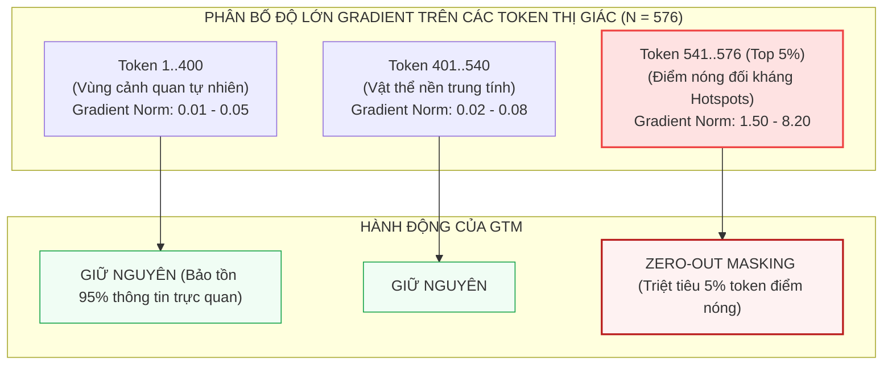
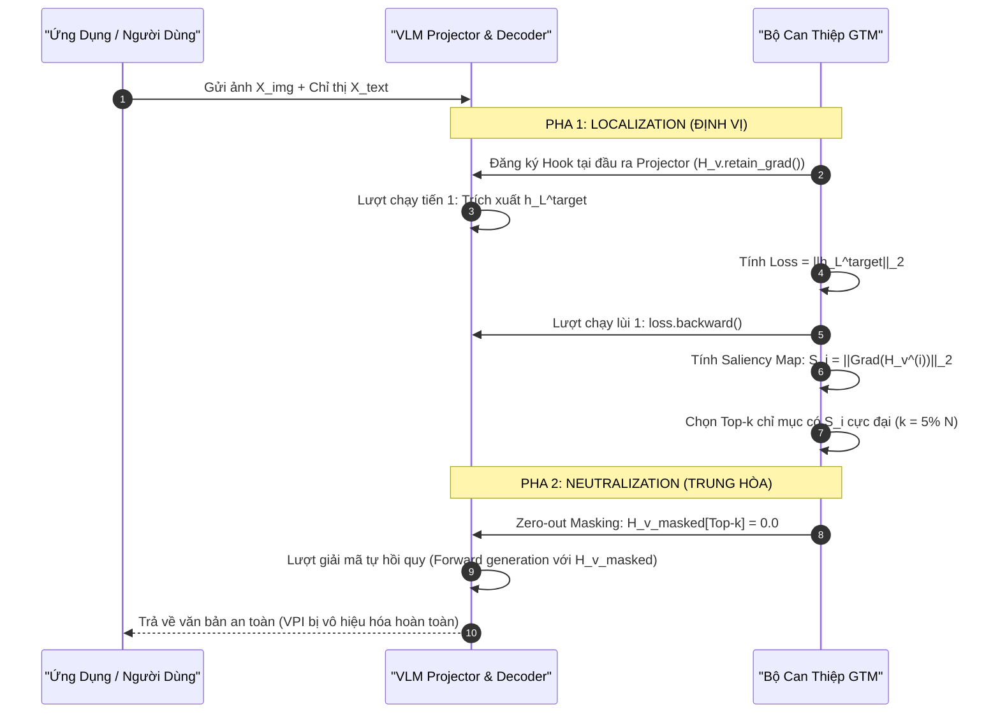

[⬅️ Bài 2: Lượng Tử Hóa Vector 2 Tầng & Tế Bào Voronoi](02_luong_tu_hoa_vector_2_tang_voronoi.md) | [🏠 Mục Lục Chuyên Đề](index.md) | [Bài 4: Thực Nghiệm ImgJP & Điểm Mù Typographic ➡️](04_thuc_nghiem_imgjp_va_diem_mu_typographic.md)

---

# Bài 3: Định Vị & Triệt Tiêu Token Dẫn Hướng Bởi Gradient (Localize and Neutralize / GTM)

> **Tóm tắt nội dung:**  
> Song song với trường phái tái cấu trúc mô hình bằng lượng tử hóa rời rạc, bài báo của Dongpeng Zhang et al. (CAS & Alibaba) tại **ICML 2026** đề xuất phương pháp **Localize and Neutralize (GTM - Gradient-guided Token Masking)**. Đây là một cơ chế phòng vệ thời gian suy luận (test-time intervention) mang tính cách mạng: **hoàn toàn không cần huấn luyện lại bất kỳ trọng số nào**. Bằng cách khai thác Chuẩn Gradient Trạng Thái Ẩn (Hidden-State Gradient Norm), GTM định vị chính xác tập con thưa thớt các token thị giác mang tải trọng đối kháng và gán triệt tiêu (zero-out) chúng ngay trước pha giải mã ngôn ngữ.

---

## 1. Triết Lý Can Thiệp Thời Gian Suy Luận (Test-Time Intervention)

Trong khi Q-MLLM đòi hỏi quá trình tiền huấn luyện và tinh chỉnh hai giai đoạn trên hàng trăm nghìn mẫu dữ liệu, thực tế triển khai công nghiệp đặt ra bài toán: *Làm thế nào để bảo vệ các mô hình VLM nền tảng khổng lồ có sẵn (Off-the-shelf Pretrained VLMs) mà không phải gánh chịu chi phí huấn luyện lại đắt đỏ?*

Nhóm nghiên cứu tại Viện Công nghệ Tính toán (CAS) và Tập đoàn Alibaba đưa ra câu trả lời thông qua phương châm: **Localization then Neutralization (Định vị trước, Trung hòa sau)**.

```
+-----------------------------------------------------------------------------+
|                  HAI BƯỚC CAN THIỆP THỜI GIAN SUY LUẬN CỦA GTM              |
+-----------------------------------------------------------------------------+
|                                                                             |
|  [BƯỚC 1: LOCALIZATION (ĐỊNH VỊ)]                                           |
|  • Thực hiện 1 lượt lan truyền tiến - lùi (Single Forward-Backward Pass)   |
|  • Tính toán chuẩn gradient trạng thái ẩn tầng cuối cùng theo từng token    |
|  • Nhận diện Top-k token thị giác có năng lượng đối kháng cao nhất (k ~ 5%)|
|                                                                             |
|  [BƯỚC 2: NEUTRALIZATION (TRUNG HÒA)]                                       |
|  • Gán véc-tơ của các token nguy hại về 0 (Zero-out Masking): H_v^(i) = 0   |
|  • Tiến hành sinh tự hồi quy thông thường trên các token còn lại             |
|  • Đòn tấn công VPI bị dập tắt hoàn toàn, ngữ cảnh tự nhiên được bảo toàn   |
|                                                                             |
+-----------------------------------------------------------------------------+
```

---

## 2. Quan Sát Cốt Lõi: Tính Thưa Thớt Của Năng Lượng Đối Kháng (Adversarial Energy Sparsity)

Một phát hiện thực nghiệm mang tính mấu chốt của Zhang et al. là: **Năng lực đối kháng của các cuộc tấn công Visual Prompt Injection không phân bổ đồng đều trên toàn bộ không gian ảnh, mà tập trung cao độ vào một tập con vô cùng thưa thớt các token thị giác nội tại (Sparsity of Adversarial Perturbations).**



### Tại sao năng lượng đối kháng lại mang tính thưa thớt?
1. Để duy trì tính vô hình trước mắt người (ràng buộc $\|\delta\|_\infty \le \epsilon$), các thuật toán tấn công đối kháng buộc phải tìm kiếm các hướng chiếu có độ nhạy cảm cao nhất trong không gian chú ý của Vision Transformer.
2. Các "điểm nóng" (hotspots) này tập trung tại một số ít patch có khả năng tương tác mạnh nhất với token chỉ thị của người dùng trong các tầng sâu của LLM.
3. Nếu loại bỏ hoặc xóa trắng (mask) đúng các token điểm nóng này, pha cộng hưởng đối kháng bị sụp đổ hoàn toàn. Ngược lại, 95% token thị giác còn lại vẫn lưu giữ đầy đủ cấu trúc hình học, màu sắc và ngữ nghĩa của bức ảnh.

---

## 3. Thất Bại Của Phương Pháp Đo Độ Nhạy Bằng Xác Suất Đầu Ra (Output Probability Attribution)

Trong lĩnh vực giải thích mô hình (Explainable AI), phương pháp kinh điển để xác định mức độ quan trọng của token đầu vào là tính đạo hàm của xác suất token đầu ra đầu tiên $P(y_1 \mid X)$ theo từng token thị giác $H_v^{(i)}$:

$$S_i^{\text{prob}} = \left\| \frac{\partial P(y_1 \mid X)}{\partial H_v^{(i)}} \right\|_2$$

Tuy nhiên, Zhang et al. chứng minh rằng phương pháp truyền thống này **hoàn toàn bất lực trong việc phòng vệ Visual Prompt Injection** do hai rào cản chí mạng:

```
                            HAI RÀO CẢN CỦA OUTPUT PROBABILITY ATTRIBUTION
                                                  │
            ┌─────────────────────────────────────┴─────────────────────────────────────┐
            ▼                                                                           ▼
┌────────────────────────────────────────┐                  ┌────────────────────────────────────────┐
│  RÀO CẢN 1: THIẾU THÔNG TIN MỤC TIÊU   │                  │   RÀO CẢN 2: BÃO HÒA VÀ BẤT BIẾN TIỀN TỐ│
│         (Target-Agnostic Setup)        │                  │        (Prefix Invariance & Saturation)│
├────────────────────────────────────────┤                  ├────────────────────────────────────────┤
│ Trong phòng vệ thực tế, hệ thống không │                  │ Nhiều đòn tiêm VPI bắt đầu bằng từ     │
│ thể biết trước kẻ tấn công muốn mô     │                  │ ngữ rất phổ biến như "Sure", "I", "The"│
│ hình sinh ra từ gì (y_1*). Nếu tính    │                  │ Đạo hàm theo các từ phổ thông này      │
│ đạo hàm theo từ ngẫu nhiên hoặc từ có  │                  │ phản ánh độ lệch ngôn ngữ chung, không │
│ xác suất cao nhất, gradient hoàn toàn  │                  │ hề bộc lộ năng lượng đối kháng đang âm │
│ sai lệch so với ý định tấn công thực.  │                  │ thầm tích lũy trong các tầng ẩn sâu.   │
└────────────────────────────────────────┘                  └────────────────────────────────────────┘
```

---

## 4. Đột Phá Toán Học: Chuẩn Gradient Trạng Thái Ẩn (Hidden-State Gradient Norm)

Để đo lường độ nhạy cảm đối kháng mà **hoàn toàn độc lập với nhãn mục tiêu (Target-Agnostic)**, GTM đề xuất một hàm mục tiêu nội tại dựa trên độ lớn của véc-tơ trạng thái ẩn tại tầng cuối cùng của LLM.

### 4.1. Thiết Lập Toán Học
Gọi:
- $H_v = (H_v^{(1)}, H_v^{(2)}, \dots, H_v^{(N)})$ là chuỗi $N$ token thị giác sau khi qua bộ chiếu $\mathcal{F}_h$, với $H_v^{(i)} \in \mathbb{R}^d$.
- $X_{\text{text}}$ là chuỗi văn bản chỉ thị của người dùng.
- $h_L^{\text{target}} \in \mathbb{R}^d$ là véc-tơ biểu diễn trạng thái ẩn tại tầng Transformer thứ $L$ (tầng cuối cùng của LLM) tại vị trí **token chuyển giao / kích hoạt (Pivot Token Index)**. Thông thường, vị trí này là token văn bản đầu tiên của câu lệnh người dùng hoặc token kết thúc phân tách phương thức.

Hàm mục tiêu năng lượng trạng thái ẩn $\mathcal{L}_{\text{target}}$ được định nghĩa bằng chuẩn $\ell_2$ của véc-tơ này:

$$\mathcal{L}_{\text{target}} = \|h_L^{\text{target}}\|_2 = \sqrt{\sum_{j=1}^d (h_{L, j}^{\text{target}})^2}$$

Điểm nhạy cảm (Saliency Score) $S_i$ của token thị giác thứ $i$ được định nghĩa bằng chuẩn Frobenius của gradient của $\mathcal{L}_{\text{target}}$ theo véc-tơ biểu diễn của token đó:

$$S_i = \left\| \nabla_{H_v^{(i)}} \mathcal{L}_{\text{target}} \right\|_2 = \left\| \frac{\partial \|h_L^{\text{target}}\|_2}{\partial H_v^{(i)}} \right\|_2$$

---

### 4.2. Bổ Đề Bảo Toàn Thứ Tự Xếp Hạng (Ranking Consistency Lemma)

Tại sao việc tối ưu hóa độ lớn trạng thái ẩn $\|h_L^{\text{target}}\|_2$ lại phản ánh chính xác các token mang tải trọng đối kháng của $\mathcal{L}_{\text{adv}}$?

> **Bổ đề (Zhang et al., ICML 2026):**  
> Giả sử kẻ tấn công thực hiện bẻ cong không gian biểu diễn để tối đa hóa xác suất sinh chuỗi độc hại $Y^*$. Khi đó, hướng biến thiên cực đại của trạng thái ẩn tại tầng cuối $h_L^{\text{target}}$ đồng pha với hướng biến thiên của hàm mất mát đối kháng $\mathcal{L}_{\text{adv}}$. Chuẩn gradient trạng thái ẩn duy trì tính nhất quán về thứ tự xếp hạng (Ranking Consistency) với chuẩn gradient đối kháng toàn phần:
> $$\text{Rank}\left( \left\| \frac{\partial \|h_L^{\text{target}}\|_2}{\partial H_v^{(i)}} \right\|_2 \right) \approx \text{Rank}\left( \left\| \frac{\partial \mathcal{L}_{\text{adv}}}{\partial H_v^{(i)}} \right\|_2 \right), \quad \forall i \in \{1, \dots, N\}$$

#### Phân tích trực giác:
Trong kiến trúc Transformer, mọi sự bẻ cong phân phối xác suất đầu ra đều phải được kết tinh thông qua sự dịch chuyển của véc-tơ trạng thái ẩn tầng cuối $h_L^{\text{target}}$. Do các tầng Transformer cuối cùng là các phép biến đổi trơn co giãn có giới hạn (Lipschitz continuous), một token thị giác có khả năng thay đổi mạnh mẽ hàm mất mát đối kháng $\mathcal{L}_{\text{adv}}$ bắt buộc phải truyền một lượng gradient khổng lồ qua $h_L^{\text{target}}$. Do đó, việc đo lường độ nhạy cảm của $\|h_L^{\text{target}}\|_2$ cho phép xác định chính xác các token độc hại mà không cần biết nội dung chuỗi đích $Y^*$.

---

## 5. Thuật Toán GTM (Gradient-guided Token Masking)

Thuật toán GTM vận hành hoàn chỉnh trong thời gian suy luận qua hai pha độc lập:



### Chi Tiết Thuật Toán

#### Pha 1: Định vị (Localization Pass)
1. Đưa ảnh $X_{\text{img}}$ qua Vision Encoder $\mathcal{F}_v$ và Bộ chiếu $\mathcal{F}_h$ để thu được chuỗi token thị giác $H_v \in \mathbb{R}^{N \times d}$.
2. Đăng ký cờ giữ gradient cho tensor này: $H_v.\text{requires\_grad} = \text{True}$.
3. Thực hiện một lượt chạy tiến (Forward pass) qua LLM để lấy trạng thái ẩn tầng cuối $h_L^{\text{target}}$ tại vị trí token kích hoạt.
4. Tính giá trị vô hướng $\mathcal{L}_{\text{target}} = \|h_L^{\text{target}}\|_2$.
5. Thực hiện một lượt lan truyền ngược duy nhất: $\text{loss.backward}()$.
6. Thu nhận ma trận gradient: $G = \nabla_{H_v} \mathcal{L}_{\text{target}} \in \mathbb{R}^{N \times d}$.
7. Tính điểm nhạy cảm cho từng token: $S_i = \sqrt{\sum_{j=1}^d G_{i, j}^2}, \quad i = 1, \dots, N$.
8. Xác định tập chỉ mục độc hại $\mathcal{I}_{\text{suppress}} = \text{Top-}k(\{S_i\}_{i=1}^N)$, với $k = \lceil \gamma \cdot N \rceil$, tỷ lệ che phủ mặc định $\gamma = 5\%$.

#### Pha 2: Trung hòa (Neutralization Pass)
1. Tạo tensor thị giác đã làm sạch $\tilde{H}_v$:
   $$\tilde{H}_v^{(i)} = \begin{cases} \mathbf{0} & \text{nếu } i \in \mathcal{I}_{\text{suppress}} \\ H_v^{(i)} & \text{ngược lại} \end{cases}$$
2. Ghép nối $\tilde{H}_v$ với token văn bản $H_t$ thành chuỗi đầu vào sạch: $\tilde{H}_{\text{fusion}} = [\tilde{H}_v \parallel H_t]$.
3. Thực hiện quá trình sinh tự hồi quy thông thường để tạo ra phản hồi cho người dùng.

---

## 6. Triển Khai Mã Nguồn Thực Thi (PyTorch Implementation)

Dưới đây là mã nguồn Python trích xuất và tinh chỉnh từ kho mã nguồn chính thức của công trình ICML 2026 ([fish883/GTM-Defense](https://github.com/fish883/GTM-Defense)), minh họa trên kiến trúc LLaVA-1.5:

```python
import torch
import torch.nn as nn

class GTMDefenseEngine:
    def __init__(self, model, processor, mask_rate: float = 0.05):
        """
        Khởi tạo Bộ phòng vệ GTM.
        :param model: Mô hình VLM mã nguồn mở (LLaVA, Qwen-VL,...)
        :param processor: Bộ xử lý tiền dữ liệu đa phương thức
        :param mask_rate: Tỷ lệ token thị giác bị triệt tiêu (mặc định 5%)
        """
        self.model = model
        self.processor = processor
        self.mask_rate = mask_rate
        # Đảm bảo không cập nhật trọng số trong quá trình phòng vệ
        self.model.eval()
        self.captured_vision_tokens = None

    def _register_vision_hook(self):
        """Đăng ký hook tại đầu ra của Projector để thu nhận gradient."""
        def forward_hook(module, input_tensor, output_tensor):
            self.captured_vision_tokens = output_tensor
            self.captured_vision_tokens.requires_grad_(True)
            self.captured_vision_tokens.retain_grad()

        # Áp dụng cho multi_modal_projector của LLaVA
        hook_handle = self.model.multi_modal_projector.register_forward_hook(forward_hook)
        return hook_handle

    def localize_adversarial_tokens(self, inputs, text_prompt: str):
        """Pha 1: Định vị các token có chuẩn gradient trạng thái ẩn cao nhất."""
        hook_handle = self._register_vision_hook()
        
        # Bật gradient checkpointing để tiết kiệm bộ nhớ GPU trong lượt backward
        if hasattr(self.model, "gradient_checkpointing_enable"):
            self.model.gradient_checkpointing_enable()

        # Forward pass lấy toàn bộ trạng thái ẩn
        outputs = self.model(**inputs, output_hidden_states=True)
        
        # Xác định vị trí pivot token (token văn bản đầu tiên của prompt)
        input_ids = inputs.input_ids[0]
        first_token_id = self.processor.tokenizer.encode(" " + text_prompt, add_special_tokens=False)[0]
        pivot_indices = (input_ids == first_token_id).nonzero(as_tuple=True)[0]
        pivot_idx = pivot_indices[-1].item() if len(pivot_indices) > 0 else -1

        # Trích xuất trạng thái ẩn tầng cuối cùng tại pivot token
        last_layer_hidden_state = outputs.hidden_states[-1]  # [batch, seq_len, d]
        pivot_hidden_vector = last_layer_hidden_state[0, pivot_idx, :]

        # Tính hàm mục tiêu năng lượng: Chuẩn L2 của véc-tơ trạng thái ẩn
        energy_loss = torch.norm(pivot_hidden_vector, p=2)

        # Backward pass duy nhất để tính gradient ngược về vision tokens
        self.model.zero_grad()
        energy_loss.backward()

        # Lấy gradient tại tensor thị giác và tính chuẩn L2 từng token
        vision_grads = self.captured_vision_tokens.grad  # [1, N, d]
        saliency_scores = torch.norm(vision_grads[0], dim=-1)  # [N]

        # Xác định số lượng token cần triệt tiêu k = gamma * N
        num_tokens = saliency_scores.numel()
        k = int(num_tokens * self.mask_rate)

        # Lọc ra Top-k chỉ mục có điểm nhạy cảm cao nhất
        topk_indices = torch.topk(saliency_scores, k=k).indices.tolist() if k > 0 else []

        # Giải phóng hook
        hook_handle.remove()
        return topk_indices, self.captured_vision_tokens

    def generate_defended_response(self, inputs, text_prompt: str, max_new_tokens: int = 512):
        """Pha 2: Gán zero-out các token nguy hại và tiến hành giải mã tự hồi quy."""
        topk_indices, vision_tokens = self.localize_adversarial_tokens(inputs, text_prompt)

        # Sao chép tensor đặc trưng thị giác và gán 0 cho các token nguy hại
        sanitized_vision_tokens = vision_tokens.clone().detach()
        if len(topk_indices) > 0:
            sanitized_vision_tokens[0, topk_indices, :] = 0.0

        # Thay thế tensor đặc trưng thị giác vào cấu trúc inputs_embeds
        # (Chi tiết ánh xạ tùy thuộc vào cấu trúc input_ids của từng họ mô hình)
        inputs_embeds = self.model.get_input_embeddings()(inputs.input_ids)
        # Giả định vị trí token thị giác được đánh dấu bởi IMAGE_TOKEN_INDEX
        image_mask = (inputs.input_ids == self.model.config.image_token_index)
        inputs_embeds[image_mask] = sanitized_vision_tokens.view(-1, inputs_embeds.shape[-1])

        # Giải mã tự hồi quy an toàn
        with torch.no_grad():
            output_ids = self.model.generate(
                inputs_embeds=inputs_embeds,
                max_new_tokens=max_new_tokens,
                do_sample=False
            )

        return self.processor.tokenizer.decode(output_ids[0], skip_special_tokens=True)
```

---

## 7. Lý Giải Toán Học Cơ Chế Bảo Toàn Năng Lực Chung (Utility Preservation)

Một nghịch lý thú vị: *Nếu ta tùy tiện gán véc-tơ $\mathbf{0}$ cho các token trong mạng học sâu, tại sao bức ảnh không bị hỏng và mô hình vẫn trả lời chính xác các câu hỏi ngữ cảnh phức tạp?*

Câu trả lời nằm ở **Tính Dư Thừa Không Gian (Spatial Redundancy)** của Vision Transformer:

```
                  CƠ CHẾ BÙ ĐẮP THÔNG TIN CỦA CƠ CHẾ ATTENTION
                  
   Patch (i-1) [Benign]:  Embedding x_(i-1) ──────────┐
                                                      │  Self-Attention
   Patch i [Adversarial]: BỊ GÁN ZERO-OUT [0.0] ──────┼──► Tổng hợp ngữ cảnh:
                                                      │    h'_i = sum(alpha_ij * x_j)
   Patch (i+1) [Benign]:  Embedding x_(i+1) ──────────┘
```

1. **Tương quan cục bộ cao giữa các mảnh ảnh:** Trong ảnh tự nhiên, các patch cạnh nhau có độ tương đồng ngữ nghĩa cực lớn (ví dụ: bầu trời, bức tường, da người, áo quần trải dài trên hàng chục patch). Khi một vài patch bị khuyết (bằng $\mathbf{0}$), cơ chế Self-Attention $\text{Softmax}(QK^\top / \sqrt{d})V$ của các tầng Transformer tiếp theo tự động lấy trọng số từ các patch lân cận để lấp đầy khoảng trống thông tin.
2. **Sự đứt gãy pha cộng hưởng đối kháng:** Ngược lại với thông tin thị giác tự nhiên mang tính phân tán và dư thừa, **nhiễu đối kháng là một cấu trúc cộng hưởng siêu nhạy cảm**. Từng véc-tơ nhiễu trên các patch phải phối hợp chính xác về biên độ và góc pha để đánh lừa tầng chú ý của LLM. Khi 5% token trọng yếu bị gán bằng $\mathbf{0}$, pha cộng hưởng bị phá vỡ hoàn toàn, khiến toàn bộ tín hiệu tiêm lệnh độc hại bị dập tắt lập tức.

---

## 8. So Sánh Chi Phí Tính Toán Giữa GTM và Các Phương Pháp Khác

| Phương Pháp Phòng Vệ | Yêu Cầu Huấn Luyện | Số Mô Hình Nạp VRAM | Lượt Chạy Suy Luận (Inference Passes) | Tỷ Lệ Tăng Độ Trễ (Latency Overhead) |
|---|:---:|:---:|:---:|:---:|
| **Vanilla VLM (Không phòng vệ)** | Không | 1 Mô hình | 1 Forward pass | 0% (Chuẩn cơ sở: 1.42s) |
| **Q-MLLM (NDSS 2026)** | Có (2 Giai đoạn) | 1 Mô hình | 1 Forward pass + $k$-NN lookup | **+2.1%** (1.45s) |
| **GTM (ICML 2026)** | **Hoàn toàn Không** | **1 Mô hình duy nhất** | 1 Forward + 1 Backward + 1 Forward | **+30.2%** (1.85s) |
| **Auxiliary Guard (Llama Guard 3V)** | Không (Dùng sẵn) | **2 Mô hình độc lập** (VLM chính + Guard 11B) | 2 Forward passes độc lập trên 2 mô hình | **+100.0%** (2.85s) |
| **Post-Detection (MLLM-Protector)** | Không | **2 Mô hình** (VLM + Detector) | 1 Forward + 1 Detector pass | **+86.6%** (2.65s) |
| **Image Transformation (ECSO)** | Không | **2 Mô hình** (Captioner + LLM) | 1 Image-to-Text pass + 1 LLM pass | **+174.6%** (3.90s) |

> [!TIP]
> **Đánh giá triển khai thực tế:**  
> Mặc dù GTM làm tăng 30% thời gian suy luận do cần 1 lượt backward pass, phương pháp này **hoàn toàn không làm tăng chi phí phần cứng (không cần GPU thứ hai để nạp Guard Model)** và **không đòi hỏi chi phí huấn luyện lại hàng trăm giờ GPU**. Đây là giải pháp phòng vệ cân bằng tối ưu nhất cho các hệ thống cần triển khai gấp trên nền tảng VLM có sẵn.

---

## 9. Tổng Kết

Phương pháp **Localize and Neutralize (GTM)** tại ICML 2026 đã mang lại một cách tiếp cận đột phá:
- Sử dụng chính gradient trạng thái ẩn nội tại làm "vũ khí chẩn đoán" chống lại các cuộc tấn công dựa trên gradient.
- Triệt tiêu chọn lọc 5% token mang năng lượng đối kháng cao nhất, dập tắt Visual Prompt Injection mà không làm tổn hại năng lực suy luận thị giác chung.
- Hoàn toàn độc lập với nhãn mục tiêu và không cần huấn luyện lại trọng số.

Tuy nhiên, trong các tình huống thực chiến, hiệu năng của cả Q-MLLM và GTM ra sao khi đối mặt với các đòn tấn công bẻ khóa thực tế (ImgJP, VAA, Typography, và Adaptive Attacks BPDA)? Bài 4 sẽ mổ xẻ toàn diện các bảng số liệu thực nghiệm và những tử huyệt chưa thể giải quyết.

---

[⬅️ Bài 2: Lượng Tử Hóa Vector 2 Tầng & Tế Bào Voronoi](02_luong_tu_hoa_vector_2_tang_voronoi.md) | [🏠 Mục Lục Chuyên Đề](index.md) | [Bài 4: Thực Nghiệm ImgJP & Điểm Mù Typographic ➡️](04_thuc_nghiem_imgjp_va_diem_mu_typographic.md)
