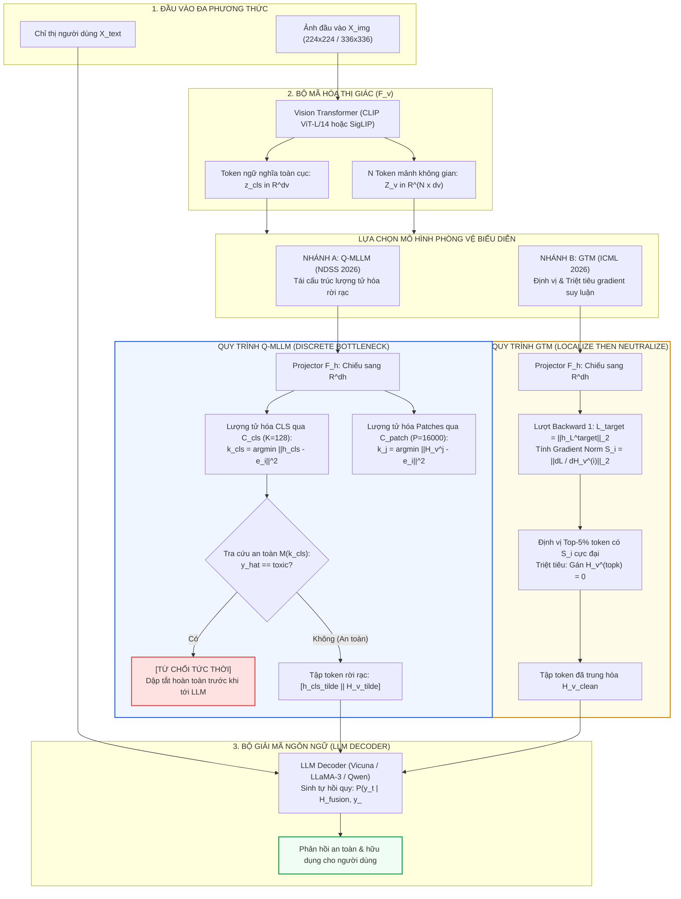

[🏠 Thư viện Chuyên khảo Model-Based VPI Defenses](../../README.md) | [Bài 1: Tấn Công Gradient Liên Tục ➡️](01_tan_cong_gradient_lien_tuc.md)

---

# Chuyên Khảo Chuyên Sâu: Rời Rạc Hóa Biểu Diễn & Triệt Tiêu Gradient Phòng Vệ Visual Prompt Injection (Q-MLLM & GTM)

> **Tóm tắt chuyên khảo:**  
> Các phương thức tấn công Visual Prompt Injection (VPI) và Multimodal Jailbreak hiện đại khai thác triệt để tính khả vi liên tục (continuous differentiability) của bộ mã hóa thị giác (Vision Encoder) để lan truyền đạo hàm ngược từ mục tiêu độc hại trong mô hình ngôn ngữ lớn (LLM) về từng điểm ảnh. Trước mối đe dọa này, hai công trình nghiên cứu tiên phong tại **NDSS 2026** và **ICML 2026** đã đề xuất các chiến lược can thiệp biểu diễn nội tại mang tính đột phá:
> 1. **Q-MLLM (NDSS 2026):** Tái cấu trúc luồng thông tin đa phương thức thông qua nút thắt cổ chai lượng tử hóa vector hai tầng (Dual-Level Vector Quantization Bottleneck), phân chia không gian biểu diễn liên tục thành các tế bào Voronoi rời rạc, cắt đứt hoàn toàn dòng gradient vi phân của kẻ tấn công.
> 2. **Localize and Neutralize / GTM (ICML 2026):** Tiếp cận theo hướng can thiệp suy luận (test-time intervention) không cần huấn luyện lại mô hình, khai thác chuẩn gradient trạng thái ẩn (Hidden-State Gradient Norm) để định vị chính xác tập con thưa thớt các token thị giác mang năng lượng đối kháng cao và triệt tiêu chúng bằng cơ chế gán zero-out tức thời.
>
> Chuyên khảo này cung cấp hệ thống tài liệu nghiên cứu chuyên sâu gồm 4 bài viết độc lập, bóc tách toàn diện nền tảng toán học, động học tối ưu hóa, chi tiết kiến trúc, mã nguồn thực thi, kết quả thực nghiệm chuẩn hóa và ranh giới thất bại cố hữu của cả hai công trình.

---

## 1. Metadata Các Công Trình Nghiên Cứu Cốt Lõi

| Thuộc Tính | Công Trình 1: Q-MLLM | Công Trình 2: Localize and Neutralize (GTM) |
|---|---|---|
| **Tên bài báo** | *Q-MLLM: Vector Quantization for Robust Multimodal Large Language Model Security* | *Localization then Neutralization: Gradient-Guided Token Suppression Against Visual Prompt Injection Attack* |
| **Tác giả** | Wei Zhao, Zhe Li, Yige Li, Jun Sun | Dongpeng Zhang, Ke Ma, Yangbangyan Jiang, Gaozheng Pei, Longtao Huang, Qianqian Xu, Qingming Huang |
| **Cơ quan nghiên cứu** | Trường Máy tính và Hệ thống Thông tin, Đại học Quản lý Singapore (Singapore Management University - SMU) | Viện Công nghệ Tính toán, Viện Hàn lâm Khoa học Trung Quốc (ICT, CAS); Đại học Viện Hàn lâm Khoa học Trung Quốc (UCAS); Tập đoàn Alibaba (Alibaba Group) |
| **Hội nghị / Năm** | **NDSS 2026** (Network and Distributed System Security Symposium) | **ICML 2026** (International Conference on Machine Learning) |
| **Tài trợ nghiên cứu** | Quỹ Nghiên cứu Học thuật Bộ Giáo dục Singapore Tier 3 (MOET32020-0004) | Quỹ Khoa học Tự nhiên Quốc gia Trung Quốc (NSFC) & Dự án Hợp tác Viện Hàn lâm - Doanh nghiệp Alibaba |
| **Mã nguồn công khai** | [GitHub: Amadeuszhao/QMLLM](https://github.com/Amadeuszhao/QMLLM) | [GitHub: fish883/GTM-Defense](https://github.com/fish883/GTM-Defense) |
| **Cấp độ can thiệp** | Tái cấu trúc kiến trúc biểu diễn (Representation Bottleneck) & Huấn luyện căn chỉnh 2 giai đoạn | Đo lường độ nhạy cảm gradient trạng thái ẩn & Triệt tiêu token động trong thời gian suy luận (Test-Time Token Suppression) |

---

## 2. Bối Cảnh Khoa Học & Xung Đột Biểu Diễn Đa Phương Thức

Sự phát triển mạnh mẽ của các Mô hình Thị giác - Ngôn ngữ Lớn (Vision-Language Models - VLMs) như LLaVA, Qwen2.5-VL, hay GPT-4o đã mở ra kỷ nguyên mới cho các tác nhân tự chủ đa phương thức. Tuy nhiên, kiến trúc ghép nối (fusion architecture) giữa hai phương thức tồn tại một nghịch lý an ninh căn bản:

```
                            XUNG ĐỘT AN NINH ĐA PHƯƠNG THỨC
                                            │
            ┌───────────────────────────────┴───────────────────────────────┐
            ▼                                                               ▼
┌────────────────────────────────────────┐      ┌────────────────────────────────────────┐
│        PHƯƠNG THỨC NGÔN NGỮ (TEXT)     │      │       PHƯƠNG THỨC THỊ GIÁC (VISION)    │
├────────────────────────────────────────┤      ├────────────────────────────────────────┤
│ • Không gian từ vựng rời rạc (Discrete)│      │ • Không gian điểm ảnh liên tục         │
│ • Huấn luyện căn chỉnh an toàn nghiêm  │      │   trơn mượt (Continuous R^(H x W x C)) │
│   ngặt qua RLHF / DPO / Safety SFT     │      │ • Vision Encoder (ViT/CLIP) tối ưu hóa │
│ • Các đòn tấn công ký tự dễ bị nhận    │      │   tương phản, KHÔNG có rào cản an toàn │
│   diện qua bộ lọc từ vựng (Perplexity) │      │ • Khả vi hoàn toàn: Dễ bị tối ưu hóa   │
│                                        │      │   đối kháng qua lan truyền ngược       │
└────────────────────────────────────────┘      └────────────────────────────────────────┘
```

Khi ghép nối chuỗi token thị giác liên tục $H_v$ với chuỗi token văn bản rời rạc $H_t$ thành $H_{\text{fusion}} = [H_v \parallel H_t]$, toàn bộ chuỗi tính toán từ logit đầu ra của LLM ngược về từng điểm ảnh của ảnh đầu vào trở thành **một hàm khả vi trơn tru (end-to-end differentiable function)**. Kẻ tấn công có thể sử dụng các giải thuật tối ưu hóa đạo hàm từng bước (như PGD, ImgJP, VAA) để chế tác các nhiễu vi phân tàng hình $\delta \in \mathbb{R}^{H \times W \times C}$, bẻ cong biểu diễn ẩn và chiếm đoạt hoàn toàn quyền kiểm soát ngữ nghĩa của mô hình.

Để giải quyết tận gốc lỗ hổng này ở cấp độ mô hình (Model-Based Defense), cộng đồng nghiên cứu đã định hình hai chiến lược đại diện:
1. **Lượng tử hóa rời rạc (Discrete Representation Bottleneck):** Điển hình là **Q-MLLM (NDSS 2026)**, đặt một rào cản lượng tử hóa vector vào giữa bộ chiếu thị giác và LLM, biến không gian liên tục thành các tế bào Voronoi rời rạc nhằm triệt tiêu hoàn toàn gradient vi phân.
2. **Triệt tiêu token dẫn hướng bởi gradient (Gradient-Guided Token Suppression):** Điển hình là **Localize and Neutralize / GTM (ICML 2026)**, tận dụng chính dòng gradient của trạng thái ẩn nội tại để định vị tập con thưa thớt các token mang tải trọng đối kháng và gán zero-out chúng trong thời gian thực mà không cần tái huấn luyện mô hình.

---

## 3. Ma Trận So Sánh Kỹ Thuật Giữa Q-MLLM và GTM

Dưới đây là bảng đối soát chuyên sâu giữa hai triết lý can thiệp biểu diễn:

| Tiêu Chí Đánh Giá | Q-MLLM (NDSS 2026) | Localize and Neutralize / GTM (ICML 2026) |
|---|---|---|
| **Triết lý phòng vệ** | **Biến đổi cấu trúc kiến trúc (Architectural Modification):** Cố định vĩnh viễn nút thắt cổ chai VQ rời rạc vào mô hình. | **Can thiệp thời gian suy luận (Test-Time Intervention):** Giữ nguyên trọng số gốc, chẩn đoán và trung hòa động. |
| **Yêu cầu huấn luyện** | Cần quy trình huấn luyện 2 giai đoạn (Giai đoạn 1: Codebook & Projector; Giai đoạn 2: LLM Decoder). | **Hoàn toàn không cần huấn luyện (Zero-shot / Training-free).** |
| **Cơ chế toán học triệt tiêu** | Đạo hàm hàm bậc thang Voronoi bằng $\mathbf{0}$ ở hầu khắp mọi nơi ($\nabla_x \text{VQ}(x) = \mathbf{0}$). | Chuẩn gradient trạng thái ẩn tầng cuối ($\|\nabla_{H_v} \|h_L^{\text{target}}\|_2\|_2$) định vị điểm nóng. |
| **Vị trí can thiệp** | Đầu ra bộ chiếu $\mathcal{F}_h$ (toàn bộ $N$ token mảnh và 1 token CLS bị lượng tử hóa). | Tensor embedding thị giác đầu vào LLM (chỉ $k \approx 5\% N$ token nhạy cảm nhất bị zero-out). |
| **Phát hiện nội dung độc hại (Passive Toxic Content)** | Có cơ chế tích hợp tức thời thông qua bảng ánh xạ chỉ mục $M(k_{\text{cls}})$ (phản hồi trong micro-giây). | Không thiết kế cho lọc ảnh độc hại thụ động; chuyên biệt đối phó Visual Prompt Injection chủ động. |
| **Chi phí tính toán suy luận (Inference Overhead)** | Tăng cực kỳ thấp (+2.1% đến +5.5% thời gian suy luận nhờ phép tìm kiếm $k$-NN nhẹ). | Tăng trung bình (+30% thời gian do yêu cầu 1 lượt backward pass lấy gradient). |
| **Độ trễ bộ nhớ VRAM** | Không phát sinh bộ nhớ tính toán gradient ở thời gian suy luận. | Cần lưu đồ thị tính toán để chạy 1 lượt lan truyền ngược (Gradient Checkpointing giảm áp lực). |
| **Tỷ lệ phòng vệ Jailbreak (DSR)** | Đạt **100.0%** trên ImgJP ($\varepsilon=8, 16, \infty$); **97.5%** trên VAA ($\infty$). | Giảm ASR của VPI từ >80% xuống dưới 10% trên hầu hết các mẫu tấn công gradient. |
| **Bảo toàn năng lực chung (Utility Preservation)** | Suy giảm nhẹ (-1.4% trên ScienceQA; F1 POPE Adversarial duy trì 78.9% so với gốc 79.0%). | Bảo toàn gần như tuyệt đối (-0.3% trên ScienceQA; F1 POPE duy trì 78.8%). |
| **Khả năng chuyển giao (Portability)** | Phải huấn luyện lại Codebook cho từng kiến trúc VLM cụ thể. | **Cắm-và-chạy (Plug-and-play)** trên mọi kiến trúc mã nguồn mở (LLaVA, Qwen-VL, InternVL). |
| **Tử huyệt chính** | Tấn công chữ in tự nhiên (Typographic VPI); Tấn công thích ứng BPDA; Mất mát chi tiết hạt mịn. | Tấn công chữ in trải rộng nhiều token; Tăng độ trễ suy luận so với forward pass thuần túy. |

---

## 4. Sơ Đồ Hệ Thống Tổng Thể (System Architecture Map)



---

## 5. Mục Lục Chuyên Đề & Điều Hướng Chi Tiết

Bộ chuyên khảo được chia làm 4 chuyên đề nghiên cứu chuyên sâu, bao hàm từ lý thuyết nền tảng đến thực nghiệm đối chiếu:

```
PAPERS / Q-MLLM & GTM MONOGRAPH DIRECTORY
│
├── index.md                                      <-- (Bạn đang ở đây) Tổng quan chuyên khảo, Metadata, So sánh hệ thống
│
├── 01_tan_cong_gradient_lien_tuc.md              <-- BÀI 1: Động học tấn công gradient liên tục & chuỗi vi phân ngược
│   ├── 1. Xung đột an ninh đa phương thức (Discrete Text vs Continuous Vision)
│   ├── 2. Toán học chuỗi vi phân ngược từ LLM về điểm ảnh (End-to-End Chain Rule)
│   ├── 3. Giả thuyết tuyến tính hóa cục bộ (Local Linearity Hypothesis) trong không gian nơ-ron
│   ├── 4. Giải phẫu thuật toán PGD trên MLLM
│   ├── 5. Cơ chế tấn công ImgJP (Image Jailbreak Prompt) & VAA (Visual Adversarial Attack)
│   └── 6. Sự thất bại của các bộ lọc tiền xử lý điểm ảnh truyền thống
│
├── 02_luong_tu_hoa_vector_2_tang_voronoi.md      <-- BÀI 2: Lượng tử hóa vector 2 tầng & Hình học tế bào Voronoi
│   ├── 1. Triết lý kiến trúc nút thắt cổ chai lượng tử hóa Q-MLLM
│   ├── 2. Phân tầng biểu diễn: Patch-level (P=16000) & Global-cls (K=128)
│   ├── 3. Hình học không gian tế bào Voronoi & Hàm bậc thang phi vi phân
│   ├── 4. Phương pháp xấp xỉ Straight-Through Estimator (STE)
│   ├── 5. Các hàm mất mát huấn luyện: Codebook Loss, Commit Loss, Semantic Alignment Loss
│   ├── 6. Quy trình huấn luyện hai giai đoạn (Pretraining & LLM Fine-Tuning)
│   ├── 7. Cơ chế phát hiện tín hiệu độc hại tốc hành (Safety Mapping Algorithm)
│   └── 8. Động học bẫy gradient trước bước nhảy nhỏ và bước nhảy lớn
│
├── 03_localize_and_neutralize_gtm.md             <-- BÀI 3: Định vị & triệt tiêu token dẫn hướng bởi gradient (GTM)
│   ├── 1. Triết lý can thiệp suy luận (Test-Time Intervention) không cần huấn luyện
│   ├── 2. Quan sát thực nghiệm: Tính thưa thớt của năng lượng đối kháng VPI
│   ├── 3. Sự sụp đổ của phương pháp gán quyền xác suất đầu ra (Output Probability Attribution)
│   ├── 4. Đột phá toán học: Chuẩn gradient trạng thái ẩn (Hidden-State Gradient Norm)
│   ├── 5. Bổ đề bảo toàn thứ tự xếp hạng (Ranking Consistency Lemma)
│   ├── 6. Thuật toán GTM hai giai đoạn: Localization Pass & Neutralization Pass
│   ├── 7. Phân tích mã nguồn PyTorch thực thi (Forward Hook, Gradient Checkpointing)
│   └── 8. Lý giải toán học cơ chế bảo toàn năng lực chung (Spatial Redundancy)
│
└── 04_thuc_nghiem_imgjp_va_diem_mu_typographic.md <-- BÀI 4: Đối sánh thực nghiệm, Điểm mù Typographic & Tấn công BPDA
    ├── 1. Bảng số liệu thực nghiệm DSR trên ImgJP, VAA, FigStep, MM-SafetyBench
    ├── 2. Khả năng phát hiện ảnh độc hại thụ động (HOD, ToViLaG) & Đánh giá FPR
    ├── 3. Đánh giá duy trì năng lực tác vụ chuẩn (ScienceQA, POPE, MM-Vet)
    ├── 4. Phân tích trường hợp thất bại đơn lẻ của VAA và kỹ thuật hiệu chỉnh tri thức LED
    ├── 5. Tử huyệt 1: Tấn công bằng chữ in tự nhiên (Semantic Typographic Prompt Injection)
    ├── 6. Tử huyệt 2: Tấn công thích ứng bằng xấp xỉ vi phân ngược (BPDA & EOT)
    ├── 7. Tử huyệt 3: Hiện tượng xung đột từ điển mã (Codebook Collision)
    └── 8. Kết luận tổng hợp: Định hình kiến trúc phòng vệ chuyên sâu kết hợp
```

---

[🏠 Thư viện Chuyên khảo Model-Based VPI Defenses](../../README.md) | [Bài 1: Tấn Công Gradient Liên Tục ➡️](01_tan_cong_gradient_lien_tuc.md)
