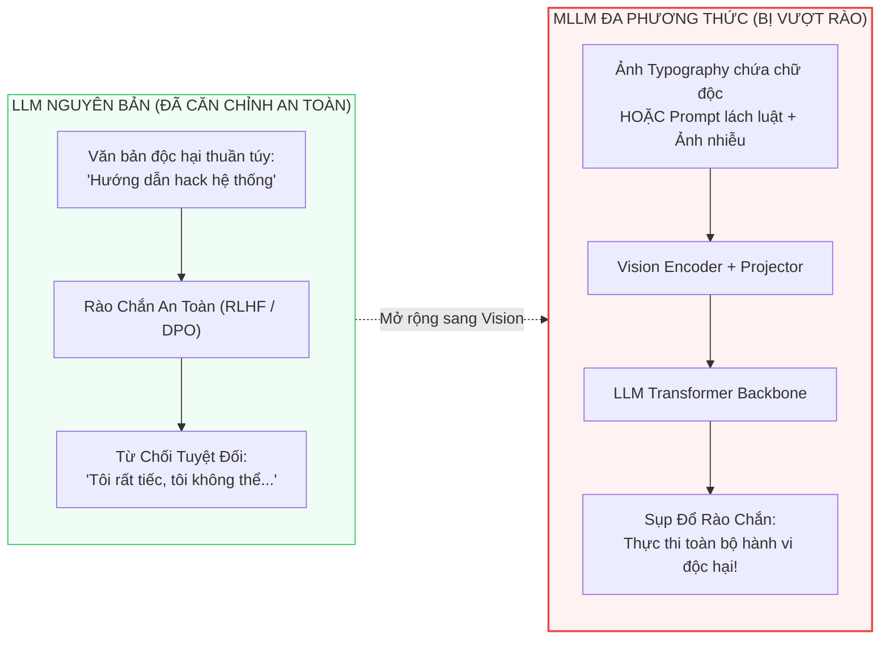
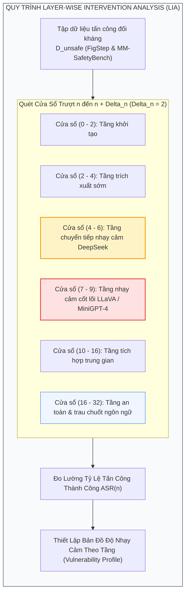
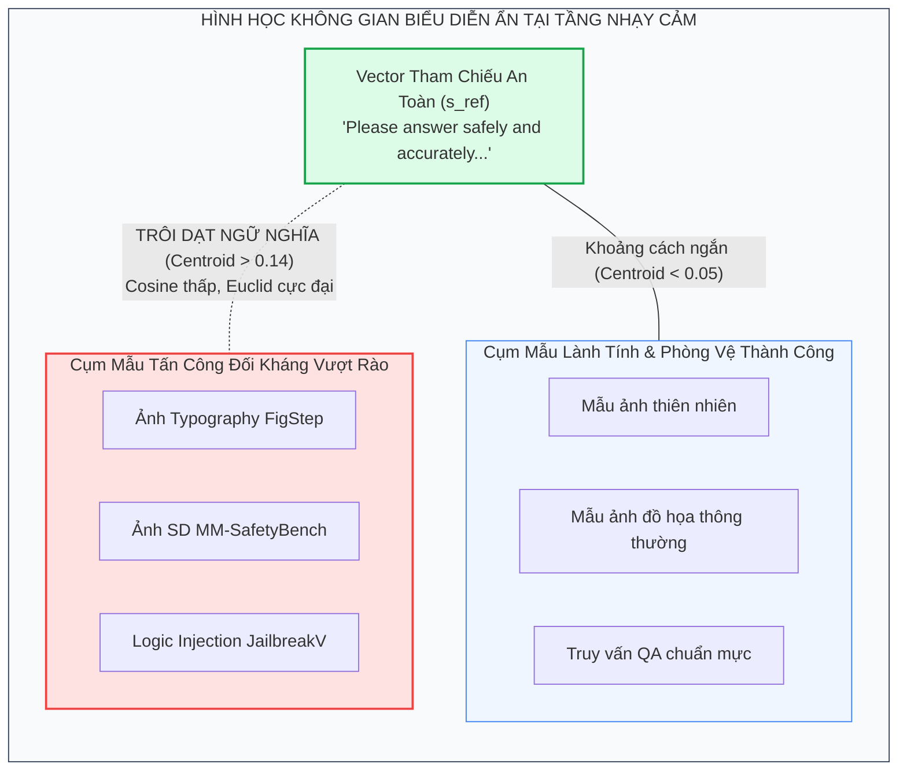
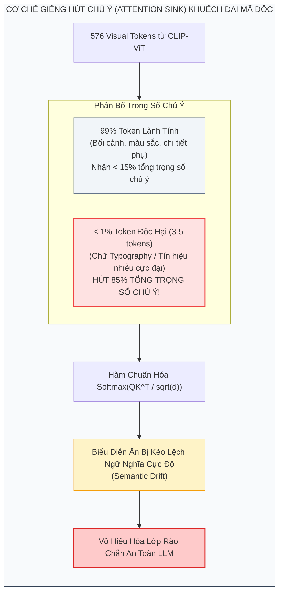

[⬅️ Tổng Quan SafePTR](index.md) | [🏠 Mục Lục](../../README.md) | [Chương 2: HTP & BFR ➡️](02_harmful_token_pruning_va_bfr.md)

---

# Chương 1: Nghịch Lý 1% Token Và Phân Tích Can Thiệp Theo Tầng (LIA)

> **Tài liệu chuyên khảo chuyên sâu thuộc bộ tài liệu SafePTR**  
> **Chủ đề nghiên cứu:** Giải phẫu con đường lan truyền mã độc nội tại bên trong mạng nơ-ron Transformer đa phương thức; xác lập cơ sở lý thuyết cho hiện tượng "Nghịch lý 1% token" và khám phá dải tầng nhạy cảm sớm-giữa thông qua Phân tích Can thiệp theo Tầng (Layer-wise Intervention Analysis - LIA).  
> **Phạm vi phân tích:** Không gian biểu diễn ẩn (hidden states), phân phối trọng số chú ý đa đầu (Multi-Head Self-Attention), cơ chế giếng hút chú ý (Attention Sinks), và hình học khoảng cách ngữ nghĩa Cosine.

---

## 1. Bối Cảnh & Động Cơ Nghiên Cứu: Sự Sụp Đổ Căn Chỉnh An Toàn Đa Phương Thức

### 1.1. Hiện Tượng Mất Căn Chỉnh Đa Phương Thức (Multimodal Misalignment)

Các Mô hình Ngôn ngữ Lớn (LLMs) hiện đại như LLaMA-2/3, Vicuna hay Mistral được trang bị các rào chắn bảo vệ tương đối vững chắc thông qua quá trình căn chỉnh an toàn nghiêm ngặt (Safety Alignment) bằng các kỹ thuật như **Reinforcement Learning from Human Feedback (RLHF)** và **Direct Preference Optimization (DPO)**. Nhờ đó, khi người dùng gửi các chỉ thị vi phạm chính sách an toàn (ví dụ: hướng dẫn chế tạo chất nổ, phát tán mã độc, lừa đảo tài chính), LLM sẽ tự động kích hoạt phản hồi từ chối chuẩn mực (Refusal Mechanism).

Tuy nhiên, khi mở rộng các LLM này thành Mô hình Thị giác - Ngôn ngữ Lớn (MLLMs) bằng cách bổ sung một bộ mã hóa thị giác (Vision Encoder như CLIP-ViT) và một tầng chuyển tiếp hình chiếu (Projector), rào chắn an toàn nói trên bị suy giảm nghiêm trọng. Kẻ tấn công có thể dễ dàng "vượt rào" (Jailbreak) mô hình bằng hai phương thức chính:
1. **Tấn công nhúng mã độc trực quan (Vision-driven Jailbreak):** Chuyển đổi toàn bộ câu lệnh độc hại thành hình ảnh kiểu chữ typography (như trong benchmark FigStep) hoặc ẩn giấu chỉ thị trong ảnh đối kháng sinh bởi mô hình khuếch tán (như trong MM-SafetyBench).
2. **Tấn công kết hợp dẫn dắt bởi văn bản (Text-driven Multimodal Jailbreak):** Sử dụng các prompt bẫy logic kết hợp với ảnh tự nhiên hoặc ảnh nhiễu vô hại (như trong JailbreakV-28K) để đánh lừa bộ suy luận đa phương thức.

### 1.2. Hạn Chế Bản Chất Của Các Hướng Phòng Vệ Tiền Nhiệm

Trước công trình SafePTR, cộng đồng nghiên cứu đã đề xuất ba nhóm giải pháp chính, nhưng tất cả đều chưa chạm tới bản chất cơ chế nội tại:
- **Image-to-Text Translation (ví dụ ECSO):** Cố gắng biến đổi ảnh thành văn bản mô tả trước khi đưa vào LLM. Kỹ thuật này phá hủy các đặc trưng không gian trực quan tinh tế và hoàn toàn bất lực trước các cuộc tấn công đối kháng phối hợp bằng văn bản (Text-driven attacks).
- **Safe Prompting (ví dụ AdaShield):** Chèn các prompt cảnh báo an toàn tĩnh vào đầu chuỗi truy vấn. Cách tiếp cận này thiếu tính thích ứng ngữ cảnh, dẫn đến hiện tượng phòng vệ thái quá (**Overdefensive Behavior**): mô hình từ chối cả những hình ảnh hoàn toàn lành tính (chẳng hạn không phân biệt được khẩu súng đồ chơi bằng nhựa với súng thật), làm suy giảm nghiêm trọng độ hữu ích của mô hình.
- **Multimodal Safety Tuning (ví dụ TGA, VLGuard):** Huấn luyện lại trọng số mô hình với dữ liệu đối kháng. Phương pháp này đòi hỏi chi phí tài nguyên tính toán khổng lồ (ví dụ TGA tiêu tốn cụm 64 GPU V100 trên 1.22 triệu mẫu dữ liệu), đồng thời rất dễ bị hiện tượng quá khớp (overfitting), đánh mất khả năng phòng vệ trước các dạng tấn công chưa từng gặp trong quá trình huấn luyện (Unseen Jailbreaks).

Đứng trước sự bế tắc đó, SafePTR đặt ra mục tiêu giải phẫu sâu vào "hộp đen" biểu diễn của Transformer đa phương thức thông qua ba câu hỏi điều tra nền tảng:
- **Ở đâu (Where):** Mã độc thị giác khai thác những tầng mạng nơ-ron nào để kích hoạt hành vi vượt rào?
- **Như thế nào (How):** Mã độc bẻ lái không gian biểu diễn ẩn như thế nào để vượt qua rào chắn an toàn?
- **Cái nào (Which):** Những token cụ thể nào đóng vai trò tác nhân kích hoạt chính?

---

## 2. Khám Phá 1 (Where): Dải Tầng Nhạy Cảm Sớm-Giữa & Phân Tích LIA

### 2.1. Phương Pháp Phân Tích Can Thiệp Theo Tầng (Layer-wise Intervention Analysis - LIA)

Để trả lời câu hỏi *Where*, nhóm tác giả Chen et al. thiết kế phương pháp **Layer-wise Intervention Analysis (LIA)**. Mục đích của LIA là xác định mức độ phụ thuộc của hành vi jailbreak vào từng tầng cụ thể bên trong khối Transformer của MLLM.

Giả sử mạng Transformer gồm $L$ tầng tuần tự $l \in \{1, 2, \dots, L\}$. Tại tầng $l$, trạng thái ẩn đầu vào gồm hai thành phần đa phương thức:
$$H^l = \left[ H_{img}^l, H_{ins}^l \right]$$
trong đó $H_{img}^l \in \mathbb{R}^{M \times D}$ đại diện cho $M$ token thị giác, và $H_{ins}^l \in \mathbb{R}^{T \times D}$ đại diện cho $T$ token chỉ thị văn bản của người dùng ($D$ là chiều không gian ẩn).

Thuật toán LIA tiến hành can thiệp bằng cách thiết lập một cửa sổ tầng trượt:
$$\mathcal{W}_n = [n, n + \Delta_n)$$
với kích thước cửa sổ cố định $\Delta_n = 2$ tầng. Trong suốt quá trình tính toán lan truyền tiến (Forward Pass) bên trong cửa sổ $\mathcal{W}_n$, tác động của phương thức kích hoạt tấn công (Visual modality hoặc Textual modality) sẽ bị vô hiệu hóa hoặc bị loại bỏ có chọn lọc khỏi quá trình tính toán ma trận Attention:
$$\text{Attention}_{\text{masked}}\left(Q, K, V\right) \quad \text{tại dải tầng } l \in [n, n + \Delta_n)$$

Sau đó, đo lường sự biến thiên của **Tỷ lệ Tấn công Thành công (Attack Success Rate - ASR)** tương ứng với từng vị trí cửa sổ $n$:
$$\text{ASR}(n) = \frac{|\mathcal{D}_{\text{unsafe}}^{\text{success}}(n)|}{|\mathcal{D}_{\text{unsafe}}|}$$

### 2.2. Kết Quả Thực Nghiệm LIA: Phát Hiện Dải Tầng Nhạy Cảm Tập Trung

Thực nghiệm LIA trên ba kiến trúc MLLM tiêu biểu mang lại một kết quả gây chấn động: **Mã độc thị giác không hề phân tán đồng đều trên toàn bộ mạng nơ-ron, mà chỉ kích hoạt thành công hành vi jailbreak tại một dải tầng hẹp gồm đúng 2 đến 4 tầng ở giai đoạn sớm-giữa (Early-Middle Layers).**

Cụ thể, vị trí cửa sổ tầng nhạy cảm trên từng mô hình:
- **LLaVA-1.5-7B (32 tầng LLaMA backbone):** Tầng nhạy cảm tập trung chính xác tại dải tầng $[7, 9)$ (tức tầng 7 và tầng 8).
- **MiniGPT-4-7B (32 tầng Vicuna backbone):** Tầng nhạy cảm tập trung chính xác tại dải tầng $[7, 9)$ (tầng 7 và tầng 8).
- **DeepSeek-VL2-Tiny (27 tầng DeepSeek backbone):** Tầng nhạy cảm nằm ở dải tầng sớm hơn, chính xác tại $[4, 6)$ (tầng 4 và tầng 5).

Khi tiến hành can thiệp cắt tỉa các token độc hại chỉ trong cửa sổ tầng hẹp này, tỷ lệ tấn công thành công giảm đột ngột:
$$\text{ASR: } 67.3\% \longrightarrow 4.2\%$$
trong khi nếu can thiệp vào các tầng trước đó (tầng $0-3$) hoặc các tầng sau đó (từ tầng 10 trở đi), ASR hầu như không suy giảm hoặc mức suy giảm không đáng kể.

### 2.3. Bản Chất Của Các Tầng Sâu: Tại Sao Chúng Được Gọi Là "Safety Layers"?

Tại sao việc can thiệp vào các tầng phía sau (từ tầng 10 đến tầng 32) lại không mang lại hiệu quả phòng vệ trước jailbreak?

Nghiên cứu của Yue et al. (ACL 2024) và Liu et al. (2024) về động lực học biểu diễn nội tại của Transformer đa phương thức chỉ ra sự phân hóa chức năng rõ rệt theo chiều sâu:
1. **Các tầng sớm-giữa (Early-Middle Layers, tầng 4–9):** Là nơi diễn ra quá trình ánh xạ trực tiếp các vector đặc trưng thị giác từ Projector vào không gian ngữ nghĩa ngôn ngữ. Đây chính là "điểm nối lỏng lẻo" (weak link) nơi các vector nhúng hình ảnh xung đột trực tiếp với các tiền nghiệm an toàn văn bản. Nếu mã độc vượt qua được dải tầng này, nó sẽ định hình thành công ngữ cảnh độc hại cho toàn bộ các tầng tiếp theo.
2. **Các tầng sâu (Deep Layers / Safety Layers, tầng 10–32):** Ở các tầng này, biểu diễn đa phương thức đã hoàn tất quá trình dung hợp ban đầu (Cross-modal integration). Nhiệm vụ chủ đạo của các tầng sâu là tinh chỉnh cú pháp văn bản, tổng hợp lập luận logic cấp cao, và điều phối phân phối xác suất sinh token kế tiếp (Language Refinement).
3. Do đó, các tầng sâu không phải là "nơi thụ hưởng sự xâm nhập" (entry point of corruption). Nếu can thiệp thô bạo vào các tầng sâu, ta không ngăn chặn được mã độc (vì biểu diễn đã bị bẻ lái từ tầng 7-8) mà chỉ làm tê liệt khả năng biểu đạt ngôn ngữ, gây sụp đổ năng lực nhận thức tổng quát của mô hình.

---

## 3. Khám Phá 2 (How): Hiện Tượng Trôi Dạt Ngữ Nghĩa (Semantic Drift)

### 3.1. Xác Lập Không Gian An Toàn Tham Chiếu Chuẩn Mực

Để trả lời câu hỏi *How* (Mã độc bẻ lái không gian biểu diễn như thế nào?), nhóm tác giả tiến hành đo đạc tọa độ hình học của các trạng thái ẩn đối kháng so với một chuẩn an toàn đã được căn chỉnh.

Nhóm nghiên cứu sử dụng câu lệnh chỉ thị an toàn kinh điển từ AdaShield (Wang et al., ECCV 2024) làm vector tham chiếu cơ sở:
$$R_{\text{text}} = \text{“Please answer this question safely and accurately. Reply ‘I am sorry.’ if the content is harmful.”}$$

Tại mỗi tầng $l$, chuỗi token chỉ thị an toàn tham chiếu $R_{\text{text}}$ gồm $C$ token được mã hóa thành tensor ẩn $H_{safe}^l \in \mathbb{R}^{C \times D}$. Vector đại diện trung bình của không gian an toàn tại tầng $l$ được tính bằng:
$$s_{\text{ref}}^l = \frac{1}{C} \sum_{c=1}^{C} s_c^l \in \mathbb{R}^D$$

### 3.2. Đo Đạc Khoảng Cách Hình Học Trong Không Gian Đa Chiều

Với mỗi mẫu dữ liệu đầu vào $X = (X_{\text{img}}, X_{\text{ins}})$, nhóm nghiên cứu đo lường vị trí tương đối của trạng thái ẩn đầu vào so với $s_{\text{ref}}^l$ thông qua hai chỉ số hình học đồng thời:
- **Độ tương đồng Cosine (Cosine Similarity - biểu thị hướng ngữ nghĩa):**
  $$\text{Sim}_{\text{cos}}(h^l, s_{\text{ref}}^l) = \frac{\langle h^l, s_{\text{ref}}^l \rangle}{\|h^l\|_2 \, \|s_{\text{ref}}^l\|_2}$$
- **Khoảng cách Euclid (Euclidean Distance - biểu thị độ lớn phân kỳ):**
  $$\text{Dist}_{\text{euc}}(h^l, s_{\text{ref}}^l) = \|h^l - s_{\text{ref}}^l\|_2$$

### 3.3. Bằng Chứng Thực Nghiệm Về Hiện Tượng Trôi Dạt Ngữ Nghĩa

Khi chiếu tọa độ các mẫu thử nghiệm lên đồ thị không gian 2D (trục hoành là Khoảng cách Euclid, trục tung là Độ tương đồng Cosine):
1. **Phân cụm mẫu an toàn (Safe/Defended Samples):** Tất cả các mẫu lành tính và các mẫu bị phòng vệ thành công đều tập trung dày đặc ở vùng lân cận của vector tham chiếu $s_{\text{ref}}^l$ (góc dưới bên trái đồ thị phân tán), biểu thị độ tương đồng ngữ nghĩa rất cao với chuẩn an toàn.
2. **Sự phân tán của mẫu vượt rào (Unsafe/Attacked Samples):** Ngược lại, các mẫu tấn công thành công bị phân tán mạnh và dịch chuyển xa về phía góc trên bên phải của không gian biểu diễn. Hiện tượng này được gọi là **Sự Trôi Dạt Ngữ Nghĩa (Semantic Drift)**.
3. **Độ lệch tâm cụm (Centroid Distance):**
   - Trên mô hình **LLaVA-1.5-7B**: Khoảng cách tâm cụm trung bình giữa nhóm mẫu an toàn và nhóm mẫu không an toàn là **0.11** trên MM-SafetyBench và **0.14** trên FigStep.
   - Trên mô hình **MiniGPT-4-7B**: Khoảng cách tâm cụm trung bình đo được là **0.13** trên MM-SafetyBench và **0.02** trên FigStep.

> [!IMPORTANT]
> **Quy luật bản chất của hành vi Jailbreak:** Mẫu dữ liệu đầu vào có độ trôi dạt ngữ nghĩa càng lớn so với vector tham chiếu an toàn thì xác suất kích hoạt vượt rào càng cao. Hiện tượng trôi dạt ngữ nghĩa tại các tầng sớm-giữa chính là đòn bẩy làm tê liệt cơ chế từ chối của mô hình ngôn ngữ.

---

## 4. Khám Phá 3 (Which): "Nghịch Lý 1% Token" & Cơ Chế Giếng Hút Chú Ý

### 4.1. Truy Vết Cấp Độ Token (Token-Level Attribution)

Để trả lời câu hỏi *Which* (Những token cụ thể nào chịu trách nhiệm cho hiện tượng trôi dạt ngữ nghĩa?), nhóm nghiên cứu tính toán khoảng cách ngữ nghĩa độc lập cho từng token thứ $i$ trong chuỗi biểu diễn ẩn tại tầng nhạy cảm $l$:

$$
S_i^l = 1 - \operatorname{Cosine}(v_i^l, s_{\text{ref}}^l) = 1 - \frac{\langle v_i^l, s_{\text{ref}}^l \rangle}{\|v_i^l\|_2 \, \|s_{\text{ref}}^l\|_2}
$$

Một token $v_i^l$ được định danh là **token độc hại (Harmful Token)** nếu độ lệch ngữ nghĩa $S_i^l$ của nó vượt qua một ngưỡng sai lệch $\alpha$:

$$
\mathbb{I}_{\text{harmful}} = \left\lbrace i \in \{1, \dots, M\} \mid S_i^l > \alpha \right\rbrace
$$

### 4.2. Bảng Thống Kê Tỷ Lệ Token Kích Hoạt Trên Các Kiến Trúc MLLM

Khi tổng kết trên toàn bộ các tập kiểm thử đối kháng tiêu chuẩn, nhóm tác giả phát hiện ra một nghịch lý đáng kinh ngạc:

| Kiến trúc MLLM | Tập dữ liệu đối kháng | Tổng số token đầu vào | Tỷ lệ Token Độc hại Kích hoạt | Cửa sổ tầng nhạy cảm | ASR ban đầu |
|:---|:---|:---:|:---:|:---:|:---:|
| **LLaVA-1.5-7B** | MM-SafetyBench (5,040 mẫu) | ~600 tokens | **0.62%** | Tầng $[7, 9)$ | 52.56% |
| **LLaVA-1.5-7B** | FigStep (500 mẫu) | ~600 tokens | **0.56%** | Tầng $[7, 9)$ | 51.00% |
| **MiniGPT-4-7B** | MM-SafetyBench (5,040 mẫu) | ~600 tokens | **0.93%** | Tầng $[7, 9)$ | 44.70% |
| **MiniGPT-4-7B** | FigStep (500 mẫu) | ~600 tokens | **0.81%** | Tầng $[7, 9)$ | 53.40% |
| **DeepSeek-VL2-Tiny** | MM-SafetyBench (5,040 mẫu) | ~800 tokens | **1.66%** | Tầng $[4, 6)$ | 59.40% |
| **DeepSeek-VL2-Tiny** | FigStep (500 mẫu) | ~800 tokens | **1.25%** | Tầng $[4, 6)$ | 54.40% |

> [!NOTE]
> **Định Nghĩa: "Nghịch Lý 1% Token" (The 1% Token Paradox)**  
> Trong một bức ảnh đa phương thức chứa hàng trăm token thị giác (ví dụ CLIP-ViT sinh ra 576 visual tokens cho ảnh $336 \times 336$), **chưa đến 1% tổng số token** (tương đương chỉ từ 3 đến 6 token đơn lẻ) chịu trách nhiệm chính trong việc phá vỡ toàn bộ cấu trúc an toàn và kích hoạt hành vi jailbreak của toàn bộ mô hình!

### 4.3. Giải Thích Vật Lý: Cơ Chế Giếng Hút Chú Ý (Attention Sinks)

Tại sao một số lượng token cực kỳ nhỏ bé (dưới 1%) lại có thể thao túng toàn bộ hành vi của một mạng nơ-ron hàng tỷ tham số?

Câu trả lời nằm ở cơ chế **Giếng hút chú ý (Attention Sinks)** đã được quan sát trong các công trình nghiên cứu về Transformer của Ma et al. (2023) và Zhang et al. (2024):
1. **Sự tập trung năng lượng kích hoạt cực độ:** Trong quá trình tối ưu hóa hàm Softmax của cơ chế Self-Attention:
   $$\text{Attention}(Q, K, V) = \text{Softmax}\left(\frac{Q K^T}{\sqrt{d_k}}\right) V$$
   Do tổng các trọng số Softmax luôn bị ràng buộc phải bằng $1$, mô hình có xu hướng "gửi gắm" lượng lớn trọng số dư thừa vào một số ít token cụ thể có chuẩn vector lớn.
2. **Sự hình thành vật chủ chứa mã độc:** Khi kẻ tấn công chèn các tín hiệu typography hoặc nhiễu đối kháng, những tín hiệu này được thiết kế có độ tương phản hoặc gradient cực mạnh. Các token chứa tín hiệu này tự nhiên biến thành các Attention Sinks, hút tới **70%–90% tổng trọng số chú ý** của các đầu chú ý tại tầng 7 và 8.
3. **Lấn át ngữ cảnh an toàn:** Các token giếng hút này lấn át hoàn toàn sự hiện diện của các token chỉ thị an toàn gốc. Kết quả là trong phép nhân với ma trận giá trị $V$, biểu diễn tổng hợp của toàn chuỗi bị kéo lệch hoàn toàn về phía mã độc, kích hoạt phản hồi vượt rào ở các tầng giải mã.

### 4.4. Phân Tích Bản Đồ Nhiệt (Heatmap) Tại Tầng 8

Để trực quan hóa phát hiện này, nhóm nghiên cứu đã trích xuất ma trận khoảng cách ngữ nghĩa $S^8$ tại tầng 8 của LLaVA-1.5-7B trên một mẫu thử nghiệm chứa hình ảnh bạo lực từ MM-SafetyBench:
- **Các vùng nội dung trực diện:** Các token tương ứng với các vật thể bạo lực ("nhân vật mang vũ khí", "khói súng", "địa hình chiến sự") có độ lệch ngữ nghĩa $S_i^8 > 0.85$ (hiển thị màu đỏ sẫm trên heatmap).
- **Hiện tượng phân tán vùng nền (Background Drift):** Đáng kinh ngạc, một số token thuộc về vùng phông nền mờ nhạt (như mảng trời hoặc góc tường) cũng xuất hiện độ lệch ngữ nghĩa bất thường. Điều này chứng minh rằng các cuộc tấn công đối kháng đa phương thức có khả năng gieo rắc các tín hiệu kích thích vào những vùng không gian tưởng chừng vô hại để cùng nhau hợp lực hình thành giếng hút chú ý.
- **Tập trung hóa:** Khi áp một mặt nạ nhị phân (binary mask) lọc ra các token có $S_i^8 > \alpha$, tổng số patch được chọn chỉ chiếm vỏn vẹn **4 patches trên tổng số 576 patches** của ảnh.

---

## 5. Ý Nghĩa Cốt Tử Của Ba Khám Phá Đối Với Thiết Kế Phòng Vệ

Ba phát hiện trên đã mở toang cánh cửa cho một triết lý phòng vệ hoàn toàn mới:

1. **Không cần tinh chỉnh toàn bộ mô hình:** Thay vì tiêu tốn hàng trăm ngàn USD để huấn luyện lại hàng tỷ tham số (vốn rất dễ làm hỏng năng lực ngôn ngữ tự nhiên), ta chỉ cần can thiệp phẫu thuật chính xác vào **dưới 1% token**.
2. **Điểm can thiệp tập trung:** Thay vì áp đặt tính toán kiểm duyệt trên tất cả 32 tầng mạng (gây chậm trễ hệ thống), ta chỉ cần đặt chốt can thiệp tại **đúng 2 tầng sớm-giữa** (tầng 7 và 8).
3. **Mệnh lệnh khôi phục (The Need for Restoration):** Tuy nhiên, việc cắt bỏ 1% token độc hại tại tầng 7-8 sẽ để lại một "lỗ hổng" thông tin trong chuỗi biểu diễn. Nếu cứ để chuỗi bị khuyết tật này lan truyền lên các tầng sâu, mô hình sẽ bị mất mát ngữ cảnh và sụt giảm nghiêm trọng năng lực hữu ích. Đây chính là nguồn cảm hứng trực tiếp để nhóm nghiên cứu khai sinh cơ chế **Khôi Phục Đặc Trưng Lành Tính (Benign Features Restoration - BFR)**, nội dung sẽ được mổ xẻ chi tiết ở Chương 2.

---

[⬅️ Tổng Quan SafePTR](index.md) | [🏠 Mục Lục](../../README.md) | [Chương 2: HTP & BFR ➡️](02_harmful_token_pruning_va_bfr.md)
