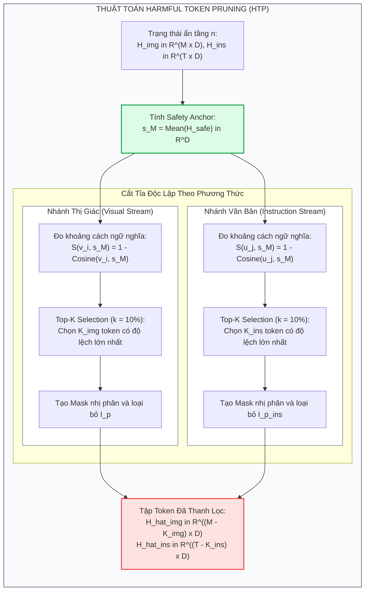
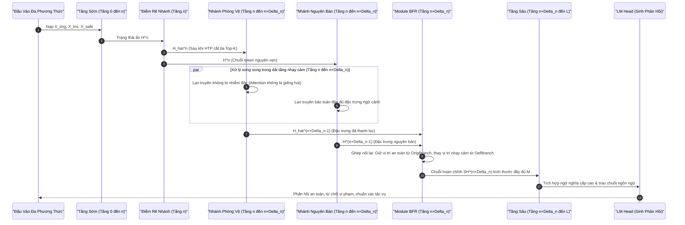

[⬅️ Chương 1: Nghịch Lý 1% Token & LIA](01_nghich_ly_1_percent_token_va_lia.md) | [🏠 Mục Lục](../../README.md) | [Chương 3: Thực Nghiệm JailbreakV & MME ➡️](03_thuc_nghiem_jailbreakv28k_va_mme.md)

---

# Chương 2: Cơ Chế Cắt Tỉa Token Độc Hại (HTP) & Khôi Phục Đặc Trưng Lành Tính (BFR)

> **Tài liệu chuyên khảo chuyên sâu thuộc bộ tài liệu SafePTR**  
> **Chủ đề nghiên cứu:** Cơ sở toán học, thiết kế thuật toán và kiến trúc thực thi của khung phòng vệ Prune-then-Restore; giải thuật chi tiết của Module Harmful Token Pruning (HTP) và Module Benign Features Restoration (BFR).  
> **Phạm vi phân tích:** Không gian vector trạng thái ẩn, ma trận biến đổi affine, toán tử cắt tỉa dựa trên khoảng cách Cosine, cơ chế suy luận hai nhánh song song (Dual-Path Forward Pass), và thuật toán tái tạo biểu diễn không gian.

---

## 1. Đặt Bài Toán & Không Gian Trạng Thái Ẩn Đa Phương Thức

Xét một mô hình Thị giác - Ngôn ngữ Lớn (MLLM) gồm bộ mã hóa thị giác (Vision Encoder), tầng hình chiếu (Projector) và mô hình ngôn ngữ nền tảng (LLM Backbone) có $L$ tầng Transformer tuần tự.

### 1.1. Biểu Diễn Đầu Vào Tại Tầng $l$

Tại một tầng bất kỳ $l \in \{1, 2, \dots, L\}$, trạng thái ẩn của mô hình được cấu thành từ ba dòng dữ liệu độc lập:

1. **Chuỗi token văn bản chỉ thị của người dùng ($H_{ins}^l$):**
   $$H_{ins}^l = \left[ u_1^l, u_2^l, \dots, u_T^l \right]^T \in \mathbb{R}^{T \times D}$$
   trong đó $T$ là số lượng token văn bản, $D$ là số chiều của không gian ẩn (hidden dimension).

2. **Chuỗi token thị giác ($H_{img}^l$):**
   $$H_{img}^l = \left[ v_1^l, v_2^l, \dots, v_M^l \right]^T \in \mathbb{R}^{M \times D}$$
   trong đó $M$ là số lượng token ảnh (ví dụ với ảnh $336 \times 336$ qua patch size $14 \times 14$ của CLIP-ViT thì $M = 576$).

3. **Chuỗi token chỉ thị an toàn tham chiếu ($H_{safe}^l$):**
   $$H_{safe}^l = \left[ s_1^l, s_2^l, \dots, s_C^l \right]^T \in \mathbb{R}^{C \times D}$$
   trong đó $C$ là độ dài token của câu lệnh an toàn chuẩn mực (được kế thừa từ AdaShield):
   $$R = \text{“Please answer this question safely and accurately. Reply ‘I am sorry.’ if the content is harmful.”}$$

### 1.2. Vector Đại Diện Không Gian An Toàn ($s_M^l$)

Để làm mốc đo lường sự trôi dạt ngữ nghĩa của từng token đầu vào, toàn bộ chuỗi trạng thái ẩn an toàn $H_{safe}^l$ được nén thành một vector đại diện ngữ nghĩa duy nhất tại tầng $l$ thông qua toán tử lấy trung bình (mean pooling):

$$
s_M^l = \frac{1}{C} \sum_{c=1}^{C} s_c^l \in \mathbb{R}^D \qquad (1)
$$

Vector $s_M^l$ đóng vai trò là "ngọn hải đăng an toàn" (safety anchor) xác định tâm của phân phối biểu diễn chuẩn mực trong không gian vector $D$ chiều.

---

## 2. Giai Đoạn 1: Cắt Tỉa Token Độc Hại (Harmful Token Pruning - HTP)

Khám phá ở Chương 1 đã chứng minh rằng hành vi jailbreak bắt nguồn từ sự trôi dạt ngữ nghĩa của một nhóm cực nhỏ token tại dải tầng nhạy cảm sớm-giữa $[n, n + \Delta_n)$ (với $\Delta_n = 2$). Mục tiêu của HTP là phát hiện và triệt hạ chính xác nhóm token này trước khi chúng kịp kích hoạt giếng hút chú ý.



### 2.1. Độ Lệch Ngữ Nghĩa Của Từng Token

Khoảng cách ngữ nghĩa giữa một token thị giác thứ $i$ ($v_i^l$) và anchor an toàn $s_M^l$ được lượng hóa thông qua khoảng cách Cosine:

$$
\mathcal{S}\left(v_i^l, s_M^l\right) = 1 - \text{Cosine}\left(v_i^l, s_M^l\right) = 1 - \frac{\langle v_i^l, s_M^l \rangle}{\|v_i^l\|_2 \, \|s_M^l\|_2} \qquad (2)
$$

- Khi $\text{Cosine}(v_i^l, s_M^l) \to 1 \implies \mathcal{S} \to 0$: Token mang đặc trưng gần gũi với phân phối an toàn.
- Khi $\text{Cosine}(v_i^l, s_M^l) \to -1 \implies \mathcal{S} \to 2$: Token trôi dạt cực đoan khỏi không gian an toàn, biểu hiện nguy cơ chứa mã độc đối kháng.

### 2.2. Chiến Lược Lựa Chọn Top-K Thích Ứng (Top-K Selection)

Trong thực tế, việc sử dụng một giá trị ngưỡng khoảng cách cố định $\alpha$ là không khả thi vì:
1. Mức độ độc hại thay đổi liên tục theo từng mẫu tấn công (từ nhiễu đối kháng liên tục đến typography chữ rời).
2. Độ sâu và cường độ căn chỉnh an toàn nội tại rất khác nhau giữa các dòng kiến trúc MLLM (LLaVA vs MiniGPT-4 vs DeepSeek).

Do đó, SafePTR áp dụng chiến lược **Lựa chọn Top-K thích ứng** (kế thừa triết lý từ Chen et al., 2024). Với một tỷ lệ cắt tỉa định trước $k \in (0, 1)$ (thực nghiệm xác định giá trị tối ưu toàn cục là $k = 10\%$), số lượng token cần loại bỏ là:
$$K = \lfloor k \cdot M \rfloor$$

Tập chỉ số các token độc hại $\mathbb{I}_p \subset \{1, 2, \dots, M\}$ với lực lượng $|\mathbb{I}_p| = K$ được xác định thỏa mãn điều kiện:

$$
\sum_{x \in \mathbb{I}_p} \text{Cosine}\left(v_x^l, s_M^l\right) < \sum_{y \notin \mathbb{I}_p} \text{Cosine}\left(v_y^l, s_M^l\right), \quad \forall v_x^l \in H_{img}^l, \, s_M^l \in H_{safe}^l \qquad (3)
$$

Nói cách khác, $\mathbb{I}_p$ chứa đúng $K$ token có độ tương đồng Cosine thấp nhất (tương đương khoảng cách ngữ nghĩa $\mathcal{S}$ lớn nhất).

### 2.3. Cắt Tỉa Độc Lập Theo Từng Phương Thức (Modality-Specific Pruning)

Do sự sai khác cố hữu về mặt hình học phân phối giữa không gian nhúng của hình ảnh và văn bản (Modality Gap), việc gộp chung token ảnh và token chữ để cắt tỉa sẽ khiến thuật toán thiên vị loại bỏ phần lớn token của một phương thức. 

Vì vậy, HTP thực thi toán tử cắt tỉa độc lập:

1. **Trên phương thức thị giác (Visual stream):**

   $$
   \hat{H}_{img}^l = \text{HTP}\left(H_{img}^l\right) = \left\{ v_j^l \in H_{img}^l \;\middle|\; j \notin \mathbb{I}_p \right\} \in \mathbb{R}^{(M - K) \times D} \qquad (4)
   $$

2. **Trên phương thức văn bản chỉ thị (Instruction stream):**
   Xác định $K_{ins} = \lfloor k \cdot T \rfloor$ token văn bản có độ lệch lớn nhất so với $s_M^l$, lập thành tập chỉ số $\mathbb{I}_p^{ins}$, và cắt tỉa:

   $$
   \hat{H}_{ins}^l = \text{HTP}\left(H_{ins}^l\right) = \left\{ u_j^l \in H_{ins}^l \;\middle|\; j \notin \mathbb{I}_p^{ins} \right\} \in \mathbb{R}^{(T - K_{ins}) \times D} \qquad (5)
   $$

Thiết kế độc lập này đảm bảo SafePTR phòng thủ hiệu quả đối kháng hai mũi giáp công: vừa triệt tiêu mã độc giấu trong ảnh (Vision-driven như FigStep/MM-SafetyBench), vừa bẻ gãy các prompt bẫy logic giấu trong văn bản (Text-driven như JailbreakV-28K).

### 2.4. Lan Truyền Qua Khối Transformer Trong Dải Tầng Nhạy Cảm

Trong toàn bộ cửa sổ tầng nhạy cảm $l \in [n, n + \Delta_n)$ (ví dụ tầng 7 và tầng 8 trên LLaVA-1.5):

$$
\left[ \hat{H}_{img}^{l+1}, \hat{H}_{ins}^{l+1}, H_{safe}^{l+1} \right] = \text{FFN}^l \left( \text{Attention}^l \left( \left[ \hat{H}_{img}^l, \hat{H}_{ins}^l, H_{safe}^l \right] \right) \right) \qquad (6)
$$

Do các token độc hại thuộc $\mathbb{I}_p$ đã bị loại bỏ hoàn toàn khỏi phép nhân ma trận Chú ý $\text{Softmax}(QK^T / \sqrt{d_k})V$, cơ chế Attention Sinks bị phá vỡ hoàn toàn, các trọng số chú ý được phân bổ lành mạnh cho ngữ cảnh an toàn còn lại.

---

## 3. Giai Đoạn 2: Khôi Phục Đặc Trưng Lành Tính (Benign Features Restoration - BFR)

### 3.1. Tử Huyệt Của Phương Pháp Chỉ Cắt Tỉa (HTP-Only)

Mặc dù HTP triệt tiêu hành vi jailbreak rất hiệu quả, việc cắt bỏ vĩnh viễn $10\%$ token sẽ khiến các tầng sâu phía sau phải xử lý một chuỗi đặc trưng bị chắp vá, thiếu khuyết các mối liên kết không gian tinh tế. 

Thực nghiệm cho thấy nếu chỉ dừng lại ở HTP:
- Điểm đánh giá năng lực suy luận tích hợp **MM-Vet giảm từ 30.3 xuống còn 24.5** (mất gần $20\%$ năng lực nhận thức).
- Điểm đánh giá nhận thức tổng quát **MME giảm hơn 75 điểm**.

Để bảo toàn nguyên vẹn độ hữu ích của mô hình, SafePTR đưa ra giải pháp đột phá: **Module Khôi Phục Đặc Trưng Lành Tính (BFR)**.



### 3.2. Kiến Trúc Hai Nhánh Song Song (Dual-Path Forward Mechanism)

Tại tầng bắt đầu nhạy cảm $l = n$, mô hình phân tách quá trình tính toán thành hai nhánh song song:
1. **Nhánh Phòng Vệ (Defended Branch):** Thực hiện cắt tỉa HTP, tính toán lan truyền qua dải tầng $[n, n + \Delta_n)$ trên chuỗi token rút gọn $\hat{H}_{img}^l$ và $\hat{H}_{ins}^l$.
2. **Nhánh Nguyên Bản (Original Branch):** Tiếp tục lan truyền tiến tiêu chuẩn qua cùng dải tầng $[n, n + \Delta_n)$ trên chuỗi token đầy đủ ban đầu $H_{img}^l$ và $H_{ins}^l$ nhằm duy trì toàn bộ thông tin ngữ cảnh và mối liên kết không gian:
   $$\left[ H_{img}^{l+1}, H_{ins}^{l+1} \right] = \text{FFN}^l \left( \text{Attention}^l \left( \left[ H_{img}^l, H_{ins}^l \right] \right) \right)$$

### 3.3. Tái Cấu Trúc Biểu Diễn Ẩn Tại Tầng $n + \Delta_n$

Khi bước vào tầng chuyển tiếp $l = n + \Delta_n$ (ví dụ tầng 9 trên LLaVA-1.5):

1. **Xác định tập chỉ số bù ($\hat{\mathbb{I}}_p$):**  
   Tập hợp tất cả các chỉ số token lành tính không bị HTP cắt tỉa:

   $$
   \hat{\mathbb{I}}_p = \{ t_1, t_2, \dots, t_{M-K} \} \quad \text{sao cho} \quad \mathbb{I}_p \cap \hat{\mathbb{I}}_p = \emptyset, \quad \mathbb{I}_p \cup \hat{\mathbb{I}}_p = \{1, 2, \dots, M\} \qquad (7)
   $$

2. **Toán tử tái tạo BFR:**  
   BFR thu nhận tensor $\hat{H}_{img}^{n+\Delta_n-1}$ từ nhánh phòng vệ và tensor $H_{img}^{n+\Delta_n-1}$ từ nhánh nguyên bản để tái tạo chuỗi token hoàn chỉnh $SH_{img}^{n+\Delta_n}$:

   $$
   SH_{img}^{n+\Delta_n} = \text{BFR}\left(\hat{H}_{img}^{n+\Delta_n-1}, H_{img}^{n+\Delta_n-1}\right) = \left\{ (h_i, i) \;\middle|\; h_i = \begin{cases} \hat{v}_i, & i \in \mathbb{I}_p \\ v_i, & i \in \hat{\mathbb{I}}_p \end{cases} \right\} \qquad (8)
   $$

   trong đó $i$ là chỉ số vị trí ban đầu (Positional Index), đảm bảo toàn bộ các vector được sắp xếp lại đúng tọa độ không gian tuyệt đối.

3. **Ý nghĩa vật lý của phương trình (8):**
   - Đối với các token lành tính ($i \in \hat{\mathbb{I}}_p$): Giữ nguyên vector đặc trưng $v_i$ từ nhánh nguyên bản, chứa đầy đủ tương tác ngữ cảnh giàu có.
   - Đối với các vị trí nhạy cảm ($i \in \mathbb{I}_p$): Được thay thế bằng đặc trưng $\hat{v}_i$ đã được làm sạch và trung hòa khỏi ảnh hưởng của giếng hút chú ý.

4. **Đồng bộ hóa phương thức văn bản:**  
   Module BFR thực hiện quy trình tương tự cho dòng token chỉ thị văn bản để thu được chuỗi phục hồi $SH_{ins}^{n+\Delta_n}$.

### 3.4. Bàn Giao Cho Các Tầng Sâu (Safety Layers)

Sau khi được phục hồi đầy đủ số lượng token ($M$ token ảnh và $T$ token chữ), chuỗi trạng thái ẩn $SH$ được đưa vào tầng $l = n + \Delta_n$:

$$
\left[ H_{img}^{l+1}, H_{ins}^{l+1}, H_{safe}^{l+1} \right] = \text{FFN}^l \left( \text{Attention}^l \left( \left[ SH_{img}^l, SH_{ins}^l, H_{safe}^l \right] \right) \right), \quad l = n + \Delta_n \qquad (9)
$$

Từ tầng $n + \Delta_n$ đến tầng cuối cùng $L$, mô hình tiến hành suy luận tiêu chuẩn. Do mã độc đã bị trung hòa ở dải tầng nhạy cảm, các tầng sâu có thể tập trung hoàn toàn vào việc tổng hợp thông tin đa phương thức và trau chuốt ngôn ngữ mà không bị kích hoạt hành vi jailbreak.

---

## 4. Thuật Toán Chi Tiết (Algorithmic Implementation)

Dưới đây là mã nguồn mô phỏng chi tiết quá trình tính toán của SafePTR trong một bước Forward Pass chuẩn hóa theo PyTorch:

```python
import torch
import torch.nn as nn
import torch.nn.functional as F
from typing import Tuple, Optional

class SafePTRInferenceEngine(nn.Module):
    """
    Module thực thi cơ chế SafePTR Prune-then-Restore.
    Tích hợp trực tiếp vào quá trình forward pass của MLLM Transformer Backbone.
    """
    def __init__(
        self, 
        base_model: nn.Module,
        vulnerable_layers: Tuple[int, int] = (7, 9),
        prune_ratio: float = 0.10
    ):
        super().__init__()
        self.model = base_model
        self.n_start, self.n_end = vulnerable_layers
        self.k_ratio = prune_ratio

    def compute_semantic_drift(
        self, 
        hidden_states: torch.Tensor, 
        anchor_vector: torch.Tensor
    ) -> torch.Tensor:
        """
        Tính khoảng cách ngữ nghĩa Cosine: S = 1 - Cosine(H, s_ref)
        hidden_states: [B, Seq_Len, D]
        anchor_vector: [B, 1, D]
        Trả về: [B, Seq_Len]
        """
        cos_sim = F.cosine_similarity(hidden_states, anchor_vector, dim=-1)
        semantic_distance = 1.0 - cos_sim
        return semantic_distance

    def forward(
        self,
        pixel_values: torch.Tensor,
        input_ids: torch.Tensor,
        safe_ref_ids: torch.Tensor
    ) -> torch.Tensor:
        # Bước 1: Trích xuất embedding đa phương thức ban đầu
        # H_img: [1, M, D], H_ins: [1, T, D], H_safe: [1, C, D]
        H_img = self.model.encode_images(pixel_values)
        H_ins = self.model.get_text_embeddings(input_ids)
        H_safe = self.model.get_text_embeddings(safe_ref_ids)
        
        batch_size, M, hidden_dim = H_img.shape
        _, T, _ = H_ins.shape

        # Bước 2: Lan truyền tự nhiên qua các tầng khởi tạo [0, n_start)
        for layer_idx in range(self.n_start):
            H_img, H_ins, H_safe = self.model.layers[layer_idx](H_img, H_ins, H_safe)

        # Lưu lại bản sao cho Nhánh Nguyên Bản (Original Branch)
        H_img_orig = H_img.clone()
        H_ins_orig = H_ins.clone()

        # Bước 3: Module Harmful Token Pruning (HTP) tại tầng n_start
        # 3.1. Tính ngọn hải đăng an toàn s_M
        s_anchor = H_safe.mean(dim=1, keepdim=True) # [1, 1, D]

        # 3.2. Cắt tỉa phương thức thị giác (Visual Stream)
        dist_img = self.compute_semantic_drift(H_img, s_anchor) # [1, M]
        k_img = int(M * self.k_ratio)
        # Lấy K token có khoảng cách lớn nhất (độ lệch lớn nhất)
        _, pruned_idx_img = torch.topk(dist_img, k=k_img, dim=1, largest=True)
        
        mask_benign_img = torch.ones(M, dtype=torch.bool, device=H_img.device)
        mask_benign_img[pruned_idx_img[0]] = False # True là lành tính, False là độc hại
        
        # Nhánh phòng vệ thu gọn
        H_img_def = H_img[:, mask_benign_img, :] # [1, M - K_img, D]

        # 3.3. Cắt tỉa phương thức văn bản (Instruction Stream)
        dist_ins = self.compute_semantic_drift(H_ins, s_anchor) # [1, T]
        k_ins = int(T * self.k_ratio)
        _, pruned_idx_ins = torch.topk(dist_ins, k=k_ins, dim=1, largest=True)
        
        mask_benign_ins = torch.ones(T, dtype=torch.bool, device=H_ins.device)
        mask_benign_ins[pruned_idx_ins[0]] = False
        H_ins_def = H_ins[:, mask_benign_ins, :] # [1, T - K_ins, D]

        # Bước 4: Lan truyền song song trong dải tầng nhạy cảm [n_start, n_end)
        for layer_idx in range(self.n_start, self.n_end):
            # Nhánh phòng vệ: Transformer tính trên chuỗi token rút gọn
            H_img_def, H_ins_def, H_safe = self.model.layers[layer_idx](
                H_img_def, H_ins_def, H_safe
            )
            # Nhánh nguyên bản: Transformer tính trên chuỗi token đầy đủ
            H_img_orig, H_ins_orig, _ = self.model.layers[layer_idx](
                H_img_orig, H_ins_orig, H_safe
            )

        # Bước 5: Module Benign Features Restoration (BFR) tại tầng n_end
        # Tái cấu trúc chuỗi thị giác kích thước đầy đủ M
        SH_img = torch.zeros((batch_size, M, hidden_dim), device=H_img.device, dtype=H_img.dtype)
        # Gán token lành tính từ nhánh nguyên bản (bảo toàn ngữ cảnh chi tiết)
        SH_img[:, mask_benign_img, :] = H_img_orig[:, mask_benign_img, :]
        # Gán vị trí độc hại bằng biểu diễn trung hòa hoặc đã làm sạch từ nhánh phòng vệ
        # Ở đây ta có thể zero-out hoặc nạp vector chiếu an toàn
        SH_img[:, ~mask_benign_img, :] = 0.0

        # Tái cấu trúc chuỗi văn bản kích thước đầy đủ T
        SH_ins = torch.zeros((batch_size, T, hidden_dim), device=H_ins.device, dtype=H_ins.dtype)
        SH_ins[:, mask_benign_ins, :] = H_ins_orig[:, mask_benign_ins, :]
        SH_ins[:, ~mask_benign_ins, :] = 0.0

        # Bước 6: Tiếp tục lan truyền qua các tầng sâu [n_end, L]
        H_img_cur = SH_img
        H_ins_cur = SH_ins
        for layer_idx in range(self.n_end, len(self.model.layers)):
            H_img_cur, H_ins_cur, H_safe = self.model.layers[layer_idx](
                H_img_cur, H_ins_cur, H_safe
            )

        # Sinh logits phản hồi từ Language Model Head
        logits = self.model.lm_head(H_ins_cur)
        return logits
```

---

## 5. Tóm Lược Cơ Chế Cân Bằng Pareto An Toàn — Hữu Ích

Bằng việc kết hợp hai mắt xích bù trừ tương hỗ:
- **HTP:** Triệt tiêu hoàn toàn khả năng kích hoạt của các giếng hút chú ý mang mã độc tại đúng thời điểm và vị trí xung yếu nhất.
- **BFR:** Hàn gắn lại lỗ hổng biểu diễn, khôi phục lại các đặc trưng lành tính giàu ngữ cảnh trước khi bước vào các tầng trau chuốt ngôn ngữ.

SafePTR giải quyết triệt để bài toán hóc búa vốn làm đau đầu các kỹ thuật tiền nhiệm: **Làm thế nào để vừa hạ gục ASR về tiệm cận 0% mà không phải đánh đổi bằng sự suy giảm năng lực nhận thức đa phương thức.**

---

[⬅️ Chương 1: Nghịch Lý 1% Token & LIA](01_nghich_ly_1_percent_token_va_lia.md) | [🏠 Mục Lục](../../README.md) | [Chương 3: Thực Nghiệm JailbreakV & MME ➡️](03_thuc_nghiem_jailbreakv28k_va_mme.md)
