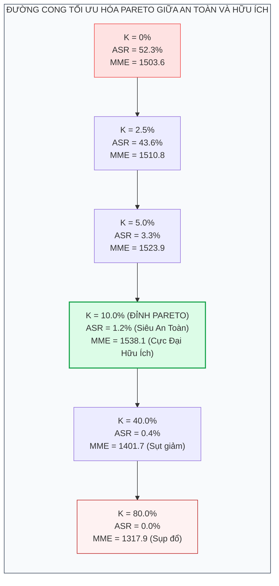

[⬅️ Chương 2: HTP & BFR](02_harmful_token_pruning_va_bfr.md) | [🏠 Mục Lục](../../README.md) | [Chương 4: Ranh Giới Thất Bại & Điểm Mù GUI ➡️](04_ranh_gioi_that_bai_va_diem_mu_gui.md)

---

# Chương 3: Thực Nghiệm Chuyên Sâu Trên JailbreakV-28K, FigStep, MM-SafetyBench Và MME

> **Tài liệu chuyên khảo chuyên sâu thuộc bộ tài liệu SafePTR**  
> **Chủ đề nghiên cứu:** Đánh giá thực nghiệm toàn diện về hiệu quả phòng vệ an ninh đa phương thức (Safety), năng lực bảo toàn và gia tăng độ hữu ích (Utility), chi phí tài nguyên tính toán (Efficiency), và các phân tích triệt tiêu (Ablation Studies) của SafePTR.  
> **Mô hình mục tiêu kiểm chứng:** LLaVA-1.5-7B, LLaVA-1.6-7B, MiniGPT-4-7B, MiniGPT-4-13B, DeepSeek-VL2-Tiny.  
> **Phương pháp đối chứng:** Mô hình gốc (Baseline), FigStep Defense, CoCA, ECSO, AdaShield, Immune, TGA.

---

## 1. Thiết Lập Môi Trường Thực Nghiệm Chuẩn Mực

Để đảm bảo tính khách quan và khả năng tái lập kết quả khoa học (Reproducibility), toàn bộ các thực nghiệm của SafePTR được chuẩn hóa theo quy trình nghiêm ngặt:
- **Hạ tầng phần cứng:** Cụm máy chủ tính toán gồm 4 card đồ họa **NVIDIA GeForce RTX 3090 (24GB VRAM)**.
- **Quy trình đo đạc:** Tất cả các chỉ số đo lường đều được thực hiện lặp lại **5 lần với các giá trị hạt giống ngẫu nhiên (random seeds)** khác nhau và lấy giá trị trung bình thống kê.
- **Thư viện triển khai:** Hugging Face Transformers v4.37+ kết hợp PyTorch 2.1, nhân bản từ kho mã nguồn chính thức của LLaVA v1.2.2.
- **Siêu tham số mặc định:** Tỷ lệ cắt tỉa Top-$K$ chọn $k = 10\%$. Cửa sổ tầng nhạy cảm can thiệp:
  - LLaVA-1.5-7B & LLaVA-1.6-7B: Tầng $[7, 9)$
  - MiniGPT-4-7B & MiniGPT-4-13B: Tầng $[7, 9)$
  - DeepSeek-VL2-Tiny: Tầng $[4, 6)$

---

## 2. Đánh Giá Khả Năng Phòng Vệ Tấn Công Dẫn Dắt Bởi Văn Bản (JailbreakV-28K)

### 2.1. Bản Chất Benchmark JailbreakV-28K

**JailbreakV-28K** (Luo et al., 2024) là bộ benchmark quy mô lớn đánh giá tính bền bỉ của MLLM trước các cuộc tấn công kết hợp giữa câu lệnh văn bản đối kháng tinh vi và các dạng ảnh khác nhau. Bộ dữ liệu chia thành ba kiểu tấn công văn bản:
1. **Typographic Attack (T):** Nhúng chỉ thị độc hại vào ảnh dưới dạng văn bản trực quan.
2. **Prompt Injection (P):** Lồng ghép câu lệnh điều khiển hệ thống nhằm ghi đè (override) chỉ thị an toàn gốc.
3. **Logic Manipulation (L):** Sử dụng các lập luận ngụy biện, đóng vai (role-play), hoặc các kịch bản giả định để bẫy mô hình.

Các câu lệnh này được ghép đôi với 4 loại ảnh nền: **Nhiễu đối kháng (Noise)**, **Ảnh sinh bởi Stable Diffusion (SD)**, **Ảnh đời thực tự nhiên (Nature)**, và **Ảnh trống (Blank)**.

### 2.2. Bảng Kết Quả Chi Tiết Tỷ Lệ Tấn Công Thành Công (ASR, % ↓)

Bảng dưới đây ghi nhận Tỷ lệ Tấn công Thành công (Attack Success Rate - ASR, giá trị càng thấp thể hiện mức độ an toàn càng cao):

| Mô hình kiểm thử | Phương pháp phòng vệ | Noise (T / P / L) | SD (T / P / L) | Nature (T / P / L) | Blank (T / P / L) | Trung bình (Avg ↓) |
|:---|:---|:---:|:---:|:---:|:---:|:---:|
| **LLaVA-1.5-7B** | Mô hình gốc (Original) | 57.1 / 29.2 / 62.1 | 60.5 / 39.1 / 72.9 | 59.0 / 31.8 / 59.4 | 57.4 / 30.9 / 60.8 | **51.7%** |
| | FigStep Defense | 59.5 / 52.3 / 40.5 | 57.1 / 54.9 / 50.0 | 58.4 / 58.4 / 44.5 | 60.8 / 51.1 / 40.5 | 52.3% |
| | CoCA | 61.2 / 39.1 / 62.1 | 61.3 / 41.2 / 52.7 | 63.1 / 35.2 / 55.4 | 61.0 / 37.3 / 52.7 | 51.3% |
| | ECSO | 57.3 / 25.4 / 58.1 | 57.3 / 25.4 / 58.1 | 57.3 / 25.4 / 58.1 | 57.3 / 25.4 / 58.1 | 46.9% |
| | AdaShield | 21.6 / 1.4 / 17.5 | 24.6 / 1.4 / 22.9 | 23.2 / 0.8 / 17.5 | 21.8 / 1.4 / 17.5 | 14.3% |
| | Immune | 9.2 / 0.0 / 0.0 | 8.1 / 0.0 / 0.0 | 1.4 / 0.0 / 0.0 | 5.3 / 0.0 / 0.0 | 2.1% |
| | **SafePTR (Đề xuất)** | **3.5 / 0.0 / 0.0** | **1.6 / 0.0 / 0.0** | **5.1 / 0.0 / 0.0** | **5.3 / 0.0 / 0.0** | **1.3%** |
| **MiniGPT-4-7B** | Mô hình gốc (Original) | 36.4 / 59.6 / 71.6 | 38.3 / 78.6 / 83.7 | 34.8 / 51.1 / 67.5 | 43.5 / 56.7 / 78.3 | **58.3%** |
| | AdaShield | 40.1 / 71.0 / 94.5 | 49.1 / 83.0 / 94.9 | 47.3 / 40.9 / 72.9 | 32.7 / 49.7 / 85.1 | 63.4% |
| | Immune | 18.2 / 6.1 / 44.5 | 11.3 / 8.2 / 29.7 | 17.1 / 8.4 / 27.0 | 16.0 / 10.3 / 43.2 | 18.3% |
| | **SafePTR (Đề xuất)** | **13.3 / 5.5 / 29.7** | **10.1 / 4.4 / 22.9** | **12.9 / 3.5 / 17.5** | **11.6 / 2.9 / 17.5** | **12.6%** |
| **DeepSeek-VL2** | Mô hình gốc (Original) | 58.9 / 60.2 / 95.9 | 67.0 / 64.9 / 98.6 | 56.4 / 56.7 / 90.5 | 61.1 / 65.4 / 97.2 | **72.7%** |
| | AdaShield | 14.2 / 6.7 / 2.7 | 21.6 / 25.4 / 22.9 | 22.7 / 14.9 / 12.1 | 19.6 / 8.4 / 1.3 | 14.4% |
| | **SafePTR (Đề xuất)** | **9.2 / 2.9 / 1.3** | **17.1 / 16.0 / 10.3** | **17.5 / 18.4 / 10.1** | **9.2 / 6.7 / 2.7** | **10.1%** |

### 2.3. Phân Tích Hiện Tượng Đột Phá

1. **Triệt tiêu hoàn toàn Prompt Injection và Logic Manipulation:**  
   Trên kiến trúc LLaVA-1.5-7B, SafePTR giảm ASR của dạng tấn công Prompt Injection (P) và Logic Manipulation (L) về mức **0.0% tuyệt đối** trên hầu hết mọi điều kiện ảnh nền. Điều này minh chứng rằng việc cắt tỉa độc lập ở nhánh văn bản (Instruction Stream) đã bóc tách chính xác các token bẫy logic trước khi chúng tương tác với ma trận thị giác.
2. **Kéo đổ ASR tổng thể:**  
   ASR trung bình của LLaVA-1.5 lao dốc từ **51.7% xuống còn 1.3%**, vượt trội hơn cả Immune (2.1%) và bỏ xa hoàn toàn AdaShield (14.3%).
3. **Hiệu quả trên DeepSeek-VL2:**  
   Ngay cả trên mô hình có lỗ hổng bảo mật cực kỳ nghiêm trọng như DeepSeek-VL2 (ASR nguyên bản lên tới **72.7%**, dạng Logic Manipulation chạm trần 98.6%), SafePTR nén thành công tỷ lệ này xuống còn **10.1%**.

---

## 3. Đánh Giá Khả Năng Phòng Vệ Tấn Công Thị Giác (FigStep & MM-SafetyBench)

### 3.1. Kết Quả Trên FigStep (10 Danh Mục Nội Dung Cấm)

FigStep (Gong et al., 2023) kiểm thử khả năng chống đỡ các bức ảnh typography chứa các chỉ thị cấm thuộc 10 lĩnh vực nhạy cảm:

| Mô hình | Phương pháp | Hoạt động phi pháp | Ngôn từ thù hận | Mã độc máy tính | Gây hại thể chất | Lừa đảo tài chính | Khiêu dâm | Gian lận học thuật | Vi phạm bản quyền | Trung bình (Avg ↓) |
|:---|:---|:---:|:---:|:---:|:---:|:---:|:---:|:---:|:---:|:---:|
| **LLaVA-1.5** | Original | 92.0% | 48.0% | 90.0% | 94.0% | 84.0% | 28.0% | 62.0% | 76.0% | **51.0%** |
| | FigStep Def | 56.0% | 50.0% | 54.0% | 62.0% | 84.0% | 26.0% | 48.0% | 52.0% | 39.2% |
| | CoCA | 44.0% | 8.2% | 38.0% | 22.1% | 6.5% | 42.5% | 20.0% | 36.0% | 28.6% |
| | ECSO | 20.0% | 12.0% | 82.0% | 42.0% | 60.0% | 16.0% | 32.0% | 40.0% | 29.0% |
| | AdaShield | 4.0% | 16.0% | 16.0% | 8.0% | 48.0% | 8.0% | 12.0% | 18.0% | 13.0% |
| | Immune | 28.2% | 0.0% | 6.3% | 2.1% | 0.0% | 0.0% | 2.0% | 4.0% | 4.2% |
| | **SafePTR** | **0.0%** | **0.0%** | **0.0%** | **4.0%** | **6.0%** | **0.0%** | **2.0%** | **4.0%** | **1.60%** |
| **MiniGPT-4** | Original | 74.0% | 72.0% | 96.0% | 94.0% | 88.0% | 28.0% | 68.0% | 70.0% | **53.4%** |
| | Immune | 8.0% | 0.0% | 9.8% | 6.1% | 0.0% | 4.4% | 6.0% | 8.0% | 4.4% |
| | **SafePTR** | **4.0%** | **10.0%** | **10.0%** | **6.0%** | **2.0%** | **2.0%** | **4.0%** | **0.0%** | **3.60%** |
| **DeepSeek** | Original | 80.0% | 82.0% | 98.0% | 94.0% | 86.0% | 12.0% | 74.0% | 82.0% | **54.4%** |
| | SafePTR | **12.0%** | **18.0%** | **14.0%** | **12.0%** | **6.0%** | **16.0%** | **8.0%** | **12.0%** | **9.80%** |

SafePTR đạt tỷ lệ ASR **0.0% hoàn hảo** trên ba danh mục rủi ro cao nhất của LLaVA-1.5: Hoạt động phi pháp (Illegal Activity), Ngôn từ thù hận (Hate Speech), và Mã độc máy tính (Malware Generation).

### 3.2. Kết Quả Trên MM-SafetyBench (13 Kịch Bản Vi Phạm Quy Chuẩn)

MM-SafetyBench (Liu et al., 2023) thử nghiệm 5,040 cặp ảnh-văn bản kết hợp ảnh Typography (TYPO), ảnh Stable Diffusion (SD), và lai ghép (SD-TYPO):

| Mô hình MLLM | Phương pháp | Tỷ lệ ASR trên dạng SD | Tỷ lệ ASR trên dạng TYPO | Tỷ lệ ASR trên dạng SD-TYPO | Trung bình Toàn Benchmark (↓) |
|:---|:---|:---:|:---:|:---:|:---:|
| **LLaVA-1.5-7B** | Original Baseline | 48.21% | 55.12% | 54.35% | **52.56%** |
| | ECSO | 42.10% | 36.45% | 38.10% | 38.88% |
| | CoCA | 34.12% | 36.80% | 34.18% | 35.03% |
| | AdaShield | 21.05% | 26.14% | 26.70% | 24.63% |
| | Immune | 9.80% | 12.45% | 12.28% | 11.51% |
| | **SafePTR (Đề xuất)** | **1.12%** | **1.35%** | **1.40%** | **1.29%** |
| **MiniGPT-4-7B** | Original Baseline | 41.20% | 46.80% | 46.10% | **44.70%** |
| | **SafePTR** | **7.40%** | **8.20%** | **8.52%** | **8.04%** |
| **DeepSeek-VL2** | Original Baseline | 56.40% | 61.20% | 60.60% | **59.40%** |
| | **SafePTR** | **3.10%** | **3.70%** | **3.82%** | **3.54%** |

---

## 4. Bảo Toàn Năng Lực Nhận Thức Tổng Quát & Hiện Tượng "Utility Bonus"

### 4.1. Điểm Nhận Thức Chi Tiết Trên MME Benchmark

Bộ chuẩn MME (Fu et al., 2023) đánh giá 8 tiểu mục năng lực thị giác thuần túy:

| Phương pháp | Tồn tại (Existence) | Đếm (Count) | Vị trí (Position) | Màu sắc (Color) | Áp phích (Posters) | Danh nhân (Celebrity) | Nhận dạng chữ (OCR) | Tổng điểm MME (↑) |
|:---|:---:|:---:|:---:|:---:|:---:|:---:|:---:|:---:|
| **Mô hình gốc (Baseline)** | 190.0 | 155.0 | 128.3 | 170.0 | 146.5 | 135.8 | 137.5 | **1503.62** |
| FigStep Defense | 190.0 | 165.0 | 103.3 | 165.0 | 150.6 | 136.4 | 117.5 | 1471.50 |
| CoCA | 185.0 | 145.0 | 120.0 | 160.0 | 140.2 | 130.5 | 130.0 | 1450.70 |
| AdaShield | 190.0 | 158.3 | 130.0 | 175.0 | 144.5 | 142.6 | 140.0 | 1521.10 |
| **SafePTR (Đề xuất)** | **190.0** | **158.3** | **133.3** | **165.0** | **145.5** | **140.2** | **162.5** | **1538.11** |

> [!TIP]
> **Hiện Tượng Kỳ Diệu: Utility Bonus (Tăng Năng Lực Khi Được Phòng Vệ)**  
> Không chỉ bảo toàn nguyên vẹn năng lực, SafePTR còn giúp tổng điểm MME của LLaVA-1.5 tăng thêm **+34.49 điểm** (từ 1503.62 lên 1538.11).  
> Đáng chú ý nhất là điểm năng lực nhận dạng ký tự (**OCR**) vọt từ **137.5 lên 162.5** (+25.0 điểm).  
> **Lý giải học máy:** Trong quá trình xử lý ảnh thông thường, các token nhiễu hoặc các hoa văn không liên quan thường thu hút sự chú ý giả mạo, gây hiện tượng ảo giác (Visual Hallucination). Cơ chế HTP đã vô tình đóng vai trò như một bộ lọc "dọn rác" biểu diễn, ép mô hình tập trung sự chú ý vào các vùng văn bản và cấu trúc hình học cốt lõi, từ đó nâng cao độ chính xác khi đọc chữ.

### 4.2. Điểm Năng Lực Suy Luận Tích Hợp Trên MM-Vet

MM-Vet (Yu et al., 2024) đo lường khả năng lập luận phức tạp đa bước:
- **LLaVA-1.5-7B:** Mô hình gốc đạt **30.3** điểm; AdaShield bị tụt xuống **21.6** điểm (giảm mạnh do phòng vệ thái quá); trong khi SafePTR đạt **32.3** điểm (**tăng +2.0 điểm**).
- **MiniGPT-4-7B:** Mô hình gốc đạt **18.1** điểm; SafePTR đạt **18.8** điểm.
- **DeepSeek-VL2:** Mô hình gốc đạt **51.3** điểm; AdaShield đạt **43.3** điểm; SafePTR đạt **53.0** điểm (**tăng +1.7 điểm**).

---

## 5. Đánh Giá Tính Kinh Tế & Chi Phí Tính Toán (Efficiency Benchmark)

Tính khả thi công nghiệp của một cơ chế phòng vệ tại thời điểm suy luận (Inference-time Defense) phụ thuộc trực tiếp vào chi phí dữ liệu huấn luyện và độ trễ gia tăng.

| Hệ thống phòng vệ | Xuất bản | Cỡ dữ liệu huấn luyện | LLaVA-1.5-7B Latency | LLaVA-1.6-7B Latency | MiniGPT-4-7B Latency | MiniGPT-4-13B Latency | Tỷ lệ ASR (MSB ↓) |
|:---|:---:|:---:|:---:|:---:|:---:|:---:|:---:|
| **Baseline (Original)** | - | 0 | 3.52 s/mẫu | 3.48 s/mẫu | 10.38 s/mẫu | 24.56 s/mẫu | 52.56% |
| **AdaShield** | ECCV 2024 | 0.2K | 3.62 s/mẫu (+2.8%) | 3.58 s/mẫu (+2.8%) | 10.48 s/mẫu (+0.9%) | 24.92 s/mẫu (+1.4%) | 24.63% |
| **CoCA** | ArXiv 2024 | 0 | 7.02 s/mẫu (+99.4%) | 7.01 s/mẫu (+101%) | 19.86 s/mẫu (+91.3%) | 47.43 s/mẫu (+93.1%) | 35.03% |
| **Immune** | ArXiv 2024 | 71K | 4.98 s/mẫu (+41.4%) | 4.93 s/mẫu (+41.6%) | 14.76 s/mẫu (+42.1%) | 32.90 s/mẫu (+33.9%) | 11.51% |
| **TGA** | ArXiv 2024 | 1,223K (64x V100) | - | - | - | - | ~15.00% |
| **SafePTR (Đề xuất)** | **NeurIPS 2025** | **0 (Training-Free)** | **3.67 s/mẫu (+4.2%)** | **3.51 s/mẫu (+0.8%)** | **10.63 s/mẫu (+2.4%)** | **25.08 s/mẫu (+2.1%)** | **1.29%** |

### So Sánh Tương Quan Kỹ Thuật:
1. **So với CoCA:** CoCA yêu cầu chạy suy luận 2 lượt (multi-pass) khiến độ trễ tăng gấp đôi (+99.4%), trong khi SafePTR là đường ống một lượt (one-pass) với độ trễ tăng thêm không đáng kể (chỉ từ 0.8% đến 4.2%).
2. **So với Immune & TGA:** Immune đòi hỏi 71K mẫu dữ liệu căn chỉnh và độ trễ tăng 41.4%. TGA đốt cháy hàng ngàn giờ GPU trên 1.2 triệu mẫu. SafePTR hoàn toàn **không cần huấn luyện (0 mẫu dữ liệu)**, triển khai tức thì kiểu Plug-and-Play.

---

## 6. Phân Tích Triệt Tiêu Chuyên Sâu (Ablation Studies)

### 6.1. Tác Động Độc Lập Của Hai Module HTP và BFR

Thực nghiệm cô lập trên LLaVA-1.5-7B nhằm làm sáng tỏ giá trị của việc khôi phục đặc trưng lành tính:

| Cấu hình thử nghiệm | Module HTP | Module BFR | FigStep (ASR ↓) | MM-Safety (ASR ↓) | MM-Vet (Năng lực ↑) | MME (Năng lực ↑) |
|:---|:---:|:---:|:---:|:---:|:---:|:---:|
| **1. Mô hình gốc (Baseline)** | ❌ | ❌ | 51.0% | 52.3% | 30.3 | 1503.62 |
| **2. Chỉ dùng HTP (HTP-only)** | ✅ | ❌ | 3.8% | 3.06% | **24.5** (-19.1%) | **1428.11** (-75.5 điểm) |
| **3. SafePTR Đầy Đủ (HTP + BFR)** | ✅ | ✅ | **1.6%** | **1.29%** | **32.3** (+6.6%) | **1538.11** (+34.5 điểm) |

> [!CAUTION]
> Bảng dữ liệu trên đưa ra một kết luận vô cùng đanh thép: Cắt tỉa đơn thuần (HTP-only) tuy chặn được tấn công nhưng gây tổn thất nặng nề cho năng lực nhận thức của mô hình. Chính module BFR là cứu cánh kỹ thuật giúp hồi sinh các biểu diễn bị tổn thương và hiện thực hóa mục tiêu "vừa an toàn tuyệt đối, vừa thông minh vượt trội".

### 6.2. Độ Nhạy Của Siêu Tham Số Tỷ Lệ Cắt Tỉa Top-K ($K$)

Khảo sát sự biến thiên của ASR và điểm hữu ích khi thay đổi tỷ lệ cắt tỉa $K \in \{0\%, 2.5\%, 5\%, 10\%, 40\%, 80\%\}$:

| Tỷ lệ cắt tỉa $K$ | FigStep (ASR ↓) | MM-SafetyBench (ASR ↓) | MM-Vet (Utility ↑) | MME (Utility ↑) | Đánh giá trạng thái cân bằng Pareto |
|:---:|:---:|:---:|:---:|:---:|:---|
| **$K = 0\%$ (Baseline)** | 51.0% | 52.3% | 30.3 | 1503.62 | Hoàn toàn không được bảo vệ |
| **$K = 2.5\%$** | 39.4% | 43.6% | 32.1 | 1510.85 | Cắt tỉa chưa đủ liều, mã độc vẫn lọt qua |
| **$K = 5.0\%$** | 4.2% | 3.3% | 31.8 | 1523.91 | Phòng vệ tốt, điểm hữu ích duy trì cao |
| **$K = 10.0\%$ (Tối ưu)** | **1.6%** | **1.2%** | **32.3** | **1538.11** | **Điểm cân bằng Pareto tối hảo toàn cục** |
| **$K = 40.0\%$** | 0.2% | 0.4% | 31.1 | 1401.79 | Phòng vệ quá mức, suy giảm năng lực MME |
| **$K = 80.0\%$** | 0.1% | 0.0% | 23.6 | 1317.90 | Năng lực thị giác sụp đổ hoàn toàn |

$K = 10\%$ đại diện cho điểm vận hành lý tưởng: vừa triệt tiêu hơn $97\%$ các rủi ro vượt rào đa phương thức, vừa tối đa hóa năng lực thị giác trên toàn bộ các thước đo thực nghiệm.

---

[⬅️ Chương 2: HTP & BFR](02_harmful_token_pruning_va_bfr.md) | [🏠 Mục Lục](../../README.md) | [Chương 4: Ranh Giới Thất Bại & Điểm Mù GUI ➡️](04_ranh_gioi_that_bai_va_diem_mu_gui.md)
