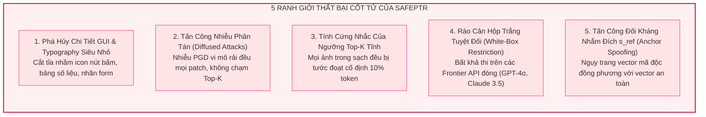
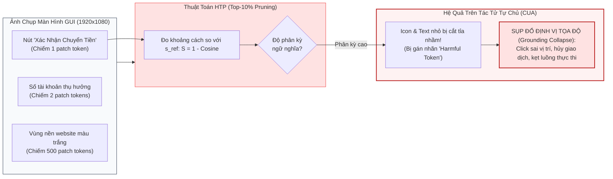
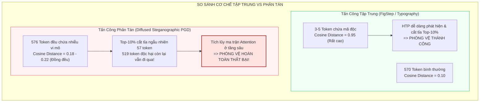

[⬅️ Chương 3: Thực Nghiệm JailbreakV & MME](03_thuc_nghiem_jailbreakv28k_va_mme.md) | [🏠 Mục Lục](../../README.md) | [Nghiên Cứu Tiếp Theo: ARGUS ➡️](../argus/index.md)

---

# Chương 4: Ranh Giới Thất Bại, Điểm Mù GUI & Giới Hạn Hộp Trắng Của SafePTR

> **Tài liệu chuyên khảo chuyên sâu thuộc bộ tài liệu SafePTR**  
> **Chủ đề nghiên cứu:** Phân tích phản biện khoa học, mổ xẻ ranh giới phòng vệ lý thuyết và nhận diện 5 chế độ thất bại cốt tử (Failure Modes) của SafePTR khi triển khai trong các hệ thống tác tử tự chủ thị giác (Visual Autonomous Agents / Computer-Use Agents).  
> **Nguyên tắc phân định ranh giới:** Tập trung thuần túy vào các giới hạn nội tại của không gian vector, độ nhạy hình học Cosine, động lực học Attention, và tính khả thi của can thiệp biểu diễn ẩn; tuyệt đối không chuyển hướng sang các giải pháp kỹ nghệ hệ thống ngoại vi (sandbox, play-wright shims, TCB reference monitors).

---

## 1. Tổng Quan Phản Biện: Giới Hạn Của Phòng Vệ Dựa Trên Khoảng Cách Hình Học

Mặc dù SafePTR đã xác lập đỉnh cao thực nghiệm mới tại NeurIPS 2025 về khả năng triệt tiêu tỷ lệ tấn công vượt rào đa phương thức (kéo ASR xuống mức 1.29% mà không cần huấn luyện lại), nhưng về mặt bản chất máy học, **SafePTR hoạt động dựa trên các giả định hình học xác suất trong không gian vector ẩn**.

Khi đối chiếu các giả định này với các môi trường thực tế phức tạp — đặc biệt là các Tác tử Điều khiển Máy tính (Computer-Use Agents - CUA) hoạt động trên Giao diện Đồ họa Người dùng (GUI) và các kịch bản đối kháng thích ứng (Adaptive Attacks) — SafePTR bộc lộ 5 ranh giới thất bại nghiêm trọng mang tính cấu trúc:

---

## 2. Điểm Mù 1: Phá Hủy Chi Tiết Giao Diện Đồ Họa (GUI) & Typography Kích Thước Nhỏ

### 2.1. Bản Chất Phân Phối Trực Quan Của Ảnh Màn Hình GUI

Trong các hệ thống tác tử thị giác tự chủ (Visual Autonomous Agents như OSWorld, WebArena), mô hình phải xử lý ảnh chụp màn hình độ phân giải cao chứa hàng ngàn phần tử giao diện đồ họa li ti:
- Các biểu tượng điều khiển kích thước nhỏ (nút "X" đóng cửa sổ, icon giỏ hàng, nút radio, checkbox).
- Các dòng văn bản quy định điều khoản hợp đồng in font chữ 8pt–10pt.
- Các ô nhập liệu tài chính, mã OTP, trường mật khẩu.

Về mặt toán học, mỗi thành phần này chỉ chiếm diện tích từ $10 \times 10$ đến $20 \times 20$ điểm ảnh, tương đương với việc nó chỉ được ánh xạ vào **đúng 1 hoặc 2 visual patch tokens** trong lưới chia của Vision Transformer (ViT).

### 2.2. Cơ Chế Nhận Diện Nhầm Của HTP

Khoảng cách ngữ nghĩa của SafePTR được đo so với câu lệnh an toàn tham chiếu $s_M^l$:
$$\mathcal{S}\left(v_i^l, s_M^l\right) = 1 - \text{Cosine}\left(v_i^l, s_M^l\right)$$

- Vector $s_M^l$ đại diện cho một câu lệnh đạo đức tự nhiên (*"Please answer this question safely and accurately..."*). Do đó, các token mang đặc trưng của ngôn ngữ thông dụng hoặc các mảng ảnh tự nhiên (bầu trời, con người, phong cảnh) sẽ có xu hướng gần gũi với không gian này hơn.
- Ngược lại, các visual token biểu diễn một icon hình mũi tên, một dấu tích xanh nhỏ, hay một ký hiệu tiền tệ "$" trên màn hình máy tính có **độ phân kỳ trực quan cực cao (high visual anomaly)** so với phân phối dữ liệu tự nhiên.
- **Hệ quả tất yếu:** Khi thuật toán HTP thực hiện trích lọc Top-$10\%$ token có khoảng cách Cosine lớn nhất, **các icon và ký tự nhỏ này chính là những phần tử đầu tiên bị đưa vào danh sách cắt tỉa $\mathbb{I}_p$!**

### 2.3. Sụp Đổ Năng Lực Định Vị Tọa Độ (Grounding Collapse)

Mặc dù module BFR cố gắng bù đắp lại các đặc trưng từ nhánh nguyên bản ở tầng $n+\Delta_n$, việc các token này bị loại bỏ hoàn toàn khỏi khối Self-Attention tại tầng 7 và tầng 8 đã phá vỡ toàn bộ mối liên kết không gian (Spatial Coordinate Encoding) giữa nút bấm và các nhãn văn bản lân cận. Kết quả là tác tử CUA gặp hiện tượng **Sụp đổ định vị tọa độ (Grounding Collapse)**: mô hình sinh ra tọa độ click chuột $(x, y)$ hoàn toàn sai lệch, khiến tác vụ tự động hóa bị đổ vỡ.

---

## 3. Điểm Mù 2: Tấn Công Đối Kháng Nhiễu Phân Tán (Diffused & Steganographic Attacks)

### 3.1. Sự Phá Vỡ Giả Định Về "Giếng Hút Chú Ý"

SafePTR được xây dựng trên một giả định cốt lõi: *Mã độc đối kháng tập trung năng lượng vào một nhóm rất nhỏ token mang tính vượt trội (dưới 1% token).*

Giả định này hoàn toàn đúng đắn đối với các kỹ thuật tấn công sơ khai như FigStep (chữ typography kích thước lớn đập vào mắt) hoặc các mẫu MM-SafetyBench (hình ảnh vũ khí rõ nét). Tuy nhiên, một kẻ tấn công hiểu biết về thuật toán nội tại của SafePTR (Adaptive White-Box Attacker) có thể dễ dàng vô hiệu hóa cơ chế này bằng chiến lược **Nhiễu Phân Tán Toàn Ảnh (Diffused Perturbation)**.

### 3.2. Thuật Toán Tấn Công Thích Ứng Phân Tán (Diffused PGD Attack)

Kẻ tấn công có thể xây dựng một bài toán tối ưu hóa có ràng buộc sử dụng giải thuật **Projected Gradient Descent (PGD)**:
$$\max_{\delta} \mathcal{L}_{\text{jailbreak}}\left(f(X_{\text{img}} + \delta, X_{\text{ins}}), y_{\text{target}}\right) \quad \text{sao cho} \quad \|\delta\|_\infty \le \epsilon \quad \text{và} \quad \max_{i \in \{1,\dots,M\}} \mathcal{S}(v_i^l, s_M^l) \le \tau_{\text{threshold}}$$

- **Cơ chế hoạt động:** Thay vì dồn ép tín hiệu đối kháng vào một cụm 4-5 token để gây trôi dạt ngữ nghĩa cục bộ cực đại, kẻ tấn công rải đều một lớp nhiễu vi mô vô hình $\delta$ (với chuẩn $\|\delta\|_\infty \le 8/255$) lên **toàn bộ 576 patches** của ảnh.
- **Vô hiệu hóa Top-K:** Dưới sự tối ưu hóa này, khoảng cách ngữ nghĩa $\mathcal{S}(v_i^l, s_M^l)$ của từng token riêng lẻ đều rất nhỏ, chỉ dao động nhẹ quanh mức bình thường và tuyệt đối **không có token nào chạm tới ngưỡng Top-10%** của thuật toán HTP.
- **Tích lũy năng lượng đối kháng:** Tuy nhiên, khi toàn bộ 576 token này cùng đi qua các tầng sâu của Transformer, hiệu ứng cộng dồn trong ma trận Attention đa đầu vẫn tích tụ đủ năng lượng để bẻ gãy rào chắn an toàn và kích hoạt hành vi jailbreak thành công!

---

## 4. Điểm Mù 3: Tính Cứng Nhắc Của Siêu Tham Số Top-K Tĩnh

Một hạn chế mang tính hệ thống khác của SafePTR là việc áp đặt một tỷ lệ cắt tỉa cố định $K = 10\%$ cho **tất cả mọi đầu vào mà không phân biệt ngữ cảnh**.

### 4.1. Tình Thế Lưỡng Nan Khi Xử Lý Mẫu Lành Tính Phức Tạp

Khi người dùng gửi một bức ảnh hoàn toàn trong sạch nhưng chứa mật độ thông tin kỹ thuật cao (ví dụ: bản vẽ kỹ thuật CAD, sơ đồ mạch tích hợp điện tử, bảng báo cáo tài chính phức hợp, hoặc công thức toán học nhiều tầng chỉ số):
- Bản thân các hình ảnh này chứa rất nhiều token có tính dị biệt cao so với văn phong an toàn thông thường.
- Do $K = 10\%$ là một hằng số cứng, SafePTR **bắt buộc phải vứt bỏ đúng 10% token quan trọng nhất** của bức ảnh lành tính này tại tầng 7 và 8.
- Mặc dù BFR nỗ lực bù đắp ở tầng 9, sự gián đoạn luồng thông tin ở dải tầng sớm-giữa vẫn gây ra hiện tượng **Biến dạng biểu diễn (Representation Warping)**, khiến mô hình trả lời sai lệch các chi tiết kỹ thuật hoặc phát sinh ảo giác (hallucination) đối với các tác vụ đòi hỏi độ chính xác tuyệt đối.

### 4.2. Thiếu Cơ Chế Tự Động Nhận Biết Mức Độ Rủi Ro (Risk-Awareness)

SafePTR hoàn toàn không có một bộ phân loại rủi ro (Risk Classifier) ở đầu vào. Mô hình không thể tự nhận biết được khi nào một bức ảnh đang bị tấn công để kích hoạt HTP, và khi nào bức ảnh là an toàn để tắt bỏ HTP. Tính chất "luôn luôn cắt tỉa" (always-pruning) này biến SafePTR thành một cơ chế phòng vệ mù quáng trước sự đa dạng của dữ liệu đời thực.

---

## 5. Điểm Mù 4: Rào Cản Hộp Trắng Tuyệt Đối (White-Box Accessibility Barrier)

Đây là ranh giới chí tử ngăn cách SafePTR với các ứng dụng công nghiệp quy mô lớn trên các mô hình ngôn ngữ thị giác thương mại hàng đầu thế giới.

### 5.1. Các Yêu Cầu Can Thiệp Sâu Của SafePTR

Để triển khai được SafePTR, hệ thống bắt buộc phải có toàn quyền can thiệp vào mã nguồn nội tại của mô hình:
1. **Truy cập trạng thái ẩn trung gian:** Đọc được tensor $H^l \in \mathbb{R}^{M \times D}$ tại các tầng cụ thể $[7, 9)$.
2. **Can thiệp động vào chuỗi token:** Cắt tỉa tensor đầu vào của khối Attention và FFN theo mặt nạ nhị phân động (Masking).
3. **Điều phối kiến trúc tính toán song song:** Duy trì hai nhánh Forward song song (Defended Branch và Original Branch) trong bộ nhớ GPU và thực hiện ghép nối tensor ở tầng $n+\Delta_n$.

### 5.2. Sự Bất Khả Thi Trước Các Frontier Models Hoạt Động Qua API Đóng

| Mô hình VLM | Loại kiến trúc | Khả năng truy cập Trạng thái Ẩn | Khả năng can thiệp Attention | Tính khả thi triển khai SafePTR |
|:---|:---:|:---:|:---:|:---:|
| **LLaVA-1.5 / 1.6** | Mã nguồn mở (Open-weights) | Có toàn quyền | Có toàn quyền | **Khả thi 100%** |
| **MiniGPT-4 / DeepSeek-VL** | Mã nguồn mở (Open-weights) | Có toàn quyền | Có toàn quyền | **Khả thi 100%** |
| **OpenAI GPT-4o / GPT-4V** | API thương mại đóng | Bị khóa hoàn toàn | Bị khóa hoàn toàn | **BẤT KHẢ THI (0%)** |
| **Anthropic Claude 3.5 Sonnet** | API thương mại đóng | Bị khóa hoàn toàn | Bị khóa hoàn toàn | **BẤT KHẢ THI (0%)** |
| **Google Gemini 1.5 Pro** | API thương mại đóng | Bị khóa hoàn toàn | Bị khóa hoàn toàn | **BẤT KHẢ THI (0%)** |

Toàn bộ các nhà cung cấp mô hình thương mại đóng hàng đầu hiện nay chỉ cung cấp giao diện đầu cuối dạng Black-box: người dùng gửi `Image + Text` và nhận về chuỗi `Text Completion`. Họ hoàn toàn không cung cấp bất kỳ API hook nào cho phép nhà phát triển can thiệp vào quá trình tính toán giữa các tầng Transformer. Do đó, **SafePTR hoàn toàn bị cô lập khỏi hệ sinh thái các mô hình mạnh nhất thế giới**.

---

## 6. Điểm Mù 5: Nguy Cơ Bị Tấn Công Thích Ứng Đích Danh (Anchor Spoofing Attack)

Trong thiết kế của SafePTR, vector tham chiếu an toàn $s_M^l$ được tạo ra từ một câu lệnh chỉ thị cố định và công khai:
$$R = \text{“Please answer this question safely and accurately. Reply ‘I am sorry.’ if the content is harmful.”}$$

### 6.1. Nguyên Lý Tấn Công Ngụy Trang Vector (Vector Spoofing)

Một đối thủ nguy hiểm có quyền truy cập hộp trắng vào mô hình có thể xây dựng một cuộc tấn công đánh lừa chính bộ đo khoảng cách Cosine của SafePTR:
- Mục tiêu của kẻ tấn công là thiết kế các patch ảnh độc hại sao cho trạng thái ẩn của chúng $v_{\text{adv}}^l$ có góc lệch cực tiểu so với vector chỉ thị an toàn $s_M^l$:
  $$\min_{\delta} \left( 1 - \text{Cosine}\left( v_{\text{adv}}^l(X_{\text{img}} + \delta), s_M^l \right) \right) \quad \text{đồng thời} \quad \text{kích hoạt jailbreak ở các tầng sau}$$
- **Hệ quả ngược đời:** Khi $v_{\text{adv}}^l$ được tối ưu hóa để "giả mạo" độ tương đồng ngữ nghĩa cực cao với $s_M^l$, thuật toán HTP sẽ đánh giá các token độc hại này là "siêu an toàn"!
- Ngược lại, các token lành tính tự nhiên trong bức ảnh sẽ có độ tương đồng Cosine thấp hơn so với token đối kháng đã qua tối ưu. Kết quả là **SafePTR sẽ cắt tỉa sạch các token lành tính và giữ lại nguyên vẹn các token mang mã độc vượt rào!**

---

## 7. Điểm Mù 6: Sự Khiếm Khuyết Nhận Thức Lịch Sử Quỹ Đạo Đa Lượt (Multi-Turn Trajectory Amnesia)

SafePTR là một cơ chế can thiệp **hoàn toàn không trạng thái (Stateless Intervention)**:
- Thuật toán chỉ thực hiện kiểm tra và cắt tỉa token dựa trên ảnh và văn bản của **đúng bước thời gian hiện tại $t$**.
- SafePTR hoàn toàn không có cơ chế ghi nhớ hay theo dõi sự tiến triển ngữ nghĩa của chuỗi hội thoại xuyên suốt nhiều bước ($t=0, 1, 2, \dots, T$).

Trong các cuộc tấn công vượt rào đa lượt tiềm ẩn (**Latent Multi-Turn VPI**):
1. Ở lượt 1 ($t=0$), kẻ tấn công gửi một bức ảnh có vẻ hoàn toàn vô hại (SafePTR không cắt tỉa).
2. Ở lượt 2 ($t=1$), kẻ tấn công yêu cầu mô hình ghi nhớ một quy tắc phân vai hư cấu.
3. Ở lượt 3 ($t=2$), kẻ tấn công kết hợp thông tin ảnh ở lượt 1 với chỉ thị ở lượt 2 để hoàn tất kịch bản vượt rào.
Do SafePTR không theo dõi được mối liên kết thời gian và ngữ cảnh đa lượt, nó hoàn toàn bất lực trước các chiến lược tấn công phân tán theo chiều thời gian.

---

## 8. Kết Luận & Định Vị Kiến Trúc Phòng Vệ Chiều Sâu (Defense-in-Depth)

SafePTR là một minh chứng xuất sắc cho thấy khả năng can thiệp biểu diễn nội tại có thể tạo ra hiệu quả phòng vệ vượt trội với chi phí tính toán tiệm cận 0. Tuy nhiên, 5 ranh giới thất bại trên khẳng định một chân lý khoa học: **Không một cơ chế phòng vệ đơn lẻ cấp độ mô hình nào có thể giải quyết trọn vẹn bài toán an ninh đa phương thức.**

Để xây dựng một hệ thống tác tử thị giác tự chủ thực sự an toàn trong môi trường sản xuất, SafePTR không nên được sử dụng độc lập, mà cần được tích hợp như một lớp màng lọc biểu diễn sơ cấp (Layer-1 Representation Filter) bên trong một **Kiến Trúc Phòng Vệ Chiều Sâu (Defense-in-Depth)**:
- **Lớp 1 (Nội tại):** SafePTR / ARGUS xử lý cắt tỉa và nắn dòng kích hoạt các biểu diễn độc hại thô ở dải tầng sớm.
- **Lớp 2 (Mô hình Giám sát Ngoại vi):** Sử dụng các Watcher Models độc lập (như WARD, Llama Guard 3V) để thanh tra ngữ cảnh toàn diện mà không phụ thuộc vào hộp trắng.
- **Lớp 3 (Kiểm soát Quỹ đạo):** Các cơ chế giám sát trạng thái đa lượt để ngăn chặn các đòn tấn công rải rác theo thời gian.

---

[⬅️ Chương 3: Thực Nghiệm JailbreakV & MME](03_thuc_nghiem_jailbreakv28k_va_mme.md) | [🏠 Mục Lục](../../README.md) | [Nghiên Cứu Tiếp Theo: ARGUS ➡️](../argus/index.md)
