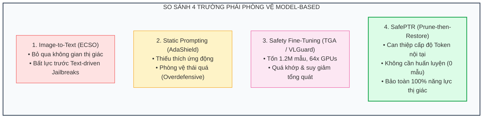
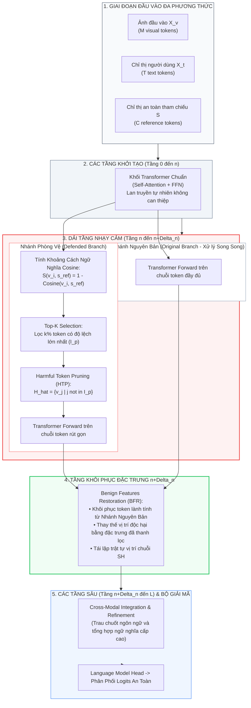

[⬅️ Nghiên Cứu Trước: VLGuard](../vlguard/index.md) | [🏠 Mục Lục](../../README.md) | [Chương 1: Nghịch Lý 1% Token & LIA ➡️](01_nghich_ly_1_percent_token_va_lia.md)

---

# Chuyên Khảo Nghiên Cứu: SafePTR — Cơ Chế Phòng Vệ Jailbreak Cấp Độ Token Qua Quy Trình Cắt Tỉa & Khôi Phục (Prune-then-Restore)

> **Tài liệu chuyên khảo chuyên sâu thuộc hệ thống Model-Based VPI Defenses**  
> **Chủ đề:** Phòng vệ vượt rào đa phương thức (Multimodal Jailbreak) và tiêm chỉ thị thị giác (Visual Prompt Injection - VPI) thông qua can thiệp không gian biểu diễn ẩn nội tại (Latent Hidden Representation Intervention) mà không cần huấn luyện lại mô hình (Training-Free).  
> **Nguyên tắc phân định ranh giới:** Tập trung thuần túy vào các can thiệp cấp độ token, ma trận chú ý đa đầu (Multi-Head Self-Attention), và các trạng thái kích hoạt tầng ẩn của Transformer; tuyệt đối không đưa vào các cơ chế kỹ nghệ hệ thống ngoại vi (sandbox, Playwright shims, TCB reference monitors).

---

## 1. Bảng Thông Tin Công Trình Khoa Học (Paper Metadata)

| Thuộc tính | Chi tiết định danh & Xuất bản |
|:---|:---|
| **Tên bài báo gốc** | *SafePTR: Token-Level Jailbreak Defense in Multimodal LLMs via Prune-then-Restore Mechanism* |
| **Tác giả** | Beitao Chen, Xinyu Lyu, Lianli Gao, Jingkuan Song, Heng Tao Shen |
| **Cơ quan nghiên cứu** | Viện Khoa học & Công nghệ Điện tử Trung Quốc (University of Electronic Science and Technology of China - UESTC) |
| **Hội nghị công bố** | **NeurIPS 2025** (Conference on Neural Information Processing Systems) |
| **Định danh lưu trữ** | [arXiv:2507.01513](https://arxiv.org/abs/2507.01513) (Bản hiển thị: [arxiv.org/html/2507.01513](https://arxiv.org/html/2507.01513)) |
| **Kho lưu trữ mã nguồn** | [GitHub: BT-C/SafePTR](https://github.com/BT-C/SafePTR) |
| **Mô hình mục tiêu** | LLaVA-1.5-7B, LLaVA-1.6-7B, MiniGPT-4-7B, MiniGPT-4-13B, DeepSeek-VL2-Tiny |
| **Tập dữ liệu tấn công** | JailbreakV-28K (Text-driven), FigStep (Typography), MM-SafetyBench (SD, TYPO, SD-TYPO) |
| **Tập chuẩn năng lực** | MME (Multimodal Evaluation), MM-Vet (Integrated Reasoning Capabilities) |
| **Thuộc tính kỹ thuật** | Can thiệp biểu diễn nội tại (Latent Representation Intervention), Không cần huấn luyện (Training-Free), Một lượt suy luận (One-pass Inference) |

---

## 2. Tóm Tắt Bản Chất & Đóng Góp Học Thuật (Executive Summary)

Mô hình Thị giác - Ngôn ngữ Lớn (Multimodal Large Language Models - MLLMs) mở rộng năng lực của các mô hình ngôn ngữ (LLMs) sang xử lý tín hiệu hình ảnh. Tuy nhiên, sự kết hợp đa phương thức này tạo ra một "tử huyệt" bảo mật: các cơ chế căn chỉnh an toàn (safety alignment) sẵn có trong phần lõi LLM bị vô hiệu hóa khi tiếp nhận các vector nhúng thị giác độc hại. Các kỹ thuật phòng vệ tiền nhiệm thường rơi vào ba ngõ cụt:
1. **Dịch chuyển Ảnh thành Văn bản (Image-to-Text - như ECSO):** Mất hoàn toàn ngữ cảnh trực quan, dễ dàng bị khuất phục bởi các đòn tấn công dẫn dắt bằng văn bản (Text-driven jailbreaks).
2. **Kỹ nghệ Prompt Phòng Vệ Tĩnh (Safe Prompting - như AdaShield):** Chèn tiền tố an toàn tĩnh dẫn đến hành vi phòng vệ thái quá (**Overdefensive behavior**), từ chối cả các câu hỏi lành tính và làm sụt giảm nghiêm trọng năng lực mô hình.
3. **Tinh Chỉnh An Toàn Đa Phương Thức (Safety Fine-Tuning - như TGA, VLGuard):** Chi phí tính toán cực kỳ đắt đỏ (đòi hỏi cụm máy chủ hàng chục GPU cao cấp và hàng triệu mẫu dữ liệu), đồng thời dễ bị hiện tượng quá khớp (overfitting) và mất khả năng phòng thủ trước các biến thể tấn công mới lạ (Unseen Attacks).



### Ba Đóng Góp Đột Phá Cốt Lõi:
- **Khám phá cơ chế lan truyền nội tại (Mechanistic Dissection):** SafePTR là công trình tiên phong giải phẫu sâu vào bên trong mạng nơ-ron Transformer để trả lời ba câu hỏi: *Mã độc vượt rào ở đâu (Where), như thế nào (How), và do những token nào kích hoạt (Which)*. Nhóm nghiên cứu chỉ ra rằng **chưa đến 1% tổng số token** tại một **cửa sổ hẹp gồm 2-4 tầng sớm-giữa** là nguyên nhân trực tiếp kích hoạt hiện tượng jailbreak.
- **Khung phòng vệ Prune-then-Restore (SafePTR):** Đề xuất giải pháp hai pha độc đáo:
  - **Pha 1 — Harmful Token Pruning (HTP):** Đo lường khoảng cách ngữ nghĩa giữa từng token và vector chỉ thị an toàn tham chiếu $s_{ref}$ tại các tầng nhạy cảm $[n, n+\Delta_n]$, loại bỏ Top-$K$ token có độ trôi dạt ngữ nghĩa lớn nhất. Quá trình cắt tỉa diễn ra độc lập cho nhánh thị giác và văn bản.
  - **Pha 2 — Benign Features Restoration (BFR):** Duy trì một nhánh suy luận phụ song song để thu giữ đặc trưng ngữ cảnh nguyên bản, sau đó tại tầng phục hồi $n+\Delta_n$ sẽ ghép nối lại các token lành tính vào đúng vị trí tọa độ ban đầu, cho phép các tầng sâu thực hiện trau chuốt ngôn ngữ mà không bị suy giảm năng lực.
- **Hiệu quả thực nghiệm vượt trội (Empirical Dominance):** SafePTR hoàn toàn **không cần huấn luyện (Training-Free, 0 mẫu dữ liệu)**, đạt độ trễ tiệm cận 0 (chỉ tăng từ +0.8% đến +4.2% thời gian suy luận so với mô hình gốc), kéo tỷ lệ tấn công thành công (ASR) trên LLaVA-1.5 từ 51.7% xuống còn **1.3%** trên JailbreakV-28K, đồng thời **tăng điểm năng lực nhận thức MME** từ 1503.6 lên **1538.1**.

---

## 3. Kiến Trúc Luồng Thực Thi Tổng Thể (System Execution Architecture)

Toàn bộ quy trình can thiệp của SafePTR được tích hợp trực tiếp vào quá trình lan truyền tiến (Forward Pass) của mô hình Transformer đa phương thức:



---

## 4. Phân Định Vị Trí Kỹ Thuật Trong Phổ Phòng Vệ Model-Based

Trong phổ các giải pháp phòng vệ an ninh mô hình thị giác - ngôn ngữ, SafePTR nằm ở phân lớp **Can thiệp biểu diễn ẩn nội tại (Latent Hidden Representation Intervention)**:

```
                            PHỔ PHÒNG VỆ VPI MODEL-BASED
                                         │
        ┌────────────────────────────────┼────────────────────────────────┐
        ▼                                ▼                                ▼
┌──────────────────────┐      ┌──────────────────────┐      ┌──────────────────────┐
│  Multi-Modal SFT     │      │ Latent Interventions │      │ Auxiliary Watchers   │
│  (Thay đổi Trọng số) │      │ (Can thiệp Kích hoạt)│      │ (Mô hình Giám sát)   │
├──────────────────────┤      ├──────────────────────┤      ├──────────────────────┤
│ • VLGuard            │      │ • SafePTR (Pruning)  │      │ • WARD (Compact VLM) │
│ • TGA Alignment      │      │ • ARGUS (Steering)   │      │ • Llama Guard 3V     │
│ • Cross-modal DPO    │      │ • Q-MLLM (VQ Code)   │      │ • GuardReasoner-VL   │
├──────────────────────┤      ├──────────────────────┤      ├──────────────────────┤
│ Chi phí cao: 100 GPU │      │ Training-Free: 0 mẫu │      │ Chi phí gọi thêm API │
│ Quá khớp mẫu đã biết │      │ Tác động trực tiếp   │      │ Phụ thuộc Black-box  │
└──────────────────────┘      └──────────────────────┘      └──────────────────────┘
```

---

## 5. Mục Lục Điều Hướng 4 Chuyên Đề Chuyên Sâu

Bộ tài liệu chuyên khảo về SafePTR được phân rã thành 4 bài nghiên cứu độc lập với mức độ chi tiết học thuật cao:

```
papers/safeptr/
├── index.md                              <-- Bạn đang ở đây (Tổng quan chuyên đề)
├── 01_nghich_ly_1_percent_token_va_lia.md <-- Khám phá Nghịch lý 1% Token & Phân tích LIA
├── 02_harmful_token_pruning_va_bfr.md     <-- Chi tiết toán học thuật toán HTP & Module BFR
├── 03_thuc_nghiem_jailbreakv28k_va_mme.md <-- Dữ liệu thực nghiệm trên 5 bộ benchmark lớn
└── 04_ranh_gioi_that_bai_va_diem_mu_gui.md<-- Ranh giới thất bại, điểm mù GUI & rào cản hộp trắng
```

### [Chương 1: Nghịch Lý 1% Token Và Phân Tích Can Thiệp Theo Tầng (LIA)](01_nghich_ly_1_percent_token_va_lia.md)
- Phân tích hiện tượng sụp đổ căn chỉnh an toàn khi mở rộng phương thức thị giác trong MLLM.
- Chi tiết phương pháp **Phân Tích Can Thiệp Theo Tầng (Layer-wise Intervention Analysis - LIA)** và phát hiện dải tầng nhạy cảm sớm-giữa $[n, n+\Delta_n]$.
- Bản chất của hiện tượng **Trôi Dạt Ngữ Nghĩa (Semantic Drift)** so với không gian an toàn tham chiếu $s_{ref}$.
- Giải phẫu **"Nghịch lý 1% token"** và vai trò của các **Giếng hút chú ý (Attention Sinks)** trong việc khuếch đại payload đối kháng.

### [Chương 2: Cơ Chế Cắt Tỉa Token Độc Hại (HTP) & Khôi Phục Đặc Trưng Lành Tính (BFR)](02_harmful_token_pruning_va_bfr.md)
- Mô hình hóa toán học không gian trạng thái ẩn đa phương thức và hàm đo khoảng cách ngữ nghĩa Cosine.
- Thiết kế thuật toán **Harmful Token Pruning (HTP)** với chiến lược Top-$K$ độc lập cho từng phương thức (Modality-Specific).
- Giải quyết bài toán đánh đổi an toàn - hữu ích (Safety-Utility Trade-off) qua module **Benign Features Restoration (BFR)** hai nhánh song song.
- Mã nguồn giả lập (PyTorch style) chi tiết từng bước tính toán trong Forward Pass.

### [Chương 3: Thực Nghiệm Chuyên Sâu Trên JailbreakV-28K, FigStep, MM-SafetyBench Và MME](03_thuc_nghiem_jailbreakv28k_va_mme.md)
- Bảng đối chiếu thực nghiệm toàn diện trên 3 mô hình (LLaVA-1.5, MiniGPT-4, DeepSeek-VL2) với 6 phương pháp phòng vệ tiền nhiệm.
- Kết quả chống đỡ tấn công văn bản (Text-driven) trên JailbreakV-28K (triệt tiêu Prompt Injection về 0.0%).
- Kết quả chống đỡ tấn công thị giác (Vision-driven) trên FigStep và MM-SafetyBench qua 13 kịch bản rủi ro.
- Hiện tượng **Cải thiện năng lực hữu ích (Utility Bonus)** trên MME và MM-Vet nhờ triệt tiêu ảo giác thị giác.
- Đánh giá hiệu năng thời gian thực và phân tích triệt tiêu (Ablation Studies) đối với siêu tham số $K$.

### [Chương 4: Ranh Giới Thất Bại, Điểm Mù GUI & Giới Hạn Hộp Trắng Của SafePTR](04_ranh_gioi_that_bai_va_diem_mu_gui.md)
- Điểm mù nghiêm trọng đối với các tác tử điều khiển máy tính (Computer-Use Agents): phá hủy icon nhỏ, font chữ giao diện (GUI collapse).
- Bất lực trước các kỹ thuật tấn công nhiễu phân tán toàn ảnh (Diffused / Steganographic Attacks) không tạo ra token vượt ngưỡng Top-$K$.
- Rào cản kỹ thuật của việc truy cập hộp trắng (White-box requirement) khiến SafePTR không thể bảo vệ các frontier model thương mại đóng (GPT-4o, Claude 3.5 Sonnet).
- Nguy cơ bị tấn công thích ứng nhắm thẳng vào vector chỉ thị an toàn tham chiếu (Guard-Targeted Adversarial Injection).

---

[⬅️ Nghiên Cứu Trước: VLGuard](../vlguard/index.md) | [🏠 Mục Lục](../../README.md) | [Chương 1: Nghịch Lý 1% Token & LIA ➡️](01_nghich_ly_1_percent_token_va_lia.md)
