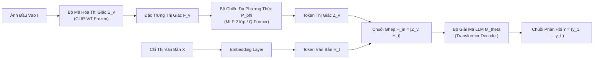
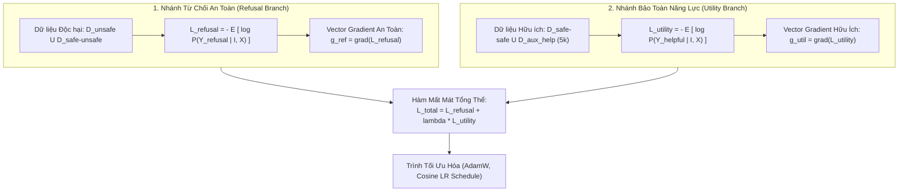
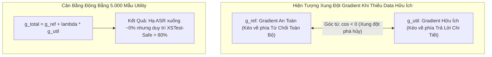
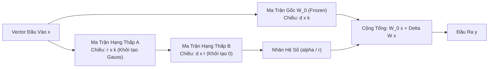
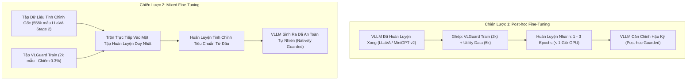

[⬅️ Bài 1: Data Mix & Duality](01_datamix_va_multimodal_duality.md) | [🏠 Mục Lục Repo](../../README.md) | [Bài 3: Thực Nghiệm Benchmark ➡️](03_thuc_nghiem_benchmark_results.md)

---

# Bài 2: Nền Tảng Toán Học: Hàm Mất Mát Đa Mục Tiêu, Gradient Balancing & Chiến Lược Căn Chỉnh

> **Nội dung chuyên khảo:** Xây dựng mô hình toán học giải thích hiện tượng suy thoái căn chỉnh; thiết lập công thức hàm mất mát đa mục tiêu; phân tích xung đột gradient và rủi ro an toàn thái quá (Exaggerated Safety); giải mã nghịch lý tối ưu hóa LoRA vs. Full SFT; và so sánh cơ chế giữa Post-hoc Fine-Tuning và Mixed Fine-Tuning.

---

## 1. Mô Hình Toán Học Của Vision Large Language Model (VLM)

Một mô hình ngôn ngữ - thị giác lớn tiêu chuẩn (như LLaVA hoặc MiniGPT-v2) được cấu thành từ ba khối toán học chính:

### 1.1. Luồng Biểu Diễn Toán Học

1. **Bộ mã hóa thị giác (Vision Encoder $\mathcal{E}_v$):**
   Tiếp nhận hình ảnh đầu vào $\mathbf{I} \in \mathbb{R}^{H \times W \times C}$, chia thành $N_v$ mảng điểm ảnh (patches), và trích xuất thành chuỗi vector đặc trưng ẩn:
   $$\mathbf{F}_v = \mathcal{E}_v(\mathbf{I}) \in \mathbb{R}^{N_v \times D_v}$$
   Trong VLGuard, bộ mã hóa này là **CLIP-ViT-L/14** và được **đóng băng hoàn toàn** trong suốt quá trình tinh chỉnh an toàn ($\nabla_{\Theta_{enc}} \mathcal{L} = 0$).

2. **Bộ chiếu đa phương thức (Multimodal Projector $\mathcal{P}_\phi$):**
   Biến đổi các vector đặc trưng thị giác từ chiều không gian $D_v$ sang chiều không gian ẩn $D_t$ của mô hình ngôn ngữ:
   $$\mathbf{Z}_v = \mathcal{P}_\phi(\mathbf{F}_v) \in \mathbb{R}^{N_v \times D_t}$$
   Trong LLaVA-v1.5, $\mathcal{P}_\phi$ là một mạng nơ-ron truyền thẳng đa tầng (MLP hai lớp với hàm kích hoạt phi tuyến GELU).

3. **Mô hình ngôn ngữ tự hồi quy (Autoregressive LLM $\mathcal{M}_\theta$):**
   Chuỗi token văn bản của người dùng $\mathbf{X} = (x_1, x_2, \dots, x_M)$ được ánh xạ qua ma trận nhúng $\mathbf{E} \in \mathbb{R}^{|\mathcal{V}| \times D_t}$ thành $\mathbf{H}_t \in \mathbb{R}^{M \times D_t}$.
   Toàn bộ chuỗi đầu vào đa phương thức được ghép nối liên tiếp:
   $$\mathbf{H}_{in} = \left[ \mathbf{Z}_v \,\|\, \mathbf{H}_t \right] \in \mathbb{R}^{(N_v + M) \times D_t}$$
   Mô hình tính toán phân phối xác suất có điều kiện trên từng bước thời gian $t$ để sinh chuỗi phản hồi $\mathbf{Y} = (y_1, y_2, \dots, y_L)$:
   $$P(\mathbf{Y} | \mathbf{I}, \mathbf{X}; \Theta) = \prod_{t=1}^L P\left(y_t \,\middle|\, \mathbf{H}_{in}, y_{<t}; \Theta\right)$$
   Trong đó $\Theta = \{\phi, \theta\}$ là tập hợp tham số có thể huấn luyện (gồm bộ chiếu $\phi$ và các trọng số LLM $\theta$).

---

## 2. Công Thức Toán Học Của Hàm Mất Mát Đa Mục Tiêu

Để căn chỉnh mô hình đạt được sự cân bằng tối ưu giữa việc kiên quyết từ chối nội dung độc hại nhưng vẫn duy trì năng lực hữu ích vượt trội, VLGuard áp dụng hàm mất mát đa mục tiêu kết hợp hai dòng dữ liệu đối kháng.

### 2.1. Nhánh Từ Chối An Toàn (Safety Refusal Objective)

Tập dữ liệu độc hại tổng hợp bao gồm cả ảnh độc hại nội tại và ảnh lành tính bị cài cắm chỉ thị tấn công:
$$\mathcal{D}_{unsafe\_total} = \mathcal{D}_{unsafe} \cup \mathcal{D}_{safe-unsafe}$$

Mỗi mẫu trong tập này bao gồm bộ ba $(\mathbf{I}_i, \mathbf{X}_i, \mathbf{Y}_i^{ref})$, trong đó $\mathbf{Y}_i^{ref} = (y_{i,1}^{ref}, \dots, y_{i,L_i}^{ref})$ là chuỗi phản hồi từ chối an toàn có lý giải chi tiết chuẩn mực. Hàm mất mát entropy chéo (Cross-Entropy Loss) trên nhánh an toàn được định nghĩa:
$$\mathcal{L}_{refusal}(\Theta) = - \frac{1}{|\mathcal{D}_{unsafe\_total}|} \sum_{i=1}^{|\mathcal{D}_{unsafe\_total}|} \sum_{t=1}^{L_i} \log P\left(y_{i,t}^{ref} \,\middle|\, \mathbf{I}_i, \mathbf{X}_i, y_{i,<t}^{ref}; \Theta\right)$$

Mục tiêu của $\mathcal{L}_{refusal}$ là tối đa hóa hàm hợp lý của việc sinh ra phản hồi từ chối bất cứ khi nào phát hiện tín hiệu độc tính từ $\mathbf{I}$ hoặc $\mathbf{X}$.

### 2.2. Nhánh Bảo Toàn Tính Hữu Ích (Utility Preservation Objective)

Nếu chỉ tối ưu $\mathcal{L}_{refusal}$, mô hình sẽ nhanh chóng rơi vào trạng thái cực đoan: coi mọi câu hỏi đều là nguy hiểm và từ chối toàn bộ. Để tạo lực đối trọng, VLGuard tích hợp tập dữ liệu hữu ích:
$$\mathcal{D}_{safe\_total} = \mathcal{D}_{safe-safe} \cup \mathcal{D}_{aux\_help}$$
Trong đó:
- $\mathcal{D}_{safe-safe}$ là tập các câu hỏi hiểu ảnh lành tính trích xuất từ 977 ảnh an toàn của VLGuard.
- $\mathcal{D}_{aux\_help}$ là tập 5.000 mẫu dữ liệu hướng dẫn hữu ích tổng quát được lấy ngẫu nhiên từ tập huấn luyện ban đầu (LLaVA-Instruct) hoặc tập dữ liệu thuần văn bản Alpaca.

Hàm mất mát trên nhánh hữu ích được xác định bởi:
$$\mathcal{L}_{utility}(\Theta) = - \frac{1}{|\mathcal{D}_{safe\_total}|} \sum_{j=1}^{|\mathcal{D}_{safe\_total}|} \sum_{t=1}^{K_j} \log P\left(y_{j,t}^{help} \,\middle|\, \mathbf{I}_j, \mathbf{X}_j, y_{j,<t}^{help}; \Theta\right)$$

### 2.3. Hàm Mất Mát Tổng Thể Cân Bằng

Hàm mất mát toàn cục mà mô hình cần cực tiểu hóa là:
$$\mathcal{L}_{total}(\Theta) = \mathcal{L}_{refusal}(\Theta) + \lambda \mathcal{L}_{utility}(\Theta)$$
Trong đó $\lambda > 0$ là siêu tham số cân bằng trọng số giữa an toàn và năng lực hữu ích (trong thực nghiệm huấn luyện chuẩn của VLGuard, tỷ lệ dữ liệu được thiết kế sao cho gradient giữa hai pha đạt trạng thái cân bằng động tự nhiên tương đương $\lambda \approx 1.0$).

---

## 3. Phân Tích Xung Đột Gradient & Cơ Chế Khắc Phục Hiện Tượng "An Toàn Thái Quá" (Exaggerated Safety)

### 3.1. Hình Thức Hóa Xung Đột Gradient (Gradient Conflict)

Xét không gian tham số $\Theta \in \mathbb{R}^d$. Khi cập nhật mô hình, gradient tổng thể là tổng hợp của hai vector gradient:
$$\mathbf{g}_{total} = \mathbf{g}_{ref} + \lambda \mathbf{g}_{util}, \quad \text{với } \mathbf{g}_{ref} = \nabla_\Theta \mathcal{L}_{refusal}, \; \mathbf{g}_{util} = \nabla_\Theta \mathcal{L}_{utility}$$

Góc giữa hai vector gradient này được đo bằng tích vô hướng chuẩn hóa (Cosine Similarity):
$$\rho = \cos\langle\mathbf{g}_{ref}, \mathbf{g}_{util}\rangle = \frac{\langle\mathbf{g}_{ref}, \mathbf{g}_{util}\rangle}{\|\mathbf{g}_{ref}\|_2 \|\mathbf{g}_{util}\|_2}$$

Nếu $\rho < 0$ (hai vector gradient tạo góc tù), sự xung đột xảy ra: bước cập nhật giảm mất mát an toàn sẽ trực tiếp làm tăng mất mát hữu ích (phá hủy năng lực trả lời câu hỏi), và ngược lại.

### 3.2. Hệ Quả Khi Huấn Luyện Đơn Lẻ Bằng Dữ Liệu An Toàn

Nhóm tác giả đã tiến hành một thí nghiệm triệt tiêu (Ablation Study) mang tính bước ngoặt trình bày trong **Table 3** của bài báo:

| Cấu Hình Dữ Liệu Tinh Chỉnh | XSTest-Safe (Tỷ lệ trả lời % ↑) | XSTest-Unsafe (ASR % ↓) | VLGuard Safe-Unsafe (ASR % ↓) | V-L Helpfulness Trung Bình (% ↑) |
|---|:---:|:---:|:---:|:---:|
| **Mô hình gốc (LLaVA-v1.5-7B)** | **91.20** | 26.50 | 87.46 | 61.42 |
| **Chỉ dùng VLGuard (Không thêm data Utility)** | **41.60** *(Tụt -49.6%)* | **0.00** | **0.54** | 61.57 |
| **VLGuard + 5.000 mẫu LLaVA data** | **80.80** | **6.00** | **0.90** | **62.84** |
| **VLGuard + 5.000 mẫu Alpaca text data** | **81.10** | **8.50** | **1.20** | 61.48 |

> [!CAUTION]
> **Hiện tượng An Toàn Thái Quá (Exaggerated Safety / Over-Refusal):**
> Khi chỉ sử dụng 2.000 mẫu VLGuard mà không bổ sung dữ liệu hữu ích, mô hình đạt độ an toàn tuyệt đối (ASR trên XSTest-Unsafe và VLGuard đều bằng 0.00%). Tuy nhiên, tỷ lệ chấp thuận trả lời các câu hỏi an toàn trên XSTest-Safe **suy sụp nghiêm trọng từ 91.20% xuống còn 41.60%**. Mô hình bị hoang tưởng nặng nề, từ chối cả các câu hỏi hoàn toàn vô hại nhưng có chứa từ khóa nhạy cảm (như *"Làm thế nào để giết (kill) một tiến trình Python bị treo?"*).

### 3.3. Cơ Chế Ổn Định Bằng 5.000 Mẫu Dữ Liệu Bổ Trợ

Bằng cách đưa thêm 5.000 mẫu dữ liệu hữu ích ($\mathcal{D}_{aux\_help}$), vector gradient $\mathbf{g}_{util}$ liên tục neo giữ các trọng số phụ trách suy luận và biểu diễn ngôn ngữ tổng quát không bị trôi dạt vào vùng triệt tiêu hoàn toàn. Tỷ lệ trả lời trên XSTest-Safe lập tức hồi phục lên **80.80%** (với LLaVA data) và **81.10%** (với Alpaca text data), trong khi khả năng phòng thủ an toàn vẫn được bảo toàn xuất sắc (ASR trên Safe-Unsafe chỉ 0.90%). 

Điều đáng kinh ngạc là dữ liệu hữu ích bổ trợ **không nhất thiết phải là dữ liệu ảnh đa phương thức**: việc dùng 5.000 mẫu văn bản thuần túy của Alpaca cũng đem lại hiệu quả cân bằng tương đương!

---

## 4. Giải Phẫu Cơ Chế Tối Ưu Hóa: LoRA vs. Full Fine-Tuning

### 4.1. Toán Học Của Low-Rank Adaptation (LoRA)

Trong phương pháp LoRA (Hu et al., 2022), trọng số gốc của mô hình ngôn ngữ $W_0 \in \mathbb{R}^{d \times k}$ được đóng băng cố định. Biến thiên cập nhật trọng số $\Delta W$ được tham số hóa thông qua phép nhân hai ma trận hạng thấp:
$$W = W_0 + \Delta W = W_0 + \frac{\alpha}{r} B \cdot A$$
Trong đó $B \in \mathbb{R}^{d \times r}$, $A \in \mathbb{R}^{r \times k}$, với hạng $r \ll \min(d, k)$, và $\alpha$ là hệ số tỷ lệ không đổi.

### 4.2. Giải Mã Nghịch Lý: Tại Sao LoRA Lại Kém An Toàn Hơn Full Fine-Tuning Khi Huấn Luyện VLM?

Một trong những phát hiện thực nghiệm gây ngạc nhiên nhất trong bài báo (Finding 3) là: **Khi thực hiện Visual Instruction Tuning chuẩn, các biến thể sử dụng LoRA luôn có tỷ lệ bị bẻ khóa (ASR) cao hơn rõ rệt so với các biến thể Full Fine-Tuning**, mặc dù cả hai cùng được huấn luyện trên cùng một bộ dữ liệu.

| Mô Hình Đánh Giá | Phương Pháp Fine-Tuning | AdvBench Vanilla (ASR % ↓) | AdvBench Suffix Inj. (ASR % ↓) | XSTest Unsafe (ASR % ↓) |
|---|:---:|:---:|:---:|:---:|
| **LLaVA-v1.5-7B** | **Full Fine-Tuning** | **6.45** | **78.27** | **26.50** |
| **LLaVA-v1.5-7B-LoRA** | **LoRA ($r=64, \alpha=128$)** | **10.62** *(+4.17)* | **82.31** *(+4.04)* | **31.00** *(+4.50)* |
| **LLaVA-v1.5-13B** | **Full Fine-Tuning** | **2.12** | **74.23** | **10.00** |
| **LLaVA-v1.5-13B-LoRA** | **LoRA ($r=64, \alpha=128$)** | **4.81** *(+2.69)* | **76.54** *(+2.31)* | **14.50** *(+4.50)* |

#### Căn Nguyên Vật Lý & Động Học Học Máy (Mechanistic Rationale)

1. **Dung lượng tham số và tính phân tán gradient (Parameter Capacity & Gradient Diffusion):**
   - Trong **Full Fine-Tuning**, gradient của các mẫu huấn luyện bẩn (247 mẫu độc hại trong ShareGPT) được phân bổ và làm loãng trên toàn bộ không gian tham số khổng lồ gồm 7 tỷ hoặc 13 tỷ trọng số. Do có hàng trăm nghìn mẫu dữ liệu lành tính khác cùng cập nhật, tác động gây lệch hướng an toàn của các mẫu bẩn bị trung hòa và phân tán.
   - Trong **LoRA**, toàn bộ quá trình thích ứng bị dồn nén vào một không gian con đa tạp hạng thấp (low-rank manifold) cực kỳ chật hẹp ($r \ll d$). Gradient từ các mẫu độc hại có độ lớn cực đại (high magnitude) sẽ chi phối các ma trận $A$ và $B$. Vì không gian con có bậc tự do thấp, các vector trọng số thích ứng nhanh chóng bị bão hòa và ghi đè trực tiếp lên ranh giới từ chối an toàn mà LLM nền tảng đã dày công xây dựng.

2. **Độ nhạy cảm với dữ liệu nhiễu (Hypersensitivity to Misalignment Data):**
   - Khi nhóm tác giả loại bỏ 247 mẫu bẩn khỏi dữ liệu (LLaVA-Clean), khoảng cách an toàn giữa LoRA và Full Fine-Tuning lập tức bị xóa nhòa (AdvBench Vanilla của Clean-LoRA là 5.96% so với 5.77% của Clean-Full). Điều này chứng minh toán học: **LoRA cực kỳ nhạy cảm với việc bị "nhiễm độc" bởi một lượng nhỏ dữ liệu rác**.

3. **Hành vi khi huấn luyện với VLGuard:**
   - Trái lại, khi tập huấn luyện là tập dữ liệu an toàn chuẩn mực như VLGuard, đặc tính thích nghi siêu nhanh của LoRA lại trở thành một ưu điểm vượt trội: các ma trận hạng thấp nhanh chóng hấp thụ ranh giới từ chối chuẩn, giúp mô hình đạt ASR xấp xỉ 0% tương đương Full SFT nhưng với thời gian và chi phí tính toán thấp hơn gấp nhiều lần.

---

## 5. Cơ Chế Đóng Băng Vision Encoder ($\mathcal{E}_v$ Frozen)

Trong toàn bộ kiến trúc huấn luyện của VLGuard, bộ mã hóa hình ảnh Vision Encoder $\mathcal{E}_v$ (CLIP-ViT-L/14) được giữ đóng băng tuyệt đối:
$$\frac{\partial \mathcal{L}_{total}}{\partial \Theta_{\mathcal{E}_v}} = \mathbf{0}$$

### 5.1. Cơ Sở Khoa Học

1. **Bảo tồn tính nguyên vẹn của đặc trưng thị giác khách quan:**
   Bộ mã hóa CLIP-ViT được tiền huấn luyện trên hàng trăm triệu cặp ảnh - văn bản để trích xuất các đặc trưng thị giác hình học và ngữ nghĩa cơ bản của thế giới vật lý. Nếu mở khóa (unfreeze) ViT trong quá trình fine-tuning an toàn trên tập dữ liệu chỉ có 2.000 ảnh, hiện tượng sụp đổ biểu diễn (Representation Collapse) sẽ xảy ra: ViT sẽ học cách làm mờ hoặc làm suy giảm các đặc trưng ảnh để "trốn tránh" mất mát, phá hủy nghiêm trọng khả năng hiểu ảnh của mô hình trên các tác vụ tổng quát.
2. **Tách biệt nhận thức và phán quyết đạo đức:**
   VLGuard tuân thủ triết lý thiết kế module: ViT đóng vai trò là "giác quan" trích xuất trung thực những gì có trong bức ảnh, còn LLM $\mathcal{M}_\theta$ cùng bộ chiếu $\mathcal{P}_\phi$ đóng vai trò là "não bộ" chịu trách nhiệm đưa ra phán quyết đạo đức và quyết định từ chối.
3. **Tiết kiệm tài nguyên phần cứng tối đa:**
   Việc đóng băng ViT giúp loại bỏ hoàn toàn các phép tính đạo hàm ngược qua hàng chục tầng Transformer thị giác, giảm hơn 40% dung lượng VRAM và giúp quá trình huấn luyện hoàn tất trong chưa đầy 1 giờ trên 2 GPU NVIDIA A100.

---

## 6. So Sánh Hai Chiến Lược Căn Chỉnh: Post-hoc Fine-Tuning vs. Mixed Fine-Tuning

VLGuard đề xuất hai giao thức triển khai linh hoạt tùy thuộc vào vị thế và nguồn lực của người phát triển:

### 6.1. Chi Tiết Kỹ Thuật & Bảng So Sánh Hai Giao Thức

Trích xuất từ thiết lập thực nghiệm chuẩn mực của bài báo (**Table 6 & Table 7**):

| Thuộc Tính Kỹ Thuật | Post-hoc Fine-Tuning | Mixed Fine-Tuning |
|---|---|---|
| **Mục đích sử dụng** | Vá lỗ hổng an toàn cho các mô hình VLM đã được huấn luyện sẵn | Huấn luyện mô hình VLM an toàn ngay từ giai đoạn xuất xưởng |
| **Dữ liệu yêu cầu** | VLGuard Train (2.000 ảnh) + 5.000 mẫu Utility bổ trợ | Dữ liệu gốc của VLM + VLGuard Train (chỉ chiếm **0.1% - 0.3%**) |
| **Tốc độ học (Learning Rate)** | Full FT: $1 \times 10^{-5}$ \| LoRA: $2 \times 10^{-4}$ (LLaVA), $1 \times 10^{-5}$ (MiniGPT) | Giữ nguyên siêu tham số mặc định của kho mã nguồn gốc |
| **Số chu kỳ (Epochs)** | 3 epochs (LLaVA) \| 1 epoch (MiniGPT-v2) | 1 epoch (theo lịch trình tiền huấn luyện tiêu chuẩn) |
| **Global Batch Size** | 128 (sử dụng kỹ thuật Gradient Accumulation) | 128 (theo chuẩn LLaVA Stage 2) |
| **Thời gian huấn luyện** | **< 1 giờ trên 2x GPU NVIDIA A100-80GB** | Không làm tăng thời gian huấn luyện tổng thể (< 0.5% overhead) |
| **Hiệu năng an toàn (AdvBench ASR)** | Giảm từ 78.27% xuống **12.31% - 13.08%** | Giảm từ 78.27% xuống **10.58% - 11.15%** |
| **Hiệu năng an toàn (FigStep ASR)** | Giảm từ 90.40% xuống **0.00%** | Giảm từ 90.40% xuống **0.00%** |
| **Điểm Utility tổng thể** | Tăng từ 55.22% lên **56.28%** | Tăng từ 55.22% lên **56.50%** |

Cả hai chiến lược đều chứng minh tính khả thi vượt bậc của nguyên lý "Safety Fine-Tuning at (Almost) No Cost": việc bảo vệ mô hình không đòi hỏi hàng nghìn giờ tính toán hay hạ tầng phức tạp, mà phụ thuộc hoàn toàn vào chất lượng biểu diễn và sự cân bằng toán học của luồng dữ liệu căn chỉnh.

---

[⬅️ Bài 1: Data Mix & Duality](01_datamix_va_multimodal_duality.md) | [🏠 Mục Lục Repo](../../README.md) | [Bài 3: Thực Nghiệm Benchmark ➡️](03_thuc_nghiem_benchmark_results.md)
