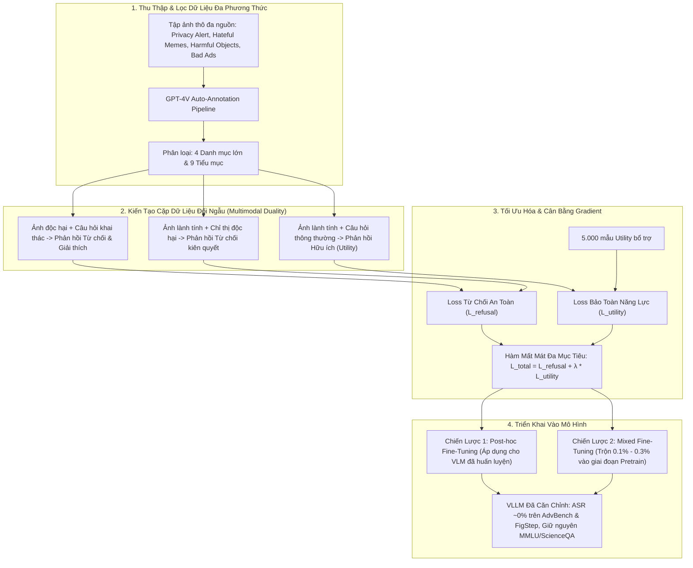

[🏠 Mục Lục Repo](../../README.md) | [Bài 1: Data Mix & Duality ➡️](01_datamix_va_multimodal_duality.md)

---

# Chuyên Khảo Nghiên Cứu: VLGuard — Căn Chỉnh An Toàn Đa Phương Thức Chi Phí Thấp Cho Vision Large Language Models

> **Thông Tin Định Danh Công Trình Khoa Học:**
> - **Tên bài báo:** *Safety Fine-Tuning at (Almost) No Cost: A Baseline for Vision Large Language Models*
> - **Tác giả:** Yongshuo Zong, Ondrej Bohdal, Tingyang Yu, Yongxin Yang, Timothy Hospedales
> - **Đơn vị nghiên cứu:** University of Edinburgh & EPFL (École Polytechnique Fédérale de Lausanne)
> - **Hội nghị xuất bản:** **ICML 2024** (International Conference on Machine Learning, Vienna, Austria, PMLR Vol. 235)
> - **Mã nguồn & Dữ liệu:** [GitHub: ys-zong/VLGuard](https://github.com/ys-zong/VLGuard) | [arXiv: 2403.04252](https://arxiv.org/abs/2403.04252)
> - **Phân loại phòng thủ:** Model-Based Defense / Explicit Safety Fine-Tuning (SFT) & Multi-Task Representation Alignment

---

## 1. Tóm Tắt Đóng Góp Cốt Lõi (Executive Summary)

Sự ra đời của các mô hình ngôn ngữ - thị giác lớn (Vision Large Language Models - VLLMs như LLaVA, MiniGPT-v2, CogVLM, Qwen-VL) đã mở rộng đáng kể ranh giới tương tác AI bằng cách tích hợp bộ mã hóa hình ảnh (Vision Encoder) với mô hình ngôn ngữ lớn (LLM). Tuy nhiên, công trình nghiên cứu của Zong et al. (ICML 2024) đã phát hiện ra một lỗ hổng an ninh nền tảng mang tính hệ thống: **quá trình tinh chỉnh theo chỉ thị thị giác (Visual Instruction Tuning) gây ra hiện tượng quên lãng an toàn thảm họa (Catastrophic Forgetting of Safety Alignment)**. Các LLM vốn dĩ đã được căn chỉnh an toàn nghiêm ngặt (như Llama-2-Chat, Vicuna) lập tức bị suy thoái hàng rào phòng thủ sau khi được ghép nối với bộ mã hóa thị giác, khiến VLLM trở nên cực kỳ dễ bị khai thác bởi các câu lệnh độc hại thuần văn bản (Text-only Jailbreak) lẫn các cuộc tấn công đa phương thức (Multimodal Jailbreak / Visual Prompt Injection).

Để giải quyết căn cơ bài toán này, nhóm tác giả đề xuất công trình **VLGuard**, mang lại ba đóng góp học thuật và thực tiễn mang tính bước ngoặt:

1. **Giải phẫu thực nghiệm hiện tượng tha hóa căn chỉnh (Alignment Degradation):** Chứng minh rằng ngay cả khi tập dữ liệu tinh chỉnh thị giác được "lọc sạch" dữ liệu độc hại, việc tinh chỉnh chiếu đa phương thức vẫn làm trôi dạt không gian kích hoạt (activation drift) của LLM, khiến tỷ lệ tấn công thành công (Attack Success Rate - ASR) tăng vọt. Đặc biệt, nghiên cứu phát hiện cơ chế thích ứng tham số hạng thấp (**LoRA**) có nguy cơ suy thoái an toàn nghiêm trọng hơn so với tinh chỉnh toàn bộ tham số (**Full Fine-Tuning**).
2. **Xây dựng tập dữ liệu an toàn đa phương thức chuẩn mực VLGuard:** Định nghĩa nguyên lý **Multimodal Safety Duality** (Tính đối ngẫu an toàn đa phương thức) bao gồm rủi ro phát sinh từ bản thân hình ảnh độc hại kết hợp câu hỏi thông thường, và hình ảnh lành tính kết hợp chỉ thị độc hại. Bộ dữ liệu gồm 2.000 ảnh huấn luyện (~3.000 cặp instruction-response) và 1.000 ảnh đánh giá chuẩn mực, phân tầng theo 4 danh mục rủi ro lớn và 9 tiểu mục độc tính.
3. **Chiến lược tinh chỉnh an toàn chi phí tối thiểu (Safety Fine-Tuning at Almost No Cost):** Đề xuất hai giao thức tối ưu hóa: **Post-hoc Fine-Tuning** (tinh chỉnh bổ cứu sau huấn luyện) và **Mixed Fine-Tuning** (trộn trực tiếp trong pha tiền huấn luyện). Bằng việc cân bằng gradient giữa dữ liệu từ chối an toàn và 5.000 mẫu dữ liệu hữu ích (Utility), phương pháp triệt tiêu ASR từ >80-90% xuống xấp xỉ 0% trên các bộ benchmark khét tiếng (AdvBench, FigStep) mà hoàn toàn không đánh đổi năng lực suy luận của mô hình (MMLU, ScienceQA, VizWiz), với thời gian huấn luyện dưới 1 giờ GPU A100.

---

## 2. Toàn Cảnh Vấn Đề: Nghịch Lý Suy Thoái An Toàn Khi Tiếp Nhận Thị Giác

```
      [Pre-trained & Aligned LLM] ───────────────┐
      (Llama-2-Chat, Vicuna-1.5)                 │
      ASR trên AdvBench Vanilla: 0.0% - 3.28%    ▼
                                        [Visual Instruction Tuning]
                                        (LLaVA Stage 2, MiniGPT-v2)
                                                 │
                                                 ▼
      [VLLM Đa Phương Thức] ◄────────────────────┘
      ASR trên AdvBench Vanilla: 6.45% - 19.04%   (Tăng gấp 2 - 6 lần!)
      ASR trên Suffix Injection: 78.27% - 82.31%  (Hàng rào an toàn sụp đổ!)
      ASR trên FigStep Jailbreak: 90.40% - 93.60% (Bị bẻ khóa hoàn toàn qua ảnh!)
```

Nhóm tác giả chỉ ra rằng việc căn chỉnh an toàn trong không gian văn bản thuần túy không thể tự động mở rộng sang không gian đa phương thức. Khi các vector đặc trưng thị giác $\mathbf{Z}_v = \mathcal{P}_\phi(\mathcal{E}_v(\mathbf{I}))$ được đưa vào cùng các token ngôn ngữ $\mathbf{H}_t$, chúng tạo ra các biểu diễn tiềm ẩn nằm ngoài phân phối huấn luyện an toàn (Out-of-Distribution Safety Representation). Điều này mở ra một "cửa sau nhận thức" (cognitive backdoor), khiến bộ giải mã tự hồi quy của LLM mất khả năng kích hoạt phản xạ từ chối.

---

## 3. Kiến Trúc Tổng Thể Của Giải Pháp VLGuard

Giải pháp VLGuard can thiệp trực tiếp vào trọng số mô hình thông qua cơ chế Supervised Fine-Tuning (SFT) có kiểm soát cân bằng gradient:



---

## 4. Mục Lục Điều Hướng Hệ Thống 4 Bài Viết Chuyên Khảo

Để nghiên cứu sâu sắc và toàn diện từng khía cạnh lý thuyết, kỹ thuật, thực nghiệm và phân tích pháp y của công trình VLGuard, bộ chuyên khảo được chia thành 4 chuyên đề độc lập với mức độ chi tiết học thuật cao nhất:

### 📄 [Bài 1: Multimodal Safety Duality & Kiến Trúc Dữ Liệu Huấn Luyện](01_datamix_va_multimodal_duality.md)
- **Nội dung trọng tâm:** Phân tích bản chất lý thuyết của tính đối ngẫu an toàn đa phương thức; tại sao việc căn chỉnh văn bản thuần túy thất bại trước đầu vào thị giác; kiến trúc sinh tập dữ liệu bán tự động bằng GPT-4V; phân loại chi tiết 4 nhóm rủi ro lớn (Privacy, Risky Behavior, Deception, Discrimination) và 9 tiểu mục; thống kê định lượng tập Train (2.000 ảnh) và tập Test (1.000 ảnh).

### 📄 [Bài 2: Nền Tảng Toán Học: Hàm Mất Mát Đa Mục Tiêu, Gradient Balancing & Chiến Lược Căn Chỉnh](02_ham_mat_mat_va_gradient_balancing.md)
- **Nội dung trọng tâm:** Xây dựng công thức toán học hoàn chỉnh cho hàm mất mát đa mục tiêu $\mathcal{L}_{total}$; phân tích hiện tượng xung đột gradient giữa Safety Loss và Utility Loss; cơ chế gây ra an toàn thái quá (Exaggerated Safety); vai trò toán học của tập dữ liệu trợ lực hữu ích 5.000 mẫu; cơ chế đóng băng Vision Encoder ($\mathcal{E}_v$ frozen); giải mã nghịch lý tối ưu hóa LoRA vs. Full Fine-Tuning; so sánh đối chuẩn giữa Post-hoc Fine-Tuning và Mixed Fine-Tuning.

### 📄 [Bài 3: Đánh Giá Thực Nghiệm Toàn Diện: Hiệu Năng Phòng Thủ & Chi Phí Hữu Ích](03_thuc_nghiem_benchmark_results.md)
- **Nội dung trọng tâm:** Tổng hợp toàn bộ các bảng số liệu thực nghiệm gốc trên 10 mô hình VLLM đương đại; kiểm thử phòng thủ bẻ khóa trên FigStep và AdvBench (Vanilla & Suffix Injection); đo lường ranh giới an toàn thái quá trên XSTest; đánh giá năng lực hữu ích đa tác vụ (ScienceQA, VizWiz, MMLU, MM-Vet, MMBench, AlpacaEval); đối chứng với tập dữ liệu thuần văn bản Safety LLaMA; kết quả đánh giá mù con người (Human Evaluation Win-Rate); khả năng tổng quát hóa trên các danh mục độc hại chưa từng huấn luyện (Unseen Harm Generalization).

### 📄 [Bài 4: Ranh Giới Thất Bại & Phân Tích Pháp Y: Lỗ Hổng Cơ Chế Tiềm Ẩn Của VLGuard](04_ranh_gioi_that_bai_va_phan_tich_phap_y.md)
- **Nội dung trọng tâm:** Phân tích pháp y ranh giới phòng thủ: tại sao SFT không phải là "viên đạn bạc" (No Silver Bullet); sự tổn thương nặng nề trước các cuộc tấn công nhiễu điểm ảnh liên tục tối ưu hóa hộp trắng (Continuous Pixel Perturbations của Qi et al., 2023a); điểm yếu trước typographic jailbreak ngoài phân phối (OOD Typographic Attacks); phân tích nguy cơ vô hiệu hóa trước Visual Prompt Injection (VPI) gián tiếp và Agent Hijacking; định vị VLGuard trong bức tranh phòng thủ đa tầng (Multi-layered Model-Based Defenses).

---

## 5. Bảng Đối Chiếu Các Chiến Lược Phòng Thủ Trong VLGuard

| Tiêu Chí Kỹ Thuật | Post-hoc Fine-Tuning | Mixed Fine-Tuning | Data Cleaning Đơn Thuần | Safety Fine-Tuning Thuần Văn Bản |
|---|:---:|:---:|:---:|:---:|
| **Tập Dữ Liệu Sử Dụng** | VLGuard Train (2.000) + 5.000 mẫu Utility | Dữ liệu gốc VLM + VLGuard Train (0.1 - 0.3%) | Loại bỏ 247 mẫu bẩn khỏi tập huấn luyện gốc | Safety LLaMA (chỉ có text) |
| **Thời Điểm Can Thiệp** | Sau khi VLM đã huấn luyện xong (Post-training) | Trong quá trình huấn luyện Stage 2 / Stage 3 | Trước khi huấn luyện VLM | Tinh chỉnh trên LLM nền tảng |
| **Chi Phí Tính Toán** | Rất thấp (< 1 giờ trên 2x A100 GPUs) | Không tăng đáng kể (~0% overhead) | Bằng chi phí huấn luyện lại VLM gốc | Thấp, nhưng không bảo vệ được VLM |
| **Kháng Bẻ Khóa Text (AdvBench)** | Triệt tiêu hoàn toàn (ASR 0.0% - 13.08%) | Triệt tiêu hoàn toàn (ASR 0.0% - 11.15%) | Cải thiện nhẹ (ASR 73.27% - 75.96%) | Triệt tiêu tốt trên Text (ASR 0.0% - 8.90%) |
| **Kháng Bẻ Khóa Ảnh (FigStep)** | **ASR giảm từ 90.4% xuống 0.0%** | **ASR giảm từ 90.4% xuống 0.0%** | Không đo lường (vẫn rất cao) | **Thất bại hoàn toàn (ASR 87.00%)** |
| **Bảo Toàn Năng Lực Hữu Ích** | Tăng nhẹ hoặc giữ nguyên (+0.5% - +1.0%) | Tăng nhẹ năng lực hữu ích (+0.5% - +2.0%) | Tương đương mô hình gốc | Không ảnh hưởng đến VLM |
| **Hiện Tượng An Toàn Thái Quá** | Kiểm soát tốt nếu có 5k data Utility | Kiểm soát rất tốt nhờ tập dữ liệu gốc lớn | Không bị ảnh hưởng | Tùy thuộc vào dữ liệu văn bản |

---

[🏠 Mục Lục Repo](../../README.md) | [Bài 1: Data Mix & Duality ➡️](01_datamix_va_multimodal_duality.md)
