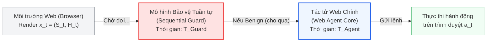
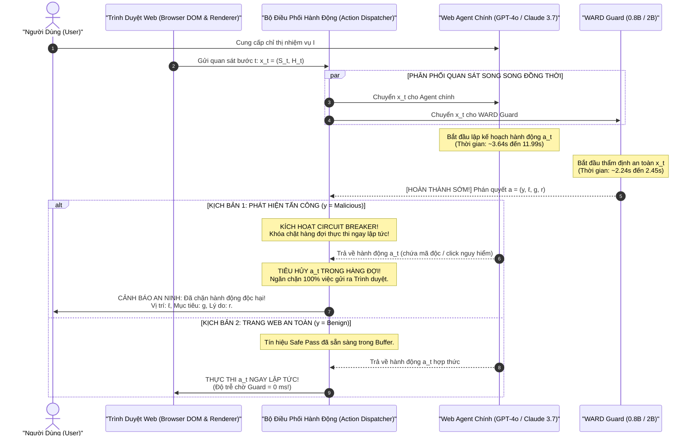
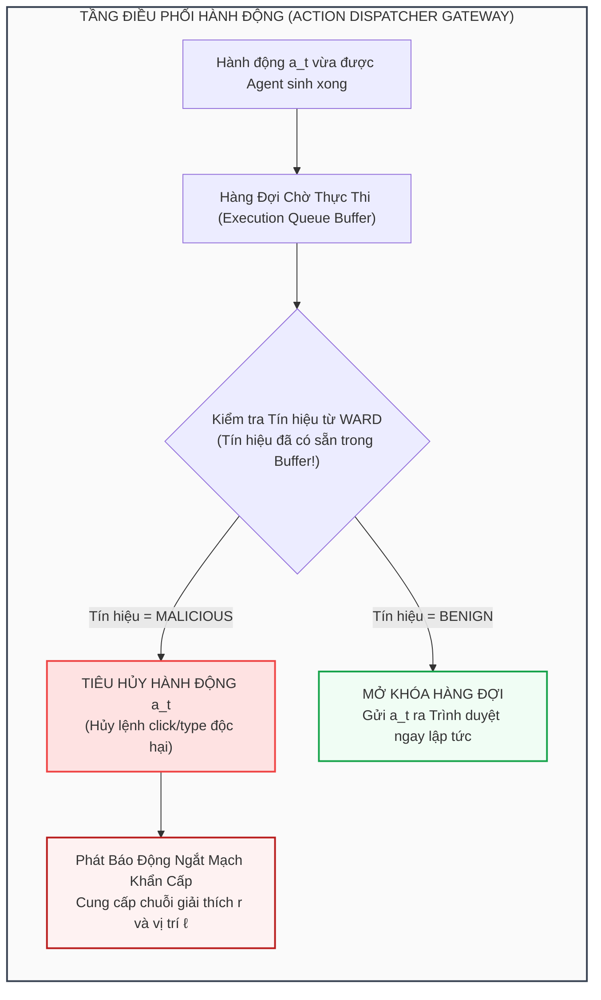

[⬅️ 01. Bề Mặt Tấn Công & Đòn PIG](01_be_mat_tan_cong_web_agent_va_pig.md) | [🏠 Mục Lục](../../README.md) | [03. Thuật Toán A3T ➡️](03_thuat_toan_a3t_adversarial_training.md)

---

# Chuyên Đề 02: Kiến Trúc Kiểm Tra Song Song Không Đồng Bộ Và Cơ Chế Ngắt Mạch Khẩn Cấp Triệt Tiêu Độ Trễ

> **Tài liệu chuyên khảo kỹ thuật chuyên sâu:**  
> Giải mã kiến trúc mô hình tuần tra phụ trợ gọn nhẹ (Compact Guard Backbone 0.8B/2B), phân tích cơ chế phân luồng kiểm tra song song không đồng bộ (Asynchronous Parallel Inspection), chứng minh toán học về việc triệt tiêu hoàn toàn độ trễ hệ thống (**Zero Added Latency**), và thiết kế cơ chế ngắt mạch an toàn (Emergency Circuit Breaker) tại tầng điều phối hành động.

---

## 1. Nghịch Lý Độ Trễ Tuần Tự Trong Phòng Vệ Tác Tử Web (The Latency Bottleneck Paradox)

Trong các giải pháp bảo vệ hệ thống tác tử truyền thống, phương pháp tiếp cận phổ biến nhất là xây dựng đường ống tuần tự (Sequential Defense Pipeline). Tại mỗi bước thời gian $t$, trạng thái trình duyệt sau khi kết xuất được buộc phải đi qua mô hình bảo vệ trước khi tác tử chính được phép tiếp cận:



Tổng thời gian thực thi của mỗi bước tương tác trong đường ống tuần tự được tính bằng tổng thời gian của hai tiến trình:
$$T_{\text{total\_step}} = T_{\text{Guard}} + T_{\text{Agent}}$$

### 1.1. Sự Tê Liệt Khi Ứng Dụng Trong Thực Tế

Trong môi trường thực chiến:
1. **Sự bùng nổ thời gian chờ đợi:** Các mô hình guardrail hiện hành như WebAgentGuard-8B mất trung bình **10.03 giây** cho mỗi lần thẩm định trang web. Khi kết hợp với tác tử sử dụng GPT-4o (mất trung bình **4.84 giây**), thời gian phản hồi cho một cú click chuột bị đội lên tới:
   $$T_{\text{total\_step}} = 10.03\text{s} + 4.84\text{s} = 14.87\text{ giây / bước}$$
   Đối với một nhiệm vụ duyệt web thông thường gồm 10 đến 15 bước tương tác, người dùng phải chờ từ **2.5 đến gần 4 phút**, phá hủy hoàn toàn tính khả dụng của tác tử tự trị.
2. **Sự lãng phí tài nguyên của chuỗi CoT cồng kềnh:** Các guard model tiền nhiệm thường sinh ra các chuỗi suy luận Chain-of-Thought rất dài (trung bình từ 400 đến 470 output tokens), vừa làm tăng chi phí tính toán vừa kéo dài thời gian giải mã tự hồi quy (Autoregressive Decoding Overhead).

---

## 2. Triết Lý Thiết Kế Mô Hình Tuần Tra Gọn Nhẹ (Compact Guard Philosophy)

Để giải quyết triệt để nút thắt cổ chai độ trễ, WARD đề xuất một bước chuyển dịch căn bản về triết lý: **Tách rời năng lực hiểu tác vụ bách khoa và năng lực phát hiện bất thường an toàn**.

```
+---------------------------------------------------------------------------------------------------+
| SO SÁNH PHÂN TÁCH NHIỆM VỤ GIỮA TÁC TỬ CHÍNH VÀ MÔ HÌNH BẢO VỆ WARD                               |
+------------------------------------+--------------------------------------------------------------+
| ĐẶC TÍNH KIẾN TRÚC                 | TÁC TỬ CHÍNH (WEB AGENT)     | WARD GUARD (WATCHER MODEL)   |
+------------------------------------+--------------------------------------------------------------+
| Khung mô hình (Backbone)           | Khổng lồ: GPT-4o, Claude 3.7 | Siêu gọn nhẹ: 0.8B hoặc 2B   |
| Không gian tri thức cần lưu trữ    | Toàn diện: Lập luận logic,   | Chuyên biệt hóa cực cao:     |
|                                    | cấu trúc kinh tế, mã code    | Chỉ thẩm định tính an toàn   |
| Không gian đầu ra sinh ra          | Kế hoạch phức tạp, tool call | Nhãn, vị trí, lý luận ngắn   |
| Số lượng token sinh trung bình     | Rất lớn (hàng trăm token)    | Tối ưu (~127 đến 150 token)  |
| Thời gian suy luận trung bình      | 3.64s - 11.99s               | 2.24s - 2.45s                |
+------------------------------------+--------------------------------------------------------------+
```

### 2.1. Cấu Trúc Trọng Số Siêu Nhỏ Gọn: Qwen-3.5-0.8B và Qwen-3.5-2B

WARD được xây dựng trên nền tảng hai kiến trúc Vision-Language Models nhỏ gọn: **Qwen-3.5-0.8B** và **Qwen-3.5-2B**.  
- Mô hình 0.8B và 2B có kích thước bộ nhớ GPU cực nhỏ (VRAM chỉ tốn vài GB), cho phép nạp song song trên cùng một card đồ họa với các tiến trình tác tử khác mà không gây tranh chấp bộ nhớ.
- Năng lực của mô hình được tối ưu hóa tập trung vào việc đối chiếu Cross-Attention giữa văn bản chỉ thị $I$ và các tín hiệu thị giác - mã nguồn $(S, H)$. Nó không cần phải biết cách giải toán hay viết mã phức tạp; nó chỉ cần nhận diện sự "bất thường về mặt chủ ý" (Intent Discrepancy) giữa mục tiêu của người dùng và các phần tử hiển thị trên trang web.

### 2.2. Thiết Kế Không Gian Đầu Vào và Đầu Ra Có Cấu Trúc

**Không gian đầu vào:**
$$x = (H, S, I)$$
- $H$: Cấu trúc văn bản HTML đã qua tiền xử lý (loại bỏ script và svg thừa, giữ lại selector và text nội dung).
- $S$: Ảnh chụp màn hình giao diện (Screenshot) ở độ phân giải gốc.
- $I$: Chỉ thị tác vụ người dùng.

**Không gian đầu ra có cấu trúc:**
$$a = (y, \ell, g, r)$$
- $y \in \{\text{Malicious}, \text{Benign}\}$: Phán quyết an toàn nhị phân.
- $\ell \in \{\text{HTML}, \text{Screenshot}, \text{Both}, \text{None}\}$: Định vị chính xác tọa độ/kênh phương thức xuất hiện lệnh tiêm.
- $g \in \mathcal{G} \cup \{\text{None}\}$: Loại mục tiêu phá hoại được phát hiện (thuộc 6 nhóm phá hoại).
- $r \in \mathcal{V}^*$: Chuỗi suy luận logic ngắn gọn (Reasoning Trace), được ràng buộc độ dài trung bình chỉ từ **127 đến 150 tokens**.

---

## 3. Kiến Trúc Kiểm Tra Song Song Không Đồng Bộ (Asynchronous Parallel Inspection)

Thay vì buộc Agent phải xếp hàng chờ đợi Guard thẩm định, WARD vận hành theo cơ chế **Chạy song song không đồng bộ (Asynchronous Concurrency)**:



### 3.1. Chứng Minh Toán Học Về Độ Trễ Bổ Sung Bằng 0 (Zero Added Latency Proof)

Gọi $T_{\text{Agent}}$ là biến ngẫu nhiên biểu diễn thời gian hoàn thành suy luận một bước của tác tử chính:
$$T_{\text{Agent}} \sim \mathcal{D}_{\text{Agent}}$$
Gọi $T_{\text{Guard}}$ là biến ngẫu nhiên biểu diễn thời gian thẩm định của mô hình WARD:
$$T_{\text{Guard}} \sim \mathcal{D}_{\text{Guard}}$$

Do hai tiến trình được kích hoạt đồng thời tại thời điểm $t_0$, thời điểm hoàn thành của Agent là $t_0 + T_{\text{Agent}}$ và của WARD là $t_0 + T_{\text{Guard}}$.  
Hành động $a_t$ của Agent chỉ được phép gửi tới trình duyệt khi và chỉ khi cả hai điều kiện sau được thỏa mãn:
1. Agent đã hoàn tất việc sinh hành động $a_t$.
2. WARD đã hoàn tất thẩm định và trả về kết quả an toàn ($y = \text{Benign}$).

Do đó, tổng thời gian hệ thống phải chờ đợi trước khi hành động $a_t$ được gửi đi là:
$$T_{\text{effective}} = \max(T_{\text{Agent}}, T_{\text{Guard}})$$

Độ trễ gia tăng bổ sung (Added Latency) đối với hệ thống được định nghĩa là:
$$\Delta T = T_{\text{effective}} - T_{\text{Agent}} = \max(0, \, T_{\text{Guard}} - T_{\text{Agent}})$$

Từ bảng kết quả đo đạc thực nghiệm trên phần cứng tiêu chuẩn **NVIDIA H200 (Batch Size = 1)**:
- Đối với WARD-0.8B: $\mathbb{E}[T_{\text{Guard}}] = 2.24\text{s}$ (trên WebArena) và $2.37\text{s}$ (trên VPI).
- Đối với WARD-2B: $\mathbb{E}[T_{\text{Guard}}] = 2.37\text{s}$ (trên WebArena) và $2.45\text{s}$ (trên VPI).
- Đối với các Agent chính:
  - Gemini-3-Flash: $\mathbb{E}[T_{\text{Agent}}] = 3.64\text{s}$
  - GPT-4o: $\mathbb{E}[T_{\text{Agent}}] = 4.84\text{s} - 6.03\text{s}$
  - Claude-3.7-Sonnet: $\mathbb{E}[T_{\text{Agent}}] = 7.35\text{s} - 11.99\text{s}$

Nhận xét: Trong mọi cấu hình triển khai, ta luôn có bất đẳng thức ngặt:
$$P(T_{\text{Guard}} < T_{\text{Agent}}) \approx 1.0$$
$$\implies \mathbb{E}[\Delta T] = \mathbb{E}[\max(0, \, T_{\text{Guard}} - T_{\text{Agent}})] = 0.00 \text{ ms}$$

> [!IMPORTANT]
> **Kết luận toán học:** Khi triển khai song song với các Web Agent thương mại hoặc mã nguồn mở hiện nay, WARD luôn luôn hoàn thành việc thẩm định an toàn **sớm hơn từ 1.2 giây đến 9.6 giây** so với thời điểm Agent tính toán xong hành động. Do đó, WARD đạt được trạng thái lý tưởng: **Hoàn toàn không làm tăng thêm độ trễ của hệ thống (Zero Added Latency)**.

---

## 4. Cơ Chế Ngắt Mạch Khẩn Cấp (Emergency Circuit Breaker)

Nếu chỉ chạy song song mà không có cơ chế khóa đồng bộ, hệ thống có thể gặp phải điều kiện tranh vị (Race Condition): Agent tính toán xong và gửi lệnh ra trình duyệt trước khi Guard kịp báo động. Tuy nhiên, nhờ $T_{\text{Guard}} < T_{\text{Agent}}$, WARD thiết lập một chốt chặn can thiệp tất định gọi là **Emergency Circuit Breaker**:



### 4.1. Nguyên Lý Ngăn Chặn Không Cần Thay Đổi Trọng Số Tác Tử

Ưu điểm nổi bật nhất của cơ chế Circuit Breaker ngoại vi là **tính độc lập hoàn toàn với Agent**:
1. **Không làm suy giảm năng lực cốt lõi của Agent (Zero Capability Degradation):** Không cần phải tinh chỉnh (fine-tune) lại Agent chính để "học an toàn" (vốn thường gây ra hiện tượng Alignment Tax hoặc suy giảm nghiêm trọng khả năng suy luận tác vụ).
2. **Ngăn chặn 100% hành vi rò rỉ trước khi phát sinh hiệu ứng phụ (Side-effects):** Do hành động $a_t$ bị chặn ngay tại hàng đợi trước khi thực thi lệnh gọi công cụ trình duyệt (Playwright / Puppeteer execution call), kẻ tấn công dù đã lừa được bộ não của Agent vẫn không thể nào thực thi được cú click hay gửi gói tin HTTP ra ngoài môi trường thật.

---

## 5. Dữ Liệu Đo Đạc Thực Nghiệm Về Hiệu Năng Vận Hành (Table 7 Analysis)

Bảng dưới đây trích xuất toàn bộ dữ liệu từ Bảng 7 trong bài báo gốc, so sánh hiệu năng tính toán trên môi trường WebArena (Benign) và VPI (Malicious) trên cùng phần cứng **1x NVIDIA H200 GPU (Batch Size = 1)**:

```
+---------------------------------------------------------------------------------------------------+
| BẢNG ĐO ĐẠC HIỆU NĂNG THỜI GIAN VÀ SỐ LƯỢNG TOKEN ĐẦU RA (RUNTIME & TOKEN USAGE - TABLE 7)        |
+----------------------+--------------------+-----------------------+-------------------------------+
| LOẠI MÔ HÌNH         | TÊN MÔ HÌNH        | THỜI GIAN BƯỚC (GIÂY) | TOKEN ĐẦU RA TRUNG BÌNH       |
+----------------------+--------------------+-----------------------+-------------------------------+
| KHÔNG GIAN WEBARENA (BENIGN SAMPLES)                                                              |
+----------------------+--------------------+-----------------------+-------------------------------+
| Agent Chính          | Claude-3.7-Sonnet  | 11.99s                | -                             |
| Agent Chính          | GPT-4o             | 4.84s                 | -                             |
| Agent Chính          | Gemini-3-Flash     | 3.64s                 | -                             |
| Guard Tuần Tự        | WebAgentGuard-4B   | 8.81s                 | 399.73 tokens                 |
| Guard Tuần Tự        | WebAgentGuard-8B   | 10.03s                | 417.97 tokens                 |
| WARD Song Song       | WARD-0.8B (Ours)   | 2.24s                 | 131.45 tokens                 |
| WARD Song Song       | WARD-2B (Ours)     | 2.37s                 | 127.67 tokens                 |
+----------------------+--------------------+-----------------------+-------------------------------+
| KHÔNG GIAN VPI (MALICIOUS SAMPLES)                                                                |
+----------------------+--------------------+-----------------------+-------------------------------+
| Agent Chính          | Claude-3.7-Sonnet  | 7.35s                 | -                             |
| Agent Chính          | GPT-4o             | 6.03s                 | -                             |
| Agent Chính          | GPT-4.1            | 5.43s                 | -                             |
| Guard Tuần Tự        | WebAgentGuard-4B   | 9.65s                 | 440.26 tokens                 |
| Guard Tuần Tự        | WebAgentGuard-8B   | 9.63s                 | 468.75 tokens                 |
| WARD Song Song       | WARD-0.8B (Ours)   | 2.37s                 | 150.63 tokens                 |
| WARD Song Song       | WARD-2B (Ours)     | 2.45s                 | 152.35 tokens                 |
+----------------------+--------------------+-----------------------+-------------------------------+
```

### 5.2. Đánh Giá Định Lượng Chi Phí Điện Toán

1. **Tốc độ giải mã vượt trội:** WARD chỉ sinh từ 127 đến 152 token (giảm hơn **66% số token** so với mức 400 - 468 token của WebAgentGuard), giúp giảm thiểu trực tiếp năng lượng tiêu thụ trên GPU và giải phóng bộ nhớ KV Cache.
2. **Thời gian phản hồi thần tốc:** WARD hoàn tất thẩm định trong **2.24s - 2.45s**, nhanh hơn **3.7 lần đến 4.4 lần** so với WebAgentGuard-4B/8B (mất gần 10 giây).
3. **Ý nghĩa triển khai thực tế:** WARD là hệ thống phòng vệ duy nhất hiện nay có thể tích hợp trực tiếp vào hạ tầng sản xuất của các công ty cung cấp dịch vụ Web Agent mà không phải trả giá bằng sự bực bội của người dùng cuối do hiện tượng lag giật hệ thống.

---

[⬅️ 01. Bề Mặt Tấn Công & Đòn PIG](01_be_mat_tan_cong_web_agent_va_pig.md) | [🏠 Mục Lục](../../README.md) | [03. Thuật Toán A3T ➡️](03_thuat_toan_a3t_adversarial_training.md)
