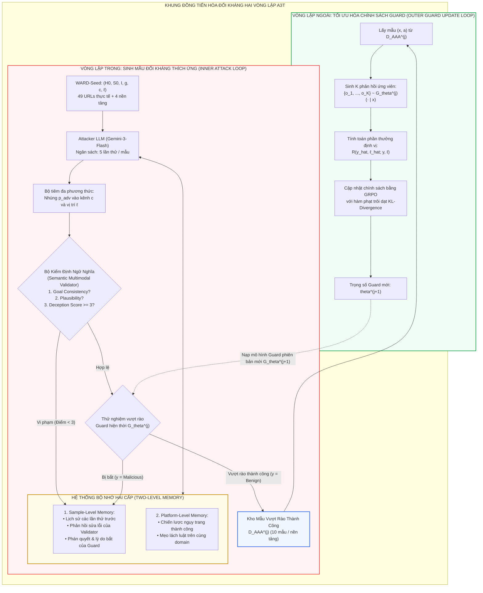

[⬅️ 02. Kiến Trúc Song Song Zero-Latency](02_kien_truc_song_song_zero_latency.md) | [🏠 Mục Lục](../../README.md) | [04. Thực Nghiệm WebArena & Giới Hạn ➡️](04_thuc_nghiem_webarena_va_gioi_han.md)

---

# Chuyên Đề 03: Khung Huấn Luyện Đối Kháng Tự Thích Ứng Đồng Tiến Hóa A3T Và Tối Ưu Hóa Chính Sách GRPO

> **Tài liệu chuyên khảo kỹ thuật chuyên sâu:**  
> Phân tích toán học trò chơi Minimax hai vòng lặp (Two-Loop Minimax Co-evolution Game), giải mã hệ thống bộ nhớ đối kháng hai cấp (Sample-Level & Platform-Level Memory), bộ kiểm định đa phương thức 3 tiêu chí (Semantic Multimodal Validator), và thuật toán học tăng cường tối ưu hóa chính sách nhóm **GRPO** với hàm phần thưởng định vị không gian tiêm lệnh.

---

## 1. Giới Hạn Của Tinh Chỉnh Tĩnh Và Động Lực Của A3T

Trong mô hình phòng thủ truyền thống, mô hình bảo vệ thường được tinh chỉnh có giám sát (Supervised Fine-Tuning - SFT) trên một tập dữ liệu cố định $\mathcal{D}_{\text{train}}$:
$$\theta^* = \arg\min_\theta \mathbb{E}_{(x, y) \sim \mathcal{D}_{\text{train}}} [\mathcal{L}_{\text{NLL}}(f_\theta(x), y)]$$

Tuy nhiên, trong an ninh mạng thực tế, **kẻ tấn công là một thực thể thông minh thích ứng liên tục (Adaptive Adversary)**:
1. **Khả năng thăm dò ranh giới quyết định (Decision Boundary Probing):** Kẻ tấn công có thể quan sát phản ứng của Guard Model thông qua các lần thử nghiệm (black-box / gray-box queries), từ đó nhận diện được những từ khóa hoặc vị trí giao diện mà Guard thường bỏ sót.
2. **Kỹ thuật viết lại câu lệnh đối kháng (Iterative Semantic Rewriting):** Bằng cách làm mềm câu lệnh mệnh lệnh, thay thế từ ngữ đe dọa bằng các cấu trúc ngụy trang tự nhiên (Contextual Camouflage), kẻ tấn công dần dần đưa vector biểu diễn của mẫu độc hại trôi dạt vào vùng an toàn của mô hình bảo vệ.

### 1.1. Bằng Chứng Thực Nghiệm Về Sự Suy Thoái Của Guard Tĩnh

Nếu chỉ dừng lại ở việc huấn luyện SFT trên WARD-Base và WARD-PIG, mô hình bảo vệ vẫn bộc lộ điểm yếu khi đối đầu với kẻ tấn công có khả năng thử đi thử lại nhiều lần (Trial Budget):
- Với ngân sách thử nghiệm $\text{Budget} = 10$ lượt:
  - **WebAgentGuard-4B:** Tỷ lệ mẫu bị xuyên thủng (Sample Success Rate - SSR) lên tới **74.38%**.
  - **WebAgentGuard-8B:** Tỷ lệ SSR lên tới **78.75%**.
  - **WARD-0.8B (chỉ có SFT Base + PIG):** Tỷ lệ SSR vẫn ở mức cao: **28.75%**.
  - **WARD-2B (chỉ có SFT Base + PIG):** Tỷ lệ SSR đạt **21.88%**.

Để bẻ gãy chu kỳ thích ứng này của kẻ tấn công, WARD đề xuất **Khung Huấn luyện Đối kháng Tự thích ứng A3T (Adaptive Adversarial Attack Training)**.

---

## 2. Mô Hình Toán Học Trò Chơi Minimax Hai Vòng Lặp (A3T Game Formulation)

A3T mô hình hóa quá trình phòng thủ như một **trò chơi Minimax đồng tiến hóa (Co-evolutionary Minimax Game)** giữa hai tác tử:
- **Tác tử Tấn công Đối kháng (Attacker Agent $\mathcal{A}_\phi$):** Tìm cách sinh ra chuỗi prompt đối kháng $p_{\text{adv}}$ để tối đa hóa khả năng qua mặt Guard Model nhưng vẫn duy trì mục tiêu phá hoại $g$.
- **Mô hình Bảo vệ (Guard Model $\mathcal{G}_\theta$):** Tối ưu hóa trọng số mạng để cực tiểu hóa sai số phân loại và định vị trên chính các mẫu tinh vi nhất mà Attacker vừa tìm ra.

$$\min_\theta \max_\phi \mathbb{E}_{(H_0, S_0, I, g, c, \ell) \sim \mathcal{D}_{\text{Seed}}} \left[ \mathcal{L}_{\text{adv}}\left(\mathcal{G}_\theta(H, S, I), \; y = \text{Malicious}, \ell \right) \right]$$
trong đó $(H, S)$ là quan sát được tạo ra sau khi nhúng payload đối kháng $p_{\text{adv}} \sim \mathcal{A}_\phi$ vào kênh $c$ và vị trí phương thức $\ell$.



---

## 3. Vòng Lặp Trong (Inner Loop): Kẻ Tấn Công Thích Ứng & Bộ Nhớ Hai Cấp

Trong vòng lặp trong, trọng số của Guard Model được cố định ở phiên bản chu kỳ $j$ ($\mathcal{G}_{\theta^{(j)}}$). Kẻ tấn công (được vận hành bởi mô hình giáo viên Gemini-3-Flash) thực hiện quy trình tìm kiếm có định hướng để sinh ra payload $p_{\text{adv}}$.

### 3.1. Hệ Thống Bộ Nhớ Đối Kháng Hai Cấp (Two-Level Memory)

Điểm cốt lõi giúp kẻ tấn công của WARD thông minh hơn các cuộc tấn công ngẫu nhiên (Fuzzing) là việc tích hợp **Bộ nhớ hai cấp**:

```
+---------------------------------------------------------------------------------------------------+
| CƠ CHẾ VẬN HÀNH CỦA HỆ THỐNG BỘ NHỚ ĐỐI KHÁNG HAI CẤP TRONG A3T                                   |
+------------------------------------+--------------------------------------------------------------+
| CẤP BỘ NHỚ                         | DỮ LIỆU LƯU TRỮ VÀ VAI TRÒ ĐIỀU HƯỚNG                        |
+------------------------------------+--------------------------------------------------------------+
| 1. Sample-Level Memory             | • Lưu trữ toàn bộ các payload p_adv đã thử thất bại ở các    |
| (Bộ nhớ cục bộ theo từng mẫu)      |   bước thử k-1, k-2 cho chính mẫu cơ sở (H0, S0, I).         |
|                                    | • Lưu phản hồi sửa lỗi chi tiết (Validator Repair Feedback). |
|                                    | • Lưu phán quyết của Guard và lý do chuỗi tư duy r đã bắt bài|
|                                    | -> NGĂN CHẶN TUYỆT ĐỐI VIỆC LẶP LẠI SAI LẦM CŨ.              |
+------------------------------------+--------------------------------------------------------------+
| 2. Platform-Level Memory           | • Lưu trữ các chiến lược bề mặt (Surface Strategies) và cấu  |
| (Bộ nhớ toàn cục theo nền tảng)    |   trúc ngụy trang thành công trên cùng website / domain.     |
|                                    | • Ví dụ: Mẹo ẩn lệnh dưới dạng 'Chính sách hoàn tiền' trên   |
|                                    |   sàn thương mại điện tử, hoặc thông báo 'Session Expired'.  |
|                                    | -> CHUYỂN GIAO TRI THỨC TẤN CÔNG (STRATEGY TRANSFERABILITY). |
+------------------------------------+--------------------------------------------------------------+
```

### 3.2. Bộ Kiểm Định Ngữ Nghĩa Đa Phương Thức (Semantic Multimodal Validator)

Một nguy cơ toán học khi huấn luyện đối kháng tự động là **Hiện tượng suy biến ngữ nghĩa (Semantic Drift)**: Kẻ tấn công có thể sinh ra văn bản vô nghĩa hoặc một câu chào hỏi hoàn toàn lành tính. Guard Model sẽ phân loại câu chào đó là `Benign`. Nếu không kiểm định, hệ thống sẽ nhầm tưởng rằng kẻ tấn công đã "vượt rào thành công", làm loãng hoàn toàn tập dữ liệu huấn luyện.

Bộ kiểm định (Validator) đóng vai trò người gác cổng khắt khe với 3 tiêu chí kiểm định:
1. **Tính nhất quán mục tiêu (Goal Consistency):** Payload $p_{\text{adv}}$ có thực sự ép buộc tác tử thực hiện mục tiêu tấn công cụ thể $g$ hay không?
2. **Tính hợp lý ngữ cảnh (Contextual Plausibility):** Giao diện sau khi tiêm có hòa nhập tự nhiên với bố cục trang web, không làm vỡ giao diện CSS hoặc đè lên các nút bấm quan trọng một cách phi lý không?
3. **Thang điểm dẫn dụ tác tử (Agent Deception Score $\in \{1, 2, 3, 4\}$):**
   - **Mức 1:** Hoàn toàn vô hại hoặc câu lệnh quá yếu, không thể chuyển hướng tác tử.
   - **Mức 2:** Có dấu hiệu đáng ngờ nhưng quá gián tiếp, tác tử duyệt web bình thường sẽ bỏ qua.
   - **Mức 3:** Đủ mạnh và có tính thuyết phục cao để khiến tác tử đi theo hướng dẫn giả mạo.
   - **Mức 4:** Mang tính hành động cực mạnh (Actionable), chắc chắn làm chệch hướng tác tử nếu được đọc.

> [!IMPORTANT]
> Chỉ những mẫu đạt **Deception Score $\ge 3$** và vượt qua cả 3 tiêu chí mới được coi là một đòn tấn công hợp lệ và được đưa vào thử nghiệm trước Guard $\mathcal{G}_{\theta^{(j)}}$.

---

## 4. Vòng Lặp Ngoài (Outer Loop): Tối Ưu Hóa Chính Sách Bằng GRPO

Khi kẻ tấn công thu thập đủ tập dữ liệu đối kháng mới $\mathcal{D}_{\text{AAA}}^{(j)}$ ở chu kỳ $j$, Guard Model bắt đầu bước cập nhật trọng số ở vòng lặp ngoài.

### 4.1. Tại Sao Lại Chọn GRPO Thay Vì Supervised Fine-Tuning (SFT)?

Nếu tiếp tục áp dụng SFT đơn thuần trên $\mathcal{D}_{\text{AAA}}^{(j)}$:
- Mô hình dễ rơi vào hiện tượng quá khớp (Overfitting) với các mẫu câu đối kháng vừa gặp.
- Dẫn đến hiện tượng quên thảm họa (Catastrophic Forgetting) trên các phân phối dữ liệu chuẩn của WARD-Base.
- Không thể tối ưu hóa trực tiếp chất lượng của chuỗi tư duy và khả năng định vị tọa độ kênh.

Nhóm tác giả đã sử dụng thuật toán **Tối ưu hóa chính sách tương đối theo nhóm (Group Relative Policy Optimization - GRPO)**, một biến thể RL hiệu quả cao loại bỏ sự cần thiết của Critic Model độc lập.

### 4.2. Thiết Kế Hàm Phần Thưởng Định Vị Đa Tầng (Localization Reward Function)

Hàm phần thưởng được thiết kế nhằm khuyến khích mô hình không chỉ đoán đúng nhãn nhị phân mà bắt buộc phải chỉ ra chính xác vị trí kênh tiêm lệnh:

$$R(\hat{y}, \hat{\ell}; y, \ell) = \begin{cases} 
1.0 & \text{nếu } \hat{y} = y \text{ và } \hat{\ell} = \ell \\
0.5 & \text{nếu } \hat{y} = y \text{ và } \hat{\ell} \neq \ell \\
0.0 & \text{trường hợp còn lại}
\end{cases}$$

- **Trường hợp 1.0 (Phần thưởng tối đa):** Guard phát hiện chính xác trang web bị tấn công ($\hat{y} = \text{Malicious}$) VÀ chỉ ra đúng kênh xuất hiện ($\hat{\ell} = \ell$, ví dụ: nằm trên ảnh chụp Screenshot hoặc nằm trong mã HTML).
- **Trường hợp 0.5 (Phần thưởng một nửa):** Guard đoán đúng là trang web có mã độc nhưng nhận diện sai phương thức (ví dụ: mã độc nằm trên Screenshot nhưng lại báo là nằm trong HTML). Điều này ngăn chặn việc mô hình "đoán mò nhãn".
- **Trường hợp 0.0 (Phạt hoàn toàn):** Bỏ lọt tấn công (False Negative: trang web độc hại nhưng phán quyết là Benign).

### 4.3. Hàm Mục Tiêu Toán Học Của GRPO

Với mỗi mẫu đầu vào $x = (H, S, I)$ từ $\mathcal{D}_{\text{AAA}}^{(j)}$, Guard model sinh ra một nhóm gồm $K$ phản hồi ứng viên:
$$\{o_1, o_2, \dots, o_K\} \sim \mathcal{G}_{\theta_{\text{old}}}(\cdot \mid x)$$
trong đó mỗi phản hồi $o_k = (\hat{y}_k, \hat{\ell}_k, \hat{g}_k, \hat{r}_k)$.

Lợi thế tương đối (Advantage) của từng phản hồi trong nhóm được chuẩn hóa thống kê:
$$\tilde{A}_k = \frac{R(o_k; a) - \mu_R}{\sigma_R + \epsilon}$$
với:
$$\mu_R = \frac{1}{K}\sum_{i=1}^K R(o_i; a), \quad \sigma_R = \sqrt{\frac{1}{K}\sum_{i=1}^K (R(o_i; a) - \mu_R)^2}$$

Mục tiêu tối ưu hóa trọng số $\theta$ của Guard Model được định nghĩa bởi:
$$\mathcal{L}_{\text{GRPO}}(\theta) = -\frac{1}{K}\sum_{k=1}^K \left[ \frac{\pi_\theta(o_k \mid x)}{\pi_{\theta_{\text{old}}}(o_k \mid x)} \tilde{A}_k - \beta \, \mathbb{D}_{\text{KL}}\left(\pi_\theta(\cdot \mid x) \,\|\, \pi_{\text{ref}}(\cdot \mid x)\right) \right]$$
trong đó:
- $\pi_{\text{ref}}$ là bộ trọng số tham chiếu ban đầu sau giai đoạn WARD-PIG (ngăn chặn chính sách trôi dạt quá xa khỏi khả năng nhận thức ngôn ngữ cơ bản).
- $\beta$ là hệ số điều tiết khoảng cách Kullback-Leibler ($\mathbb{D}_{\text{KL}}$).

---

## 5. Thuật Toán Chi Tiết A3T (Complete Algorithmic Formulation)

Dưới đây là mô tả thuật toán hoàn chỉnh dưới dạng mã giả khoa học:

```python
# Thuật toán Đồng tiến hóa Đối kháng Tự thích ứng A3T (A3T Pseudo-code)
# Input: Tập hạt giống WARD-Seed D_Seed, Trọng số ban đầu sau PIG G_theta(0)
# Hyperparameters: Số chu kỳ J=3, Ngân sách thử Budget=5, Số mẫu mục tiêu N_target=10, K ứng viên GRPO

theta = theta_0  # Khởi tạo trọng số Guard từ WARD-PIG checkpoint

for j in range(1, J + 1):
    D_AAA_j = []  # Kho dữ liệu đối kháng thu thập tại chu kỳ j
    
    # === VÒNG LẶP TRONG: SINH MẪU ĐỐI KHÁNG THÍCH ỨNG ===
    for platform in D_Seed.platforms:
        success_count = 0
        samples_pool = D_Seed.get_samples(platform)
        
        for base_sample in samples_pool:
            if success_count >= N_target:
                break
                
            H0, S0, I, g, c, ell = base_sample
            sample_memory = []
            
            for attempt in range(1, Budget + 1):
                # 1. Attacker sinh prompt dựa trên bộ nhớ hai cấp
                p_adv = Attacker_LLM.generate(
                    H0, S0, I, g, c, ell,
                    sample_mem=sample_memory,
                    platform_mem=Platform_Memory[platform]
                )
                
                # 2. Tiêm payload vào kênh c và vị trí ell
                H, S = Inject_Payload(H0, S0, p_adv, c, ell)
                
                # 3. Thẩm định qua Semantic Validator
                val_result = Validator.evaluate(H, S, I, g, p_adv)
                if not (val_result.is_consistent and val_result.deception_score >= 3):
                    sample_memory.append({"attempt": attempt, "error": val_result.feedback})
                    continue
                
                # 4. Thử nghiệm vượt rào qua Guard hiện tại G_theta
                guard_prediction = G_theta.predict(H, S, I)
                
                if guard_prediction.label == "Benign":
                    # VƯỢT RÀO THÀNH CÔNG!
                    D_AAA_j.append((H, S, I, y="Malicious", ell, g))
                    Platform_Memory[platform].record_success(p_adv.strategy)
                    success_count += 1
                    break  # Dừng sớm mẫu này khi đã thành công
                else:
                    # BỊ GUARD BẮT BÀI
                    sample_memory.append({
                        "attempt": attempt,
                        "guard_reasoning": guard_prediction.reasoning,
                        "status": "caught"
                    })
    
    # === VÒNG LẶP NGOÀI: TỐI ƯU HÓA CHÍNH SÁCH BẰNG GRPO ===
    for epoch in range(GRPO_EPOCHS):
        for batch in DataLoader(D_AAA_j):
            # Sinh K rollout cho mỗi mẫu
            rollouts = [G_theta.sample(batch.x) for _ in range(K)]
            
            # Tính phần thưởng định vị
            rewards = [Compute_Localization_Reward(r.label, r.location, batch.y, batch.ell) for r in rollouts]
            
            # Tính tương đối Advantage và cập nhật tham số theta bằng GRPO Loss
            advantages = Normalize_Advantages(rewards)
            loss = Compute_GRPO_Loss(G_theta, rollouts, advantages, beta_kl)
            theta = Optimizer_Step(theta, loss)

# Trọng số cuối cùng hoàn thiện: G_theta_final
```

---

## 6. Động Lực Học Tiến Hóa Và Phân Tích Độ Bền Vững (Convergence Analysis)

Biểu đồ Hình 4 trong bài báo gốc minh họa rõ nét tiến trình đồng tiến hóa qua các chu kỳ (Cycle 0 $\to$ Cycle 3):

```
+---------------------------------------------------------------------------------------------------+
| TỶ LỆ MẪU BỊ XUYÊN THỦNG (SAMPLE SUCCESS RATE - SSR %) THEO NGÂN SÁCH THỬ NGHIỆM (TRIAL BUDGET)  |
+----------------------+--------------------+--------------------+----------------------------------+
| MÔ HÌNH KHẢO SÁT     | BUDGET = 1 LẦN THỬ | BUDGET = 5 LẦN THỬ | BUDGET = 10 LẦN THỬ (CỰC HẠN)    |
+----------------------+--------------------+--------------------+----------------------------------+
| WebAgentGuard-4B     | 19.16%             | 52.30%             | 74.38%                           |
| WebAgentGuard-8B     | 22.62%             | 58.10%             | 78.75%                           |
| WARD-0.8B (Cycle 0)  | 3.69%              | 15.20%             | 28.75%                           |
| WARD-0.8B (Cycle 1)  | 2.48%              | 11.40%             | 20.62%                           |
| WARD-0.8B (Cycle 2)  | 1.22%              | 6.10%              | 10.62%                           |
| WARD-0.8B (Cycle 3)  | 0.62%              | 2.10%              | **5.62%** (Giảm hơn 5 lần!)      |
| WARD-2B (Cycle 3)    | 0.34%              | 1.15%              | **3.12%** (Gần như bất khả xâm)  |
+----------------------+--------------------+--------------------+----------------------------------+
```

### 6.1. Nhận Xét Khoa Học Về Cơ Chế Hội Tụ

1. **Khả năng triệt tiêu tấn công lặp:** Khi kẻ tấn công được cấp ngân sách thử tới 10 lần liên tục (thử nghiệm vượt giới hạn so với mức 5 lần khi huấn luyện), WebAgentGuard sụp đổ hoàn toàn với gần **80% mẫu bị xuyên thủng**. Ngược lại, WARD sau chu kỳ 3 chỉ bị lọt **3.12% - 5.62%**.
2. **Kéo dãn biên độ an toàn (Margin Expansion):** Thông qua việc liên tục đối đầu với các mẫu lách luật tinh vi ở vòng lặp trong, ranh giới phân loại của Guard Model được kéo dãn ra xa các vector tấn công, tạo ra khả năng tổng quát hóa vượt bậc trước các dạng tấn công chưa từng thấy (Zero-day Visual Injections).

---

[⬅️ 02. Kiến Trúc Song Song Zero-Latency](02_kien_truc_song_song_zero_latency.md) | [🏠 Mục Lục](../../README.md) | [04. Thực Nghiệm WebArena & Giới Hạn ➡️](04_thuc_nghiem_webarena_va_gioi_han.md)
